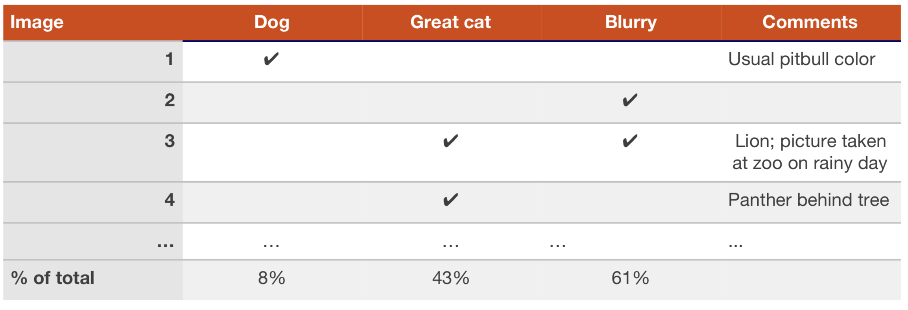
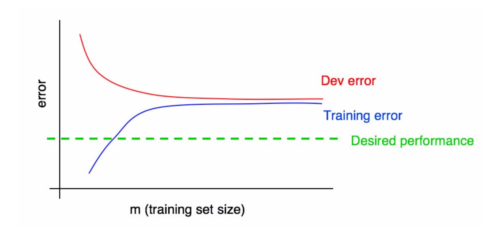
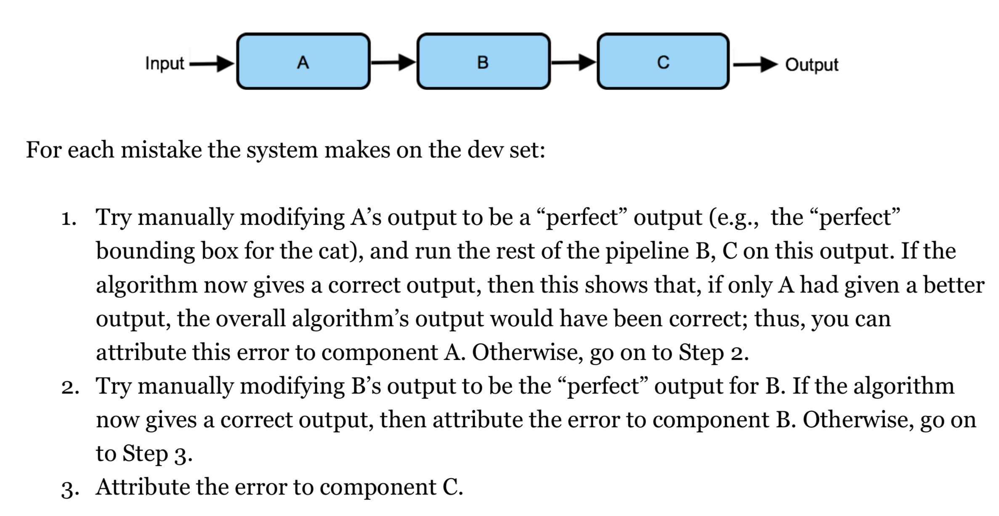

# Machine Learning Yearning

## Setting up development and test sets

- How to pick dev/test sets
  - Choose dev/test sets to reflect data you expect to do well on. This may not be the same as your training data distribution.
  - Dev set and test sets should come from the same distribution.
- Dev/ test sets ***size***
  - With 10,000 examples, you have a good choice to detect an improvement  of 0.1%. ( Dev sets with sizes of 1,000 to 10,000 samples are common )
  - Get a lager dev set, if you want to detect smaller improvements.
  - Size of test set should be large enough to give high confidence in the overall performance of your system.
- Having a **single-number evaluation metric** allows you to sort all your models according to their performance on this metric, and quickly decide what is working best.
- If there are multiple goals you care about
  - Taking an average or weighted average is one of the most common ways to combine multiple metrics into one.
  - When you are trading off N different criteria, consider set N-1 of the criteria as ***satisficing*** metrics and define the final one as the ***optimizing*** metric.
- It is better to come up with something imperfect and get going quickly, rather than overthink it.
  - When starting a brand new application, try to establish dev/test sets and a metic quickly, say less than a week. It might be okay to take longer on mature applications.
  - To building a ML system quickly, you need to a loop: Idea -> code -> experiment. ***Iterate*** this loop quickly.
- If you find that dev/test sets or metrics are no longer pointing your team in the right direction, just change them.
  - If you had overfit the dev set, get more dev set data.
  - If the actual distribution you care about is different from the dev/test set distribution, get new dev/test data.
  - If your metric is no longer measuring what is most important to you, change the metric.

## Basic Error Analysis

- Build your first system quickly ( perhaps a few days), the iterate.

- Error Analysis: 

  - the process of examming dev set examples that your algorithm misclassified, so that you can understand the underlying causes of the errors.
  - can help prioritize projects and inspire new directions.

- Evaluating multiple ideas in parallel during error analysis

  - create a spreadsheet and fill it out while looking through ~100 misclassified dev set examples.
  - jot down comments that might help me remember specific examples.
  - if you are inspired to propose new error categories, you can go back and add new columns to the spreadsheet.
  - Pick the direction that could help to eliminate more errors.

  

- Cleaning up mislabeled examples in dev/test sets
  - It is not uncommon to start off tolrating some mislabeled dev/test examples, ohly later to change your mind as your system improves so that the fraction of mislabeled examples grows relative to the total set of errors.
  - Whatever process you apply fixing dev set labels, remember to apply tothe test set labels too.
  - If you decide to improve the label quality, consider double-checking both the labels misclassified and correctly classified.
- Eyeball dev set and Blackbox dev set
  - Eyeball dev set should be big enough (~ 100 mislabeled examples), so that you can get a good sense of the major sources of errors.
  - Blackbox dev set of 1,000 - 10,000 examples is sufficient for many applications.
  - If your dev set is not big enough to split this way, just use entire dev set as an Eyeball dev set for manual error analysis, model selection, and hyperparameter tuning.

## Bias and Variance

- Comparing to the optimal error rate
  - Optimal error rate (unavoidable bias、 Bayes error rate)
  - Avoidable bias
  - variance
- High bias -> 
  - increase the size of model
  - reduce or eliminate regularization
  - Modify input features based on the insights from error analysis
  - Modify model architecture
- High variance -> 
  - add data to training set
  - add regularization
  - add early stoping
  - Feature selection to decrease number/type of input features
  - Decrease the model size
  - Modify input features based on the insights from error analysis
  - Modify model architecture
- Your algorithm must perform well on training set before you expect it perform well on dev/test set. If it is not fitting the trainind set well, perform an error analysis on the training set.

## Learning curves

- Error rate decrease as training set size grows, while training set error usually increases as training set sizes grows.
- Example of learning curve of high bias

- Tips for plotting learning curves 
  - when training set is small (10 examples), select several different randomly chosen training sets by sampling with replacement, and calculate the average error rate
  - Make sure the fraction of examples from each class is as close as possible to the overall fraction in the original training set

## Comparing to human-level performance

- For a task that human can do well on:
  - ease of obtaining data from human labelers
  - Error analysis can draw on human intuition
  - Use human-level performance to estimate the optimal error rate and also set a "desired error rate"

- Use expert experience as human-level performance
- So as long there are dev set examples where humans are right and your algorithm is wrong, then many technologies described can apply. Even if averaged performance of algorithm is already surpassing human-level performance.

## Training and testing on different distributions

- Add some images downloaded from Internet in training set, while keep your user images you want to do well on in dev/test sets.
  - This may be a risk if you use earlier generation algorithms ( hand-designed features mad linear classifier), but this risk has greatly diminished since you use large neural networks.
  - this may gives neural networks more information, and expand some of its capacity to learn properties that are specific to internet images.

- The data you include in your training data must ***consistent*** with the your data you wanna to work well on.
- Give more weights to your ture data and less weights to your adding data.
- Mismatch errors
  - Get a train dev set to detect whether there is a mismatch error

- How to address mismatch errors
  - Try to understand (error analysis) what properties of the data differ between the training and dev set distribution.
  - Try to find more data that better matches the dev set examples that your algorithm has trouble with.
  - Synthesize some data artificially. (Put some thought into whether you're really synthesizing a representive set of examples, and avoiding giving the synthesized data properties that makes it possible for a learning algorithm to distinguish synthesized from non-synthesized examples.)

## Debugging inference algorithm

- Use ***Optimization Verification test*** when you know how to compute $Score_x(y)$ that indicates how good a response  $y$ is to a input $x$ and use an approximate algorithm to find $arg max_y Score_x(y)$ , but suspect that the search algorithm is sometimes failing to find the maximum. 
  - $y^*$ is the correct output but the algorithm outputs $y_{out}$ , then measure whether $Score_x(y^*)>Score_x(y_{out})$ 
  - If the inequality holds, we blame the optimization algorithm
  - Otherwise, we blame the computation of $Score_x(y)$

- Used in language model, reinforcement learning, etc.

## End-to-end deep learning

- Pros and cons of end-to-end learning

| Pipline methods                                       | End-to-end learning                                          |
| ----------------------------------------------------- | ------------------------------------------------------------ |
| Many parts of pipline are "hand-engineered"           | Don't need to generate features by hands                     |
| Throw away some information and limit the performance | have potential to do well, perhaps approach optimal error rate, when data is sufficient |
| More robust                                           |                                                              |
| Require less data                                     | Require a lot of labeled data for "both ends"                |

- When you choose pipeline components, consider
  - Data availability
  - Task simplicity

## Error analysis by parts

- By carrying out **error analysis by parts**, you can attribute each mistake the algorithm makes to one ( or sometimes both) of the pipeline.
  - Looking at the output of each of the parts and see if you can decide which one made a mistake
  - Give the perfect input of each part to see whether it works well
- General case of error attribution

- You can also carry out error analysis by parts by comparing to human-level performance
- If you don't think your pipline as a whole will achieve human-level performance, even if individual component has human-level performance, the the pipeline is flawed and should be redesigned.

