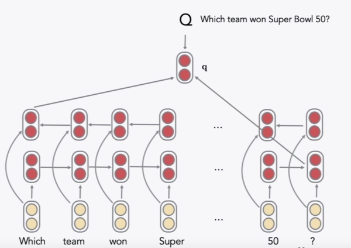
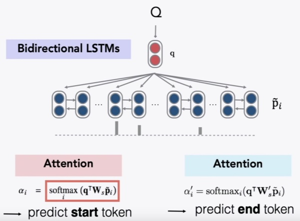
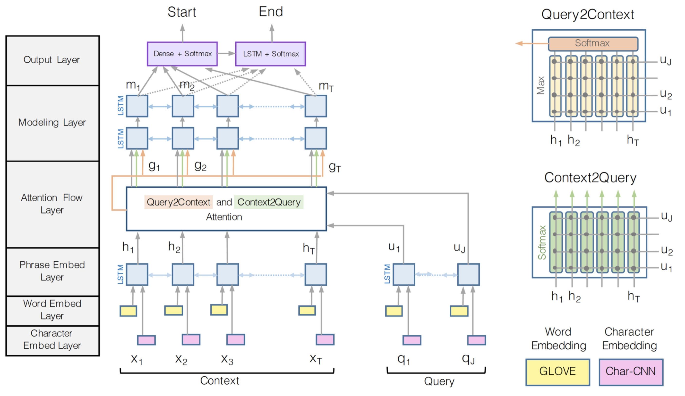

# Lecture 10 Question Answering and the Default Final Project

###Motivation/History

- Motivation: With massive collections of full-text documents, i.e., the web, simply returning relevant documents is of limited use, especially when on mobile or use a digital assistant device.
- Factor the problem(**Open-domain Question Answering**) into two parts:
  - Finding documents that (might) contain an answer
    - By traditional information retrieval/ web search (standford cs276 for more information)
  - Finding an answer in a paragraph or a document (**Reading Comprehension**)
- Reading Comprehension
  - A machine **comprehends** a passage of **text** if, for any **question** regarding that text that can be **answered** correctly by a majority of native speakers, that machine can provide a string which those speakers would agree both answers that question, and does not contain information irrelevant to that question.
  - Passage(P) + Question(Q) --> Answer(A)

### The SQuAD dataset

- Stanford Question Answering Dataset
  - Authors collected 3 gold answers for each question
  - Systems are scored on two metrics:
    - Exactmatch:1/0 accuracy on whether you match one of the 3 answers
    - F1 score (more reliable and taken as primary)
  - Performance on SQuAD 1.1
    - Logistic Regression Baseline: EM 40.4, F1 51.0
    - Human performance: EM 82.3, F1 91.2
  - In SQuAD 2.0, 1/3 of the training questions have no answer, and about 1/2 of the dev/test questions have no answer
  - Performance on SQuAD 2.0
    - BiDAF baseline: EM 59.17, F1 62.09
    - Human performance: EM 86.83, F1 89.45
  - Limitations of SQuAD 2.0
    - Only span-based answers (no yes/no, counting, implicit why)

### The Stanford Attentive Reader model

- Demonstrated a minimal, highly successful architecture for reading comprehension and question answering

- Stanford Attentive Reader

  - Extract feature from question by Bidirectional LSTM, use the end hidden state as feature

    

  - Extract feature from passage by Bidirectional LSTM, use representation of each word to conduct attention with question feature.

    

  - Loss function (Cross Entropy)
    $$
    L =-\sum\log P^{start}(a_{start})-\sum \log P^{end}(a_{end})
    $$

- Stanford Attentive Reader++

  - For encoding question, use of all states in an LSTM by a weighted sum (work better for most tasks)
    $$
    q=\sum_jb_jq_j
    $$

    $$
    b_j=\frac{\exp(W\cdot q_j)}{\sum_{j^\prime}\exp(W\cdot q_{j^\prime})}
    $$

    where $W$ is a learned parameter.

  - Use a deep 3 layer BiLSTM, rather than a single layer

  - The vector representation of eachd token in passage is made from concatenation of 

    - Word embedding (GloVe 300 )

    - Linguistic features: POS, NER tags, one-hot encoded

    - Term frequency (unigram probability, a float)

    - Exact match: whether the word appears in the question (3 binary features: exact, uncased, lemma)

    - Aligned question embedding ("car" vs "vehicle")
      $$
      f_{align}(p_i)=\sum_ja_{i,j}E(q_j)
      $$

      $$
      a_{i,j}=\frac{\exp(\alpha(E(p_i))\cdot \alpha(E(q_j)))}{\sum_{j^\prime}\exp(\alpha(E(p_i))\cdot \alpha(E(q_j^\prime)))}
      $$

      where $\alpha$ is a simple one layer FFNN, and $a_{i,j}$ is the similarity of passage word $p_i$ and question word $q_j$ 

- Neural Networks do better than traditional methods for the reason that:

  - do better semantic matching of word similarities
  - rephrase that are semantically related but don't use the same words

### BiDAF

- Bi-Directional Attention Flow

  - **Core idea**: attention should flow in both directions between query and the passage.

  
  - Similarity matrix
    $$
    S_{i,j}=w_{\text{sim}}^T[c_i;q_j;c_i\circ q_j]\in\mathbb R
    $$
    where $c_i$ is context vector and $q_j$ is query vector, dimension of $c_i$ and $q_j$ is 2h , and dimension of $w$ is 6h

  - Context-to-Question (C2Q) attention
    $$
    \begin{aligned} \alpha^{i} &=\operatorname{softmax}\left(\boldsymbol{S}_{i,:}\right) \in \mathbb{R}^{M} \quad \forall i \in\{1, \ldots, N\} \\ \boldsymbol{a}_{i} &=\sum_{j=1}^{M} \alpha_{j}^{i} \boldsymbol{q}_{j} \in \mathbb{R}^{2 h} \quad \forall i \in\{1, \ldots, N\} \end{aligned}
    $$

  - Question-to-Context (Q2C) attention
    $$
    \begin{aligned} \boldsymbol{m}_{i} &=\max _{j} \boldsymbol{S}_{i j} \in \mathbb{R} \quad \forall i \in\{1, \ldots, N\} \\ \beta &=\operatorname{softmax}(\boldsymbol{m}) \in \mathbb{R}^{N} \\ \boldsymbol{c}^{\prime} &=\sum_{i=1}^{N} \beta_{i} \boldsymbol{c}_{i} \in \mathbb{R}^{2 h} \end{aligned}
    $$

  - For each passage position, output of BiDAF layer is
    $$
    \boldsymbol{b}_{i}=\left[\boldsymbol{c}_{i} ; \boldsymbol{a}_{i} ; \boldsymbol{c}_{i} \circ \boldsymbol{a}_{i} ; \boldsymbol{c}_{i} \circ \boldsymbol{c}^{\prime}\right] \in \mathbb{R}^{8 h} \quad \forall i \in\{1, \ldots, N\}
    $$

  - Adding another deep (2-layer) BiLSTM over passage (Modelling layer)

  - A more complex answer span selection

    - Start: a dense FF layer and a softmax
    - End: Another BiLSTM and then dense FF layer and a softmax  

### Recent, more advanced architectures

- Most of the work in 2016, 2017, and 2018 employed progressively more complex architectures with a multitude of variants of attention – often yielding good task gains

- Attention functions

  - MLP (Additive) form:
    $$
    S_{i,j}=s^T\tanh(W_1c_i+W_2q_j)
    $$

  - Bilinear (product) form:
    $$
    \begin{array}{c}{S_{i j}=c_{i}^{T} W q_{j}} \\ {S_{i j}=c_{i}^{T} U^{T} V q_{j}} \\ {S_{i j}=c_{i}^{T} W^{T} D W q_{j}} \\ {S_{i j}=\operatorname{Relu}\left(c_{i}^{T} W^{T}\right) \operatorname{DRelu}\left(W q_{j}\right)}\end{array}
    $$

### ELMo and BERT preview

- Contextual word representations