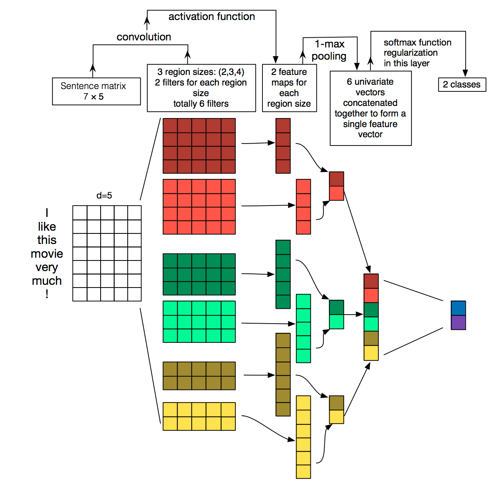
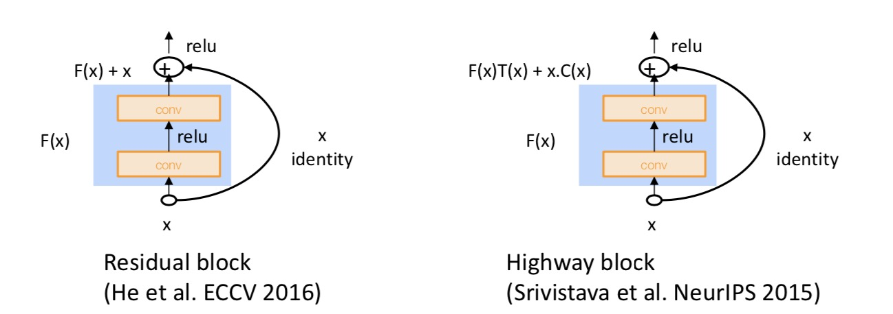

# Lecture 11 ConvNets for NLP

### Introduction to CNNs

- Some methods to compute convoltion
  - Conv1d, padded with max (or k-max) pooling over time
  - Conv1d, padded with avg pooling over time
  - Conv1d, stride = 2
  - Conv1d, with local max pool, stride = 2
  - Conv1d, with dilation = 2

### Simple CNN for Sentence Classification: Yoon (2014)

- Yoon Kim (2014): Convolutional Neural Networks for Sentence Classification. EMNLP 2014. https://arxiv.org/pdf/1408.5882.pdf

 

- Text CNN is a simple use of one convolutional layer and pooling

- Filter size can be size of 2, 3 or 4

- Formula of text CNN

  - Sentence: $x_{1:n}=x_1\oplus  x_2\oplus ...\oplus x_n$ 

  - All possible windows of length h: $\{x_{1:h},x_{2:h+1},...,x_{n-h+1:n} \}$ 

  - Compute feature (one channel) for CNN layer
    $$
    c_i=f(W^Tx_{i:1+h-1}+b)
    $$

  - Feature map: $\boldsymbol c=[c_1,c_2,...,c_{n-h+1}]\in\mathbb R^{n-h+1}$ 

  - Max pooling: $\hat c=\max\{\boldsymbol c\}$ 

  - Use 100 feature maps each of size 3, 4, 5
    $$
    \boldsymbol z=[\hat c_1,...,\hat c_{300}]
    $$

  - Simple final softmax layer
    $$
    y=softmax(W^{(S)}\boldsymbol z+b)
    $$

- Multi-channel input data

  - Initialize with pre-trained word vector, start with two copies
  - Backprop into only one set, keep other "static"

- Regularization

  - Dropout: masking vector r of random variables with probability p of being 1

  - Delete features during training
    $$
    y=softmax(W^{(S)}(\boldsymbol r \circ \boldsymbol z)+b)
    $$

  - At test time, no dropout, scale final vector by probability p
    $$
    \hat W^{(S)}=pW^{(S)}
    $$

  - Reasoning: Prevents co-adaption (overfitting to seeing specific feature constellations)

  - Constrain $l_2$ norms of weight vectors of each class (row in $W^{(S)}$) to fix number s, if $||W^{(S)}_{c\cdot} ||>s$, then rescale it so that: $||W^{(S)}_{c\cdot} ||=s$ 

### CNN potpourri

- Gated units used vertically

  - Core idea: summing candidate update with shortcut connection to make very deep networks to work

    

    note: pad x for conv so same size when add them. 

  - Highway block seems more complicated, but mathmatically it is not any more powerful. You can represent anything highway block do with residual block.

- Batch Normalization

  - Transform the convolution output of a batch by scaling the activation to have zero mean and unit variance
  - Use BatchNorm makes models much less sensitive to parameters initialization, and tends to make tuning of learning rates simpler

- 1 x 1 Convolutions

  - 1 x 1 convolution aka network-in network (NiN)
  - Can be used to map from many channels to fewer channels

- CNN can also used in machine translation as encoders.

### Model comparison

- Bag of Vectors: Surprisingly good baseline for simple classification problems. Especially if followed by a few ReLU layers! (See paper: Deep Averaging Networks)
- Window Model: Good for single word classification for problems that do not need wide context. E.g., POS, NER.
- CNNs: good for classification, need zero padding for shorter phrases, hard to interpret, easy to parallelize on GPU. Efficient and versatile.
- Recurrent Neural Networks: Cognitively plausible, not best for classification (if just use last state), much slower than CNNs, good for sequence tagging and classification, great for language models, can be amazing with attention mechanisms.

### Deep CNN for Sentence Classification: Conneau et al. (2017)

- Work from the character level
- Looks like a vision system in its design, similar to VGGnet or ResNet
- Deeper neural networks tend to work better, and MaxPooling is the best choice for pooling action.

### Quasi-recurrent Neural Networks

- QRNN tries to combine the best of both CNN and RNN

- Use convolution to extract features
  $$
  \begin{aligned} \mathbf{z}_{t} &=\tanh \left(\mathbf{W}_{z}^{1} \mathbf{x}_{t-1}+\mathbf{W}_{z}^{2} \mathbf{x}_{t}\right) & & \mathbf{Z}=\tanh \left(\mathbf{W}_{z} * \mathbf{X}\right) \\ \mathbf{f}_{t} &=\sigma\left(\mathbf{W}_{f}^{1} \mathbf{x}_{t-1}+\mathbf{W}_{f}^{2} \mathbf{x}_{t}\right) & \rightarrow \ \ \ \ \  &  \mathbf{F}=\sigma\left(\mathbf{W}_{f} * \mathbf{X}\right) \\ \mathbf{o}_{t} &=\sigma\left(\mathbf{W}_{o}^{1} \mathbf{x}_{t-1}+\mathbf{W}_{o}^{2} \mathbf{x}_{t}\right) & & \mathbf{O}=\sigma\left(\mathbf{W}_{o} * \mathbf{X}\right) \end{aligned}
  $$

  - (Not truely understood)