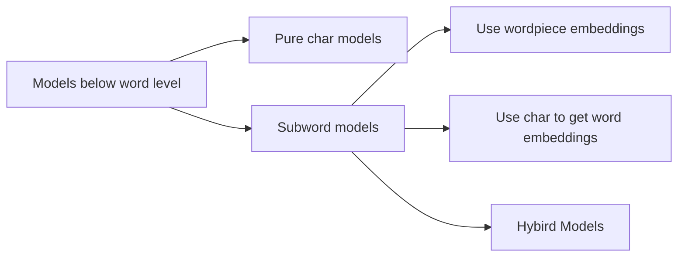
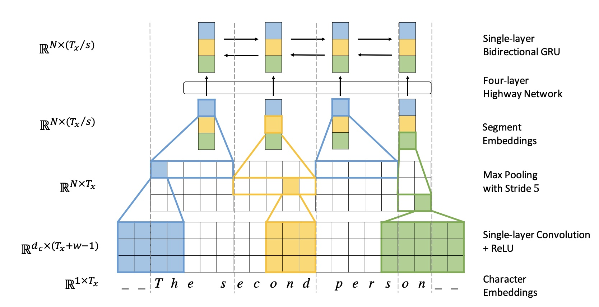
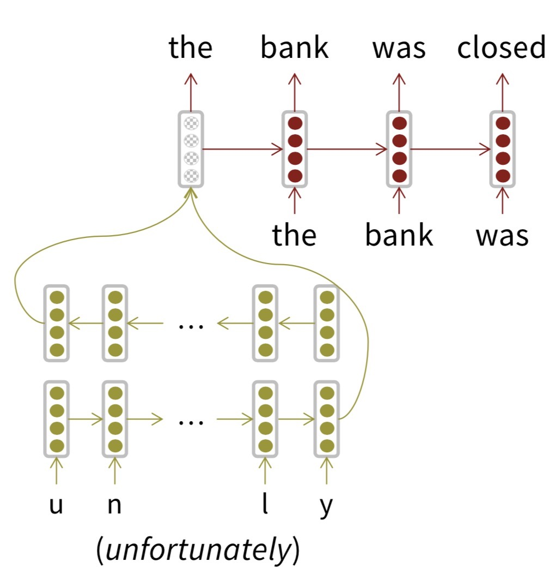
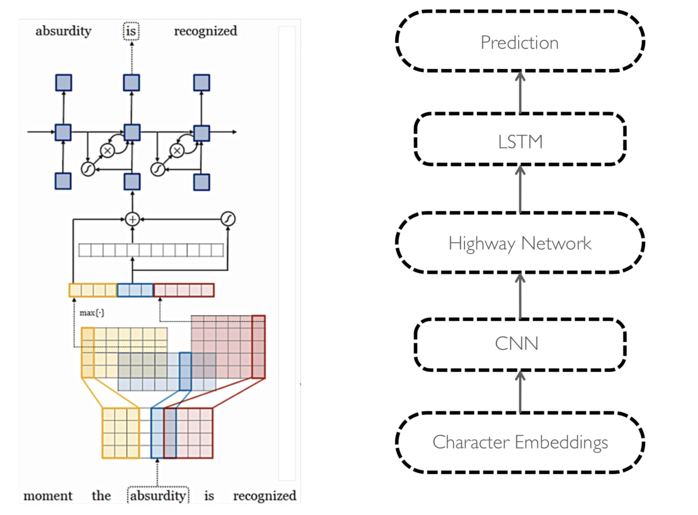
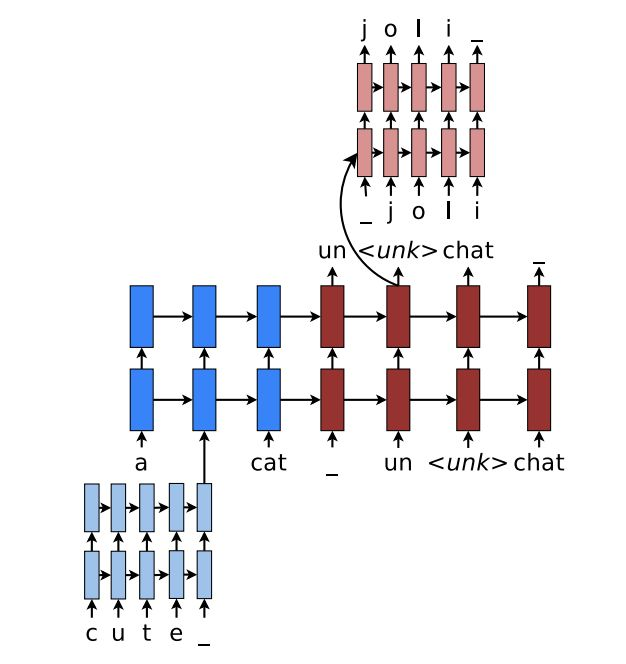

# Lecture 12 Subword Models

- Reasons we'd like to start modeling below the word level
  - Models based on words cannot deal with out-of-vocabulary (OOV) problem
  - Word-based models is not good at dealing with morphology (词法修饰)

### Character-level Models

- Two types of character-level models 
  1. Compose word embeddings to character embeddings
     - Generate embeddings for unknown words
     - Similar spelling share similar embeddings
     - Solve OOV problem
  2. Connected language can be processed as characters

- Purely character-level models
  - Emample: Very deep convolutional networs for text classification
  - Initially, Purely character-level NMT models performed unsatisfying (2007,2013), then they were used as decoder only in NMT (2016), and then they give promising results (since 2016)
  - at some level, characters don't mean much, but we have powerful combinatory models with a lot of parameters in them, and those models can store and build representations of meaning from multi-letter groups. In such a way, that they can model the meanings of morphemes and larger units and therefore put together word meanings

- Fully Character-Level Neural Machine Translation without Explicit Segmentation

  - Jason Lee, Kyunghyun Cho, Thomas Hoffmann. 2017. https://arxiv.org/pdf/1610.03017.pdf

  - Encoder as below; decoder is a char-level GRU

    

- Purely character-level models are computationally expensive, they run really slow for the reason that input sequence is much longer.

### Subword-level Models

- Two trends of subword-level models
  - Same architecture as for word-level models, but use smaller units: "word pieces"
  - Hybrid architecture, main model has words; something else for characters
- Byte Pair Encoding (BPE)
  - A word segmentation algorithm
    - Start with a vocabulary of characters
    - Most frequent ngram pairs --> a new ngram
    - Have a target vocabulary size and stop when you reach it
- Wordpiece/Sentencepiece model (A variant of BPE)
  - Google NMT (GNMT) uses a variant of this
    -  V1: wordpiece model
    - V2: sentencepiece model
  - Rather than char n-gram count, uses a greedy approximation to maximizing language model log likelihood to choose the pieces
    - Add n-gram that maximally reduces perplexity
  - Wordpiece model tokenizes inside words
  - Sentencepiece model works from raw text
    - Whitespace is retained as special token (_) and grouped normally
    - https://github.com/google/sentencepiece
    - https://arxiv.org/pdf/1804.10959.pdf

- Character-level to build word-level

  - Use character to generate word embeddings

    

- Character-Aware Neural Language Models

  - Motivation

    - Deriveapowerful, robust language model effective across a variety of languages.
    - Encode subword relatedness: eventful, eventfully, uneventful...
    - Address rare-word problem of prior models.
    - Obtain comparable expressivity with fewer parameters.

  - Network structure

    

### Hybrid character and word level models

- The hybrid NMT model make use of both character models and word models

  - Translate mostly at word level, only go to character level when needed (OOV problem)

  - Train the model end-to-end, and the loss contains both word level loss and character level loss

  - Use a more sophisticated decoding algorithm: 2-stage decoding. 

    - Word-level beam search
    - Char-level beam search for <UNK>

    

### FastText

- Enriching Word Vectors with Subword Information Bojanowski, Grave, Joulin and Mikolov. FAIR. 2016. https://arxiv.org/pdf/1607.04606.pdf  https://fasttext.cc/

- Represent word as char n-grams augmented with boundary symbols and as whole word

  - For example, where = *<wh,whe,her,ere,re>,<where>* 

  - For word $w$, the set of  char n-grams is $G_w$, the embedding for each n-gram is $\overrightarrow {z_g}$ , the similarity of center word $w$ and context word $c$ is $s(w,c)$ 
    $$
    s(w,c)=\sum_{g\in G_w} \overrightarrow {z_g}^T\overrightarrow {v_c}
    $$

