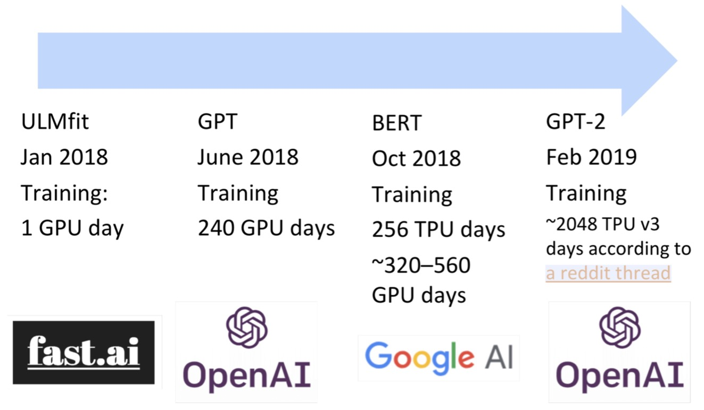

# Lecture 13 Contextual word embeddings

### Reflections on word representations 

- Tips for unknown words with word vectors
  - Simplest and common solution 
    - Train time: Vocab is {words occurring $\ge$ 5 times } $\cup$ {<UNK>}
    - Map all rarer (<5) words to <UNK>, train a word vector for it
    - Runtime: use <UNK> when out-of-vocabulary words occur
  - Problems:
    - No way to distinguish different UNK word, either for identity or meaning
  - Try these tips:
    - if the UNK word at test time appears in your unsupervised word embeddings, use that vector as is at test time
    - Additionally, for other words, just assign them a random vector, adding them to the vocabulary

- Up untill now, we've basically had one representation of words (word2vec, GloVe, fastText), there have two problems:
  - Always the same representation for a word type regardless of the context in which a word token occurs
  - Just have one representation for a word, but words have different aspects, inculding semantics, syntactic behavior, or register/connotations
- In an NLM, the model is producing context-specific word representation at each position.

### Pre-ELMo and ELMO

- TagLM  ("Pre-ELMo")

  - Peters et al. (2017) https://arxiv.org/pdf/1705.00108.pdf 

  - Idea: Want meaning of word in context, but standardly learn task RNN only on small task-labeled data (e.g., NER)

    

  - Language model observations
    - An LM trained on supervised data does not help
    - Having a bidirectional LM helps over only forward, by about 0.2
    - Having a huge LM design (ppl 30) helps over a smaller model (ppl 48) by about 0.3
    - Using just the LM embeddings to predict isn’t great

- ELMo: Embeddings from Language Models
  - Peters et al. (2018): https://arxiv.org/abs/1802.05365

    - Breakout version of word token vectors or contextual word vectors
    - Learn word token vectors using long contexts not context windows (here, whole sentence, could be longer)
    - Learn a deep Bi-NLM and use all its layers in prediction

  - For each token $t_k$, a L-layer biLM computes a set of 2L + 1 representations, $x_k^{LM}$ is a context-independent token representation (via token embedding or a CNN over characters),  $\overrightarrow{\mathbf{h}}_{k, j}^{L M}( j=1, \ldots, L)$ is a context-dependent representations generated by the forward LSTM layer $j$ .
    $$
    \begin{aligned} R_{k} &=\left\{\mathbf{x}_{k}^{L M}, \overrightarrow{\mathbf{h}}_{k, j}^{L M}, \overleftarrow{\mathbf{h}}_{k, j}^{L M} | j=1, \ldots, L\right\} \\ &=\left\{\mathbf{h}_{k, j}^{L M} | j=0, \ldots, L\right\} \end{aligned}
    $$
    where $h_{k, 0}^{L M}=x_{k}^{L M}, \quad h_{k, j}^{L M}=\left[\overrightarrow{\mathbf{h}}_{k, j}^{L M} ; \stackrel{\leftarrow}{h}_{k, j}^{L M}\right]$ 

  - For inclusion in a downstream model, ELMo collapses all layers in $R$ into a single vector, $\bold{ELMo}_k=E(R_k;\Theta_e)$.
    $$
    \bold{ELMo}_k^{task}=E(R_k;\Theta^{task})=\gamma^{task}\sum_{j=0}^Ls_j^{task}\bold h_{k,j}^{LM}
    $$
    where $\gamma^{task}$ scales overall usefulness of ELMo to task and $\bold s^{task}$ are softmax-normalized mixture model weights

  - Use with a task

    - First run biLM to get representation for each word
    - Freeze weights of ELMo and concatenate ELMo weights into task-specific model

  - The two biLSTM NLM layers have differentiated uses/meanings

    - Lower layer is better for lower-level syntax, etc.
      - Part-of-speech tagging, syntactic dependencies, NER
    - Higher layer is better for higher-level semantics
      - Sentiment, Semantic role labeling, question answering, SNLI

### ULMFiT and onward

- ULMFIT

  - Universal Language Model Fine-tuning for Text Classification. 

  - https://arxiv.org/pdf/1801.06146.pdf

  - How to use

    1. Train LM on big general domin corpus (use biLM)
    2. Tune LM on target task data
    3. Fine-tune as classifier on target task

    

- Scale up the model size

  

### Transformer architectures

- The motivation of transformers

  - We want parallelization but RNNs are inherently sequential
  - Despite GRUs and LSTMs, RNN still need attention mechanism to deal with long range dependencies
  - If attention gives us access to any state, maybe we can just use attention and don't need RNN

- Transformer overview 

  - Attention is all you need https://arxiv.org/pdf/1706.03762.pdf
  - An Jupyter Notebook using PyTorch that explains everything! http://nlp.seas.harvard.edu/2018/04/03/attention.html
  - Non-recurrent sequence-to-sequence encoder-decoder model, and final loss function is standard cross-entropy loss on top of a softmax classifier

- Scaled dot-product attention
  $$
  A(Q.K,V)=softmax(\frac{QK^T}{\sqrt{d_k}})V
  $$

  - As $d_k$ gets large, the variance of $q^Tk$ increase --> some values inside the softmax get large --> the softmax gets very peaked --> hence its gradient gets smaller. 
  - To solve this problem, scale by length of query/key vectors

- Multi-head attention
  $$
  \begin{array}{l}{ \text { MultiHead }\left.(Q, K, V)=\text { Concat(head_1, } \ldots, \text { head_ }_{\mathrm{h}}\right) W^{O}} \\ {\quad \text { where head }_{\mathrm{i}}=\text { Attention }\left(Q W_{i}^{Q}, K W_{i}^{K}, V W_{i}^{V}\right)}\end{array}
  $$
  

- Self-attention in encoder

  - The input word vectors are the queries, key and values
  - Word vector stack = Q = K = V

- Encoder Input

  - Actual word representations are byte-pair encodings

  - Also added is a positional encoding so same words at different locations have different overall representations
    $$
    \begin{aligned} P E_{(p o s, 2 i)} &=\sin \left(\text {pos} / 10000^{2 i / d_{\text {model }}}\right) \\ P E_{(\text {pos}, 2 i+1)} &=\cos \left(\text {pos} / 10000^{2 i / d_{\text {model }}}\right) \end{aligned}
    $$

- Complete encoder

  - Each block has two "sublayers": (1) multihead attention and (2) a 2-layer feed-forward NNnet

  - Each of these two steps also has: (1) residual connection and (2) layernorm

  - Layernorm changes input to have mean 0 and variance 1, per layer and per training point https://arxiv.org/pdf/1607.06450.pdf
    $$
    \mu^{l}=\frac{1}{H} \sum_{i=1}^{H} a_{i}^{l} \quad \sigma^{l}=\sqrt{\frac{1}{H} \sum_{i=1}^{H}\left(a_{i}^{l}-\mu^{l}\right)^{2}} \quad \quad h_{i}=f\left(\frac{g_{i}}{\sigma_{i}}\left(a_{i}-\mu_{i}\right)+b_{i}\right)
    $$

  - For encoder, at each block, we use the same Q, K and V from the previous layer. And blocks are repeated 6 times

    

- Transformer Decoder
  - 2 sublayer changes in decoder
    - Masked decoder self-attention on previously generated outputs
    - Encoder-Decoder attention, where queries come from previous decoder layer and keys and values come from output of encoder
- Tips and tricks of the transformer
  - Byte-pair encodings
  - Checkpoint averaging
  - ADAM optimizer with learning rate changes
  - Dropout during training at every layer just before adding residual
  - Label smoothing
  - Auto-regressive decoding with beam search and length penlties

### BERT

- Pre-training of Deep Bidirectional Transformers for Language Understanding
- Language models only use left context or right context, but language understanding is bidirectional. Words can “see themselves” in a bidirectional encoder.
- Mask language model and Next sentence prediction.
- GLUE benchmark is dominated by natural language inference tasks, but also has sentence similarity and sentiment.

