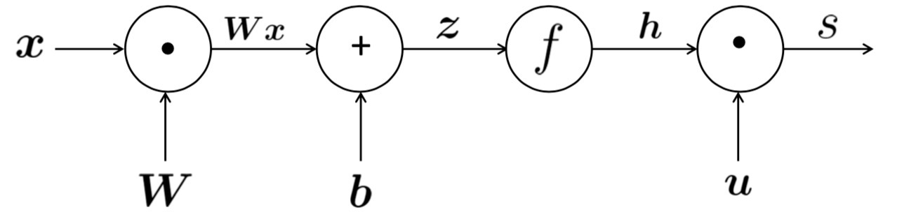

# Lecture 4 Backpropagation and computation graphs

### Matrix gradients for our simple neural net and some tips

- Some tips for deriving gradients
  - Carefully define your variables and keep track of their dimensionality!
  - Chain rule! Keep straight what variables feed into  computations.
  - For the top softmax part of a model: First consider the derivative wrt $f_c$ when $c=f$ (the correct class), then consider derivative wrt $f_c$ when $c\ne f$ (all the incorrect classes)
  - Work out element-wise partial derivatives if you're getting confused by matrix calculus!
  - Use Shape Convention. Note: The error message $\delta$ that arrives at a hidden layer has the same dimensionality as that hidden layer.
- Updating word gradients in window model
  - This push word vectors around so that they will (in principle) be more helpful in specific tasks.
  - The model can learn that seeing $x_{in}$ as the word just before the center word is indicative for the center word to be a location.
  - Sparse SGD to updates the word vectors in embedding matrix to get a better performance. 
- A pitfall when fine tuning word vectors 
  - Should I use available "pre-trained" word vectors?
    - Almost always, yes!
    - The skip-gram algorithm is easy to train, and the don't need to label data
    - Word vectors are trained on a huge amout of data, and they will know about words not in your training data and will know more about words that are in your training data.
    - Have 100s of millions of words of data? Okay to start random
  - Should I fine tune my own word vectors?
    - If you only have a small training data set (a couple of hundred thousand words), don't train the word vectors
    - If you have a large dataset (over a million words) , it probably will work better ti fine-tune word vectors to the task
    - You can train the algorithm both ways, and to see which one performs better
- we can arbitrarily decide to throw away any subset of these gradients away, we still improve the log-likelihood of our model. This is one of the reasons why often people don't notice their bugs in their code.

### Computation graphs and backpropagation

- Computation graphs

  - Source nodes: inputs

  - Interior nodes: operations

  - Edges pass along result of the operation

    

- Backpropagation

  - [downstream gradient] = [upstream gradient] x [local gradient]
  - Gradients sum at outward branches
  - taking derivatives and using the generalized chain rule

- Node Intuitions

  - "+" distributes the upstream gradient to each summand
  - "max" routes the upstream gradient
  - "*" switches the upsteram gradient

- Efficient way to compute gradients

  - Compute all the gradients at once
  - Reuse derivatives of higher layers in lower layers to minimize computation.

- Back-prop in general computation graph

  - Fprop: visit nodes in the topological sort order, compute value of node give predecessors
  - Bprop: visit nodes in reverse order, compute gradient wrt each node using gradient wrt successors

  ```python
  class ComputationGraph(object):
    def forward(inputs):
      # 1. [pass inputs to input gates]
      # 2. forward the computational graph
      for gate in self.graph.nodes_topologically_sorted():
        gate.forward()
       return loss
    def backward():
      for gate in reversed(self.graph.nodes_topologocally_sorted()):
        gate.backward()
      return inputs_gradients
  ```

  - Done correctly, big O() complexity of fprop and bprop is **the same**

  - Each node type needs to know how to compute its output and how to compute the gradient

    ```python
    class MultiplyGate(object):
      def forward(x,y):
        z = x*y
        self.x = x
        self.y = y
        return z
      def backward(dz):
        dx = self.y * dz
        dy = self.x * dz
        return [dx, dy]
    ```

- Gradient checking: Numeric Gradient

  - For small $h (\approx 1e-4)$ 
    $$
    f^\prime(x)\approx\frac{f(x+h)-f(x-h)}{2h}
    $$

  - Easy to implement, but slow. Much less needed now.

- Backpropagation doesn't always work perfectly

  - Understanding why is crucial for debugging and improving models
  - Example in future lecture: exploding and vanishing gradients
  - See Karpathy article: https://medium.com/@karpathy/yes-you-should-understand-backprop-e2f06eab496b

### Stuff you should know

##### a. Regularization to prevent overfitting

- A full loss function in practice includes regularization over all parameters $\theta$, e.g., L2 regularization
  $$
  J(\theta) = \frac1N\sum_{i=1}^N-\log\left( \frac{e^{f_{y_i}}}{\sum_{c=1}^Ce^{f_c}} \right) + \lambda \sum_k\theta_k^2
  $$

- Regularization prevents overfitting

##### b. Vectorization

- Always try to use vectors and matrices rather than for loops

##### c. Nonlinearities

- sigmoid
  $$
  f(z)=\frac 1{1+\exp(-z)}
  $$

- tanh
  $$
  f(z)=\tanh(z)=\frac{e^z-e^{-z}}{e^z+e^{-z}}=2\times\text{sigmoid}(2z)-1
  $$

- hard tanh
  $$
  \text{HardTanh}(x)=\begin{cases}
  -1 &\text{if} \ x<-1 \\
  x &\text{if} \ -1\le x\le1 \\
  1 &\text{if}\ x>1
  \end{cases}
  $$

- ReLU
  $$
  \text{ReLU}(z)=\max(z,0)
  $$

- Leaky ReLU
  $$
  \text{Leaky ReLU}(z)=\max(z,0.01z)
  $$

- Parameteric ReLU
  $$
  \text{Parametric ReLU}(z)=\max(z,az)
  $$

- For building a feed-forward deep network,  the first thing you should try is ReLU, it trains quickly and performs well due to good gradient backflow 

##### d. Initialization

- Initialize weights to small random values to avoid symmetries that prevent learning

- Initialize hidden layer biases to 0 and output biases to optimal value if weights were 0

- Initialize **all other weights** ~ Uniform ( -r, r), with r chosen so numbers get neither too big or too small

- Xavier initialization (recommended) has variane inversely proportional to fan-in $n_{in}$ (previous layer size) and fan-out $n_{out}$ (next layer size):
  $$
  \text{Var}(W_i)=\frac2{n_{in}+n_{out}}
  $$

##### e.Optimizers

- Plain SGD work just fine, however, getting good results will often require hand-tuning the learning rate
- For more complex nets and situations, you often do better with one of a family of more sophisticated "adaptive" optimizers that scale the parameter adjustment by an accumulated gradient.
- These models give per-parameter learning rates
  - Adagrad
  - RMSprop
  - Adam (fairly good, safe place to begin in many cases)
  - SparseAdam

##### f.Learning rates

- You can just use a constant learning rate, start around $lr=0.001$
  - It must be order of magnitude right - try power of 10
  - Model will diverge if the learning rate is too big, or you may not have trained your model by deadline if the learning rate is too small
- Better results can be obtained by allowing learning rates to decrease as you train
  - By hand: halve the learning rate every k epochs
  - By a formula: $lr=lr_0e^{-kt}$ for epoch t
  - There are fancier mothods like cyclic learning rates 
- Fancier optimizers still use a learning rate but it may be an initial rate that the optimizer shrinks - so may be able to start high.