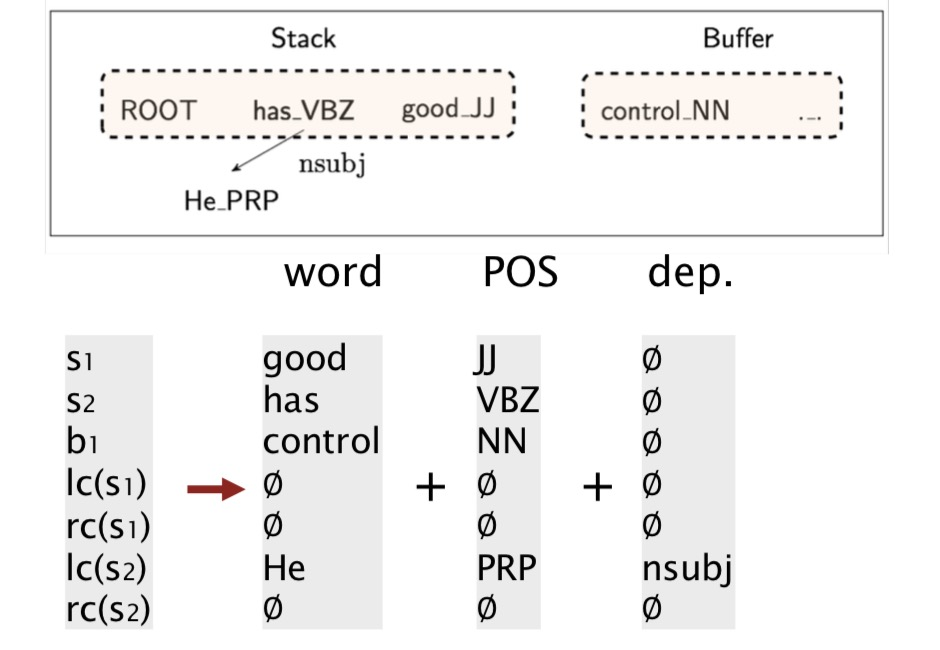
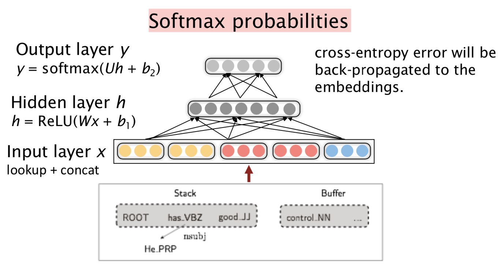

# Lecture 5: Dependency parsing

### Syntactic structure: Consistency and Dependency

- Two views of linguistic structure
  - Phrase structure grammar (=context-free grammars)
    - Phrase structure organizes words into nested constituents
  - Dependency structure
    - Dependency structure shows which words depend on (modify or are arguments of) which other words
- Why do we need sentence structure?
  - to interpret language correctly
  - human communicate complex ideas by composing words together into bigger units to convey complex meaning
- Ambiguity
  - Prepositional phrase attachment ambiguity
  - Coordination scope ambiguity
  - Adjectival modifier ambiguity
  - Verb phrase attachment ambiguity
- Dependency paths identify semantic relations

### Dependency Grammar and Treebanks

- Dependency syntax postulates(假定) that syntactic structure consists of relations between lexical items, normally binary asymmetric relations ("arrows") called **dependencies** 
  - The arrows are commonly typed with the name of grammatical  relations (subject, prepositional object, apposition, etc.) (Not used in this class)
  - The arrow connects a **head** (governor, superior, regent) with a **dependent** (modifier, inferior, subordinate)
  - Usually, dependencies form a tree (connected, acyclic, single-head )
  - Some people draw the arrows one way; some the other way! Tesniere had them point from head to dependent
  - Usually add a fake ROOT so every word is a dependent of precisely 1 other node.
- Dependency Grammar/Parsing History
  - The idea of dependency structure goes back a long way
    - To Panini grammar (c. 5th century BCE)
    - Basic approach of 1st millennium Arabic grammarians
  - Constituency/ context-free grammars is a new fangled invention
    - 20th century invention (R.S. Wells, 1947; then Chomsky)
  - Modern dependency work often sourced to L. Tesniere (1959)
    - Was dominant approach in "East" in 20th century (Russia, China)
  - Among the earliest kinds of parsers in NLP, even in the US:
    - David Hays, one of the founders of US computational linguistics, built early (first?) dependency parser (Hays 1962)
- The rise of annotated data: Universal Dependencies treebanks
  - Universal Dependencies: https://universaldependencies.org/
  - Starting off, building a treebank seems a lot slower and less useful than building a grammar
  - But a treebank gives us many things
    - Reusability of the labor
      - Many parsers, part-of-speech taggers, etc. can be built on it
      - Also valuable resources for linguistics
    - Broad coverage, not just a few intuitions
    - Frequencies and distributional information
    - A way to evaluate systems
- Dependency Conditioning Preferences (What are the sources of information for dependency parsing?)
  - Bilexical affinities   *[discussion -> issues] is plausible*
  - Dependency distance  *mostly with nearby words*
  - Intervening material   *Dependencies rarely span intervening verbs or punctuation*
  - Valency of heads. *How many dependents on which side are usual for a head*
- Dependency parsing
  - A sentence is parsed by choosing for each word that other word (including ROOT) is it a dependent of 
  - Only one word is a dependent of ROOT
  - Don't wnat cycles A -> B, B-> A
  - Almost we don't allow arrows to cross (projective) but sometime arrows can cross (non-projective)
- Methods of Dependency parsing
  - Dynamic programming
  - Graph algorithms
  - Constraint Satisfaction
  - "Transition-based parsing" or "deterministic dependency parsing"
    - Greedy choice of attachments guided by good machine learning classifiers MaltParser (Nivre et al. 2008). Has proven highly effective.

### Transition-based dependency parsing

- Basic transition-based dependency parser
  - A simple form of greedy discriminative dependency parser
  - The parser does a sequence of bottom up actions. Roughly like "shift" or "reduce" in a shift-reduce parser, but the "reduce" actions are specialized to create dependencies with head on left or right.
  - The parser has:
    - a stack $\sigma$ ,written with top to the right
    - a buffer $\beta$ , written with top to the left
    - a set of dependency arcs A
    - a set of actions
  - The process
    - **Start:**      $\sigma=[\text{ROOT}], \beta=w_1,...,w_n,A=\empty $ 
    - **1. Shift**               $\sigma, w_i|\beta,A\ \rightarrow \ \sigma|w_i,\beta,A$
    - **2. Left-Arc**         $\sigma|w_i|w_j,\beta,A \ \rightarrow \ \sigma|w_j,\beta,A\cup \{r(w_j,w_i)\}$
    - **3. Right-Arc**       $\sigma|w_i|w_j,\beta,A \ \rightarrow \ \sigma|w_i,\beta,A\cup \{r(w_i,w_j)\}$ 
    - **Finish:**    $\sigma=[w],\beta=\empty$
  - To choose which decision to make, need to explore the exponential size of the solution space.

- MaltParser (Nivre and Hall 2005)
  - Each action is predicted by a discriminative classifier (e.g., softmax classifier) over each legal move
    - Max of 3 untyped choices; max of |R|*2+1 when typed
    - Features: top of stack word, POS; first in buffer word, POS; etc
  - There is NO search (in the simplest form) But you can profitably do a beam search if you wish (slower but better): You keep k good parse prefixes at each time step.
  - The model's accuracy is fractionally below the state of the art in dependency parsing, but it provides very **fast linear time parsing**, with great performance. (dynamic programming algorithms for sentences are always cubic or worse )

- Conventional Feature Representation

  - The feature is a binary, sparse, long vector, dim $=10^6\sim10^7$ 

  - Similar to the features in global linear model 

  - Indicator features
    $$
    s1.w=\text{good}\wedge s1.t=\text{JJ}\\
    s2.w=\text{has} \wedge s2.t=\text{VBZ}\wedge s1.w=good\\
    lc(s2).t=\text{PRP} \wedge s2.t=\text{VBZ}\wedge s1.t=\text{JJ}\\
    lc(s2).w=\text{He}\wedge lc(s2).l=\text{nsubj}\wedge s2.w=\text{has}
    $$
    $s1$ is the top word of the stack, $s2$ is the second top word of the stack

- Evaluation of Dependency parsing

  - Dependency Accuracy
    $$
    Acc=\frac{\text{#correct deps}}{\text{#all deps}}
    $$

  - UAS: unlabeled attachment score

  - LAS: labeled attachment score

- Handling non-projectivity

  - Some possible directions to head: .......

### Neural dependency parsing

- Disadvantages of Indicator Features
  - sparse
  - incomplete
  - expensive computation (more than 95% of time is consumed by feature computation)

- Distributed Representation  

  - Represent each word as a d-dimensional feature dense vector

  - Meanwhile, part-of-speech tags and dependency labels are also represented as d-dimensional vectors

  - Extracting tokens and then vector representations from configuration 

    

- Model Architecture

  

- Neural Networks can accurately determine the structure of sentences, supporting interpretation. The dense representation let it outperform other greedy parsers in both accuracy and speed.
- Further developments in transition-based neural dependency parsing:
  - Bigger, deeper networks with better tuned hyperparameters
  - Beam search
  - Global, CRF-style inference over the decision sequence
  - https://ai.googleblog.com/2016/05/announcing-syntaxnet-worlds-most.html

- A Neural graph-based dependency parser [Dozat and Manning 2017; Dozat, Qi, and Manning 2017]

