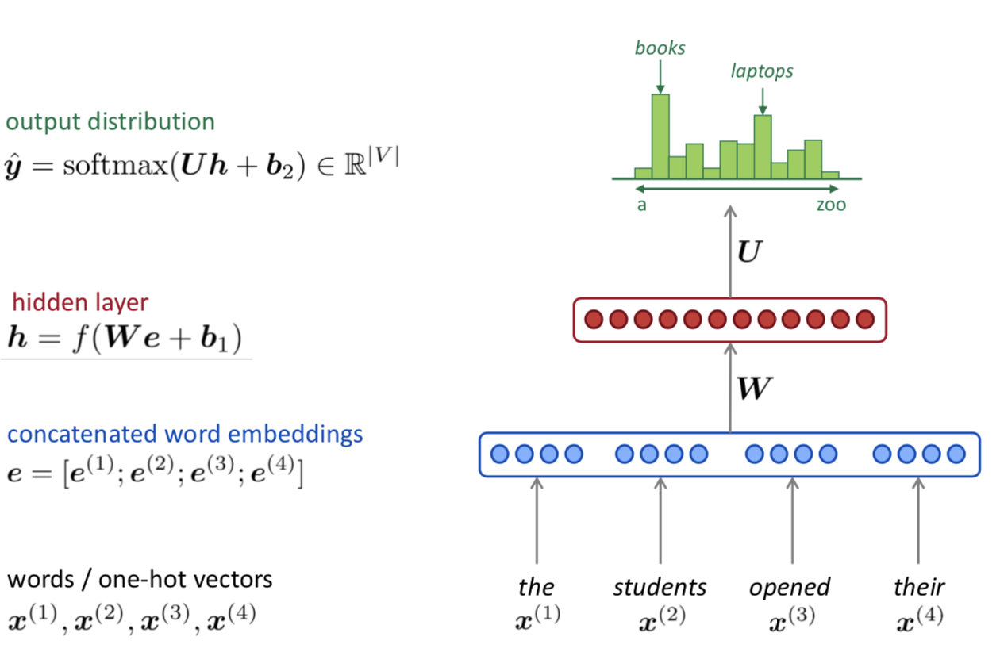
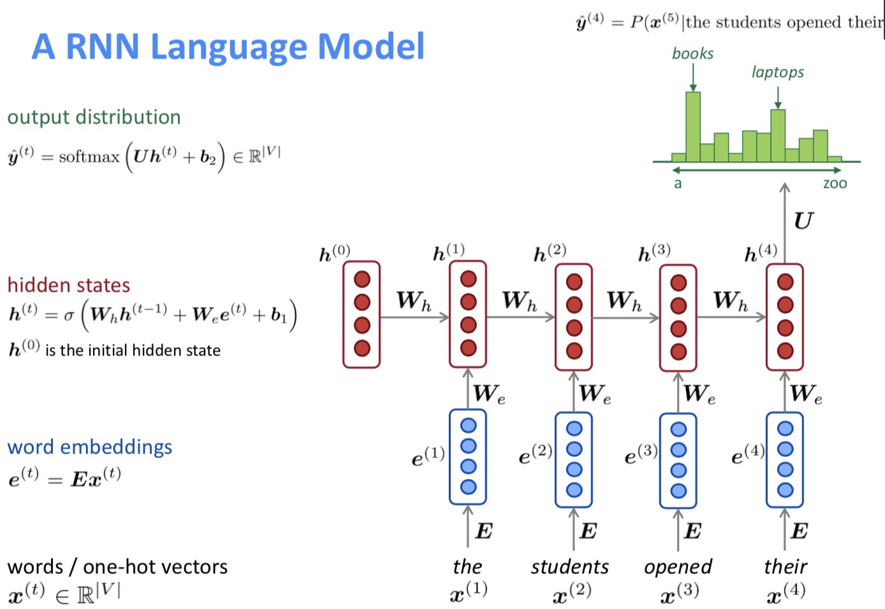

# Lecture 6 Language Models and RNNs

### Language models

- Definition

  - Language modeling is the task of predicting what word comes next

  - Given a sequence of words $x^{(1)},x^{(2)},...,x^{(t)}$, compute the probability distribution of the next word $x^{(t+1)}$
    $$
    P(x^{(t+1)}|x^{(t)},...,x^{(1)})
    $$
    where $x^{(t+1)}$ can be any word in the vocabulary $V=\{w_1,...,w_{|V|}\}$

  - Use a language model can assign probability to a piece of text
    $$
    \begin{align}
    P(x^{(1)},...,x^{(T)}) &=P(x^{(1)})\times P(x^{(2)}|x^{(1)})\times \ldots \times P(x^{(T)}|x^{(T-1)},\ldots,x^{(1)}) \\
    &=\prod_{t=1}^TP(x^{(t)}|x^{(t-1)},\ldots,x^{(1)})
    \end{align}
    $$

- N-gram Language Models

  - Assumption: $x^{(t+1)}$ depends only on the preceding $n-1$ words.
    $$
    \begin{align}
    P(x^{(t+1)}|x^{(t)},...,x^{(1)}) &=P(x^{(t+1)}|x^{(t)},\ldots,x^{(t-n+2)}) \\
    &=\frac{P(x^{(t+1)},x^{(t)},\ldots,x^{(t-n+2)})}{P(x^{(t)},\ldots,x^{(t-n+2)})}\\
    &\approx\frac{\text{count}(x^{(t+1)},x^{(t)},\ldots,x^{(t-n+2)})}{\text{count}(x^{(t)},\ldots,x^{(t-n+2)})}
    \end{align}
    $$

  - Sparsity Problems with n-gram language models

    - The numerator is equal to 0 
      - Solution: Add small $\delta$ to the count for every $w\in V$ (smoothing)
    - the denominator is 0
      - Solution: Just condition on (n-2) gram instead (backoff) 
    - Increasing n makes sparsity problems worse. Typically we can't have n bigger than 5

  - Storage Problems with n-gram language models

    - Need to store for all n-grams you saw in the corpus
    - Increasing n or increasing corpus increases model size! 

- N-gram Language Model in practice

  - You can build a simple trigram Language Model over a 1.7 million word corpus (Reuters) in few seconds on your laptop
  - https://nlpforhackers.io/language-models/
  - You can use a Language Model to generate text.

- Neural Language Model

  - A fixed-window neural Language Model

    

  - Improvements over n-gram LM:
    - No sparsity problem
    - Don't need to store all observed n-grams
  - Remaining problems:
    - Fixed window is too small
    - Enlarging window enlarges $W$
    - Window can never large enough
    - $x^{(1)}$ and $x^{(2)}$ are multiplied by completely different weights in $W$. No symmetry in how the inputs are processed.

### Recurrent Neural Networks

- Core idea: Apply the same weights $W$ repeatedly.

- A RNN Language Model

  
  

  - RNN Advantages:
    - Can process any length input
    - Computation for step t can (in theory) use information from many steps back
    - Model size doesn't increase for longer input
    - Same weights applied on every timestep, so there is symmetry in how inputs are processed.
  - RNN Disadvantages:
    - Recurrent computation is slow
    - In practice, difficult to access information from many steps back

- Training a RNN Language Model

  - Get a big corpus of text which is a sequence of words $x^{(1)},...,x^{(T)}$ 

  - Feed into RNN-LM, compute output distribution $\hat y^{(t)}$ for every step $t$ 

  - Loss function on step t is cross-entropy between predicted probability distribution $\hat y^{(t)}$ and the true next word $ y^{(t)}$ (one-hot for $x^{(t+1)}$)
    $$
    J^{(t)}(\theta)=CE( y^{(t)},\hat  y^{(t)}) =-\sum_{w\in V}  y^{(t)}_w\log \hat y^{(t)}_w =-\log \hat y^{(t)}_{x_{t+1}}
    $$ { }

  - Average this to get overall loss for entire training set:
    $$
    J(\theta)=\frac1T\sum_{t=1}^TJ^{(t)}(\theta)=\frac1T\sum_{t=1}^T -\log \hat y^{(t)}_{x_{t+1}}
    $$

  - Compute loss $J(\theta)$ for a sentence (actually a batch of sentences), compute gradients and update weights. Repeat.

  - Backpropagation for RNNs
    $$
    \frac{\partial J^{(t)}}{\partial \boldsymbol{W}_{\boldsymbol{h}}}=\left.\sum_{i=1}^{t} \frac{\partial J^{(t)}}{\partial \boldsymbol{W}_{\boldsymbol{h}}}\right|_{(i)}
    $$
    Backpropagate over timesteps $i=t,...,0$ , summing gradients as you go. This algorithm is called "backpropagation through time"

- Evaluating Language Models

  - The standrad evaluation metric for language models is **perplexity**
    $$
    \text{perplexity}=\prod_{t=1}^T\left(\frac{1}{P_{LM}(\boldsymbol{x}^{(t+1)}|\boldsymbol{x}^{(t)},...,\boldsymbol{x}^{(1)})} \right)^{1/T}
    $$

  - This is equal to the exponential of the cross-entropy loss $J(\theta)$ 
    $$
    \text{perplexity}=\prod_{t=1}^{T}\left(\frac{1}{\hat{\boldsymbol{y}}_{x_{t+1}}^{(t)}}\right)^{1 / T}=\exp \left(\frac{1}{T} \sum_{t=1}^{T}-\log \hat{\boldsymbol{y}}_{x_{t+1}}^{(t)}\right)=\exp (J(\theta))
    $$

  - Lower perplexity is better!

- Why should we care about Language Modeling?
  - Language Modeling is a benchmark task that helps us measure our progress on understanding language
  - Language Modeling is a subcomponent of many NLP tasks, especially those involving generate text or estimating the probability of text:
    - Predictive typing
    - Speech recognition
    - Handwriting recognition
    - Spelling/ grammar correction
    - Authorship identification
    - Machine translation
    - Summarization
    - Dialogue
    - etc.

- Use RNN to compute sentence encoding
  - Use final hidden state
  - Take element-wise max or mean of all hidden states

