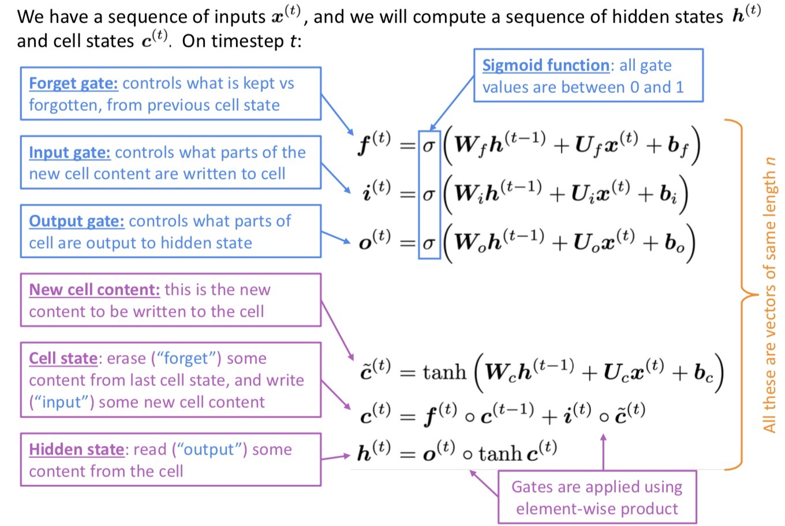
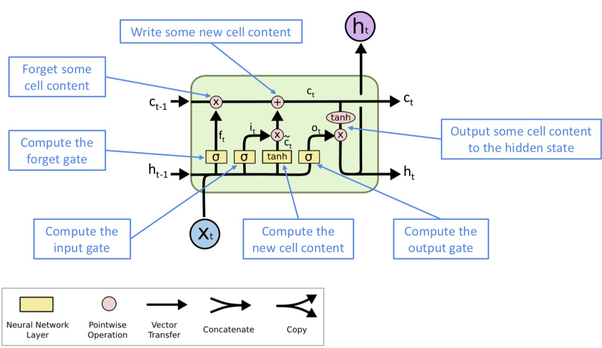
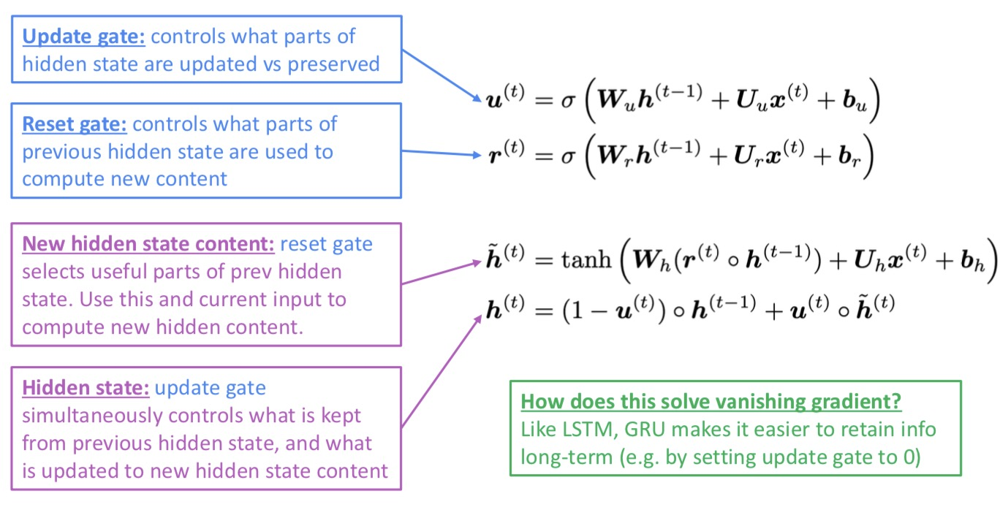

# Lecture 7 Vanishing Gradients and Fancy RNNs

### Vanishing gradient problem

- The hidden state of RNN
  $$
  \boldsymbol h^{(t)}=\sigma\left(\boldsymbol W_h\boldsymbol h^{(t-1)}+\boldsymbol W_x \boldsymbol x^{(t)}+\boldsymbol b_1 \right)
  $$
  therefore
  $$
  \frac{\partial \boldsymbol h^{(t)}}{\partial \boldsymbol h^{(t-1)}} = \text{diag}\left(\sigma^\prime \left(\boldsymbol W_h\boldsymbol h^{(t-1)}+\boldsymbol W_x \boldsymbol x^{(t)}+\boldsymbol b_1\right)\right)\boldsymbol W_h
  $$
  the gradient of the loss $J^{(i)}(\theta)$ on step i, with respect to the hidden state $\boldsymbol h^{(j)}$ on some previous step j
  $$
  \begin{aligned} \frac{\partial J^{(i)}(\theta)}{\partial \boldsymbol{h}^{(j)}} &=\frac{\partial J^{(i)}(\theta)}{\partial \boldsymbol{h}^{(i)}} \prod_{j<t \leq i} \frac{\partial \boldsymbol{h}^{(t)}}{\partial \boldsymbol{h}^{(t-1)}} \\ &=\frac{\partial J^{(i)}(\theta)}{\partial \boldsymbol{h}^{(i)}} {\boldsymbol{W}_{h}^{(i-j)}} \prod_{j<t \leq i} \operatorname{diag}\left(\sigma^{\prime}\left(\boldsymbol{W}_{h} \boldsymbol{h}^{(t-1)}+\boldsymbol{W}_{x} \boldsymbol{x}^{(t)}+\boldsymbol{b}_{1}\right)\right) \end{aligned}
  $$
  consider matrix L2 norm
  $$
  \left\|\frac{\partial J^{(i)}(\theta)}{\partial \boldsymbol{h}^{(j)}}\right\| \leq\left\|\frac{\partial J^{(i)}(\theta)}{\partial \boldsymbol{h}^{(i)}}\right\|\left\|\boldsymbol{W}_{h}\right\|^{(i-j)} \prod_{j<t \leq i}\left\|\operatorname{diag}\left(\sigma^{\prime}\left(\boldsymbol{W}_{h} \boldsymbol{h}^{(t-1)}+\boldsymbol{W}_{x} \boldsymbol{x}^{(t)}+\boldsymbol{b}_{1}\right)\right)\right\|
  $$
  Pascanu et al showed that if the largest eigenvalue of $\boldsymbol W_h$ is less than 1, then the gradient $\left\|\frac{\partial J^{(i)}(\theta)}{\partial \boldsymbol{h}^{(j)}}\right\|$ will shrink exponentially.

  There is similar proof relating a largest eigenvalue > 1 to exploding gradients

- Why is vanishing gradient a problem

  - Gradient signal from faraway is lost because it's much smaller than gradient signal from close-by
  - Model weights are only updated wrt near effects, not long-term effects.
  - Gradient can be viewed as a measure of the effect of the past on the future.

- Effect of vanishing gradient on RMM-LM

  - If the gradient is small, the model can't learn the long-distance dependency, so the model is unable to predict similar long-distance dependencies at test time.
  - Due to vanishing gradient, RNN-LMs are better at learning from sequential recency than syntactic recency.

### Exploding gradient problem

- If the gradient becomes too big, then the SGD update step becomes too big. We may take too large a step and reach a bad parameter configuration (with large loss)
- In the worst case, this will result in Inf or NaN in your network (then you have to restart training from an earlier checkpoint)

rnn的bptt代码实现

### LSTM

- How to fix vanishing gradient problem
  - The main problem is that it's too difficult for RNN to learn to preserve information over many timesteps
  - In a vanilla RNN, the hidden state is constantly being rewritten, how about a RNN with separate memory

- Long Short-Term Memory (LSTM)

  - A type of RNN proposed by Hochreiter and Schmidhuber in 1997 as a solution to the vanishing gradient problem 

  - paper: https://www.bioinf.jku.at/publications/older/2604.pdf

  - On step t, there is a hidden state $\boldsymbol h^{(t)}$ and cell state $\boldsymbol c^{(t)}$ 

    - Both are vectors length n
    - The cell state stores long-term information
    - The LSTM can erase, write, and read information from the cell state

  - The selection of which information is erased/written/read is controlled by three corresponding gates

    - The gates are also vectors length n
    - On each timestep, each element of the gates can be open (1), closed (0), or somewhere in-between
    - The gates are dynamic: their value is computed based on the current context

  - Formula of LSTM

    

  - Diagram of LSTM

    

- How does LSTM solve vanishing gradients?
  - The LSTM architecture makes it easier for the RNN to preserve information over many timesteps
    - if the forget gate is set to remember everything on every timestep, then the info in the cell is preserved indefinitely
    - by contrast, it's harder for vanilla RNN to learn a recurrent weight matrix $\boldsymbol W_h$ that preserves info in hidden state
  - LSTM doesn't guarantee that there is no vanishing/exploding gradient, but it does provide an easier way for the model to learn long-distance dependencies

### GRU

- Gated Recurrent Units

  - Proposed bu Cho et al. in 2014 as a similar alternative to the LSTM

  - Paper: https://arxiv.org/pdf/1406.1078v3.pdf

  - Formula of GRU

    

- LSTM vs GRU
  - Researchers have proposed many gated RNN variants, but LSTM and GRU are the most widely-used
  - The biggest difference is that GRU is quicker to compute and has fewer parameters
  - There is no conclusive evidence that one consistently performs better than the other
  - LSTM is a good default choice (especially if your data has particular long dependencies, or you have lots of training data)
  - Rule of thumb: start with LSTM, but switch to GRU if you want something more efficient

### Other fixes for vanishing (or exploding) gradient

- Gradient clipping

  If the norm of the gradient is greater than some threshold, scale it down before applying SGD update
  $$
  \begin{array}{l}{\hat{\mathbf{g}} \leftarrow \frac{\partial \mathcal{E}}{\partial \theta}} \\ {\text { if }\|\hat{\mathbf{g}}\| \geq \text { threshold then }} \\ {\quad \hat{\mathbf{g}} \leftarrow \frac{\text { threshold }}{\|\hat{\mathbf{g}}\|} \hat{\mathbf{g}}} \\ {\text { end if }}\end{array}
  $$
  **Intuition:** take a step in the same direction, but a smaller step

- Vanishing/expolding gradient is not just a RNN problem, it can be a problem for all neural architecture (including feed-forward and convolutional), especially deep ones.
  - Chain rule/ nonlinearity maks gradient become vanishingly small as it backpropagates 
  - Lower layers are learnt very slowly (hard to train)
  - Add more direct connections allowing gradient to flow
- Skip connections
  - ResNet (Residual connections)  identity connection
  - DenseNet (Dense connections)  connect everything to everything
  - HighwayNet (Highway connections)  dynamic gate similar to LSTM

### More fancy RNN variants

- Bidirectional RNNs
  $$
  \begin{aligned} 
  \text { Forward RNN } \  \ \overrightarrow{\boldsymbol{h}}^{(t)} &=\operatorname{RNN}_{\mathrm{FW}}\left(\overrightarrow{\boldsymbol{h}}^{(t-1)}, \boldsymbol{x}^{(t)}\right) \\ 
   \text { Backward RNN } \ \ \overleftarrow {\boldsymbol{h}}^{(t)}&=\operatorname{RNN}_{\mathrm{BW}}\left(\overleftarrow {\boldsymbol{h}}^{(t+1)}, \boldsymbol{x}^{(t)}\right) \\
   
  \text { Concatenated hidden states }\ \ \boldsymbol{h}^{(t)}& =\left[\overrightarrow{\boldsymbol{h}}^{(t)} ; \overleftarrow {\boldsymbol{h}}^{(t)}\right] 
  \end{aligned}
  $$

  - Bidirectinal RNNs are only applicable if you have access to the entire input sequence. (Not applicable to Language Modeling )
  - If you have entire input sequence (any kind of encoding), bidirectionality is powerful (you should use it by default)

- Multi-layer RNNs
  - RNN are already "deep" on one dimension (unroll over many timesteps), we can also make them "deep" in another dimension by applying multiple RNNs, which is multi-layer RNN (stacked RNNs)
  - Multi-layer allows the network to compute more complex representations (Lower RNNs compute lower-level features and higher RNNs compute higher-level features)
  - High-performing RNNs are often multi-layer. For Neural Machine Translation, 2-4 layers is best for the encoder RNN, and 4 layers is best for the decoder RNN. 
  - Skip-connections/ dense-connections are needed to train deeper RNNs.

