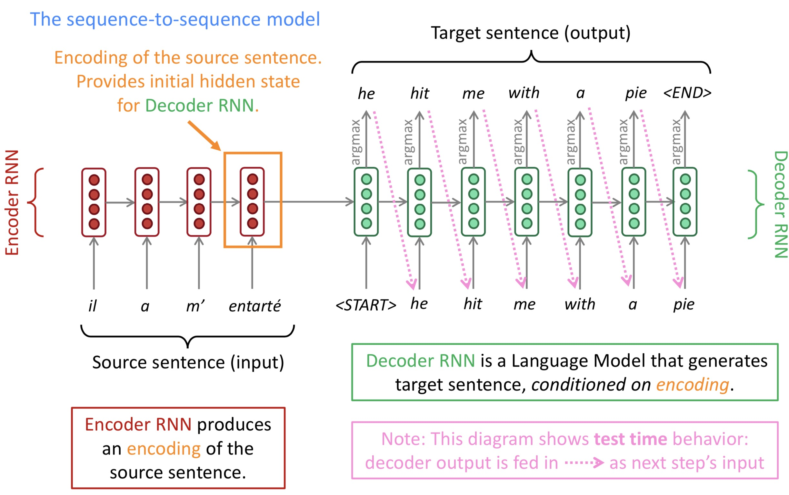
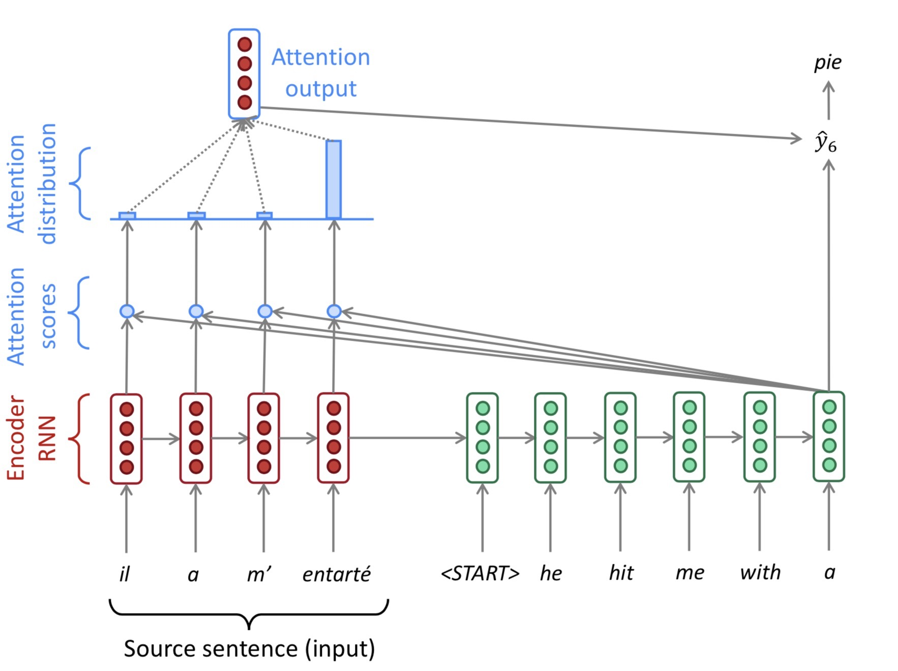

# Lecture 8 Machine Translation, Sequence-to-sequence and Attention

- Machine Translation is the task of translating a sentence x from one language (the source language) to a sentence y in another language (the target language)

### Pre-Neural Machine Translation

- 1950s: Early Machine Translation

  - MT research began in the early 1950s
  - Russian -> English (Motivated by the Cold War)
  - System were mostly **rule-based**, using a bilingual dictionary

- 1990s-2010s: Statistical Machine Translation

  - Learn a probabilistic model from data

  - Find the best English sentences y, given French sentence x, and use Bayes Rule to break down the probability 
    $$
    \arg\max_y P(y|x)=\arg\max_y \overbrace{P(x|y)}^{\text{Translation Model}}\underbrace{P(y)}_{\text{Language Model}}
    $$
    

    - translation model: models how words and phrases should be translated (fidelity). Learnt from parallel data
    - language model: models how to write good English (fluency). Learnt from monolingual data

  - How to learn translation model $P(x|y)$ from parallel data? Break it down further, consider $P(x,a|y)$ where a is the alignment

  - Alignment is the correspondence between particular words in the translated sentence pair.

  - Decoding for SMT: use a heuristic search algorithm to search for the best translation, discarding hypotheses that are too low-probability

  - Features of SMT

    - Systems had many separately-designed subcomponents
    - Lots of feature engineering
    - Lots of human efforts to maintain (repeated effort for each language pair)
    - Require compiling and maintaining extra resources (like tables of equivalent phrases)

### Neural Machine Translation

- Neural Machine Translation (NMT) is a way to do Machine Translation with a single neural network. The neural network architecture is called sequence-to-sequence

  

- Sequence-to-sequence is usful more than just MT, many NLP tasks can be phrased as seq2seq

  - Summarization (long text -> short text)
  - Dialogue (previous utterance -> next utterance)
  - Parsing (input text -> output parse as a sequence)
  - Code generation (natural language -> python code)

- Seq2seq model is an example of a **Conditional Language Model** 

  - Language Model because the decoder is predicting the next word of the target sentence $y$ 

  - Conditional because its predictions are also conditioned on the source sentence $x$ 
    $$
    P(y|x) = P(y_1|x)P(y_2|y_1,x)P(y_3|y_1,y_2,x)...P(y_T|y_1,...,y_{T-1},x)
    $$

- Beam search decoding

  - Exhaustive search decoding is far too expensive ($O(V^T)$)

  - Idea of beam search: On each step of decoder, keep track of the k most probable partial translations (hypotheses), and k is the beam size (in practice around 5 to 10)

  - A hypothesis $y_1,...,y_t$ has a score which is its log probability
    $$
    \text{score}(y_1,...,y_t)=\log P_{LM}(y_1,...,y_t|x) =\sum_{i=1}^t\log P_{LM}(y_i|y_1,...,y_{i-1},x)
    $$

    - scores are all negative, and higher score is better
    - we search for high-scoring hypotheses, tracking top k on each step

  - Beam search is not guaranteed to find optimal solution, but much more efficient than exhaustive search

  - Beam search decoding: stopping criterion

    - In greedy decoding, we decode until the model produces a <END> token
    - In beam search decoding, different hypotheses may produce <END> token on different timesteps
      - when a hypothesis produces <END>, that hypothesis is complete
      - Place it aside, and continue exploring other hypotheses via beam search
    - We continue beam search until
      - we reach timestep T (where T is some pre-defined cutoff), or
      - we have at least n completed hypotheses (where n is pre-defined cutoff)

  - Normalize the log probability by length, for the reason that longer hypothesis have lower scores
    $$
    \frac 1t\sum_{i=1}^t\log P_{LM}(y_i|y_1,...,y_{i-1},x)
    $$

- Advantages of NMT

  - Better performance (more fluent, better use of context, better use of phrase similarities)
  - A single neural network to be optimized end-to-end
  - Requires much less human engineering effort (no feature engineering, same method for all language pairs)

- Disadvantages of NMT

  - NMT is less interpretable (hard to debug)
  - NMT is difficult to control (cannot easily specify rules or guidelines for translation) 

- Evaluation of Machine Translation: BLEU (BiLingual Evalutaion Understudy)

  - BLEU compares the machine-written translation to one or several human-written translation(s), and computes a similarity score based on:
    - N-gram precision (usually for 1,2,3 and 4-grams)
    - Plus a penalty for too-short system translations
  - BLEU is useful but imperfect
    - There are many valid ways to translate a sentence
    - So a good translation can get a poor BLEU score because it has low n-gram overlap with the human translation

- Neural Machine Translation went from a fringe research activity in 2014 to the leading standard method in 2016

- Difficulties remains in MT

  - Out-of-vocabulary words
  - Domin mismatch between train and test data
  - Maintaining context over longer text
  - Low-resource language pairs

- NMT is the flagship task for NLP Deep learning

### Attention

- The bottleneck problem

  - The last hidden state of the encoder RNN needs to capture all information about the source sentence.

- Attention

  - Core idea: on each step of the decoder, use direct connection to the encoder to focus on a particular part of the source sequence

    

  - Attention in equations

    - Encoder states: $h_1,...,h_N\in\mathbb R^h$ 

    - On timestep $t$, decoder hidden state $s_t\in\mathbb R^h$ 

    - Attention score $e^t$ for this step
      $$
      \boldsymbol e^t=[\boldsymbol s_t^T\boldsymbol h_1,...,\boldsymbol s_t^T\boldsymbol h_N]\in\mathbb R^N
      $$

      $$
      \alpha^t=\text{softmax}(\boldsymbol e^t)\in\mathbb R^N
      $$

      $$
      \boldsymbol a_t=\sum_{i=1}^N \alpha_i^t\boldsymbol h_i\in \mathbb R^h
      $$

      

    - Concatenate together $[\boldsymbol a_t;\boldsymbol s_t]\in\mathbb R^{2h}$ 

  - Advantages of Attention 

    - Signicantly improves NMT performance
    - Solves the bottleneck problem
    - Helps with vanishing gradient problem
    - Provides some interpretability (we get soft alignment for free)

- Attention is a general deep learning technique

  - you can use attention in many architectures and many tasks
  - More general definition: Given a set of vector **values**, and a vector **query**, **attention**  is a technique to compute a weighted sum of the values, dependent on the query.
  - Intuition: The weighted sum is a selective summary of the information contained in the values, where the query determins which values to focus on.

- Attention variants

  - There are several ways to compute $\boldsymbol e\in\mathbb R^N$ from $\boldsymbol h_1,...,\boldsymbol h_N \in\mathbb R^{d_1}$  and $\boldsymbol s\in \mathbb R^{d_2}$ 

  - Basic **dot-product attention**: 
    $$
    \boldsymbol e_i=\boldsymbol s^T\boldsymbol h_i \in \mathbb R
    $$
    assume $d_1=d_2$

  - **Multiplicative attention**:
    $$
    \boldsymbol e_i=\boldsymbol s^T\boldsymbol W\boldsymbol h_i \in \mathbb R
    $$
    where $\boldsymbol W\in \mathbb R^{d_2\times d_1}$ is a weight matrix

  - **Additive attention**:
    $$
    \boldsymbol e_i=\boldsymbol v^T\tanh(\boldsymbol W_1\boldsymbol h_i+\boldsymbol W_2 \boldsymbol s) \in \mathbb R
    $$
    where $\boldsymbol W_1\in \mathbb R^{d_3\times d_1}$, $\boldsymbol W_2\in \mathbb R^{d_3\times d_2}$ are weight matrices and $\boldsymbol v \in \mathbb R^{d_3}$ is a weight vector. And $d_3$ is a hyperparameter.

