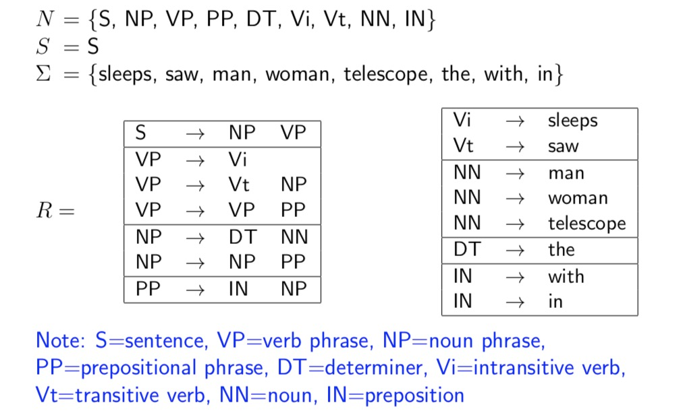
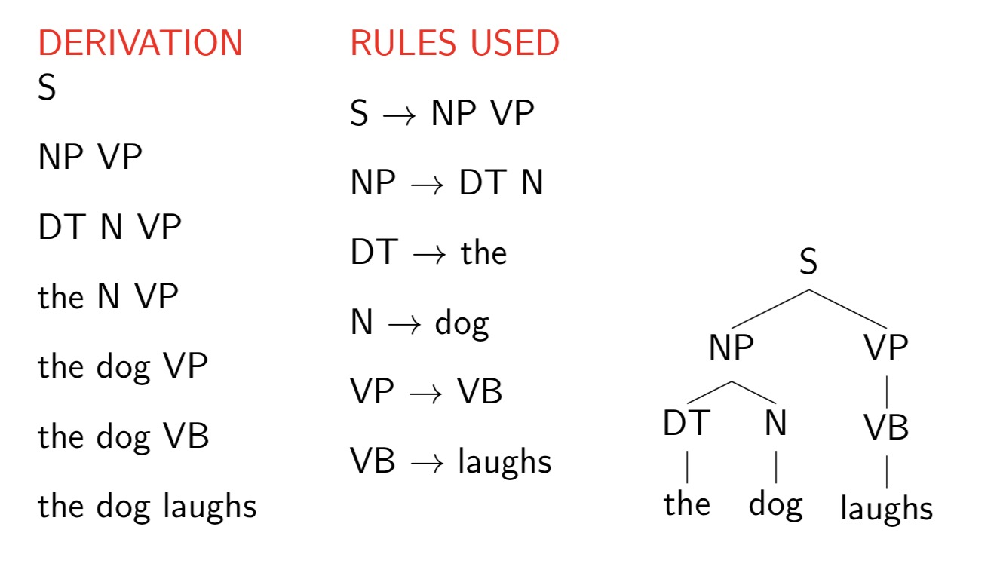
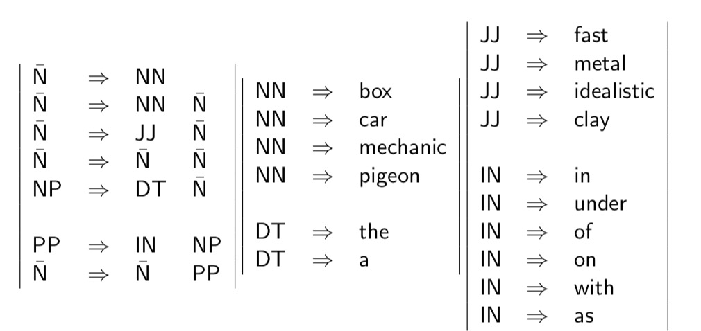
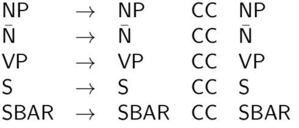
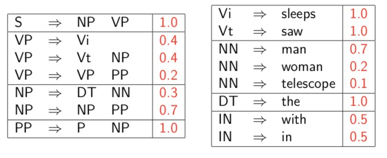

# Week 3 Parsing and context free grammars  

### An introduction to the parsing problem

- __Input__: A sentence, __Output__: A hierarchical structure parse tree

-  A recommand book to read: CHOMSKY(1957) - SYNACTIC STRUCTURES
- Examples of current formalisms: minimalism, lexical functional grammers(LFG), head-driven phrase-structure grammars (HPSG), tree adjoining grammers (TAG), categorial grammars. 
- Data for parsing experiments: 
  - Penn WSJ Treebank = 50,000 sentences with associated trees
  - Usual set-up: 40,000 training sentences, 2400 test sentences
- The information conveyed by parse trees:
  - Part of speech for each word
  - Phrases
  - Useful relationships
- An example application: Machine translation

### Context-Free grammars

- Context-free grammars are not only used in linguistics, they are also of central importance in computer science, both in theoretical computer science, and also in programming languages.
- __Definition__: A context-free grammar $G=(N,\Sigma,R,S)$ where:
  - $N$ is a set of non-terminal symbols
  - $\Sigma$ is a set of terminal symbols
  - $R$ is a set of rules of the form $X \to Y_1Y_2...Y_n$ for $n\ge0,X \in N,Y_i\in(N\cup \Sigma)$ 
  - $S\in N$ is a distinguished start symbol  
- An example of context-free grammar

- Left-most Derivations

  - A left-most derivation is a sequence of strings $s_1 … s_n$ , where 

    - $s_1 = S$ , the start symbol
    - $s_n \in \Sigma^*$ , i.e. $s_n$ is made up of terminal symbols only  ( $\Sigma^*$ is the set of all possible strings derived from $\Sigma$ , including empty string)
    - Each $s_i$ for $i=2…n$ is derived from $s_{i-1}$ by picking the left-most non-terminal $X$  in  $s_{i-1}$ and replacing it by some $\beta$  where $X \rightarrow \beta$ is a rule in $R$

    For example:  $\mathsf{[S],[NP \ VP],[D\  N \ VP],[the \ N \ VP],[the \ dog \ VP],[the \ dog \ Vi],[the \ dog \ laughs]}$

- Properties of CFGs
  - A CFG defines a set of possible drivations
  - A string $s\in \Sigma^*$ is in the *language* defined by the CFG if there is at least one derivation that yields $s$ 
  - Each string in the language generated by the CFG may have more than one derivation ("ambiguity")

### A brief sketch of the syntax of English

- Parts of speech (tags from the Brown corpus)

  - Nouns

    NN = singular noun    e.g., man, dog, park

    NNS = plural noun      e.g., telescopes, houses, buildings

    NNP = proper noun      e.g., Smith, Gates, IBM

  - Determiners

    DT = determiner        e.g., the, a, some, every

  - Adjectives

    JJ = adjective        e.g., red, green, large

- Phrase grammar

  - NP = noun phrases
  - Preposition phrases
    - IN = preposition     e.g., of, in, out
  - Verb pharses
    - Vi = Intransitive verb         e.g., sleeps, walks, laughs,
    - Vt = Transitive verb           e.g., sees, saw, likes
    - Vd = Ditransitive verb       e.g., gave
    - V[5]                                      e.g., said, reported
    - V[6]                                      e.g., told, informed
    - v[7]                                      e.g., bet

  - Grammer rules

  

  VP -> Vi

  VP -> Vt NP

  VP -> Vd NP NP

  VP -> VP PP

  VP -> V[5] SBAR

  VP -> V[6] NP SBAR

  VP -> V[7] NP NP SBAR

- Sentence Grammar

  - S -> NP VP

  - Complementizers

    COMP = complementizer     e.g., that

  - SBAR

    SBAR -> COMP S

  - CC = Coordinator       e.g., and, or, but

  - Grammer rules

  

### Examples of ambiguous structures 

- Sources of ambiguity

  - Part-of-speech ambiguity

  - preposition phrase attachment ambiguity

  - noun premodifiers

    the fast car mechanic

### Probabilistic Context-Free Grammars (PCFGs)

- Defination

  	Probability of a tree $t$ with rules
  $$
  \alpha_1 \rightarrow \beta_1,\alpha_2 \rightarrow \beta_2,...,\alpha_n \rightarrow \beta_n
  $$
  ​	is $p(t)=\prod_{i=1}^nq(\alpha_i \rightarrow \beta_i)$ where $q(\alpha \rightarrow \beta)$ is the probability for rule $\alpha \rightarrow \beta$

- Properties of PCFGs

  - Assigns a probability to each *left-most* derivation, or parse-treee, allowed by the underlying CFG

  - Say we have a sentence $s$, set of derivations for that sentence is $\mathcal{T}(s)$ . Then a PCFG assigns a probability $p(t)$ to each member of $\mathcal{T}(s)$ , and the most likely parse tree for a sentence $s$ is 
    $$
    \arg  \max_{t \in \mathcal{T}(s)} \ p(t)
    $$

- Deriving a PCFG from a Treebank

  - Given a set of example trees (a treebank), the underlying CFG can simply be **all rules seen in the corpus**

  - Maximum likelihood estimates:
    $$
    q_{ML}(\alpha \rightarrow \beta) = \frac{\mathsf{Count(\alpha \rightarrow \beta)}}{\mathsf{Count(\alpha)}}
    $$
    where the counts are taken from a training set of example trees

  - Given a CFG, if we want the probabilities of the trees generated by the CFG defines a distribution, they must meet some requirments:

    - The rule probablities defines a conditional distributions over the different ways of rewriting each non-terminal.
    - Some other requirments. (Not seen in common use)

### The CKY Algorithm for parsing with PCFGs

- Chomsky Normal Form

   A context free grammar $G = (N,\Sigma,R,S) $ in Chomsky Normal Form is as follows

  - $N$ is a set of non-terminal symbols
  - $\Sigma$ is a set of terminal symbols
  - $R$ is a set of rules which take one of two forms:
    - $X\rightarrow Y_1Y_2$ for $X \in N$ and $Y_1,Y_2 \in N$
    - $X \rightarrow Y$ for $X \in N$ and $Y \in \Sigma$ 
  - $S\in N$ is a distinguished start symbol

- Basic definitons for Dynamic Programming Algorithm

  - Given a PCFG and a sentence $s$, how do we find 

  $$
  \max_{t\in \mathcal{T} (s)} p(t)
  $$

  - Notation:

  $$
  \begin{align}
  & n= \mathsf{number \ of \ words \ in \ the \ sentence}\\
  & w_i= i\mathsf{\ th \ word \ in \ the \ sentence} \\
  & N = \mathsf{the \ set \ of \ not-terminals in the grammar} \\
  & S = \mathsf{the \ start \ symbol \ in \ the \ grammar}
  \end{align}
  $$

  - Dynamic programming table

  $$
  \begin{align}
  \pi[i,j,X] = & \mathsf{\ maximum \ probability \ of \ a \ constituent \ with \ non-terminal} \ X \\ &\mathsf{\ spanning words} \ i...j \mathsf{\ inclusive}
  \end{align}
  $$

  - Our goal is to calculate $\max_{t\in \mathcal{T} (s)} p(t)=\pi[1,n,S]$

  - Base case definition: for all $i =1…n$ , for $X\in N$
    $$
    \pi[i,i,X]=q(X\rightarrow w_i)
    $$
    (define $q(X\rightarrow w_i)=0$ if $X\rightarrow w_i$ is not in the grammar)

  - Recursive definition: for all $i=1…(n-1),j=(i+1)…n,X\in N$
    $$
    \pi(i,j,X) = \max_{X\rightarrow Y\ Z\in R\\s\in\{i...(j-1)\}}(q(X\rightarrow Y\ Z) \times \pi(i,s,Y)\times \pi(s,j,Z))
    $$
    where $s$ is $X\rightarrow Y\ Z$ is the rule and $s$ is the split point.

    we will search through all possible rules and search through all possible split points to find the optimal solution.

- Full Dynamic Programming Algorithm (CKY Algorithm)

  **Input:** a sentence $s=x_1…x_n$, a PCFG $G=(N,\Sigma,S,R,q)$  (where $q$ is the parameter of the PCFG).

  **Initialization:**

  for all $i\in \{1…n\}$, for all $X\in N$,
  $$
  \begin{equation}
  \pi(i,i,X) = 
  \left\{
  \begin{array}{l}
  q(X\rightarrow x_i) \ & \mathsf{if}\ X\rightarrow x_i\ \in R\\
  0  & \mathsf{otherwise}
  \end{array}
  \right.
  \end{equation}
  $$
  **Algorithm:**

  - For $l = 1…(n-1)$

    - For $i=1…(n-1)$

      - Set $j=i+1$

      - For all $X\in N$, calculate
        $$
        \pi(i,j,X) = \max_{X\rightarrow Y\ Z\in R\\s\in{i...(j-1)}}(q(X\rightarrow Y\ Z) \times \pi(i,s,Y)\times \pi(s,j,Z))
        $$
        and
        $$
        bp(i,j,X) =\arg \max_{X\rightarrow Y\ Z\in R\\s\in\{i...(j-1)\}}(q(X\rightarrow Y\ Z) \times \pi(i,s,Y)\times \pi(s,j,Z))
        $$

   **Complexity:** $\mathcal{O}(n^3|N|^3)$

### Summary

- PCFGs augments CFGs by including a probability for each rule in the grammar
- The probability for a parse tree is the product of probability for the rules in the tree
- To build a PCFG-parsed parser:
  - Learn a PCFG from a tree bank
  - Given a test data sentence, use CKY algorithm to compute the highest probability tree for the sentence under the PCFG