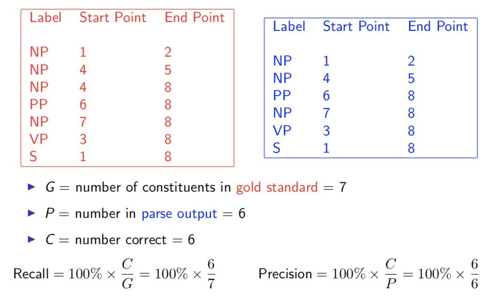
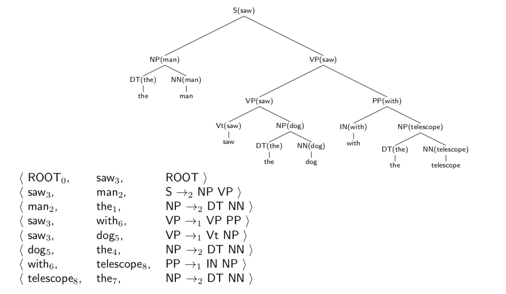

# Week 4 Lexicalized Probabilistic Context-Free Grammars

### Weakness of Probabilistic Context-Free Grammars

- Performance of PCFG: 72% accuracy , while morden parsers achieve 92% accuracy
- Reasons:
  - Lack of sensitivity of lexical information
  - Lack of sensitivity of structural information 

- Attachment decision is completely independent of the words, just base on the probabilities of rules learned the train data.
- PCFGs may generate two parse trees with identical rules (different orders)
- PCFGs ignore the close attachment preference when human read a sentence. And "Close attachment" is twice as likely in Wall Street Journal text.

### Lexicalization of a treebank

- Add annotations specifying the "head" of each rule

- Some intuitions for "head":

  - The central sub-constituent of each rule
  - The semantic predicate in each rule

- Rules recover heads for NPs

  **if** the rule contains NN, NNS, or NNP:

  ​	Choose the rightmost NN, NNS, or NNP

  **Else if** the rule contains an NP: Choose the leftmost NP

  **Else if** the rule contains a JJ: Choose the rightmost JJ

  **Else if** the rule contains a CD: Choose the rightmost CD (number)

  **Else** Choose the rightmost child

- Rules recover heads for VPs

  **If** the rule contains Vi or Vt: Choose the leftmost Vi or Vt

  **Else if ** the rule contains an VP: Choose the leftmost VP

  **Else** Choose the leftmost child

- Adding "head" to the not-terminal symbols makes the size of set $N$ from about 50 up to $50\times |vocab|$ 

- A consituent receives its headword from its head child.

### Lexicalized probabilistic context-free grammars

- Lexicalized Context-Free Grammars in Chomsky Normal Form
  - $N$ is a set of non-terminal symbols
  - $\Sigma$ is a set of terminal symbols
  - $R$ is a set of rules which take one of three forms:
    - $X(h)\rightarrow_1 Y_1(h)Y_2(w)$ for $X \in N$ and $Y_1,Y_2 \in N$, and $h,w\in \Sigma$
    - $X(h)\rightarrow_2 Y_1(w)Y_2(h)$ for $X \in N$ and $Y_1,Y_2 \in N$, and $h,w\in \Sigma$
    - $X (h)\rightarrow h$ for $X \in N$, and $h\in \Sigma$ 
  - $S\in N$ is a distinguished start symbol

- Parameters in Lexicalized PCFGs

  - An example parameter in a PCFG:
    $$
    q(\mathsf S\rightarrow \mathsf{NP\ VP})
    $$

  - An example parameter in a Lexicalized PCFG:

  $$
  q(\mathsf {S(saw)}\rightarrow_2 \mathsf{NP(man)\ VP(saw)})
  $$

- Parsing with Lexicalized PCFGs
  - There are $O(|\Sigma|^2\times|N|^3)$ potential possible rules in new form of grammars
  - Naively, parsing an $n$ word sentence using dynamic programming algorithm will take $O(n^3|\Sigma|^2|N|^3)$ time. But $|\Sigma|$ can be hunge.
  - By discarding rules that contain word not in the sentence, we can parse in $O(n^5|N|^3)$ time.

### Parameter estimation in lexicalized probabilistic context-free grammars

- A model from Charniak (1997)

  - An example parameter in a Lexicalized PCFGs:

  $$
  q(\mathsf {S(saw)}\rightarrow_2 \mathsf{NP(man)\ VP(saw)})
  $$

  - **Frist step:** decompose this parameter into a product of two parameters

  $$
  \begin{align}
  & q(\mathsf {S(saw)}\rightarrow_2 \mathsf{NP(man)\ VP(saw)})   \\
  = \ & q(\mathsf{S\rightarrow_2NP\ VP|S,\ saw)\ \times}\ q(\mathsf{man|S\rightarrow_2NP\ VP,\ saw})
  \end{align}
  $$

  - **Second step:** use smoothed estimation for the two parameter estimates

  $$
  \begin{align}
  & q(\mathsf{S\rightarrow_2NP\ VP|S,\ saw)} \\
  = \ & \lambda_1 \times q_{ML}(\mathsf{S\rightarrow_2NP\ VP|S,\ saw)} + \lambda_2 \times q_{ML}(\mathsf{S\rightarrow_2NP\ VP|S})
  \end{align}
  $$

  
  $$
  \begin{align}
  & q(\mathsf{man|S\rightarrow_2NP\ VP,\ saw}) \\
  =\ & \lambda_3 \times q_{ML}(\mathsf{man|S\rightarrow_2NP\ VP,\ saw}) +
  \lambda_4 \times q_{ML}(\mathsf{man|S\rightarrow_2NP\ VP}) \\
  &\lambda_5 \times q_{ML}(\mathsf{man|NP})
  \end{align}
  $$

- Some other details

  - need to deal with rules with more than two children
  - need to incorporate parts of speech
  - need to encode preference for close attachment
  - Further reading: Michael Collins. 2003. Head-Driven Statistical Models for Natural Language Parsing. In Computational Linguistics.

### Accuracy of lexicalized probabilistic context-free grammars

- Representing Trees as Constituents

  
  - Results
    - Training data: 40,000 sentences from the Penn Wall Street Journal treebank. Testing data: around 2,400 sentences from the Penn Wall Street Journal treebank
    - Results for a PCFG: 70.6% Recall, 74.8% Precision
    - Magerman (1994): 
      - 84.0% Recall, 84.3% Precision
      - Using descision trees and bottom-up parser
    - Results for a lexicalized PCFG: 88.1% Recall, 88.3% Precision (from Collins (1997, 2003))
    - Discriminative estimation
      - Carreras et al., 2008: 90.7% Recall/ 91.4% Precison
      - Charniak and Johnson, 2005: 91.2% Recall/ 91.8% Precision
    - Latent-variable PCFGs
      - Petrov 2010: 91.7% Recall/ 92.0% Precision

- Dependency Accuracies

  
  - All parses for a sentence with $n$ words have $n$ dependencies 
  - Results from Collins, 2003: 88.3% accuracy
  - Can calculate precision/recall on particular dependency **types**, e.g., look at all subject/ verb dependencies

- Strengths and Weakness of Modern Parsers

  (Numbers taken from Collins (2003))

  - Subject-verb pairs: over 95% recall and precision
  - Object-verb pairs: over 92% recall and precision
  - Other arguments to verbs: $\approx$ 93% recall and precision
  - Non-recursive NP boundaries:  $\approx$ 93% recall and precision
  - PP attachments:  $\approx$ 82% recall and precision
  - Coordination ambiguities:  $\approx$ 61% recall and precision