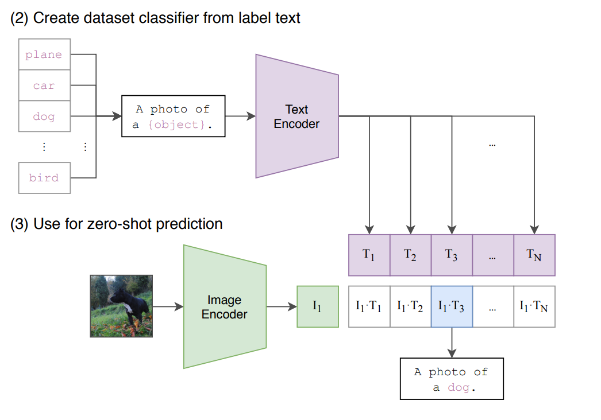

# CLIP

- 评价：方法出奇的简单，但效果出奇的好。比如：迁移学习的能力非常好，预训练好的模型能在任意一个视觉分类的数据集上，取得不错的效果；而且还是zero-shot的，就是没有在这些数据集上做训练，也能取得很好的效果。

- CLIP如何做预训练：
  - 输入：图片+文字的配对
  - 输入encoder，生成特征
  - 在特征上做对比学习
  - 特征矩阵里获得正负样本，正样本就是匹配的图文对（矩阵对角线），负样本则是所有不匹配的图文对
  - 训练集：4亿个图文对，数据质量高

- CLIP如何做zero-shot推理：
  - Prompt template，以ImageNet为例
  - 输入：CLIP先把ImageNet的1000个类，用于生成一个object作为替换位的句子，1000个句子
  - 预训练好的文本encoder，生成1000个文本特征 
  - 可以采用Prompt engineering和Prompt ensemble去进一步提高模型的准确率

- 基于CLIP的有趣应用
  - StyleCLIP：https://arxiv.org/pdf/2103.17249 
  - CLIPDraw：https://arxiv.org/pdf/2106.14843
  - 开放域目标检测：https://arxiv.org/pdf/2104.13921 
  - 视频中的检索：https://github.com/johanmodin/clifs


## 标题

- 标题：利用来自nlp的监督信号去学习一个迁移效果很好的视觉模型
- 方法：利用nlp的监督信号
- 目的：迁移性，学习泛化性好的特征


## 摘要

- 目前最先进的视觉系统：固定的提前定义好的物体类别集合，模型通过预测提前定义好的类别完成模型训练。这属于有限制性的监督信号，这也限制了模型本身的泛化性，尤其是要识别新类别物体的时候，就需要新的数据去训练新的模型。

- 本文：从文本中获得监督信号，也就是只要用语言描述过的物体，就有可能让视觉模型能识别到。

- 证明：用一个很简单的预训练任务，就能非常高效的、可扩展的去学习最好的图像表征

- 预训练任务：配对任务，给定一张图片和一些句子，模型需要判断哪个句子和图片是配对的

- 数据集： 4亿的图文数据集

- 自监督的训练方式：多模态的对比学习来完成模型训练

- 

  预训练完成之后，自然语言就被用来引导视觉模型做物体分类，也就是Prompt，而且Prompt不局限于学到的视觉概念，还能扩展到新的类别，从而，学到的这个模型可以直接用在下游任务上去做zero-shot推理 作者：大道至简ann https://www.bilibili.com/read/cv26779607/?from=search&jump_opus=1 出处：bilibili

- 预训练完成之后，自然语言就被用来引导视觉模型做物体分类，也就是Prompt，而且Prompt不局限于学到的视觉概念，还能扩展到新的类别，从而，学到的这个模型可以直接用在下游任务上去做zero-shot推理


## 引言

- NLP中的范式
  - 自监督任务
  - 任务无关的预训练任务，无需针对特定任务精心设计网络
  - 可以scaling，可以处理各种下游任务
- CV之前的类似工作
  - virtex：用自回归的预测方式做模型的预训练
  - ICMLM：用完形填空的方式做预训练
  - Convirt：只在医疗图像上做了实验
- 之前类似的工作很少、效果不够好的原因：规模不够大。
  - 没有大的数据集
  - 没有大模型
  - 没有大算力
  - 没有这么好的自监督训练方式
- 如何证明效果
  - 刷更多的榜（30个榜），泛化效果好
  - linear probe，计算高效
  - zero-shot，更稳健（泛化好）


## 方法

- 任务：用文本作为监督信号，做自监督学习的对比任务

  - Why 文本作为监督信号，做自监督任务？

    - 自监督的范式下，无需数据标注，数据量几乎等同于无限制。可以在数据上scaling
    - 文本监督信号，不再是categorical，而是可以有很大的自由度，方便下游任务迁移
    - 可以将文本和图像特征绑定，从而形成多模态特征

  - Why 对比学习？

    - 前绪视觉模型训练成本很高，（ResNetXt101 需要19 GPU 年，Noisy Student EfficientNet-L2 需要33 TPU-v3 年）
    - 先尝试了image- caption方案，效率太低。转换为对比损失，然后效率提升了4倍。

  - 对比学习伪代码

    ```python
    # image_encoder - ResNet or Vision Transformer
    # text_encoder - CBOW or Text Transformer
    # I[n, h, w, c] - minibatch of aligned images
    # T[n, l] - minibatch of aligned texts
    # W_i[d_i, d_e] - learned proj of image to embed
    # W_t[d_t, d_e] - learned proj of text to embed
    # t - learned temperature parameter
    # extract feature representations of each modality
    I_f = image_encoder(I) #[n, d_i]
    T_f = text_encoder(T) #[n, d_t]
    # joint multimodal embedding [n, d_e]
    I_e = l2_normalize(np.dot(I_f, W_i), axis=1)
    T_e = l2_normalize(np.dot(T_f, W_t), axis=1)
    # scaled pairwise cosine similarities [n, n]
    logits = np.dot(I_e, T_e.T) * np.exp(t)
    # symmetric loss function
    labels = np.arange(n)
    loss_i = cross_entropy_loss(logits, labels, axis=0)
    loss_t = cross_entropy_loss(logits, labels, axis=1)
    loss = (loss_i + loss_t)/2
    ```

- 数据：

  - 前绪数据集
    - MS-CoCo：质量高，量级少（10w级别）
    - Visual Genome：质量高，量级少（10w级别）
    - YFCC100M：质量差，量级高（1亿数据），经过清洗之后，只有1500w数据
    - JFT 300M：量级高（3亿数据）
    - Instagram photes：弱信号，量级高（35亿数据）
  - 构造数据集：WIT（WebImageText，4亿数据）
    - 量级超过Google的JFT 300M
    - 兑换到NLP，量级和训练GPT-2的数据接近
    - 同时应用到了文生图的模型训练：DALL·E

- 训练

  - 模型
    - 视觉模型：训练了5个resnet，3个vit
    - 所有模型都训练了32 epochs，Adam优化器
    - 超参搜索：在res-50上进行，训练1个epoch，batch szie：32768
  - 一些训练细节
    - 因为收集的数据集太大了，所以模型的训练不太会有overfitting的问题，所以实现起来就比之前的工作简单很多。比如训练CLIP的时候，对应的文本编码器和图片编码器都是不需要提前进行预训练的
    - 在做最后的投射的时候，没有用非线性的投射层，而是用了一个线性的投射层。SImCLR moco这一系列论文的时候，证明非线性的投射层会比用线性的投射层，带来将近10个点的性能提升。但是作者在本文中说，在他们多模态的预训练过程中，他们发现线性非线性没什么大关系，他们怀疑：这种非线性的投射层non-linear projections只是适配纯图片的单模态学习的
    - 因为数据集太大了，所以也不需要做太多的数据增强，本文中唯一做了的数据增强就是随机裁剪
    - 因为模型实在是太大了，数据集也实在是太大了，训练起来太耗时，所以不太好去做调参的工作，所以在算对比学习的超参数的时候，温度这个超参数（非常重要，稍微调一调最后的性能就会有很大的改变）但本文作者实在是不想调，于是就设置成了一个可以学习的标量，所以这个参数直接在模型训练过程中就被优化了，而不需要当做一个超参数，最后再去调参


## 实验

- zero-shot transfer

  - Why？

    - 之前的自监督或者无监督的方法，主要研究的是特征学习的能力，目标是去学一种泛化性比较好的特征。但即使学到了很好的特征，如果想应用到下游任务上，还是需要有标签的数据做微调，所以还牵扯各种各样的问题：下游任务不好收集数据，分布偏移（Distribution shift）【分布偏移在监督学习中一般指的是训练分布与测试分布不同，在离线强化学习中指的是训练策略与行为策略不一致。】
    - 那么如何能够训练一个模型，接下来就不再训练或者不再微调了呢？一旦借助文本训练好了这个又大又好的模型，然后就可以用这个文本作为引导，去很灵活的做zero-shot的迁移学习，至少在分类上效果都非常好。

  - How？

    - 当CLIP预训练好之后，其实就有两个编码器：图像和文本，都已经训练好了

    - 这时候任意给一张图片，通过图片编码器，就会得到一个图片特征

    - 文本输入：一些感兴趣的标签单词，通过prompt engineering就会得到对应数量的句子，然后通过文本编码器，就会得到相应的文本特征

    - 所有文本特征和图片特征算余弦相似度，得到的相似度还会通过一层softmax，得到一个概率分布

    - 哪个概率最大，也就是哪个相似度最高，大概率就是在描述这张照片。此时句子中包含的物体就是图片中的物体了

      

  - prompt engineering和prompt ensembling 进一步提升效果

  

- Few shot

  - 对于更难的数据集，fewshot会比zeroshot的衡量更合理 
  - 方法：预训练之后冻住模型参数，只从里面抽特征做这种linear probe，训练最后的分类头，所以需要下游数据集里有这种有标签的数据

- 表征学习

  - 如果下游任务用全部数据，那就用很多方式去衡量模型学到的特征好不好，最常见的两种方式：
    - linear probe：把预训练好的模型冻住，在上面再训练一个分类头
    - finetune：把整个网络都放开，去做端到端的学习。微调一般是更灵活的，而且在下游任务数据集比较大的时候，微调往往是比linear probe的效果好很多的
  - 本文选择了linear probe方法


## 和人效果对比

- zero shot CLIP的效果超过人了的zero-shot、one-shot 和 two-shot


## 局限和不足

- CLIP 在很多场景下，可以和 res-50 打成平手，但和 SOTA 还有差距
  - ImageNet，zero shot 准确率76.2%，而 SOTA 已经达到 90%
  - 可以通过scaling的方式继续提升效果，但是如果想达到 SOTA，计算量预计要扩大1000倍
- CLIP的zero shot上，在细分类、抽象、更难的任务上，效果不够好（低于 res-50）
- CLIP虽然泛化性很好，但是对于 OOD 的数据，效果还是不好
- 无法做生成类任务，比如image caption
- 对于数据的利用不够高效
- 下游数据的测试集可能有过拟合，需要一个新的专门 zero shot 测试集
- 数据来源于网络，可能带有偏见
- 有可能出现few-shot效果，低于 zero-shot的效果的现象


## 评价：

- 新意度：100。打破了固定类别的图像分类模式
- 有效性：100。zero-shot效果很好，泛化性好
- 问题大小：100。用一个模型解决大部分分类任务，而且是zero shot 解决


## 其他

- 如何做超大规模训练：https://lilianweng.github.io/posts/2021-09-25-train-large/