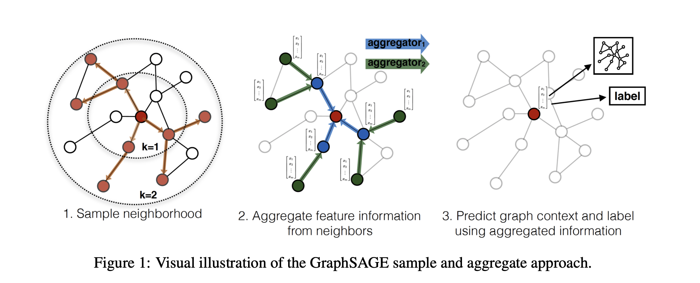
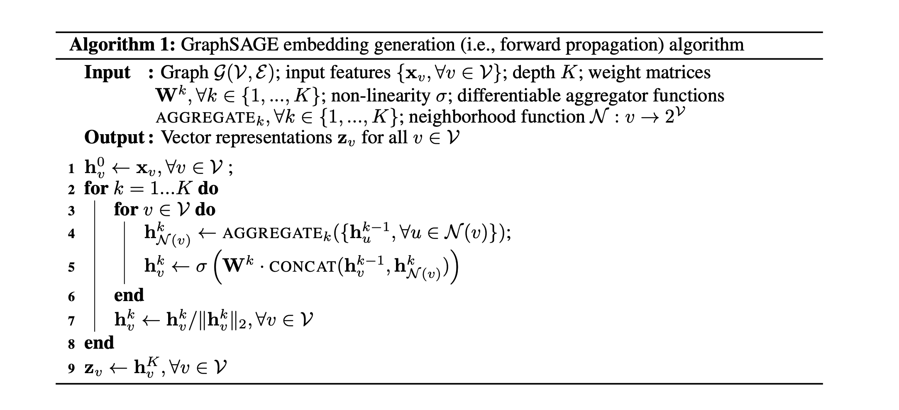

#  GCN、GraphSage、GAT

## GCN

- GCN也是一个神经网络层，它的层与层之间的传播方式是：

$$
H^{(l+1)}=\sigma\left({\tilde{D}^{-\frac{1}{2}} \tilde{A} \tilde{D}^{-\frac{1}{2}}} H^{(l)} W^{(l)}\right)
$$
$$
\tilde{A}=A+I_N
$$

$$
\tilde{D}_{i i}=\sum_j \tilde{A}_{i j}
$$

- $A$ 是图的邻接矩阵
- $\tilde D$ 是邻接矩阵的度矩阵

## GraphSage

- GraphSAGE (SAmple and aggreGatE)
- 不同方法归类
  - 直推式（transductive）方法：
    - 之前GCN的graph embedding方法都是所有节点都在图中，对于没有看到过的节点是不能处理的
  - 归纳式（inductive）方法：
    - 可以对于没见过的节点也生成embedding。

- Graphsage采样和聚合示意图

  

- Graphsage的算法

- 聚合函数

  - **平均聚合：**直接对目标节点和所有邻居emebdding中每个维度取平均（替换伪代码中第5、6行），后再非线性转换：
    $$
    \mathbf{h}_v^k= \sigma\left(\mathbf{W} \cdot \operatorname{MEAN}\left(\left\{\mathbf{h}_v^{k-1}\right\} \cup\left\{\mathbf{h}_u^{k-1}, \forall u \in \mathcal{N}(v)\right\}\right)\right.
    $$

  - **Pooling聚合器：**先对每个邻居节点上一层embedding进行非线性转换，再按维度应用 max/mean pooling，捕获邻居集上在某方面的突出的／综合的表现 以此表示目标节点embedding。
    $$
    \begin{aligned}
    &h_{N(v)}^k=\max \left(\left\{\sigma\left(W_{\text {pool }} h_{u i}^k+b\right)\right\}, \forall u_i \in N(v)\right) \\
    &h_v^k=\sigma\left(W^k \cdot \operatorname{CONCAT}\left(h_v^{k-1}, h_{N(u)}^{k-1}\right)\right)
    \end{aligned}
    $$

  - **LSTM聚合：**LSTM函数不符合“排序不变量”的性质，需要先对邻居随机排序，然后将随机的邻居序列embedding ${x_t,t∈N(v)} $作为LSTM输入。

- 损失函数

  - **无监督损失：**希望节点$u$与“邻居”$v$ 相似（第一项），而与“没有交集”的节点 $v_n$ 不相似（第二项)。
    $$
    J_{\mathcal{G}}\left(\mathbf{z}_u\right)=-\log \left(\sigma\left(\mathbf{z}_u^{\top} \mathbf{z}_v\right)\right)-Q \cdot \mathbb{E}_{v_n \sim P_n(v)} \log \left(\sigma\left(-\mathbf{z}_u^{\top} \mathbf{z}_{v_n}\right)\right)
    $$
    - $z_u$ 为节点u通过GraphSAGE生成的embedding。
    - 节点 ${v}$ 是节点 ${u}$ 随机游走访达"邻居"。
    - $v_n \sim P_n(u)$ 表示负采样: 节点 $v_n$ 是从节点 $\mathrm{u}$ 的负采样分布 $P_n$ 采样的, Q为采样样本数。
    - embedding之间相似度通过向量点积计算得到

  -  **有监督损失：**无监督损失函数的设定来学习节点embedding 可以供下游多个任务使用，若仅使用在特定某个任务上，则可以替代上述损失函数符合特定任务目标，如交叉熵。

- 参考资料
  - 博客：https://zhuanlan.zhihu.com/p/62750137
  - 代码：https://github.com/williamleif/GraphSAGE

## GAT

- 对每个邻居使用attention计算权重，然后计算加权和

$$
\alpha_{i j}=\frac{\exp \left(\operatorname{LeakyReLU}\left(\overrightarrow{\mathbf{a}}^T\left[\mathbf{W} \vec{h}_i \| \mathbf{W} \vec{h}_j\right]\right)\right)}{\sum_{k \in \mathcal{N}_i} \exp \left(\operatorname{LeakyReLU}\left(\overrightarrow{\mathbf{a}}^T\left[\mathbf{W} \vec{h}_i \| \mathbf{W} \vec{h}_k\right]\right)\right)}
$$

$$
\vec{h}_i^{\prime}=\sigma\left(\sum_{j \in \mathcal{N}_i} \alpha_{i j} \mathbf{W} \vec{h}_j\right)
$$

- 使用multi-head来增强模型表达能力
  $$
  \vec{h}_i^{\prime}=\|_{k=1}^K \sigma\left(\sum_{j \in \mathcal{N}_i} \alpha_{i j}^k \mathbf{W}^k \vec{h}_j\right)
  $$

- **与GCN的联系**

  - GCN与GAT都是将邻居顶点的特征聚合到中心顶点上（一种**aggregate**运算）。不同的是GCN利用了拉普拉斯矩阵，GAT利用attention系数。一定程度上而言，GAT会更强，因为 顶点特征之间的**相关性**被更好地融入到模型中。
  - GAT适用于有向图。这是因为GAT的运算方式是**逐顶点**的运算（node-wise），每一次运算都需要**循环遍历图上的所有顶点**来完成。逐顶点运算意味着，摆脱了拉普利矩阵的束缚，使得有向图问题迎刃而解。也正因如此，GAT适用于inductive任务。与此相反的是，GCN是一种**全图**的计算方式，一次计算就更新全图的节点特征。

- 参考资料
  - https://zhuanlan.zhihu.com/p/452301344

