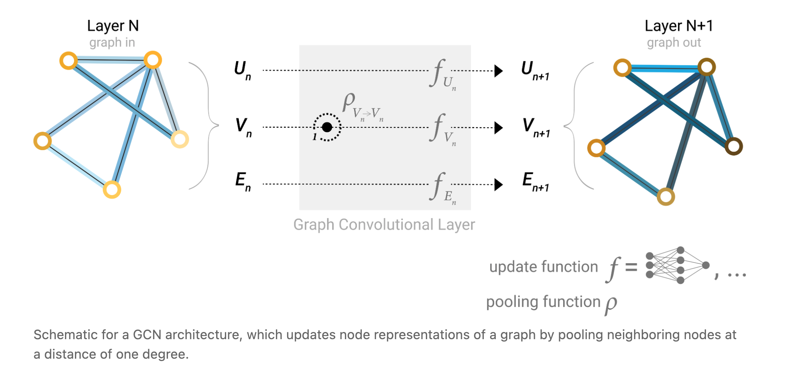

# GNN

- https://distill.pub/2021/gnn-intro/

- 目前，神经网络已经被采用来利用图的结构和属性。
- 本篇文章探索了构建图神经网络所需的组件，以及它们背后的设计的动机。

- 作者：
  - Google Research团队
  - Benjamin Sanchez-Lengeling, Emily Reif, [Adam Pearce](https://roadtolarissa.com/), Alexander B. Wiltschko

- 另一篇文章，如何理解图卷积：https://distill.pub/2021/understanding-gnns/

## 1. 什么数据可以表示为图

- 图的定义：图表示一些节点之间的连接关系
- 图的属性：节点、边、全局属性
- 图是一种很灵活的数据结构：
  - 图像和文本也可以表示为图
  - 其他的图：分子结构、社交网络、文献引用、知识图谱

## 2. 图和别的数据有什么不一样

- 图结构的任务：图级别任务、节点级别任务、边级别任务
  - 图级别任务：根据整个图，预测整体图的性质（类比于图片分类和文本分类）
  - 节点级别任务：预测每个节点的性质（类比于图片分割和序列标注）
  - 边级别任务：预测节点之间的关系（如图片分割之后，各个物体之间的关系）

- 使用图进行机器学习的挑战
  - 如何将图进行表示，从而可以用于神经网络
  - 节点的表示：矩阵
  - 边的表示：
    - 邻接矩阵（太稀疏、没有排列不变性）
    - 邻接列表

## 3. 构建一个图神经网络

- GNN：

  - 一个可优化的变换，这个变换可以作用于图的所有属性（包括节点、边、全局信息）并且保持排列不变性

  - GNN采用“图进图出”的结构，不会改变图的连接结构

  - 可以通过pooling操作，将节点的信息转化为边的信息，反之也可以。

  - 所有的顶点共享一个MLP，所有的边共享一个MLP

    

- 在图的各个部分传递信息

  - 搜集邻居节点的信息
  - 聚合邻居节点的信息
  - 使用神经网络对聚合后的信息进行更新

- GCN

  - 和图像卷积的区别：图像中卷积核是有权重的，得到的结果是加权和。此处没有权重，是直接加和。

  

- 可以通过不同的聚合方式，构建不同的GNN

## 4. GNN playground

- GNN对于参数比较敏感

