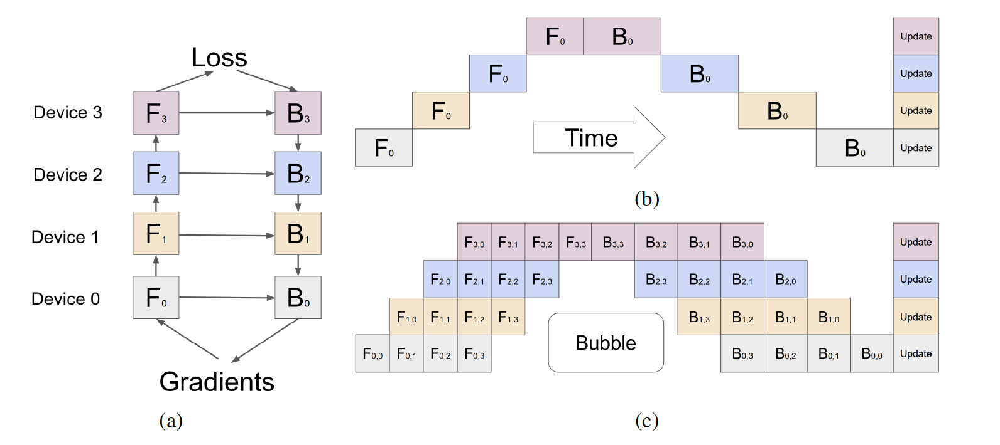

# GPipe

- GPipe：使用流水线并行对超大网络进行有效的训练
- 参数服务器是数据并行，pathways是流水线并行
- pipeline parallelism，是模型并行的一种
- CPU中的流水线
  - 如果一条CPU指令需要多个时钟周期来执行，而且每个时钟周期用到的硬件是不一样的
  - 可以把多条指令排个序，流水进行执行，这样每个硬件在每个时刻都有在做运算，从而提升CPU效率

## 作者

- 来自Google Brain
- 发表于NeurIPS 2019，这个会议上的系统文章不会很难

## 摘要

- 模型变大后，无法放入一个加速器中
- GPipe：一个流水线并行的包，可以适用于任何可以表示为一些层串联的神经网络
  - 把不同的子序列的层，通过流水线的方式，在多个加速器上进行执行
  - 同时既有灵活性，又能性能比较好
  - 使用了一个新的batch-spliting的流水线算法
- 训练了一个60亿参数的模型，同时效果很好
  - 为什么要说模型效果好？因为需要说明这个任务不是我假想出来的，而是存在真实的需求
  - 如果只是为了做系统而假想一个很大的任务（ 比如一个特别大的全连接网络），实际没法运用到真正的场景中，则意义不大

## 导言

- Re-materialization：把一些中间结果丢掉，下次需要用的时候，再重新计算，从而减少内存的占用
- micro-batch：把一个batch再做切分，可以用来实现流水线并行

## GPipe库

- 基于Lingvo库的实现

  - Lingvo是基于tensorflow上面的一个框架，特别是针对变长输入的语言模型，有点像keras
  - 最初是针对语音开发的，后面扩展到NLP，变成一个通用的框架
  - 最大的特点：追求可重复性。所有的超参数、参数、数据集都是继承至同一个基类，类似一个大的字典
  - 优点：指定一个版本号或者配置，可以完美重复。
  - 缺点：抽象逻辑有点奇怪，对于新手不友好

- 算法

  - 对于一个L层的神经网络，每一层是 $L_i$ ，对应的计算量是 $c_i$ ，以及需要把网络切成 $K$ 块，每一块称为一个单元（cell），每个单元放在一个加速器上面

  - 将每个batch再切成微批量

    

  - 如果计算batch norm的时候，要特殊处理一下。Transformer因为是Layer norm，因此不受影响

-  空间复杂度

  - 采用的是Re-materialization
  - 单个加速器上，从 $O(N\times \frac{L}{K})$ 降低到 $O\left(N+\frac{L}{K} \times \frac{N}{M}\right)$ ，当 $\frac{L}{K} $ 比较大的时候，节省的空间还是比较多
  - 代价是，需要计算2次forward

- 时间复杂度

  - bubble的开销 $O\left(\frac{K-1}{M+K-1}\right)$ ，当 $M \geq 4 \times K$ 时，bubble的计算开销可以忽略不计
  - 重新计算forward，会带来约30%的额外计算时间
  - 需要让每一块的加速器上的计算量比较均衡，降低等待时间

- 模型并行，相比数据并行，通讯量会降低

- 同期的另一篇工作：PipeDream
  - 更加复杂，更加精妙的设计，更偏系统
  - 有异步的算法
  - 发表于SOSP
  - 实现更难一点

## 结论

- 性能：近似于加速器数量的线性提升
- 灵活性：可以支持任意一个串行的神经网络
- 可靠性：同步的梯度更新

