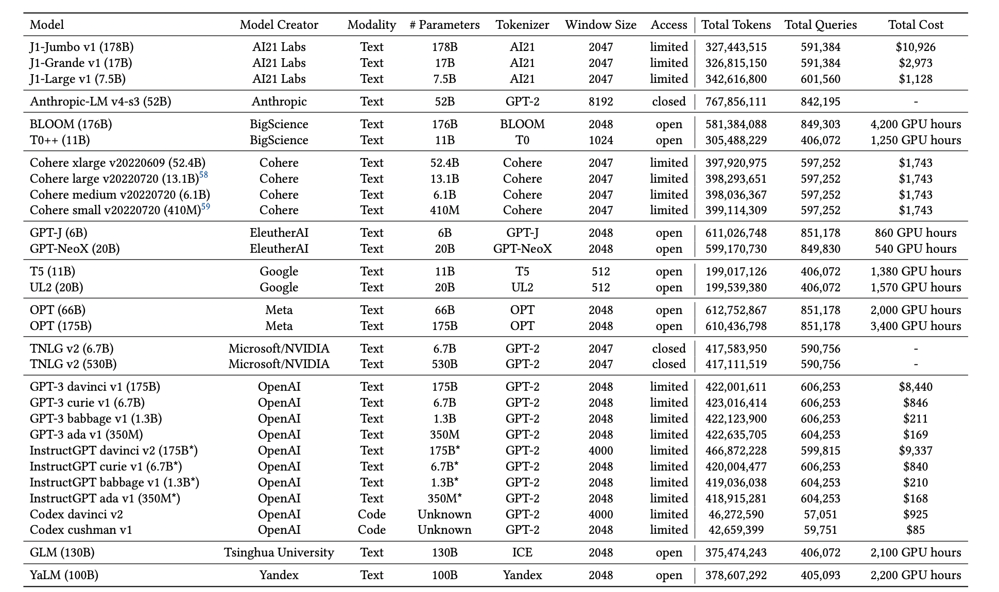

# Holistic Evaluation of Language Models

## 省流版本

- InstructGPT效果最好
- 闭源模型比开源模型效果更好
- 模型越大越好，最少50B。未来如何降低到5B或者10B
- LM对prompt非常敏感

## 作者

- 斯坦福团队
- Percy Liang，斯坦佛副教授，2011伯克利博士，Squad的作者。做QA出身

## 摘要

- 语言模型是主要NLP的基石，但是能力、局限性、风险了解还不够
- 主要贡献：
  - 对潜在应用场景、评估手段，做了分类。然后对其中的子集，做了仔细评测
  - 7个评估指标：精度accuracy、校准calibration、稳定性robustness、公平性fairness、偏差bias、有毒性toxicity、效率efficiency
  - 16个核心场景的评测
  - 30个LM，42个场景评估
  - 覆盖了96%的场景

## 核心应用场景

- 场景可以分为3个部分：
  - 任务：如QA、摘要、情感分析、信息检索
  - 领域
    - what：wikipedia、新闻、推特、电影评论
    - who：网络用户、不同性别作者、不同种族、不同年龄
    - When：2018、2011、前互联网时代
  - 语言：英语、中文
- QA
  - 分类：
    - 开放式的问题
    - 做选择题
  - 数据集
    - NaturalQuestions：在google上搜的比较长的问题，且在wikipedia上有答案
    - NarrativeQA：根据一段文字，做回答
    - QuAC：更像日常的对话，有上下文，更开放性
    - HellaSwag：关于常识的问题
    - OpenBookQA：关于初中的一些知识，比如传热最快的物体
    - TruthfulQA：一些GPT-3回答错误的问题，看LM是否一本正经的胡说
    - MMLU：大学课程的问题，如微观经济学的问题
    - BoolQ：判断是否的问题
- 信息检索
  - 给定一个查询Q，和一个数据集C，返回top-K的最相近的文本
  - 给定一个q和文本 $c_i$，让模型判断，文本 $c_i$ 包含q的答案的概率，然后根据概率排序。pointwise
  - 数据集：MARCO

- 摘要
  - 最好是生成，而不是抽取。
  - 评估比较困难。
  - 数据集
    - CNN/DailyMail
    - XSum：更加简单
- 情感分析
  - 商家、金融中应用
  - 数据集：IMDB
- 毒性检测
  - 用于互联网审核
  - 不同文化下，有毒性不一样
  - 数据集：CivilComments
- 各种文本分类
  - 数据集：RAFT

## 评估指标

- 评估指标要更具有扩展性，不跟特定场景相关

- 精度accuracy

  - General

    - exact match
    - Quasi-exact match
    - f1

  - 信息检索（排序）

    - RR@K 

    $$
    R R @ K= \begin{cases}1 / r a n k, & \text { if } r a n k \leq K \\ 0, & \text { otherwise. }\end{cases}
    $$

    - NDCG@K

  - 摘要

    - ROUGE-2

  - 语言模型

    - BPB（bits-per-byte）

  - 推理Reasoning

    - F1
    - exact match
    - code
    - equivalent

- 校准和不确定性 Calibration and uncertainty

  - 给出模型的置信度

- 稳健性

  - 当输入做了变换之后，输出是否还能保持正确
  - Invariance：语义不变，做一些变换，如，大小写替换，常见的错别字等
  - Equivariance：语义会改变，句式类似，但是含义可能会相反

- 公平性fairness

  - 反事实的公平性：he变成she，看结果会不会变化
  - 性能的偏差：在不同群体上的差别，如性别、国籍、口语还是书面语

- 偏见和刻板映像 bias and stereotypes

  - 模型的生成结果，会不会过分偏向某些群体

- 有毒性 toxicity

  - perspective API

- 效率

  - 训练效率
  - 预测的有效性

## 目标

- 语言模型：
  - 使用模型计算LM的损失
  - minimal pair：给定一个句子，将其中的一个token做不可接受的变换，使其在LM中的概率低一些
- 知识
  - 知识QA问答
  - 事实补全
- 推理
- 记忆和版权
  - Linux 代码
- 虚假信息
- 偏差
- 有毒性

## 模型

## 任务适配

- prompt的选择，参数设置等

## 结果

- accuracy前四：
  - InstructGPT davinci v2 (175B*)
  - TNLG v2 (530B)
  - Anthropic-LM v4-s3 (52B)
  - OPT (175B)
  - Cohere xlarge v20220609 (52.4B)

- 摘要的人工评估
  - 数据集不够好

 

