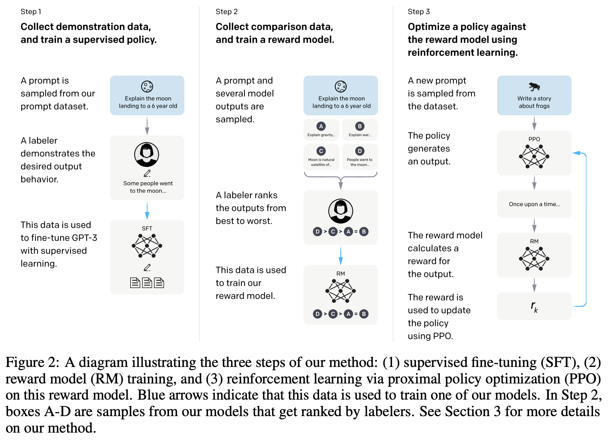
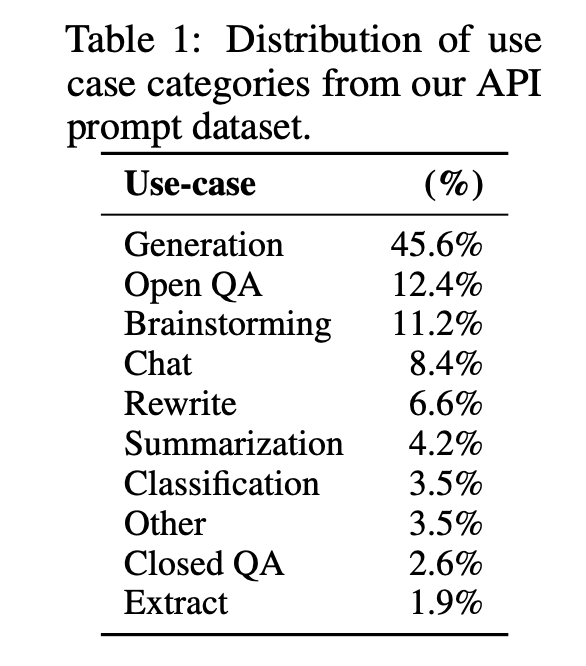

# InstructGPT

- 博客：https://openai.com/blog/chatgpt

## 摘要

- 把语言模型变大，并不意味着它可以更好地按照用户意图来做事情。LLM可能会生成不真实的、有毒的、对用户没有帮助的答案。也就是说，LLM没有和它的用户align在一起。
- 本文展示了如何在模型和人类的意图之间align，方法是使用RLHF做微调
- 在OpenAI的API上收集了很多问题，然后人工写出答案，然后在GPT-3上微调
- 然后又新构建了一个数据集，对模型的输出进行排序，然后使用强化学习的方法进行微调
- 通过人工评估，1.3B的InstructGPT性能比175B的GPT-3效果更好

## 导言

- LLM没有和它的用户align在一起

  - LM的目标函数是，给定一段文本，预测下一个词
  - 用户的意图：根据指示，安全的有帮助的生成答案

- 目标：希望LLM可以真诚、有帮助、无害

- 训练流程

  

- 主要的亮点：
  - 使用人工标注数据，进行微调
  - 标注一个排序的数据
  - 训练一个奖励模型reward model
  - 使用强化学习进行训练
- 结果：
  - 标注人员认为instructGPT比GPT-3要好很多
  - instructGPT在真实性上比GPT-3要好很多
  - instructGPT在是否生成有毒的答案上比GPT-3要好很多，但是偏见上没有
  - 在做RLHF的时候，同时增加之前的学习任务，避免灾难性遗忘
  - 微调对于数据是比较敏感的
  - instructGPT还是会犯一些简单的错误
  - instructGPT像是一个玩具，而不是工具

## 方法

### 数据集

- 第一个数据集
  - 让标注人员写很多的prompt，包括plain、few-shot、user-based的问题

- 第二个数据集
  - 使用第一个数据集微调了一个模型，然后放在playground让大家去玩，搜集到了新的prompt
  - 然后对采集到的数据进行筛选，每个用户最多200个问题，划分train/dev/test是根据用户id进行划分
  - 过滤了包含个人信息的数据

- 有了上述的prompt之后，生产了3个不同的数据集

  - SFT数据集，13k，让标注人员直接去写答案
  - RM数据集，33k，标注了排序信息
  - PPO数据集，31k，没有人工标注，训练强化学习

- prompt的数据分布

  

### 如何标注数据

- 招了40个人，附录中有介绍，如何筛选标注人员
- 在标注的时候，把帮助性（helpfulness）放在第一位，评估的时候，把真实性（truthfulness）和无害性（harmlessness）放在第一位

- 标注人员的一致性：72.6%

## 模型

- SFT

  - 在SFT数据集上，使用GPT-3进行微调，训练了16 epochs
  - 1 epoch之后，模型就过拟合了，但是没有关系，只是用于初始化后面的模型

-  RM

  - 使用SFT初始化参数，最后一层拿掉，然后用一个线性层进行投影，输出一个标量
  - 使用了6B的模型，175B的模型不稳定
  - 训练大模型会有不稳定的问题
  - 损失函数：pairwise ranking loss

  $$
  \operatorname{loss}(\theta)=-\frac{1}{\left(\begin{array}{c}K \\ 2\end{array}\right)} E_{\left(x, y_w, y_l\right) \sim D}\left[\log \left(\sigma\left(r_\theta\left(x, y_w\right)-r_\theta\left(x, y_l\right)\right)\right)\right]
  $$

  ​	其中， $y_w$ 和 $y_l$ 的排序更靠前

  ​	K选9，可以在少量增加排序时间的前提下，大量增加排好序的数据，并且pair对的数据量大幅增加

- RL

  - 选用了PPO
  - 没看懂，以后再看

