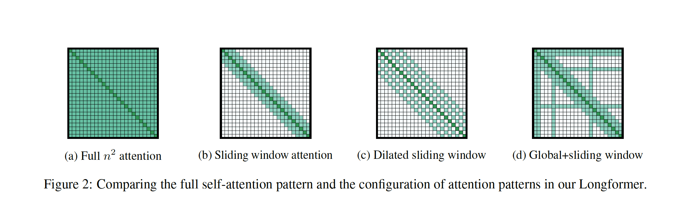

# Longformer

### 作者

Allen AI: Iz Beltagy, Matthew E. Peters, Arman Cohan

### 摘要

- 为了解决transformer计算复杂度问题，引入了线性复杂度的Longformer
- Longformer的attention机制可以即插即用的替代传统的self- attention
- 采用局部的窗口attention和任务驱动的全局attention
- 性能：在字符级别的语言模型，达到SOTA。在长文本下游任务超越RoBERTa。
- 引入长序列seq2seq模型Longformer-Encoder-Decoder (LED)

### 引言

- Longformer是从RoBERTa的参数中，继续训练的

### 相关工作

- 长文本transformers
  - Sparse Transformer：使用了BlockSparse的膨胀滑动窗口
  - BP-Transformer：在机器翻译上进行评估，但没有进行预训练
  - Blockwise attention：在QA上进行评估，有预训练
- 特定任务的长本文模型
  - ETC：local + global attention，使用相对位置编码，引入了新的预训练损失（CPC loss）
  - GMAT：使用类似的方法，部分global位置当作全局共享
  - BigBird：ETC的扩展版本，在更多的任务上进行了评估，如摘要。

### Longformer

- 

