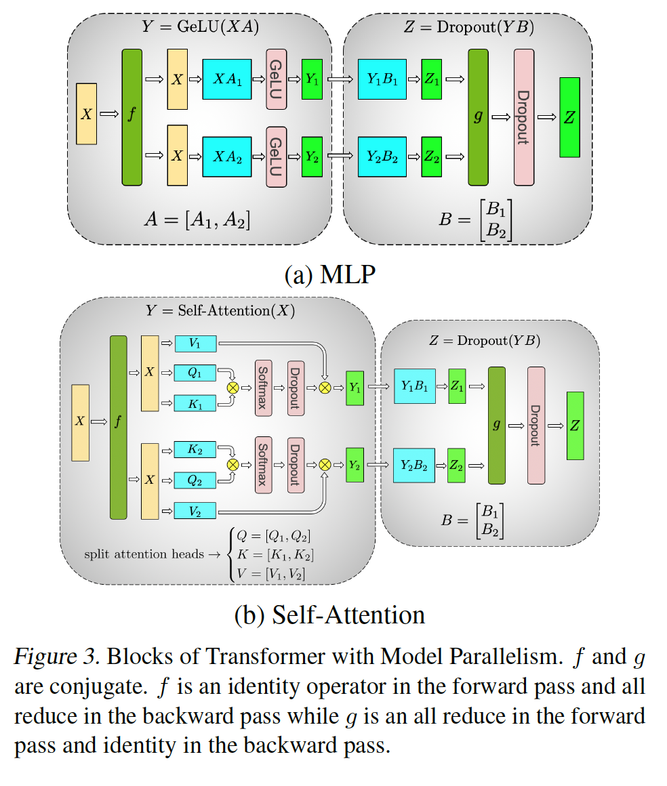
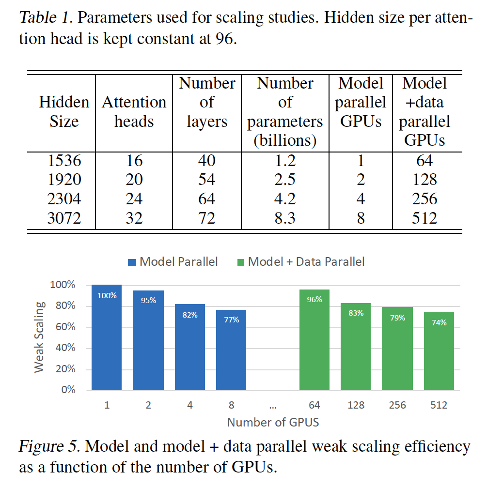

# Megatron-LM

- Megatron：威震天
- 针对transformer专门做的优化，不适用于其他的神经网络
- 张量并行

## 摘要

- 一个层内的模型并行
- 可以训练10亿以上的transformer模型
- 不需要一个新的编译器，或者一个新的包，只需在原生的pytorch代码上插入一些通讯的代码就行了
- 使用了512张V100，训练了一个8.3B的模型。15.7PFLOPs的性能，76%的分布式性能
- 针对大模型，需要把layer norm换一个位置，否则会不收敛

## 导言

- 随着GPU数量的增加，性能有一个线性的增加（作者玩了一个小技巧，做了美化）
- 针对本文的贡献，做了更细的拆分，显得贡献更多一些（写作套路）

- 针对一个系统而言，都是在做取舍。任何一个亮点，都牺牲了一些东西。
  - GPipe，别人任务要么需要一个编译器，要么就是和特定的任务相关，不通用。GPipe更简单，更通用，只要把层切成一块一块就行。
  - Megatron-LM，我们的更简单，只需要改一点pytorch代码。缺点是只适合用在transfomeer上，通用性上更小了
  - 别人任务，需要编译器，目标是更通用的

## Megatron

- 张量并行示意图

  

- 对比

  |        | 张量并行                                                 | 数据并行                      | 备注                |
  | ------ | -------------------------------------------------------- | ----------------------------- | ------------------- |
  | 通讯量 | $O(b*l*k*n)$                                             | $O(k^2*n)$                    | 差不多，都是 $10^5$ |
  | 优点   | 每个GPU只需要维护一块模型，模型占比比较小                | 计算和通讯可以有一定的并行度  |                     |
  | 缺点   | 1. 需要保证模型能够被切开 2. 无法做到计算和通讯的并行 | 每个卡都需要保存完整的模型    |                     |
  | 性能   | 速度上更吃亏一点（速度限制）                             | 受到GPU内存的限制（空间限制） |                     |

  

## 实验

- 硬件配置

  - 使用了32台 DGX-2H 服务器，一共有512 Tesla V100 SXM3 32GB GPUs。
  - 一台DGX-2H价格 $40w/台，一共1200w美元，折合将近1亿人民币
  - 机器内部带宽300 GB/s，机器之间是100 GB/s

- 实验设置

  - baseline：1.2B的模型，可以放入一块卡中
  - 逐步增大模型，到8B，然后分到8卡，每张卡差不多1B参数
  - 每个卡，batch size是固定大小，8

- 为什么每台机器有16卡，只做8卡的模型并行？

  - 可能16卡的效果没那么好
  - 使用16卡的时候，可能没法把模型变成16B

- 实验结果

  

- 评价
  - 通过张量并行，将模型切块，切起来比较均匀，避免了GPipe切分不均匀的问题
  - 局限性：
    - 只是针对transformer的优化
    - 通讯很大，而且计算和通讯不能异步
    - GPU增多的时候，冗余性也增多，导致无法做到16块卡
  - 对比Megatron和Gpipe
    - Megatron的通讯量和层数是线性关系
    - Gpipe的通讯量和GPU数是线性关系
    - 一般而言，层数是GPU数的10倍左右，因此，Megatron的通讯量是Gpipe的10倍
    - Gpipe为了流水，必须要较大的batch size，然后只能舍掉一些中间变量，用计算换空间

