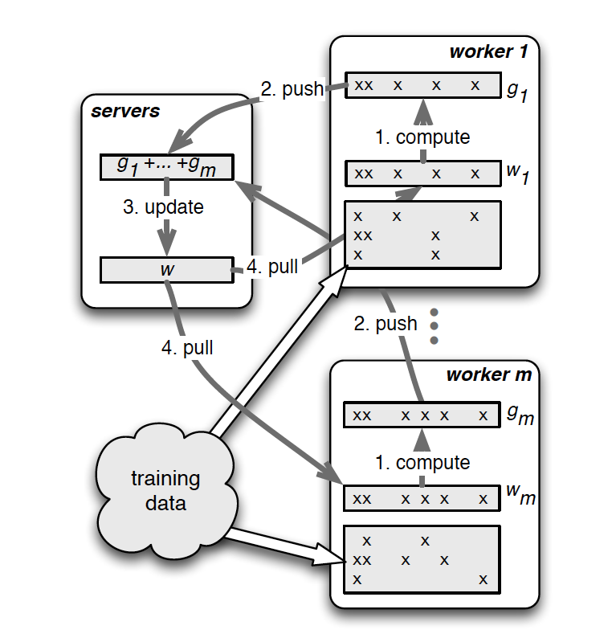
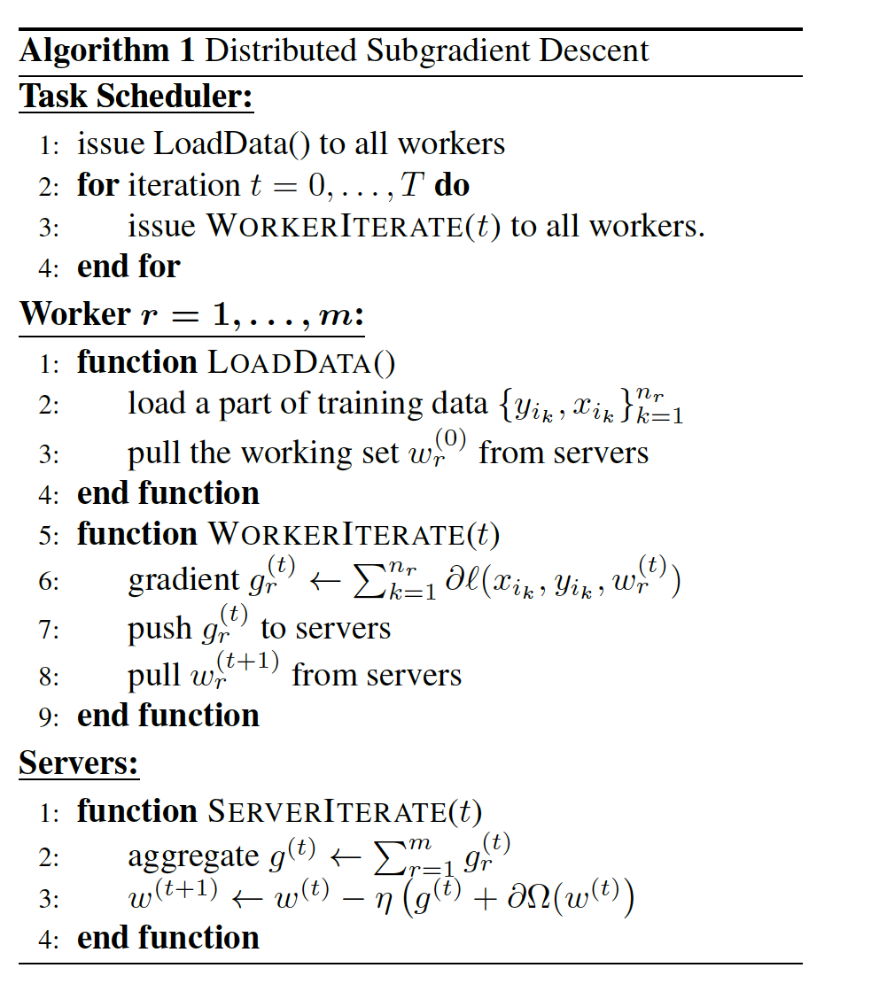
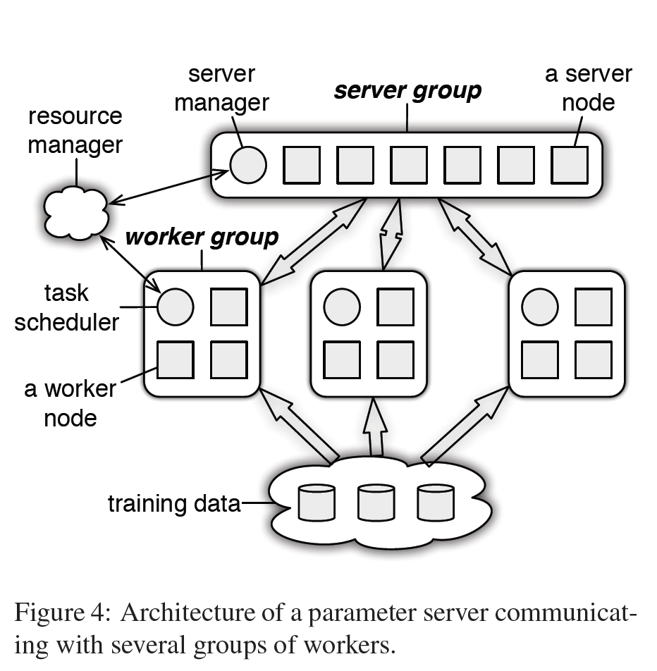
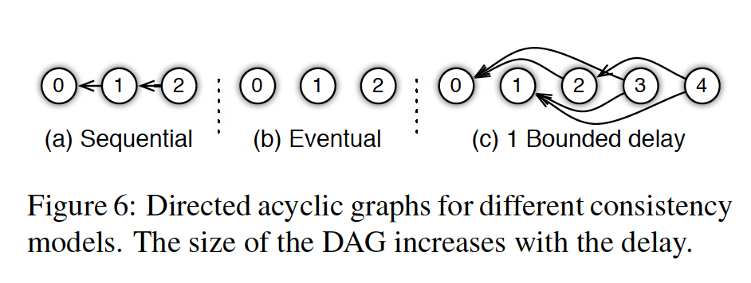

# Parameter-Server

- 发表会议：OSDI，Operating Systems Design and Implementation，系统方向的顶会
  - 另一个系统方向的顶会：SOSP

- 作者：李沐
  - 有在baidu广告团队的经历，工业界有1000台机器的资源

## 摘要

- 提出了一个叫参数服务器的框架，来解决分布式机器学习任务
- 数据和任务都分布在任务节点上，同时有服务器节点维护一个全局共享的参数 
- 这个框架可以管理异步的数据通讯，支持一些灵活的一致性模型，弹性的可扩展性和持续的容灾
- 使用了PB级别的真实数据，10亿级别的样本和参数。实验做了稀疏的LR、LDA和分布式的sketching

## 导言

- 分布式的优化和推理，是解决大规模机器学习问题的前置条件
- 大规模数据的量级：1TB到1PB，模型参数量：10^9~10^12（1B～100B）
- 模型的参数需要被全局共享，从而带来很多的问题：
  1. 大量的通讯。所有的节点都要去访问模型的参数
  2. 大量的全局同步。机器学习算法是一个顺序的模型，按照batch进行计算
  3. 机器数量很多时，容灾就变得很重要
- 本文的贡献：
  - 对代码做了更好的抽象，使得后续的开发更方便
  - 具有5个关键的特点
    1. 高效的通讯：一个异步通讯算法，同时对机器学习算法做了压缩，使得通讯量可以降低一个规模
    2. 灵活的一致性模型： 不同的时刻，访问同一个参数，可能会不一致。（强一致性模型vs弱一致性模型）降低一致性，可以带来系统性能上的提升
    3. 弹性的可扩展性：可以在训练时，增加或者减少机器
    4. 容灾： 当一（多）台机器出现问题时，可以花多长时间进行恢复。使用了vector clock，可以在1s内进行恢复。
    5. 易用：当时用的是C++，全局参数可以看作是向量或者矩阵
  - Novelty
    - 对机器学习和分布式系统，分别做了调整（tradeoff），使得可以更好的融合
    - 放弃了分布式系统中的一部分强一致性，也放弃了一些机器学习中的强一致性
    - 可以在真正工业界的大小上，做到一个通用的系统
- 工程上的挑战
  -  需要不断读写全局的参数，参数很大，需要放在不同的机器上面。PS会去汇聚和同步这些全局的参数
  -  每个计算节点，会去取一部分或者全部的参数进行计算。

- 分布式梯度下降

  

- 分布式梯度下降算法

  

## 架构

- 架构图

  

- (Key, Value) Vector

  - 参数服务器对于整个数据结构的抽象
  - key可以理解为参数W的下标，但下标不一定是连续的，是一个经过哈希的值
  - value可以是一个浮点数、一个向量或者是一个层的参数
  - 区别于一般的分布式系统，key和value都是字符串，这里的key是int64或者int128，value是一个浮点数，或者一串浮点数
  - 这样的实现，可以使得更方便地使用数值计算的库，如BLAS等，来直接写矩阵乘法

- 通讯接口：带区间的Push和Pull

  - 如果每次都发送key进行通讯，会占据带宽
  - 有点像切片操作，可以灵活的传输不同大小的value，但是key相对是比较小的

- 服务器端可以支持用户自定义函数

  - 从分布式系统角度来说，一般不会允许用户修改服务器端的代码，可能会引入安全性问题
  - 但是机器学习中，可能需要在服务器端计算正则项
  - 在安全保障的前提下，给一些接口，允许用户自定义一些功能

-  异步任务及依赖关系

  - 一个任务就是一个rpc（remote procedure call），一个push或者pull就是一个rpc
  -  所有的任务可以异步执行，通过 `execute-after-finished` 来实现有依赖的步骤执行
  - 通过是否加入 `execute-after-finished` 来实现不同的一致性算法，具有较高的灵活性

- 灵活的一致性模型

  - 

  - a 完全一致性，同步执行；b 最后一致性，异步执行；c 带上限的一致性，部分异步

- 用户定义的过滤器

  - 分布式机器学习系统需要发送大量的数据，但这些数据并不总是必要进行发送的
  - 比如 `significant modified filter` ，当一个参数在一轮迭代中没有怎么更新时，就不进行更新
  - 可以把32位浮点数，压缩到16位或者低精度整数，从而降低通讯量

- 系统设计的原则
  - 实用原则：系统的抽象要能够很好地执行自己的任务
  - 简单原则：不能为了满足所有的需求，设计了及其复杂的api。只需要满足80%用户80%的需求，否则实现和后期的维护会很困难，避免over engineering

## 实现

- Vector Clock 向量钟
  - 不同的工作节点，会取不同时刻的参数。需要保存计算节点个数那么多份参数
  - 实用带区间的参数机制，使得，每个节点只需保存对应区间的参数，大大降低服务器端的存储
- Messages
  - 很多的Key，如果在不同的时刻，server端看到是相同的（哈希值相同），则可以不发送key，从而降低通讯量
  - 通过filter来实现
- server如何存参数
  -  使用一致性哈希环
  - 可以动态增加或减少server节点，做好容灾
  - 通过汇聚操作，然后再进行备份。通过适当增加延迟，来降低对带宽的要求

- worker如何容灾
  - scheduler查看worker的工作状态，如果长时间没完成或者ping不通，则把之前的任务重新发给别人，或者让系统新给我一个worker

## 评估

- 稀疏LR

  - 数据和环境：
    - dataset with 170 billion examples and 65 billion unique features. This dataset is 636 TB uncompressed  (141 TB compressed). 
    - We ran the parameter server on 1000 machines, each with 16 physical cores, 192GB DRAM, and connected by 10 Gb Ethernet. 800 machines acted as workers, and 200 were parameter servers. The cluster was in concurrent use by other (unrelated) tasks during operation.
  - 如何节省通讯量
    - 压缩算法、key缓存之后不再发送（catching keys）、KKT filter
    - server降低40.3倍，worker降低12.3倍

  - 一致性的调整
    - 当可以有4步delay的情况下，系统的总收敛时间最短

