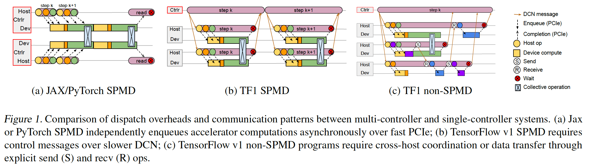

# Pathways

- 针对机器学习的异步的分布式的数据流
- PaLM：5400亿可学习参数
- 使用了4096块TPU v3芯片，57.8%的应用使用率

## 作者

- Jeff Dean
  - Google AI的老大，管理上千人
  - 著名的工作：BigTable、MapReduce、TensorFlow
  - The Jeff Dean Facts：
    - 编译器从来不警告Jeff Dean，因为Jeff Dean警告编译器
    -  Jeff提交代码之前会编译一下，主要是检查compiler和linker
    - gcc -O4表示把你的代码发邮件给Jeff，让他重写一下
- Sanjay
  - Jeff的好基友，经常一起结对编程
  - 曾将把libc中的某个函数重写了一遍，使得google的各个服务都快了百分之几

## 摘要

- 提出了一个新的大规模，编排层（orchestration layer）的设计
- 编排层：在云上有很多的服务，当服务来的时候，怎样映射到底层的计算资源，如何进行管理和调度

## 导言

- 机器学习的模型在和硬件、系统一起演进
- 目前的机器学习模型使用的都是SPMD（single program multiple data），这个模型来自于MPI
  - 分布式计算梯度的时候，要调用一个allreduce的函数，使得每台机器的梯度得到累加，然后再更新
  - 是一种数据并行，也称为bsp
- 新的问题
  - 模型变得更大，在单个加速器上存不下，纯数据并行不可行，需要使用pipline的方式进行切割
  - 探索模型的稀疏性连接
  - 机器学习的加速器变得越来越异构，加速器集群中，有一些“岛”
  - 要追求MPMD（multiple program multiple data），每台机器拿到的py代码可能是不那么一样的
  - 模型很大，训练和推理可能会同时进行

## 设计动机

- 不同的分布式机制

  

- python调用C++的时候，是有延时的，一般可以做到 $10^5/s$ 个函数调用，但对于transformer模型来说，是不够的，需要做到 $10^6～10^7/s$  。
- 对于上图中的c模式，中央集成器，需要跨网络，同时需要调用上千台机器，带宽更低，通讯更多
- 动机：如何将tf1这种数据流的模式，做到异构的上千个加速器的，transformer的分布式训练上

## 编程模型

- 科普
  - 第一代框架：DisBelief，2011年，Andrew Ng在google上课，Jeff听完课，课后作业写了一个DisBelief
  - 第二代框架：Tensorflow。
    - 坏处：调试很难，python只是定义一个图。
    - 好处：可以做更好的性能优化，整个计算图可以和python定义分离，方便后续的部署
  - Tensorflow1 之后不久，Google开始研究TPU，并开发了自己的编译器xla。xla后续又支持了GPU和CPU
  -  Jax是xla的一个前端，提供一个和numpy很像的一个前端，可以在tpu上运行，并可以自动求导
- pathways并不是一个框架，而是一个后端

## 系统架构

- 资源管理器
  - 单个pod中有2048个TPU核，不同的pod之间的通讯带宽会比较受限
  - pathways想要，在多个pod之间低带宽的调度和执行
  - 当用户需要1000个TPU的时候，资源管理器会和系统申请1000个TPU，然后将代码中的虚拟TPU映射到真实的物理TPU
- Client
  - Jax会先把任务转成一个MLIR的dialect，XLIR是xla上层的一个语言，可以用来支持动态的数据流，和动态的输入输出
  - 这是一个高层的IR，会不断往下走，一直走到汇编层面
  - 分布式程序，会有通讯在里面，会映射到底层的网络通讯架构，如：scatter、gather 
  - 采用了RDMA，如果我需要从别的机器取一块数据，那我就直接去访问那台机器的内存地址

- 如何在数据中心网络上收发数据
  -  使用PLAQUE 进行各种优化

- Gang scheduled动态分发
  - 调度器会把每个TPU的计算和通讯都排好序，避免出现死锁
- 并行的异步分发
  - 本文主要的novelty，编译的时候知道所有的图的流程，能够并行的计算就可以同时进行计算
- 数据管理
  - 一块内存除了本地使用外，有可能远端也会使用。内存在回收时要考虑这一点

- 总结：
  - 如何有效地把我的任务映射到真实的加速器上
  - 如何有效地在数据中心网络上的通讯
  - 如何有效地管理内存，特别是该内存可能被远端使用的时候
  - 如何有效地减少编译和任务派发带来的影响

## 讨论

- pathways架构更多是为了TPU设计的，对于GPU架构不那么适用
- 总结：
  - pathways是帮助JAX突破只能在一个pod上训练的局限
  - 整个设计跟TPU架构、Google的数据中心底层的网络通讯协议、xla的设计理念是相关的
  - 对于PaLM来说，效果很好。但是没有实现Jeff之前画的大饼

