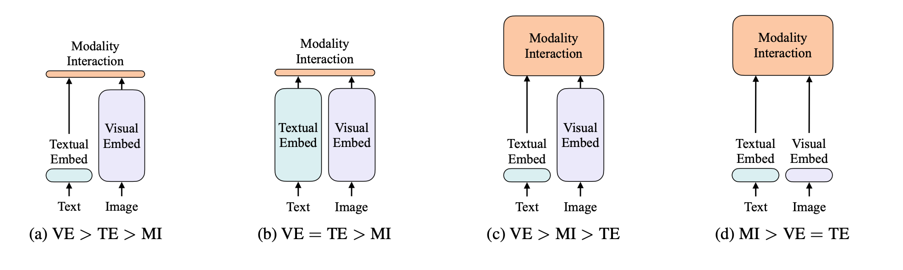

# ViLT

- `ViLT`是一个极其简单的视觉文本多模态的框架，其最主要贡献，就是把多模态学习框架中的目标检测，也就是论文中反复强调的`Region Feature`（区域性特征）直接拿掉了。这个操作简直是大快人心，因为它极大地简化了视觉模态特征的抽取过程，把主要计算量放在了模态融合上，大大提高了模型的推理速度，可称之为多模态领域一个里程碑式的工作。

## 标题

- ViLT: Vision-and-Language Transformer Without Convolution or Region Supervision
  - ViLT 是 Vision-and-Language Transformer 的缩写
  - 和其他工作的区别：Without Convolution or Region Supervision，没有使用卷积特征和区域特征

## 摘要

- 目前的VLP任务，非常依赖图像特征的抽取，也就是说，是视觉网络越复杂，效果越好。
- 目前的方法存在以下缺点：
  - 效率不行，速度太慢。视觉抽特征花费了大量的时间，在特征融合层面反而没有更多关注
  - 使用预训练过的模型，效果不一定好。因为，目标检测的数据集比较小，类别比较少。因此，需要端到端学习。
- 针对以上痛点，作者提出了极简化的VLP模型，ViLT。可以比之前的模型快很多，但是性能还是具有竞争力。

## 引言

- VLP 前绪工作

  - 工作模式：预训练 + 微调
  - 任务：ITM + MLM
  - 文本模态：transformer 已经一统江湖
  - 图像模态：依赖目标检测器
    - 原因：1、离散的、有语义的特征表示；2：下游任务（VQA等）和物体强相关
    - 预训练模型：一般是基于 Visual Genome 进行训练的，包含1600的目标类别和400个属性类别（CoCo数据集一共80类，太少了）
    - 改进：Pixel-BERT，将Res-Net的特征直接作为视觉特征，当成 sequence token 让 transformer 学习，去除了检测头的计算量。

- 前续工作对比

  

  - 数据集：
    - NLVR2，visual reasoning的数据集
    - F30K，做retrieval的数据集，可以分别对图像和文本进行检索

- ViLT的三个贡献

  - 迄今为止，最简单的 vision language 模型，带来了显著的运行时间和参数量的减少
  - 减少复杂度的同时，保持性能不掉。第一次在不使用区域各种和残差特征的情况下，效果差不多
  - 采用了更多的数据增强方式（图像：randmAugment；文本：whole word mask）

## 背景信息

|          | a    | b    | c               | d    |
| -------- | ---- | ---- | --------------- | ---- |
| 代表模型 | VSE  | CLIP | ViLBERT、UNITER | ViLT |

- 代表模型
  - VSE：Visual Semantic Embedding，文本端很轻量，视觉端贵，融合很轻量。
  - CLIP：文本和图像的表达力度一致，模型融合很轻量。适合做 retrieval 任务，但是如果是 vqa 或者visual reasoning，效果略差。
  - ViLBERT：类似的工作比较多。图像特征贵，而且模型融合也很贵。但性能确实不错。
  - ViLT：受到 ViT 的启发，特征层都很轻量，融合比较贵。

- 前续模型如何做融合
  - single- stream：只有一个模型，将两个输入直接 concat 起来，让模型自己去学习。
  - dual- stream：有两个模型，两个模型分别对各自的输入做一些处理，充分挖掘单独模态的信息，然后在后面的某一个时间点，进行融合。
  - 两者的性能差不多，dual- stream 在某些情况下效果更好一些，毕竟有两个模型，参数更多，也更贵一些。
- 图像如何抽取特征
  - 基于目标检测的 region feature：1、先使用 backbone 抽取一些特征，2、然后是使用 rpn 网络抽取 ROI，再做一次 NMS，将ROI 降到一个固定的数量，得到一些 bonding box。3、得到 bonding box 之后，再通过 ROI head，就能得到一些一维向量，就是 region feature。
  - 基于backbone的 grid feature：直接把 CNN 的特征图抽出来，就可以拿到 grid feature。成本是降低了，但性能非常不好。
  - 进一步引出本文的方法，使用一层 patch embedding 就把特征抽完了。快很多倍，性能还不怎么掉点。

## 模型结构

- 模型结构图

  

- 一些细节
  - 两个模态都有 cls token
  - modal-type embedding
  - loss：ITM、MLM、Word Patch Alignment
  - 三种不同的 embedding 都是相加在一起的
- 训练技巧
  - 文本上的 whole word masking
  - 图像上的数据增强：RandAugment。去除了color inversion 和 cutout，避免数据增强对图像语义的改变

## 实验

- 预训练数据集
  - MSCOCO：每个图片配了5个caption，标题较长
  - VG：Visual Genome，单图多个caption，标题较短
  - GCC：单图一个caption，标题较长
  - SBU：单图一个caption，标题较长
  - 上面4个数据集合并称为4M

- 在分类任务和检索任务上进行了探索
- 消融实验
  - 训练时间越长，性能越好
  - whole word masking 有一定提升，但不明显
  - 图像的数据增强，提升比较多

## 结论

- 结论：使用了一个极小化的VLP模型，ViLT，模型结构简单，速度又快，效果还好。
- 未来方向
  - 规模，继续scaling
  - 图像重建，后续MAE实现了
  - 数据增强，提升数据的有效性