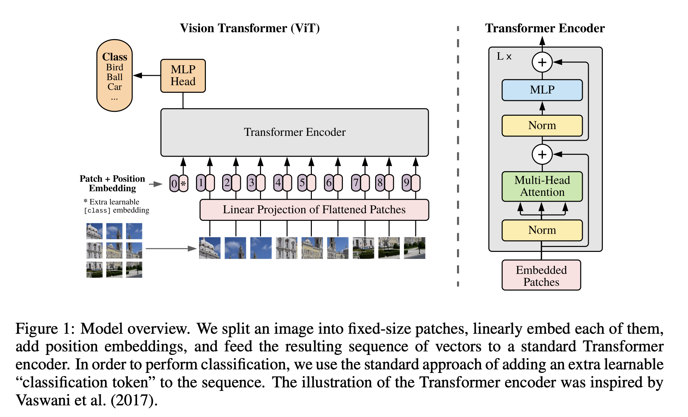

# ViT

- ViT：过去一年，CV 最有影响力的工作  
  - 推翻了 2012 Alexnet 提出的 CNN 在 CV 的统治地位
  - 有足够多的预训练数据，NLP 的 Transformer 搬运到 CV，效果很好 
  - 打破 CV 和 NLP 的壁垒，给 CV、多模态 挖坑
- ViT效果有多好？
  - CV 任务刷榜：paperwithcode网站 霸榜 ImageNet （基于 ViT）和 COCO，目标检测（Swin Transformer ICCV 21 best paper：多尺度的 ViT ）的模型
- ViT的特性
  - [Intriguing Properties of Vision Transformers](https://arxiv.org/abs/2105.10497) 中提到，在有些情况下，卷积神经网络CNN不能处理的很好，但是Vit可以处理的不错。比如：遮挡、数据分布偏移（比如纹理去除）、对抗性patch、patch打散

## 标题

- 一张图片等价于很多16*16大小的单词：使用transformer做大规模的图像识别。
- 作者：Google research, Brain Team

## 摘要

- 在NLP中，transformer使用已经非常普遍
- 在CV中，attention要么是和卷积网络一起使用，要么是CNN中的某些组件替换为attention，而保持整体的结构不变
- 本文证明了对于CNN的依赖是完全不必要的
  - 一个纯transformer作用于图像块的时候，也可以在图像分类任务上表现的非常好。
  - 尤其是在大规模的数据集上做预训练，然后迁移到中小型数据集上时，ViT可以获得和最好的CNN相媲美的结果。
- 使用了相对更少的资源进行训练：2500 天TPUv3 

## 引言

- Transformers是NLP的主导模型，具有计算高效和可扩展性的特性，同时，参数不断扩大的同时，也没有饱和（过拟合）的现象
- Transformer 应用在 CV 的难点
  - self- attention关于序列长度n的计算复杂度为 n^2
  - 基于像素的 self-attention，序列太长。224 分辨率的图片，有 50176 个像素点，（2d 图片 flatten）序列长度是 BERT 的近 100 倍。

- ViT 任何情况都很强吗？
  - mid-sized datasets ImageNet without strong regularization，ViT 比 ResNet of comparable size 弱几个点。 
  - 原因分析：
    - Transformer 比 CNN 少归纳偏置（inductive biases）
    - CNN的归纳偏置：locality、平移不变性（translation equaivariance）

## 结论

- 用最少的改动，将NLP中的transformer用于CV，在大规模数据集上，进行训练，达到了SOTA。
- 挖了新的坑
  - 检测：DETR
  - 分割：Swin Transformer
  - 自监督训练：MAE
  - 多个模态的统一

## 相关工作

- CV 中使用attention的相关工作
  - Local Network，CVPR Wang et al. 2018
    - CNN + attention
    - 网络中的特征图，输入 Transformer
    - ResNet 50 最后一个 stage，res4 的 feature map 14 * 14，相当于序列长度为196
  - stand-alone attention 孤立自注意力，Ramachandran et al., 2019
    - 用 local window 局部小窗口，控制 transformer 的计算复杂度
    - 有点像卷积， 卷积也有 locality，局部窗口卷积。
  - axial attention 轴注意力，Wang et al., 2020
    - 图片的序列长度 n = H * W 
    - 2 个 1d 顺序操作，降低计算复杂度
    - 2d 矩阵 拆分为 2个1d 向量，先在 H 高度 dimension 做一次 self-attention，再 W 宽度 dimension 做一次 self-attention
  - 上述3种方法在理论上很高效，但没有经过硬件加速，导致没法scaling。因此在大规模的图像识别上，还是ResNet效果最好。 
  - Cordonnier et al. (2020)
    - 最相近的工作，2 * 2 patches for CIFAR-10 32 * 32 图片
    - ViT 胜在哪里: 更大的 patches 16 *16 + 更大的训练数据集
  - iGPT (Chen et al., 2020a)
    - GPT 也用了 transformer 图片（降低分辨率和 color space）。用训练好的 image GPT or 直接把 image GPT 当成特征提取器
    - ImageNet 准确率：iGPT 72%；ViT 88.5%

## ViT模型

- 一图胜千言

  

-  ViT 用了标准的 transformer 结构，ViT的特点是什么？ 
  - 图片 patches 化
  - position embedding

- 消融实验
  - CLS token 和 GAP的效果差不多（但是超参数不同，需要调参数）
  - 位置编码，1d or 2d效果差不多
- patches 数增多，如何使用已预训练好的位置编码呢？

  - 2d 插值，torch 的 interpolate 函数实现；但也不是任意长度增加都能保持效果。
- 数据量
  - 如果想用 ViT，至少需要 ImageNet-21K 14M 大小的数据集
  - 小于整个数据量，CNN 更合适，更好的利用 inductive bias，ViT 没有特别多 inductive bias 需要更多数据训练。
  - 数据集规模比 ImageNet-21K 更大时，Vision Transformer 效果更好，因为可扩展性 scaling 更好。
- 混合模型结构
  - 混合模型结构：CNN 抽取出来的特征，能不能帮助 Transformer 更好的学习呢？
  - 小模型，Hybrid 模型吸收 CNN 和 Transformer 的优点，效果好。不需要很多的数据预训练，达到 Transformer 的效果 
  - 大模型，Hybrid 模型 和 Transformer 差不多，甚至不如 Transformer 模型。

- 其他
  - 可以将embedding层可视化，观察embedding 的FC层学到的特征
  - 将position embedding 可视化，可以看到二维的空间信息
  - 还可以看模型是否学到了全局的信息

## 参考资料

- https://www.bilibili.com/video/BV15P4y137jb/

- https://www.bilibili.com/read/cv14221668/?jump_opus=1

