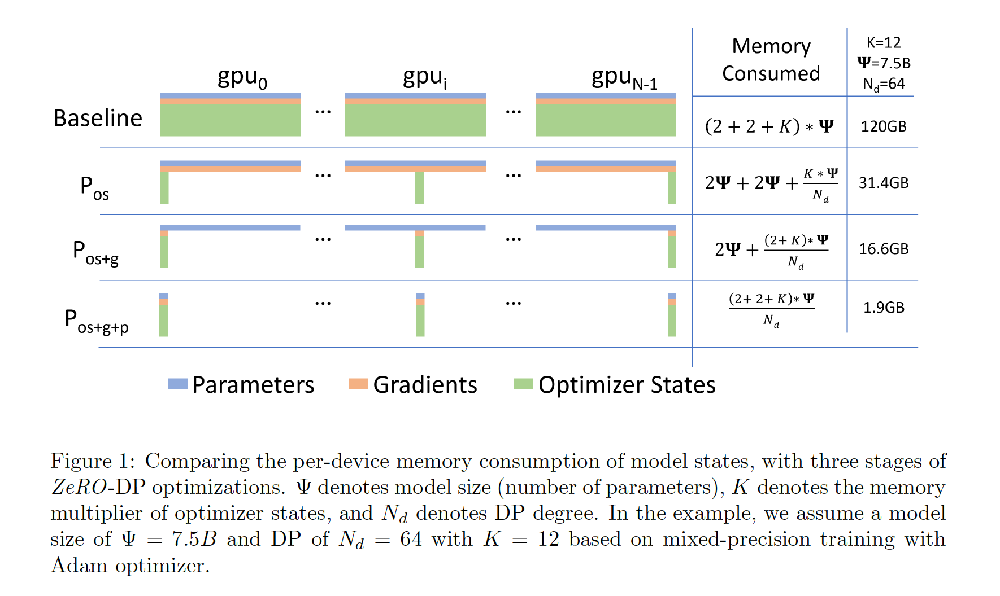
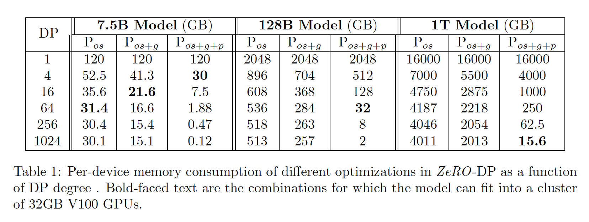

# ZeRO

- deep speed背后的算法，https://www.deepspeed.ai/
- Pytorch的FSDP，https://pytorch.org/blog/introducing-pytorch-fully-sharded-data-parallel-api/

- ZeRO，如何将数据并行使用在超大规模的模型上面
- 数据并行的优点：
  - 计算和通讯可以并行
  - 不需要关心模型是什么样子
- 更多阅读
  - https://zhuanlan.zhihu.com/p/513571706

## 摘要

- ZeRO：Zero Redundancy Optimizer（零冗余的优化器）
- 可以训练万亿以上的模型
- 训练了一个100B的模型，得到了一个超线性的加速

## 导言

- 背景
  - 数据并行没法降低每个卡内存的使用，如果一个卡内存是32GB，那么最多可以放1.4B的参数
  - 使用流水线并行或者张量并行会有问题，主要是计算通讯效率比。
  - 之前最好的是张量并行，但是目前也没法做到更大了

## 内存用在了哪些地方

- 主要分为两个方面
  - 模型的状态，包括：模型的参数，参数的梯度，优化器的状态（比如adam中的momentum和variances）
  - 其他的存储，如：中间值（activation）、临时的buffers、碎片化的内存
- 如何优化模型的状态
  - 混合精度训练
    - fp16的计算速度会比fp32快很多，但是在梯度累加的时候，可能会精度不够
    - 因此，forward和backward的时候，使用fp16，梯度累加的时候使用fp32
    - 一共有 $\Psi$ 个参数，则fp16的参数和梯度，一共需要 $4\Psi$ bytes，而fp32需要存参数、adam中的momentum和variances，一共是 $12\Psi$ bytes
    - 计算只需要 $4\Psi$ bytes，但是存储需要多 $12\Psi$ bytes
- 中间阶段的存储
  - activation
  - temporary buffers
  - memory fragmentation

## ZeRO

- DP vs MP
  - DP比MP的效率要高，MP计算粒度更小
  - DP的内存不有效
  - DP和MP都需要维护adam的一些中间状态，导致效率不高

- ZeRO的优化
  - ZeRO-DP
    - 对于任何一个W，所有的状态都只存一份，如果需要用的时候，所有的GPU都跟一个GPU去拿这个数据即可，和parameter server的思路一样
  - ZeRO-R
    - Megatron的输入在每个GPU上都有一份，ZeRO把输入切成很多块，每个GPU只维护一小块，当需要这些数据的时候，再跟其他的GPU拿数据，用完之后再丢掉。（这里是拿带宽换空间，GPipe是拿计算换空间）
    - 针对临时buffer，开一个固定大小的缓存，用的时候拿给你，不用的时候删掉
      - 会根据数据量和超时的情况，对于临时buffer的大小进行加倍或减半。
    - 针对内存碎片化，会不断做内存的整理

- ZeRO-DP

  - ZeRO-DP的三种方法

  

  - 增加了zero 3之后，通讯量是之前的1.5倍

  - 不同参数的模型，使用ZeRO可以训练，所需要的GPU卡数

    

- 超线性的增长
  - 当GPU数量增加的时候，每块卡上的参数变少了，可以存更多的中间变量，可以用更大的batch size
  - batch size增大的时候，有2个好处
    - GPU每次做运算的矩阵变大了，可以更好的使用单GPU所有的核，单GPU的性能提升，计算变快
    - 通讯量没变，计算量增大，计算通讯比变得更好了，对于整体分布式性能更好
  - batch size增大的时候，坏处
    - 可能使得收敛变慢