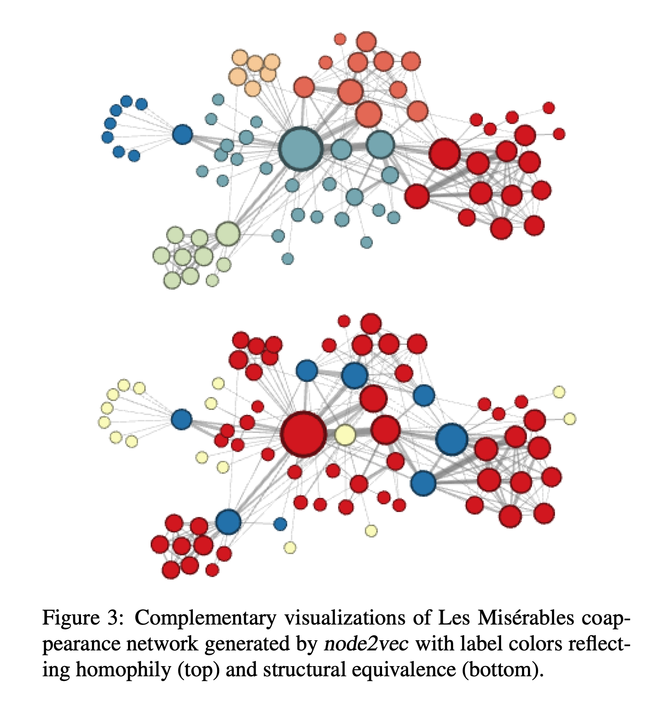

# deepwalk、node2vec

## deepwalk

- 使用**图中节点与节点的共现关系**来学习节点的向量表示。那么关键的问题就是如何来描述节点与节点的共现关系，DeepWalk给出的方法是使用随机游走(RandomWalk)的方式在图中进行节点采样。

- 算法流程

  

- 参考资料
  - https://zhuanlan.zhihu.com/p/56380812

## node2vec

- 可以采用不同的方式在图中进行游走采样

  

- 如何控制游走的方式

  

  - 公式
    $$
    P\left(c_i=x \mid c_{i-1}=v\right)= \begin{cases}\frac{\pi_{v x}}{Z} & \text { if }(v, x) \in E \\ 0 & \text { otherwise }\end{cases}
    $$

    $$
    \pi_{v x}=\alpha_{p q}(t, x) \cdot w_{v x}
    $$

    $$
    \alpha_{p q}(t, x)= \begin{cases}\frac{1}{p} & \text { if } d_{t x}=0 \\ 1 & \text { if } d_{t x}=1 \\ \frac{1}{q} & \text { if } d_{t x}=2\end{cases}
    $$

- 图结构的不同性质

  - 同质性（homophily）DFS，即q值⼩，探索强。会捕获homophily同质性节点，即相邻

    节点表示类似

  - 结构等价性（structural equialence）BFS，即p值⼩，保守周围。会捕获结构性，即某些节点的图上结构类似

  

  

- 参考资料
  - https://zhuanlan.zhihu.com/p/56542707