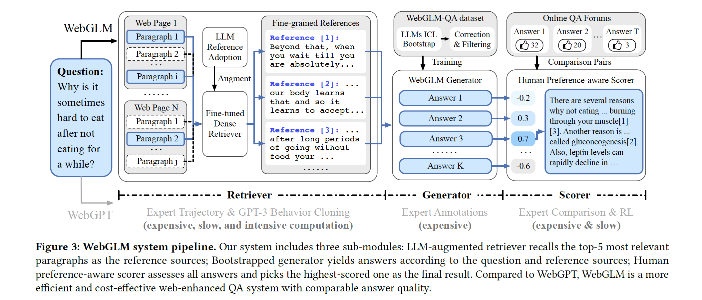

# webGPT

## 摘要

- 通过模仿人类的行为，让模型可以搜索和访问网络，然后基于网络文本回答长格式的问题。
- 模型必须搜集参考文献，以支持其回答。
- 和人类直接给出的答案相比，56%的情况下，人们更喜欢本文模型的回答。和Reddit上的最高票回答相比，69%的情况下，人们更喜欢本文模型的回答。

# WebGLM

## 摘要

- 定义：webGLM是一个网络增强的问答系统
- 策略：LLM增强的检索器、自举生成器、人类偏好感知评分器。
- 评估：给出了网络增强问答系统的系统性标准
- 效果：WebGLM-10B比WebGPT-13B效果更好，甚至可以达到WebGPT-175B的效果

## 引言

- WebGPT的缺点
  - 需要大量专家级别的高质量标注
  - 需要模仿人类的行为
  - 回复太慢（回答500 tokens的问题，需要31秒）
- 改进方式
  - 大模型增强的检索器：粗粒度的网络检索、细粒度的LLM蒸馏检索
  - 自举生成器：
  - 人类偏好感知评分器：

## WebGLM系统

- 大模型增强的检索器
  - 粗粒度的web搜索
    - 分为3个步骤：搜索、抓取、解析
  - 细粒度的大模型检索
    - 使用了200个query的测试集，每个测试集包含5个参考。其中只有68.6%的参考和query是相关的。而经过大模型1-shot的in-context-learning之后，相关性达到了90.2%。
    - 采用GPT-3生成了数据，并使用 Rouge-1进行了矫正。使用均方根loss，训练了双塔检索器。
- 自举生成器
  - 使用LLM的 1-shot in-context learning 生成了83k的样本
  - 使用 Rouge-1 对数据进行了过滤（阈值为0.57），过滤后一共有样本数45k
- 人类偏好感知评分器
  - 使用了bean-search的解码方式，已经表现的不错
  - 数据构建
    - 每个回答至少要有3个赞，每个问题要至少有8个回答
    - 长度偏好修正：对于太长的回答进行截断，比较短的回答则丢弃
    - 选取排序差距超过5的回答作为pair
    - 一共得到了93k问题和249k对比回答
  - 训练
    - SFT：先用SFT方法训练了16个epochs，初始学习率2.83e-5
    - 对比训练：使用SFT的参数初始化模型，每条数据输出一个标量值，然后针对一对pair数据，最大化他们之间的gap
    - 模型过拟合：模型倾向于很快过拟合。应对方式：冻结了前70%的层，采用了drop-out和更大的batch size。

## 评估指标

- 针对参考的评估
  - 相关性（类比召回）、信息密度（类比精确）、真实性、有毒性、社交偏见
- 针对回答的评估
  - 流畅性、正确性、引用准确率、真实性、客观性、冗余度

