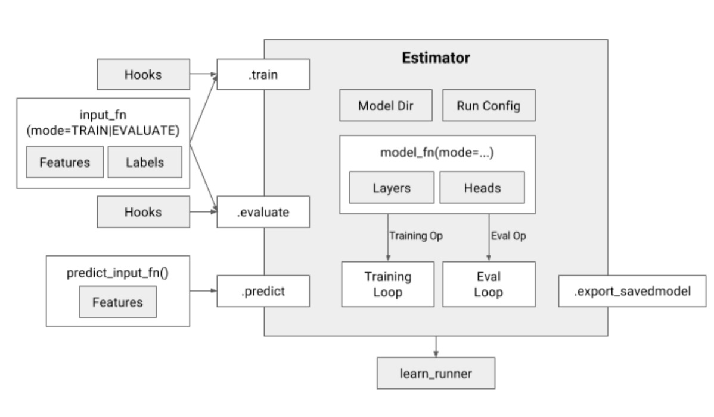

# Tensorflow High-level API

### Estimator

- Estimators encapsulate only following 4 actions

  - train
  - evaluate
  - predict
  - export_savedmodel

- Simplified overview if the Estimator interface

  

- Build an estimator

  ```python
  tf.estimator.Estimator(
  	model_fn=model_fn,
    params=params,     # a dict
    config=run_config  # a RunConfig object
  )
  ```

- Specifying inputs with input_fn

  ```python
  def my_input_fn(file_pattern):
    feature_dict = learn.io.read_batch_features(
    			file_pattern=file_pattern,
    			batch_size=BATCH_SIZE,
    			features=FEATURE_SPEC,
    			reader=READER,
    			...)
  estimator.train(input_fn=lambda:my_input_fn(TRAINING_FILE),...)
  estimator.evaluate(input_fn=lambda:my_input_fn(EVAL_FILES),...)
  ```

- Specifying the model with model_fn

  ```python
  def model_fn(features, target, mode, params):
    predictions = tf.stack(tf.fully_connected, [50, 50, 1])
    loss = tf.losses.mean_squared_error(target, predictions)
    train_op = tf.train.create_train_op(loss, tf.train.get_global_step(),
                                       params['learning_rate'], params['optimizer'])
    return EstimatorSpec(mode=mode, predictions=predictions,
                        loss=loss, train_op=train_op)
  ```

- Specifying outputs with Heads

  ```python
  def model_fn(features, target, mode, params):
    last_layer = tf.stack(tf.fully_connected, [50, 50, 1])
    head = tf.multi_class_head(n_classes=10)
    return head.create_estimator_spec(features, mode, last_layer,labels=target,
                                     train_op_fn=lambda loss: my_optimizer.minimize(
                                     loss, tf.train.get_global_step()))
  ```

- Combining multiple Heads for multi objective learning

  ```python
  def model_fn(features, target, mode, params):
    last_layer = tf.stack(tf.fully_connected, [50, 50, 1])
    head1 = tf.multi_class_head(n_classes=2, label_name='y', head_name='h1')
    head2 = tf.multi_class_head(n_classes=10, label_name='z', head_name='h2')
    head = tf.multi_head([head1, head2])
    return head.create_model_fn_ops(features, features, mode, last_layer, label=target,
                                   train_op_fn=lambda loss:my_optimizer.minimize(
                                   loss, tf.train.get_global_step()))
  ```

- Code injection using Hooks

  ```python
  class TimeBasedStopHook(tf.train_SessionRunHook):
    def begin(self):
      self.started_at = time.time()
    def after_run(self, run_context, run_values):
      if time.time() - self.started_at >= TRAIN_TIME:
        run_context.request_stop()
  ```


### Dataset API

- Read data from memory

  ```python
  import tensorflow as tf
  import numpy as np
  
  dataset = tf.data.Dataset.from_tensor_slices(np.array([1.0, 2.0, 3.0, 4.0, 5.0]))
  iterator = dataset.make_one_shot_iterator()
  one_element = iterator.get_next()
  with tf.Session() as sess:
      for i in range(5):
          print(sess.run(one_element))
  ```

- Operations of Dataset

  - map

    ```python
    dataset = tf.data.Dataset.from_tensor_slices(np.array([1.0, 2.0, 3.0, 4.0, 5.0]))
    dataset = dataset.map(lambda x: x * x) # 1.0, 4.0, 9.0, 16.0, 25.0
    ```

  - filter

    ```python
    dataset = dataset.filter(filter_func)
    ```

  - shuffle

    ```python
    dataset = dataset.shuffle(buffer_size=10000)
    ```

  - repeat

    ```python
    dataset = dataset.repeat(5)
    # 直接调用repeat()的话，生成的序列就会无限重复下去，没有结束，因此也不会抛出tf.errors.OutOfRangeError异常。
    ```

  - batch

    ```python
    dataset = dataset.batch(32)
    ```

- Read data from file

  - tf.data.TextLineDataset()
  - tf.data.TFRecordDataset()
  - tf.data.FixedLengthRecordDataset()

- Decode a csv file

  ```python
  _CSV_COLUMNS = ['field1', 'field2', 'field3', 'field4']
  _CSV_COLUMN_DEFAULTS=[[''], [''], [0.0], [0.0]]
  
  def input_fn(data_file, shuffle, batch_size):
    def parse_csv(value):
      columns = tf.decode_csv(value, record_defaults=_CSV_COLUMN_DEFAULTS, field_delim='\t')
      features = dict(zip(_CSV_COLUMNS, columns))
      labels = features.pop('ctr_flag')
      return features, tf.equal(labels, '1.0')
  
    # Extract lines from input files using the Dataset API.
    dataset = tf.data.TextLineDataset(data_file)
    if shuffle: dataset = dataset.shuffle(buffer_size=100000)
    dataset = dataset.map(parse_csv, num_parallel_calls=100)
    # We call repeat after shuffling, rather than before, to prevent separate
    # epochs from blending together.
    dataset = dataset.repeat()
    dataset = dataset.batch(batch_size)
    return dataset
  ```

- Decode from pd.DataFrame

  ```python
  df = pd.read_csv(titanic_file, index_col=None)
  
  titanic_slices = tf.data.Dataset.from_tensor_slices(dict(df))
  
  for feature_batch in titanic_slices.take(1):
    for key, value in feature_batch.items():
      print("  {!r:20s}: {}".format(key, value))
  ```

  ```python
  def df_to_dataset(dataframe, shuffle=True, batch_size=32):
    dataframe = dataframe.copy()
    labels = dataframe.pop('target')
    ds = tf.data.Dataset.from_tensor_slices((dict(dataframe), labels))
    if shuffle:
      ds = ds.shuffle(buffer_size=len(dataframe))
    ds = ds.batch(batch_size)
    return ds
  ```

- py_func

  ```python
  def filter_func(line):
    fields = line.decode().split("\t")
    if len(fields) < 8:
      return False
    for field in fields:
      if not field:
        return False
    return True
  
  dataset = dataset.filter(lambda x: tf.py_func(filter_func, [x], tf.bool, False))
  ```

- Eager Mode (Don't need to use sess.run() to get values from tensor)

  ```python
  import tensorflow.contrib.eager as tfe
  tfe.enable_eager_execution()
  
  dataset = tf.data.Dataset.from_tensor_slices(np.array([1.0, 2.0, 3.0, 4.0, 5.0]))
  
  for one_element in tfe.Iterator(dataset):
      print(one_element)
  ```

- make_initializable_iterator

  **tf.data.Dataset.from_tensor_slices(array)时，实际上发生的事情是将array作为一个tf.constants保存到了计算图中**。当array很大时，会导致计算图变得很大，给传输、保存带来不便。这时，我们可以用一个placeholder取代这里的array，并使用initializable iterator. https://zhuanlan.zhihu.com/p/30751039

  ```python
  with np.load("/var/data/training_data.npy") as data:
    features = data["features"]
    labels = data["labels"]
  
  features_placeholder = tf.placeholder(features.dtype, features.shape)
  labels_placeholder = tf.placeholder(labels.dtype, labels.shape)
  
  dataset = tf.data.Dataset.from_tensor_slices((features_placeholder, labels_placeholder))
  iterator = dataset.make_initializable_iterator()
  sess.run(iterator.initializer, feed_dict={features_placeholder: features,
                                            labels_placeholder: labels})
  ```

- Decode TFRecord file


