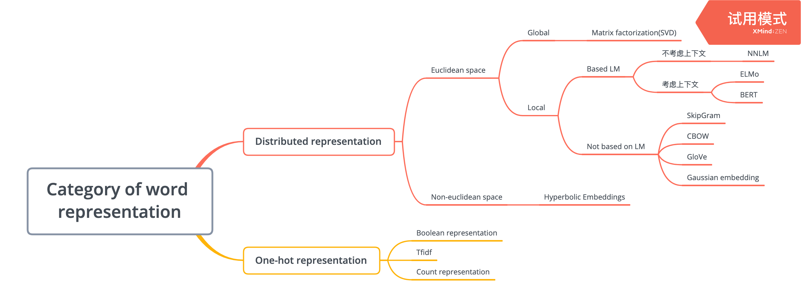

# 03.01-03.07 回顾

### 线性代数相关

- 矩阵对角化
  - 相似矩阵$(B= PAP^{-1})$，是一个线性变化（矩阵）在不同坐标系下的表示。
  - 一个方阵（满足某些条件，根据线性无关的特征向量的个数判断），可以通过求解特征值和特征向量进行对角化$U^{-1}AU=\Lambda$，其中$\Lambda$ 的对角线元素是$A$的特征值，$U$的列向量是对应的特征向量。$A$通过$U$转换到了另一个坐标系，成为了和$A$相似的对角矩阵$\Lambda$。
  - 特别的，对于一个实对称矩阵，存在$Q^{-1}AQ=\Lambda$，其中$Q$是正交矩阵，即$Q^{-1}=Q^{T}$。
  - 对于一个实对称矩阵，属于不同特征值的特征向量本身就是正交的。
  - 特征向量乘以一个非零实数仍是特征向量。
  - 如何理解特征值和特征向量：https://www.matongxue.com/madocs/228.html

- 奇异值分解（SVD）
  - 对于$m\times n$的矩阵$A$，定义$A$的SVD为$A=U\Sigma V^{T}$，其中$U$是$m\times m$，$\Sigma$是$m\times n$，$V$是$n\times n$。且$U$和$V$是正交矩阵，$U$的列向量是矩阵$AA^T$的特征向量，$V^T$的列向量是矩阵$A^TA$的特征向量。$\Sigma$的对角线非零元素是$AA^T$特征值的平方根。
  - $A_{m\times n}=U_{m\times m}\Sigma_{m\times n}V^T_{n\times n}\approx U_{m\times k}\Sigma_{k\times k}V^T_{k\times n} \ \ \ where \ \  k \lt n$ 
- Latent Semantic Indexing (LSI)
  - 使用SVD进行分解，对于$m$个词，$n$个文本的矩阵$A$，$U$的行向量是词的embedding，$V^T$的列向量是文本的embedding，可以使用$V^T$的列向量计算文档之间的相似度。
  - LSI的缺点：
    - SVD很耗时，尤其是词和文本数很大时（使用非负矩阵分解（NMF）计算）
    - $k$值的选取对于结果影响很大，且很难选择（层次狄利克雷过程（HDP））
    - LSI得到的不是概率模型，可解释性差（使用pLSI和隐含狄利克雷分布（LDA））
  - LSI适用于规模较小的问题，其他时候推荐LDA和HDP。
- 参考资料
  - https://www.cnblogs.com/pinard/p/6251584.html
  - https://www.cnblogs.com/pinard/p/6805861.html

### word2vec

- Sigmoid 函数

  - 公式
    $$
    \sigma(z)=\frac 1{1+e^{-z}}
    $$

  - 根据对称性有：$\sigma(-z)=1-\sigma(z)$

  - 导数的性质：
    $$
    \begin{align}
    &\sigma^\prime(z)=\sigma(z)(1-\sigma(z)) \\  
    &[\log\sigma(z)]^{\prime}=1-\sigma(z) \\ 
    &[\log(1-\sigma(z))]^\prime=-\sigma(z)
    \end{align}
    $$

- Logistic Regression

  - 假设函数（Sigmoid函数）：
    $$
    h_\theta(X) =\sigma(\theta^TX)=\frac1{1+e^{-\theta^TX}}
    $$

  - Sigmoid函数的性质：
    
    - 将任意的输入压缩到 $(0,1)$ 之间
    - 单调性（一致性）
    - 倒数在 1/2 处达到最大
    - 设 $f(x)=\text{sigmoid}(x)$ ，则有 $f^\prime (x) = f(x)(1-f(x))$ 
    - 两边梯度接近饱和（作为神经网络激活函数有弊端）
  - 不以原点为中心（作为神经网络激活函数有弊端）
    
  - 正负类别的概率
    $$
    \begin{align}
    &p(y=1)=h_\theta(X) \\
    &p(y=0)=1-h_\theta(X)
    \end{align}
    $$

    - 可以看出，样本服从伯努利分布
    
  - 当$y$分别取不同的值时，单个样本$(x_i,y_i)$分类正确的概率为
    $$
    p_i=h_\theta(x_i)^{y_i}(1-h_\theta(x_i))^{1-y_i}
    $$

  - 根据极大似然估计，对全体样本求概率的乘积，再取对数，得到对数似然函数如下：
    $$
    \mathcal L=\log\prod_ip_i=\sum_iy_i\log (h_\theta(x_i))+(1-y_i)\log (1-h_\theta(x_i))
    $$
    
    - 损失函数再加个负号，最小化损失函数也就是最大化似然函数。
    
  - LR 使用的特征最好进行离散化（增加鲁棒性、引入非线性） 

  - 可以处理高维稀疏类型的特征，天然适用于CTR场景。

  - 对损失函数的求导过程，略。

- word2vec的损失函数

  - **CBOW**
    $$
    \mathcal L=\sum_{w\in\mathcal C}\log p(w|context(w))
    $$

    - Hierarchial softmax
      $$
      \begin{align}
      \mathcal L&=\sum_{w\in\mathcal C}\log \prod_{j=2}^{l^w}\{[\sigma(x_w^T\theta_{j-1}^w)]^{1-d_j^w} \cdot \ [1-\sigma(x_w^T\theta_{j-1}^w)]^{d_j^w}   \}\\ 
      &=\sum_{w\in\mathcal C}\sum_{j=2}^{l^w}\{ (1-d^w_j)\cdot\log[\sigma(x_w^T\theta^w_{j-1})]+d^w_j\cdot\log[1-\sigma(x_w^T\theta_{j-1}^w)] \}
      \end{align}
      $$
      where
      $$
      x_w=\sum_{i=1}^{2c}v(context(w)_i)\in\R^m
      $$

    - Negative sampling
      $$
      \begin{align}
      \mathcal L&=\sum_{w\in \mathcal C}\log\prod_{u\in\{w\}\cup NEG(w) }\{[\sigma(x_w^T\theta^u)]^{L^w(u)} \cdot [1-\sigma(x_w^T\theta^u)]^{1-L^w(u)} \} \\
      & =\sum_{w\in \mathcal C}\sum_{u\in\{w\}\cup NEG(w) }\{ L^w(u)\cdot\log[\sigma(x_w^T\theta^u)] +[1-L^w(u)]\cdot\log[1-\sigma(x_w^T\theta^u)] \} \\
      &=\sum_{w\in \mathcal C} \left \{ \log[\sigma(x_w^T\theta^w)]+\sum_{u\in NEG(w) }\log(\sigma(-x_w^T\theta^u)) \right\}
       \end{align}
      $$
      where
      $$
      L^w(u)=\begin{cases}1,\text{if}\ u=w \\ 0,\text{if}\ u\ne w\end{cases}
      $$

  - **Skip-gram**
    $$
    \mathcal L=\sum_{w\in\mathcal C}\log p(context(w)|w)
    $$

    - Hierarchial softmax
      $$
      \begin{align}
      \mathcal L&=\sum_{w\in\mathcal C}\log \prod_{u\in context(w)} p(u|w)    \\
      &=\sum_{w\in\mathcal C}\log\prod_{u\in context(w)} \prod_{j=2}^{l^u}\{ [\sigma(v(w)^T\theta_{j-1}^u)]^{1-d_j^u} \cdot[1-\sigma(v(w)^T\theta_{j-1}^u)]^{d_j^u}    \} \\ 
      &=\sum_{w\in\mathcal C}\sum_{u\in context(w)} \sum_{j=2}^{l^u} \{(1-d_j^u)\cdot\log[\sigma(v(w)^T\theta_{j-1}^u)] + d^u_j \cdot\log[1-\sigma(v(w)^T\theta_{j-1}^u)] \}
      \end{align}
      $$
      
    - Negative sampling
          $$
          \mathcal L=\sum_{w\in\mathcal C}\sum_{z\in context(w)}\sum_{u\in\{z\}\cup NEG(z)} \{L^z(u)\cdot\log[\sigma(v(w)^T\theta^u)] +[1-L^z(u)]\cdot\log[1-\sigma(v(w)^T\theta^u)]\}
          $$
          按照上式，对一个样本$(w,context(w))$ ，需要针对$context(w)$中的每个词进行一次负采样，而实际上，在word2vec的源码中，只是针对$w$进行了$|context(w)|$次负采样。即
          $$
          \mathcal L=\sum_{w\in\mathcal C}\sum_{z\in context(w)}\sum_{u\in\{w\}\cup NEG^z(w)} \{L^w(u)\cdot\log[\sigma(v(z)^T\theta^u)] +[1-L^w(u)]\cdot\log[1-\sigma(v(z)^T\theta^u)]\}
          $$
          上式来自博客，好像有点问题，cs224n和代码中的为准。
          $$
          J_t(\theta)=\log \sigma(u_o^Tv_c)+ \sum_{i=1}^k\Bbb E_{j\sim P(w)}[\log \sigma(-u_j^Tv_c)]
          $$
    
  - 求导
  
    
  
- 参数说明：
  
  - $p^w$ ：从根节点出发到达$w$对应叶子节点的路径
    - $l^w$  ：路径$p^w$包含的节点个数
    - $p_1^w,p_2^w,...,p^w_{l^w}$ ：路径中的节点
    - $d_2^w,d_3^w,...,d^w_{l^w}\in\{1,0\}$ ：词$w$对应的Huffman编码
    - $\theta_1^w,\theta_2^w,...,\theta^w_{l^w-1}\in\R^m$ ：路径中非叶子节点对应的向量
  
- Huffman树：给定n个带权的节点作为叶子节点构造一个二叉树，若它的带权路径长度达到最小，则称这样的二叉树为最优二叉树，也叫Huffman树。

- Negative sampling
  $$
  P(w)=\frac{U(w)^{\frac3 4}}Z
  $$
  where $U(w)$ is the unigram distribution. 3/4 power can decrease the frequency of common words and increase the frequency of rare words. $Z$ is normalization term.

- word2vec相比one hot的优点：

  - dense、semantics、capacity(表达能力)、global generation

- 训练

  - 1G的语料，一般需要一天的时间，迭代10-20epoch
  - window的大小取5（左右各两个单词+中间词）

- 把word2vec的思想应用于别的领域

  - Real-time Personalization using Embeddings for Search Ranking at Airbnb
  - Node2vec

- Skipgram的缺点

  - 没有考虑上下文，一词多义问题（context-aware word embedding，例如ELMo，BERT）
  - 窗口长度有限（基于RNN/LSTM的Language Model）
  - 无法考虑全局特征（全局模型Matrix Factorzation）
  - 无法有效学习低频、未登录词（OOV）的词向量（subword embedding）
  - 没有严格意义上的语序（基于RNN/LSTM的Language Model或者BERT）
  - 可解释性不够（非欧氏空间）
  - 没有probabilistic/uncertainty（Gaussian Embedding）

- 参考资料
  
  - [word2vec 中的数学原理详解](https://blog.csdn.net/itplus/article/details/37969519)
  
- 疑问

  - 低频词的处理，相当于不存在？(用[UNK]来代替，具体低频词的大小根据词表大小来取舍)
  - 句子之间的连接？（长文本还是分隔的句子）（每个句子单独取window来训练）
  - 如何调参（grid serach）

### GolVe 

- 利用向量之间的共现概率
  $$
  F(w_i,w_j,\tilde w_k)=\frac{p_{ik}}{p_{jk}}
  $$
  其中$\tilde w$代表上下文词，$w_i$和$w_j$是要比较的两个词，根据一些函数的性质，得到了
  $$
  F(w_i-w_j,\tilde w_k)=\frac{p_{ik}}{p_{jk}} \\
  F((w_i-w_j)^T\tilde w_k)=\frac{p_{ik}}{p_{jk}}\\
  F(w_i^T\tilde w_k -w_j^T\tilde w_k)=\frac{p_{ik}}{p_{jk}}\\
  w_i^T\tilde w_k =\log(p_{ik})=\log(X_{ik})-\log(X_i)\\
  w_i^T\tilde w_k +b_i+\tilde b_k=\log(X_{ik})
  $$
  所以，损失函数如下
  $$
  J=\sum_{i,j=1}^{|V|}f(X_{i,j})(w_i^T\tilde w_k+b_i+\tilde b_j-\log X_{i,j})^2
  $$
  也就是一个L2损失，其中$f$是一个ceiling function。
  $$
  f(x)=\begin{cases}
  (x/x_{\max})^\alpha \ & \text{if  }\ x<x_{\max} \\ 
  1 &\text{otherwise}
  \end{cases}
  $$
  

### fasttext

- 主要解决低频词和OOV问题
- 适用于有形态特征的语言，如英语、德语、意大利语；也适用于语料库较少的时候。
- 对于某些频率比较小的character-n-gram也选择忽略
- n的取值是去3-6
- character-n-gram并不直接用于训练，而是相加之后，得到word的embedding，然后使用skipgram模型。
- 既可以用于训练词向量，也可以用于文本分类
  - https://fasttext.cc/docs/en/supervised-tutorial.html

### ELMo

- Key points：1、use Language model； 2、multiple layers（deep model）

### Gaussian Embedding

- 学到的embedding不只是一个向量，而且是一个分布。使用KL Divergence来计算两个分布的相似度。

### Category of word representation

### 拓展

- 可以把学习word embedding的思路用于学习其他的embedding，例如：
  - Sentence embedding
  - Node embedding
  - Graph embedding
  - Knowledge graph embedding
  - Code embedding

## Plan of next week

- RNN

- GRU

- LSTM

- ELMo

- seq2seq

  

