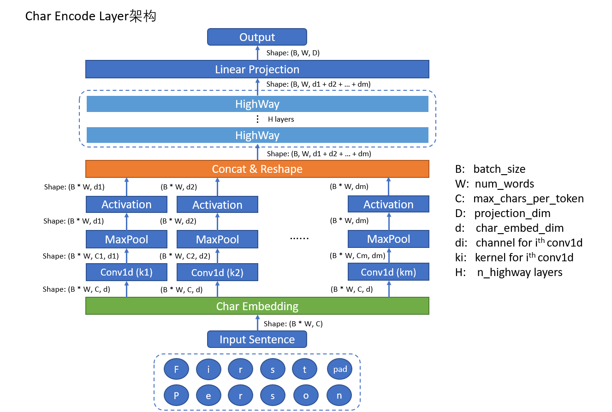

# 03.08-03.14  回顾

### RNN

- 一般神经网络backpropagation的计算过程可以分为5种类型

  $$
  \frac{\part loss}{\part f(x)}
  $$

  $$
  \frac{\part loss}{\part a^{(L+1)}(x)}
  $$

  $$
  \frac{\part loss}{\part h^{(k)}(x)} \ \ \ \text{where}\ k=1,2,...,L
  $$

  $$
  \frac{\part loss}{\part a^{(k)}(x)} \ \ \ \text{where}\ k=1,2,...,L
  $$

  $$
  \frac{\part loss}{\part w^{(k)}},\frac{\part loss}{\part b^{(k)}} \ \ \ \text{where}\ k=1,2,...,L
  $$

  

- Backpropagation through time（BPTT）

  

  $$
  L = \frac{1}{T} \sum_{t=1}^T \ell (\boldsymbol{o}_t, y_t)
  $$
  

  https://zh.d2l.ai/chapter_recurrent-neural-networks/bptt.html

- Vanilla RNN
  $$
  h_t=\sigma(W_{hx}X+W_{hh}h_{t-1}+b_1) \\
  y = \text{softmax}(W_{hy}h_t+b_2)
  $$

- LSTM
  $$
  \begin{align}
  \text{forget gate:} \  f^{(t)}&=\sigma(W_fh_{t-1}+U_fX_t+b_f)\\ 
  \text{input gate:} \  i^{(t)}&=\sigma(W_ih_{t-1}+U_iX_t+b_i)\\ 
  \text{output gate:} \ o^{(t)}&=\sigma(W_oh_{t-1}+U_oX_t+b_o)\\ 
  
  \tilde c^{(t)} &= \tanh(W_ch_{t-1}+U_cX_t+b_c)\\
  c^{(t)} &= f^{(t)}\odot c^{(t-1)}+i^{(t)}\odot\tilde c^{(t)}\\ 
  h^{(t)}&=o^{(t)}\odot \tanh( c^{(t)})
  
  \end{align}
  $$

- GRU
  $$
  \begin{align}
  u^{(t)}&=\sigma(W_uh_{t-1}+U_uX_t+b_u) \\
  r^{(t)}&=\sigma(W_rh_{t-1}+U_rX_t+b_r) \\
  \tilde h^{(t)} &= \tanh(W_h(r^{(t)}\odot h^{(t)})+U_nX_t+b_h) \\ 
  h^{(t)} &=(1-u^{(t)})\odot h^{(t-1)}+u^{(t)}\odot\tilde h^{(t)}
  \end{align}
  $$

- 梯度消失推导过程

  
  
  
  
- Skip connections（防止梯度消失）

  - ResNet (Residual connections)  identity connection
  - DenseNet (Dense connections)  connect everything to everything
  - HighwayNet (Highway connections)  dynamic gate similar to LSTM
  
- Reading material of LSTM

  - [The Unreasonable Effectiveness of Recurrent Neural Networks](http://karpathy.github.io/2015/05/21/rnn-effectiveness/)
  
- 优化方法

  - 定义问题：待优化参数$w$，目标函数$f(w)$，初始学习率$\alpha$。在每一个step $t$，

    1. 计算目标函数对当前参数的梯度：$g(t)=\Delta f(w_t)$
    2. 计算一阶动量和二阶动量：$m_t=\phi(g_1,g_2,...,g_t);V_t=\psi(g_1,g_2,...,g_t)$ 
    3. 计算当前时刻的下降梯度：$\eta_t=\alpha\cdot m_t/\sqrt {V_t}$
    4. 根据下降梯度进行更新：$w_{t+1}=w_t-\eta_t$

  - SGD
    $$
    m_t=g_t;\ V_t=I^2;\ \eta_t=\alpha\cdot g_t
    $$

  - Momentum（利用一阶动量加速或者避免振荡）
    $$
    m_t=\beta_1\cdot m_{t-1}+(1-\beta_1)\cdot g_t
    $$

  - Nesterov（在第一步求导时，不计算当前位置梯度，而是计算按照累积动量已经走了一步，那个位置的下降方向 ）
    $$
    g_t=\Delta f(w_t-\alpha\cdot m_{t-1}/\sqrt{V_{t-1}})
    $$

  - AdaGrad（二阶动量登场，使得频繁出现的参数(二阶动量大)学习率变小，偶尔出现的参数学习速率变大）（稀疏数据场景下表现好，但二阶动量$\sqrt{V_t}$是单调递增的，可能会使学习率单调递减为0，学习提前结束。）(为保证$V_t>0$，会加上一个很小的常数。)
    $$
    V_t = \sum_{\tau=1}^tg^2_\tau
    $$

  - AdaDelta/RMSProp（不累积全部历史梯度，只关注过去一段时间窗口的下降梯度(指数移动平均)，避免训练提前结束的问题）
    $$
    V_t=\beta_2 *V_{t-1}+(1-\beta_2)g^2_t
    $$

  - Adam（momentum + AdaDelta）
    $$
    m_t = \beta_1\cdot m_{t-1}+(1-\beta_1)\cdot g_t \\
    V_t=\beta_2 *V_{t-1}+(1-\beta_2)g^2_t
    $$
    实际中，参数的经验值$\beta_1=0.9,\ \beta_2=0.999$ ，初期$m_t,V_t$都会接近0，常根据以下公式进行修正：
    $$
    \tilde m_t=m_t/(1-\beta_1^t) \\ 
    \tilde V_t=V_t/(1-\beta^t_1)
    $$

    - Adam的缺点：

      1. SGD和AdaGrad可以单调递减，最终收敛到0。但是由于$V_t$可能会时大时小，导致Adam的学习率不是单调变化，后期学习率的震荡可能会导致模型无法收敛。
      2. 可能错过全局最优解。自适应学习率的方法可能会对前期出现的特征过拟合，后期出现的特征很难纠正前期的拟合效果。最终结果可能比SGD要差。

    - 改进方法：前期用Adam快速下降，再用SGD调优。

      https://zhuanlan.zhihu.com/p/32338983

  - Nadam（Nesterov+Adam）
    $$
    g_t=\Delta f(w_t-\alpha\cdot m_{t-1}/\sqrt{V_{t-1}})
    $$

  - 算法之间的关系

    

  参考资料：

  [一个框架看懂优化算法之异同 SGD/AdaGrad/Adam](https://zhuanlan.zhihu.com/p/32230623)

  [最优化方法](https://zhuanlan.zhihu.com/p/68068197)

- Gradient Checking
  $$
  \left| \frac{f(x+\varepsilon)-f(x-\varepsilon)}{2\varepsilon} -\frac{\part f(x)} {\part x}\right|<10^{-6}
  $$

- Gradient clipping for exploding gradient

  - if $||g^{(t)}||\ge \text{threshold}$, then
    $$
    g^{(t)}=g^{(t)}\cdot\frac{\text{threshold}}{||g^{(t)}||}
    $$

- 避免过拟合的方法
  - 正则（L1/L2）
  - early stopping
  - drop-out （相当于ensemble，集成学习）

### ELMo

- conv1d（第一列有颜色的是kernel）

  

- ELMo的总体框架

  

- 损失函数
  $$
  \sum_{k=1}^N\left\{\log p(t_k\mid t_1,..,t_{k-1};\Theta_x,\overrightarrow {\Theta}_{LSTM},\Theta_s)+(\log p(t_k\mid t_{k+1},...,t_N;\Theta_x,\overleftarrow\Theta_{LSTM},\Theta_s))\right\}
  $$

- char encode layer

​		关于highway的一个说明：https://blog.csdn.net/guoyuhaoaaa/article/details/54093913

- biLMs

- 生成ELMo词向量

  一共有$L$层的biLSTM，得到的表征维度为$(L+1)*B*W*2D$，对于每一个token，有$L+1$个$2D$维的表征，如下：
  $$
  \begin{align}
  R_k&=\{x_k^{LM},\overrightarrow h _{k,j}^{LM},\overleftarrow h_{k,j}^{LM}\mid j=1,...,L\}\\ &=\{h_{k,j}^{LM}\mid j=0,1,...,L\}
  \end{align}
  $$
  $h_{k,0}^{LM}$是词的embedding输出，$h_{k,j}^{LM}=[\overrightarrow h _{k,j}^{LM},\overleftarrow h_{k,j}^{LM}]$是双向LSTM拼接后的结果。然后做一个scalar mixer：
  $$
  ELMo_k^{task}=E(R_k,\Theta_{task})=\gamma^{task}\sum_{j=0}^Ls_j^{task}h_{k,j}^{LM}
  $$

- 合适的dropout和L2在ELMo模型上时会提升效果

- Elmo的训练逻辑图，注意不同方向的lm是分开训练的，细品。

- macOS安装allennlp时，遇到`error: command 'gcc' failed with exit status 1 `问题。使用`conda install -c conda-forge xxx`来安装没法正确安装的包，在继续`pip install allennlp` 即可。

  https://github.com/allenai/allennlp/issues/1938

  https://github.com/allenai/allennlp/issues/1969

- 参考资料
  
  - https://blog.csdn.net/Magical_Bubble/article/details/89160032

### Seq2seq

- An example of **conditional language model**
  $$
  P(y|x) = P(y_1|x)P(y_2|y_1,x)P(y_3|y_1,y_2,x)...P(y_T|y_1,...,y_{T-1},x)
  $$

- Beam search decoding

  复杂度从$O(|V|^n)$降到了$O(k^2n)$ ，概率的对数似然函数：
  $$
  \frac 1t\sum_{i=1}^t\log P_{LM}(y_i|y_1,...,y_{i-1},x)
  $$
  [CS224N_winter_2019/Lecture 8 Machine Translation and Sequence-to-sequence and Attention](https://github.com/wangjw14/Summary-notes/blob/master/CS224N_winter_2019/Lecture 8 Machine Translation%2C Sequence-to-sequence and Attention.md)

- 机器翻译的评价指标
  $$
  BLUE=BP\cdot \exp(\sum_{n=1}^Nw_n\log p_n)
  $$

  $$
  BP=\begin{cases}
  1 &\text{if}\ \  c>r\\
  e^{1-r/c} \ \ &\text{if}\ \  c\le r
  \end{cases}
  $$

  其中$p_n$是对于n-gram的modified_precision。

  https://blog.csdn.net/guolindonggld/article/details/56966200

  http://www.nltk.org/_modules/nltk/align/bleu_score.html

### Representation Learning

- The better representation lies in lower dimensional manifold.
- How to evaluate a representation?
  - Smoothness of cost function （平滑的目标函数便于使用优化算法，L1正则在x=0处没有倒数）
  - Multiple explanatory factors（disentangling） 
    - 不同方面的特征值出现在不同的维度，可以有更好的解释性，也可以便于迁移学习。
    - 为了达到这一目标，方法一：统计学上，不同特征的co-variance矩阵是一个block diagonal 矩阵；方法二：semi-supervised方法，设计不同的loss适用于不同的目的
    - 扩展阅读：VAE（Auto-Encoding Variational Bayes）、GAN、InfoGAN
  - Hierarchical representation（结构化的表示，如图像中的多层CNN，便于迁移学习）
  - Shared factors across tasks（便于迁移学习，范化能力强）
  - Low dimensional manifold
  - Temporal/Spacial coherence （连续性，一致性，避免较大的跃变）
  - Sparsity（可解释性，类似multiple explanatory factors）

### Universal Approximation Theorem

- 当有足够多的神经元时，一个单层的神经网络就能够近似任何一个连续的函数。
- 但同时，我们并没有一个足够好的优化算法能够找到这样的参数。

### 算法复杂度相关

- Master Theorem
  适用于求递归的时间复杂度，当有以下形式的时候
  $$
  T(n)=aT(n/b)+f(n)
  $$
  其中$a\ge1\text{ and } b>1$是常数，有以下三种情况：

  1. 若$f(n)=O(n^{\log_ba-\epsilon })$ for $\epsilon>0$ ，则$T(n)=\Theta(n^{\log_ba})$ 。
  2. 若$f(n)=\Theta(n^{\log_ba}\log^kn)$ with $k\ge0$，则$T(n)=\Theta(n^{\log_ba}\log^{k+1}n)$。
  3. 若$f(n)=\Omega(n^{\log_ba+\epsilon})$ for $\epsilon>0$，并且存在$c<1$使得$af(n/b)\le cf(n)$，则$T(n)=\Theta(f(n))$。

- 递归树

  - 例如斐波那契数列，递归方法，时间复杂度$O(2^n)$，空间复杂度$O(n)$（函数压栈）

- 斐波那契数列的其他实现方式：

  - 循环方式，时间复杂度$O(n)$，空间复杂度$O(1)$

  - $O(1)$时间复杂度的实现方式，使用通项公式。
    $$
    f(n)=\frac{(\frac{1+\sqrt 5}{2})^n-(\frac{1-\sqrt5}2)^n}{\sqrt 5}
    $$
    推导过程：

    使用矩阵对角化、求特征值，特征向量、矩阵求逆等。

    [斐波那契数列通项公式是怎样推导出来的？ - Daniel Xiang的回答 - 知乎](https://www.zhihu.com/question/25217301/answer/158291644)

    [如何计算可逆矩阵的逆矩阵？ - Lingfeng Ai的回答 - 知乎](https://www.zhihu.com/question/19584577/answer/13465887)

## Plan of next week

- 数据结构和算法完成前2个week的内容

- elmo的源码探究，尝试训练一个词向量

- BERT和attention

- HMM和CRF

  

