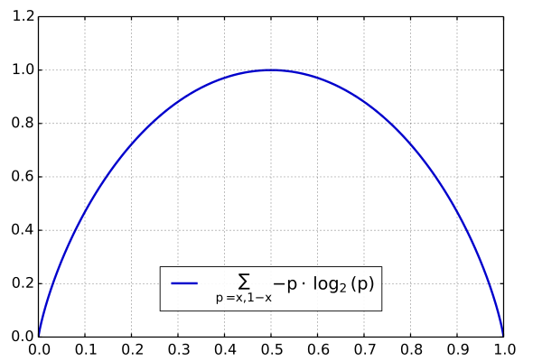

# 04.12-04.18 回顾

# 最大熵模型

### 熵的相关概念

- **熵**：表示随机变量不确定性的度量。
  $$
  H(X)=-\sum_{i=1}^np_i\log  p_i
  $$
  其中，若 $p_i=0$，则 $0\log 0=0$ 。$\log$ 的底数表示单次操作可能产生结果的数量。若底数为2，则熵的单位是bit，若底数是 $e$，则单位是nat。

  - 熵越大，不确定性越大。均匀分布时，不确定性最大，熵也最大。

  - 熵只依赖于 $X$ 的分布，而与 $X$ 的取值无关。

  - 熵将一个分布映射到一个数值，可以理解为范函 。

  - 熵 $H(p)$ 随概率 $p$ 变化的曲线如下：

    

- **联合熵**：给定两个随机变量 $X,Y$ 的联合分布，可以形成联合熵，用 $H(X,Y)$ 表示。

- **条件熵**：给定两个随机变量 $X,Y$ 的联合分布，以及 $Y$ 取不同值的前提下 $X$ 的分布。可以定义条件熵：
  $$
  H(X|Y)=-\sum_{x,y}p(x,y)\log p(x|y)
  $$

  $$
  H(X|Y)=H(X,Y)-H(Y)
  $$

- **相对熵**：也叫交叉熵、互熵、KL散度

  - 作用：用于衡量两个取值为正数的函数的相似性（所以可以用作**交叉熵损失函数**）

  $$
  KL(f(x)\|g(x))=\sum_xf(x)\log\frac{f(x)}{g(x)}\\
  $$

  - 相对熵的性质：

    1. 完全相同的函数，相对熵等于0
    2. 相对熵越大，两个函数差异越大；反之，相对熵越小，两个函数差异越小。
    3. 对于概率分布或者概率密度函数，如果取值均大于0，则相对熵可以度量两个随机分布的差异性。

  - 为什么交叉熵可以用于计算代价？
    $$
    \begin{align}
    KL(f(x)\|g(x))&=\sum_xf(x)\log\frac{f(x)}{g(x)}\\
    &= \sum_xf(x)\log f(x)-\sum_xf(x)\log g(x)
    \end{align}
    $$
    第一项表示 $f(x)$ 的熵（的相反数），第二项（包括负号）就是我们cross-entropy loss中的形式。对于要拟合的分布 $f(x)$ 可以看成是常数。因此最小化KL散度，也就是最小化cross-entropy loss。

    [知乎-为什么交叉熵（cross-entropy）可以用于计算代价？](https://www.zhihu.com/question/65288314)

  - 已经存在一个随机变量 $P$，要用另一个随机变量 $\hat P$ 去拟合 $P$ ：

    1. 如果使用 $KL(\hat P\|P)$  
       $$
       KL(\hat P\|P)=
       \sum_x\hat P(x)\log \hat P(x)-\sum_x \hat P(x)\log P(x)
       $$
       由于 $P$ 和 $\hat P$ 都在区间 $[0,1]$ ，为了让距离最小，则要求在 $P(x)=0$ 的地方， $\hat P(x)$ 也尽量为0，会得到比较“窄”的分布曲线。

    2. 如果使用 $KL( P\|\hat P)$  
       $$
       KL( P\|\hat  P)=\sum_x P(x)\log P(x)-\sum_x P(x)\log \hat P(x)
       $$
       由于 $P$ 和 $\hat P$ 都在区间 $[0,1]$ ，为了让距离最小，则要求在 $P(x)\ne 0$ 的地方， $\hat P(x)$ 也尽量不为0，会得到比较“宽”的分布曲线。

  - 由于相对熵是不对称的，因此做如下定义：
    $$
    JS(f(x)\|g(x))=\frac12[KL(f(x)\|g(x))+KL(g(x)\|f(x))]
    $$

- **互信息**：表示两个随机事件的“相关性”量化
  $$
  \begin{align}
  I(X,Y)&=KL(P(X,Y)\|P(X)P(Y))
  \\ &=\sum_{x,y}p(x,y)\log \frac{p(x,y)}{p(x)p(y)}\\
  &=H(X)-H(X|Y)\\
  &=H(X)+H(Y)-H(X,Y)
  \end{align}
  $$

  - 所谓相关性的量化度量，就是在了解了其中一个 $Y$ 的前提下，对消除另一个 $X$ 不确定性所提供的信息量。
  - 互信息的取值在 0 到 $\min(H(X),H(Y))$ 之间。当 $X$ 和 $Y$ 完全相关时，它的取值是 $H(X)$ ，同时 $H(X)=H(Y)$；当二者完全无关时，取值是0。
  - 决策树中的**信息增益**等价于训练数据集中类与特征的互信息。

- Venn diagram

  

### 最大熵模型

- **两个原则**

  1. 承认已知（约束条件）
  2. 对未知事物不做任何假设，没有任何偏见（概率平均分布，也就是熵最大）

- **最大熵模型的定义 **  

  - 假设一个分类器是 $P(Y|X)$ 的判别模型，给定训练数据 $T=\{(x_1,y_1),(x_2,y_2),\cdots,(x_N,y_N)\}$ ，先定义经验联合分布 $\tilde P(X,Y)$ 和经验边缘分布 $\tilde P(X)$ 
    $$
    \begin{align}
    &\tilde P(X=x,Y=y)=\frac{v(X=x,Y=y)}{N} \\
    &\tilde P(X=x)=\frac{v(X=x)}{N}
    \end{align}
    $$
    其中，$v(X=x,Y=y)$ 代表训练数据中样本 $(x,y)$ 出现的频数，$N$ 是样本总数。

    再定义特征函数 $f(x,y)$ 如下：
    $$
    f(x,y)=\cases {1,\ \ \ \ \ x与y满足某一事实\\0,\ \ \ \ \ 否则}
    $$
    则特征函数 $f(x,y)$ 关于经验分布 $\tilde P(X,Y)$ 的期望如下：
    $$
    E_{\tilde P}(f)=\sum_{x,y}\tilde P(X,Y) f(x,y)
    $$
    另外，特征函数 $f(x,y)$ 关于模型 $P(Y|X)$ 与经验分布 $\tilde P(X)$ 的期望如下：
    $$
    E_P(f)=\sum_{x,y}\tilde P(x)P(y|x)f(x,y)
    $$
    上两式应该相等，并将其作为模型的约束条件，即：
    $$
    E_{ P}(f)=E_{\tilde P}(f)
    $$

  - **最大熵模型** 

    假设所有满足约束条件的模型集合为
    $$
    \mathcal C=\{P\in\mathcal P\ \ |\ \ E_{P}(f_i)=E_{\tilde P}(f_i) \}
    $$
    其中，$i=1,2,\cdots,n$ ，$n$ 是特征函数的个数，也是约束条件的个数。定义在条件概率分布 $P(Y|X)$ 上的条件熵：
    $$
    H(P)=-\sum_{x,y}\tilde P(x)P(y|x)\log P(y|x)
    $$
    则模型集合 $\mathcal C$ 中使得 $H(P)$ 最大的模型称为最大熵模型。其中对数的底数是 $e$ 。

- 已知 $\tilde P(X,Y)$ 和 $\tilde P(X)$ ，为什么不直接求 $P(Y|X)$ ，而是要用最大熵模型的方式？

  注意区别**经验的联合概率和联合概率**，也就是说 $ P(X,Y)\ne \tilde P(X,Y) $ 。原因是，当 $X$ 的维度很大时，训练数据也无法穷尽 $(X,Y)$ 的所有组合，只能尽可能满足训练数据（约束条件）的情况下，保持对训练数据中没有出现的情况等概率分布（熵最大）。

  如果训练数据已经可以穷尽所有的 $(X,Y)$ 组合，那么，数据没有不确定性，熵也就为0。

  而尽可能满足约束条件，也等同于最大似然估计中的尽可能拟合数据；熵最大也等同与最大似然估计中的似然函数取极值。

  [知乎-最大熵模型已经知道了经验联合概率分布p(x,y)，为什么不去直接求p(y|x)?](https://www.zhihu.com/question/59251551)

-  最大熵模型的求解

  最大熵模型可以看出一个有约束的最优化问题：
  $$
  \begin{align}
  \min_{P\in\mathcal C}\ \ \ \ \ \ \ \  &-H(P)=\sum_{x,y}\tilde P(x)P(y|x)\log(y|x)\\
  \text{s.t.}\ \ \ \ \ \ \ \  & E_{P}(f_i)=E_{\tilde P}(f_i), \ \ \ i=1,2,\cdots,n\\
    &   \sum_yP(y|x)=1
  \end{align}
  $$
  引入拉格朗日函数：
  $$
  \begin{align}
  L(P,w)&=-H(P)+w_0\left[1-\sum_y P(y|x)\right] + \sum_{i=1}^n w_i(E_{\tilde  P}(f_i)-E_{P}(f_i))\\
  &=\sum_{x,y}\tilde P(x)P(y|x)\log P(y|x)+w_0\left[1-\sum_y P(y|x)\right]  \\ &+\sum_{i=1}^nw_i\left[\sum_{x,y}\tilde P(x,y)f_i(x,y)-\sum_{x,y}\tilde P(x)P(y|x)f_i(x,y)  \right]
  \end{align}
  $$
  求导数
  $$
  \frac{\part L(P,w)}{\part P(y|x)}=\sum_{x,y}\tilde P(x)(\log P(y|x)+1)- \sum_yw_0-\sum_{x,y}\left[\tilde P(x)\sum_{i=1}^nw_if_i(x,y)\right]\\
  =\sum_{x,y}\tilde P(x)\left[\log P(y|x)+1-w_0-\sum_{i=1}^nw_if_i(x,y) \right]
  $$
  令导数等于0，在 $\tilde P(x)>0$ 的条件下，有
  $$
  P(y|x)=\exp \left[\sum_{i=1 }^nw_if_i(x,y)+w_0-1\right] =\frac{\exp \left[\sum_{i=1 }^nw_if_i(x,y)\right]}{\exp(1-w_0)}
  $$
  由于 $\sum_yP(y|x)=1$ ，得到
  $$
  P(y|x)=\frac1{Z(x)}\exp\left[\sum_{i=1 }^nw_if_i(x,y)\right]
  $$
  其中，
  $$
  Z(x)=\sum_y\exp\left[\sum_{i=1 }^nw_if_i(x,y)\right]
  $$
  上述得到的就是最优形式的 $P(y|x)$ ，因此，最大熵模型也可以表示为：
  $$
  P(y|x)=\frac1{Z(x)}\exp\left[\sum_{i=1 }^nw_if_i(x,y)\right] \\
  Z(x)=\sum_y\exp\left[\sum_{i=1 }^nw_if_i(x,y)\right]
  $$
  根据上式，最大熵模型属于log linear model。

   将上式的 $P(y|x)$ 代回到拉格朗日函数 $L(P,w)$ 中，得到：
  $$
  L(P,w)=\sum_{x,y}\tilde P(x,y)\sum_{i=1}^n w_if_i(x,y)-\sum_x\tilde P(x)\log Z(x)
  $$

  - 给出最大似然估计的对数似然函数：
    $$
    L(P)=\log\prod_{x,y}P(y|x)^{\tilde P(x,y)}=\sum_{x,y}\tilde P(x,y)\log P(y|x)
    $$
    将 $P(y|x)$ 带入后可以发现，与拉格朗日方法的结论一致，可见，最大熵模型和最大似然估计是等价的。

- 最大熵模型没有解析解

  [知乎-关于最大熵模型的严重困惑：为什么没有解析解？](https://www.zhihu.com/question/49139674/answer/114650147)

- 改进的迭代尺度法（IIS）

  由于最大熵模型没有解析解，只能迭代求数值解。IIS的想法是，假设目前的参数向量是 $w$ ，希望找到一个新的参数向量 $w+\delta$ ，使得模型的对数似然函数值增大。那么问题转化为求 $\delta$ 。通过一系列复杂的转换之后，可以求出 $\delta$ ，并不断迭代，直至收敛。

- 使用拟牛顿法BFGS进行求解。

- **一点思考**：

  - 熵：不确定度
  - 似然：与知识的吻合程度
  - 最大熵模型：对不确定度的无偏分配
  - 最大似然估计 ：对知识的无偏理解

  **知识** = **不确定度** 的 **补集**   

  某种程度上，最大熵和最大似然估计是等价的。

# 优化方法

### 梯度下降法

略

### 牛顿法和拟牛顿法

- 正定矩阵

  - 给定一个大小为 $n\times n$ 的实对称矩阵 $A$ ，如果对于任意长度为 $n$ 的**非零**向量 $x$ ，均有 $x^TAx>0$ 成立，则矩阵 $A$ 是一个正定矩阵。
  - 给定一个大小为 $n\times n$ 的实对称矩阵 $A$ ，如果对于任意长度为 $n$ 的向量 $x$ ，均有 $x^TAx\ge0$ 成立，则矩阵 $A$ 是一个半正定矩阵。

- 牛顿法和拟牛顿法是求解**无约束最优化**问题的常用方法

- **牛顿法** 

  - 定义

    定义无约束最优化问题：
    $$
    \min_{x\in R^n}f(x)
    $$
    假设 $f(x)$ 有二阶连续偏导数，第 $k$ 次迭代的值为 $x^{(k)}$ ，则 $f(x)$ 可以在 $x^{(k)}$ 处进行二阶泰勒展开：
    $$
    f(x)=f(x^{(k)})+g_k^T(x-x^{(k)})+\frac12(x-x^{(k)})^TH(x^{(k)})(x-x^{(k)})
    $$
    其中， $g_k=g(x^{(k)})=\nabla f(x^{(k)}) $ 是 $f(x)$ 在 $x^{(k)}$ 处的梯度，$H(x^{(k)})$ 是 $f(x)$ 的海塞矩阵（Hesse matrix）。对上式两边继续对 $x$ 求导，得到：
    $$
    \nabla f=g_k+H_k(x-x^{(k)})
    $$
    其中，$H_k=H(x^{(k)})$ 。由于函数的极值点在一阶导数为0处，也就是 $\nabla f(x)=0$  ，并令 $x=x^{(k+1)}$ ，得到
    $$
    x^{(k+1)}=x^{(k)} -H_k^{-1}g_k
    $$
    用上式不断迭代，直至收敛。

  - 牛顿法的**直观解释**：每一次迭代，将目标函数在局部近似表示成二次函数，然后用该二次函数的极值点代替目标函数的极值点，不断重复直至收敛。

  - 原始牛顿法没有步长因子，是定步长迭代。对于非二次型目标函数可能会发散。因此，可以改进为**阻尼牛顿法**。阻尼牛顿法与牛顿法迭代的方向相同，但是加入了步长因子：

  $$
  x^{(k+1)}=x^{(k)} -\lambda_k H_k^{-1}g_k \\
  \lambda_k= \arg\max_{\lambda\in \R} f(x_k-\lambda H_k^{-1}g_k)
  $$

  ​		即 $\lambda_k$ 是沿迭代方向作一维搜索（line search）后寻求到的最优步长。

  - 牛顿法的缺点：
    - 对目标函数严格，必须有连续的一、二阶偏导数，海塞矩阵必须正定。
    - 计算相当复杂。

- 拟牛顿条件

  - 牛顿法中，海塞矩阵的逆矩阵计算比较复杂，因此考虑一个 $n$ 阶矩阵 $G_k=G(x_k)$ 来代替 $H_k^{-1}=H^{-1}(x_k)$ ，这是拟牛顿法的基本想法。

  - 由上可知，$H_k$ 要满足以下条件：
    $$
    \nabla f=g_k+H_k(x-x^{(k)})\\
    g_{k+1}-g_k=H_k(x^{(k+1)}-x^{(k)})
    $$
    上式即位**拟牛顿条件**。记：
    $$
    y_k=g_{k+1}-g_k\\
    \delta_k=x^{(k+1)}-x^{(k)}
    $$

  - $G_k$ 要扮演 $H^{-1}_k$ 在牛顿法中的作用，因此也需要满足以下条件：

    1. $G_k$ 是正定矩阵，保证牛顿法的方向是向下搜索的
    2. $G_k$ 满足拟牛顿条件，即 $G_k y_k=\delta_k$ 

  - $G_k$ 选择不唯一，每次迭代需要更新替代矩阵 $G_k$ 
    $$
    G_{k+1}=G_k+\Delta G
    $$

- DFP算法

  假设 $G_{k+1}$ 由 $G_k$ 加上两个附加项构成，即
  $$
  G_{k+1}=G_k+P_k+Q_k
  $$
  其中， $P_k$ 和 $Q_k$ 是带确定的矩阵，此时有
  $$
  G_{k+1}y_k=G_ky_k+P_ky_k+Q_ky_k
  $$
  为使 $G_{k+1}$ 满足拟牛顿条件，则
  $$
  P_ky_k=\delta_k\\
  G_ky_k=-G_ky_k
  $$
  令
  $$
  P_k=\frac{\delta_k\delta_k^T}{\delta_k^Ty_k}\\
  Q_k=-\frac{G_ky_ky^T_kG_k}{y_k^TG_ky_k}
  $$
  得到 $G_{k+1}$ 的迭代公式：
  $$
  G_{k+1}=G_k+\frac{\delta_k\delta_k^T}{\delta_k^Ty_k}-\frac{G_ky_ky^T_kG_k}{y_k^TG_ky_k}
  $$
  成为DFP算法。可以证明，当初试矩阵 $G_0$ 是正定的，迭代过程中的每个矩阵 $G_k$ 都是正定的。

- BFGS算法

  DFP用 $G_k$ 逼近 $H^{-1}_k$ ，BFGS用 $B_k$ 去逼近 $H_k$ 。BFGS是最流行的拟牛顿算法，对应的拟牛顿条件：
  $$
  B_{k+1}\delta_k=y_k
  $$
  令：
  $$
  B_{k+1}=B_k+P_k+Q_k\\
  B_{k+1}\delta_k=B_k\delta_k+P_k\delta_k+Q_k\delta_k
  $$
  注意此处是 $\delta_k$ ，而DFP算法中是 $y_k$ 。为满足拟牛顿条件，令
  $$
  P_k\delta_k=y_k\\
  Q_k\delta_k=-B_k\delta_k
  $$
  得到 $B_{k+1}$ 迭代公式：
  $$
  B_{k+1}=B_k+\frac{y_ky_k^T}{y^T_k\delta_k}-\frac{B_k\delta_k\delta_k^TB_k}{\delta_k^TB_k\delta_k}
  $$
  可以证明，当初试矩阵 $B_0$ 是正定的，迭代过程中的每个矩阵 $B_k$ 都是正定的。

- Broyden类算法

  使用BFGS得到 $B_k$ 的迭代公式，若令 $G_k=B_k^{-1},G_{k+1}=B_{k+1}^{-1}$ ，在经过转换之后，可以得到：
  $$
  G_{k+1}=\left[I-\frac{\delta_ky_k^T}{\delta_k^Ty_k} \right]G_k\left[I-\frac{\delta_ky_k^T}{\delta_k^Ty_k} \right]^T+ \frac{\delta_k\delta_k^T}{\delta_k^Ty_k}
  $$
  记上式通过BFGS得到的 $G_{k+1}$ 为 $G^{\text{BFGS}}$ ，再记通过DFP算法得到的 $G_{k+1}$ 为 $G^{\text{DFP}}$ 。由于它们都满足拟牛顿条件，所以，它们的线性组合
  $$
  G_{k+1}=\alpha G^{\text{DFP}}+(1-\alpha)G^{\text{BFGS}}
  $$
  也满足拟牛顿条件，且是正定的。其中 $0\le\alpha\le1$ 。这样就得到了一族拟牛顿法，成为Broyden类算法。

- L-BFGS

  在BFGS中，要保存一个 $n\times n$ 的矩阵 $G_k$ ，占用的空间太大，因此，不会直接保存 $G_k$ ，而是保存计算 $G_k$ 中的 $\{y_i\},\{\delta_i\}$ ，其中 $i=1,2,\cdots,k$  。为了进一步节省空间， $i$ 也会从保存所有的 $k$ 个，退化到只保存最近 $m$ 个。这样一来，存储从 $O(n^2)$ 降到了 $O(mn)$ ，并且一般 $m \ll n$ 。

  具体计算公式可参考：https://blog.csdn.net/itplus/article/details/21897715

### 拉格朗日对偶性

- **如何理解拉格朗日乘子法** 

  对于有约束的优化问题：
  $$
  \min_x f(x)\\
  \text{s.t. }g(x)=0
  $$
  转化为无约束的优化问题：
  $$
  \min_x f(x)+\lambda g(x)
  $$
  分别对 $x$ 和 $\lambda$ 求导，并另导数为零，求解，最优值。为什么上述两个问题是等价的。从几何意义上说，极值点处是 $f(x)$ 和 $g(x)$ 相切的地方，也就是说，极值点处，两个的**导数方向是平行**的，即
  $$
  \nabla_xf(x)=\lambda \nabla g(x)
  $$
  上式等价于
  $$
  \nabla_x(f(x)+\lambda g(x))=0
  $$
  同时，极值点还需要满足在 $g(x)$ 上，有 $g(x)=0$ ，恰好是 $f(x)+\lambda g(x)$ 对 $x$ 和 $\lambda$ 的导数等于0的情况。因此，两者是等价的。

  [知乎-如何理解拉格朗日乘子法？](https://www.zhihu.com/question/38586401/answer/457058079) 

- KKT条件

  对于有约束的优化问题：
  $$
  \begin{align}
  \min_x\ & f(x)\\
  \text{s.t. }\ & c_i(x)\le0 ,   &\ i=1,2,\cdots,k\\
  &h_j(x)=0, &\ j=1,2,\cdots,l
  \end{align}
  $$
  引入拉格朗日函数：
  $$
  L(x,\alpha,\beta)=f(x)+\sum_{i=1}^k\alpha_ic_i(x)+\sum_{j=1}^l\beta_jh_j(x)
  $$
  其中，$\alpha_i\ge0$ 。则KKT条件为：
  $$
  \begin{align}
  \nabla_xL(x^*,\alpha^*,\beta^*) =0\\
  a_i^*c_i(x^*)=0\\
  c_i(x^*)\le0\\
  \alpha_i^*\ge0\\
  h_j(x^*)=0
  \end{align}
  $$
  对于等式约束 $h_j(x)$ ，拉格朗日乘子法中已经进行过讨论。

  对于不等式约束，先定义可行域 $K=\{x\in\R^n| c_i(x)\le0\}$ ，并假设最优解为 $x^*$ ，有两种情况：

  1. $c_i(x)<0$ ，最优解 $x^*$ 为于  $K$ 内部，称为内部解，此时约束条件是无效的，即 $\alpha_i=0$  。
  2. $c_i(x)=0$ ，最优解 $x^*$ 为于  $K$ 边界，称为边界解，此时约束条件是有效的。

  因此，无论内部解还是边界解 $\alpha_ic_i(x)=0$ 恒成立，称为**互补松弛性**。

  [知乎-Karush-Kuhn-Tucker (KKT)条件](https://zhuanlan.zhihu.com/p/38163970) 

- 拉格朗日对偶性

  公式太多，就不抄了，具体参考《统计学习方法》或者知乎。

  [知乎-拉格朗日对偶性](https://zhuanlan.zhihu.com/p/38182879)

## Plan of next week

- 

