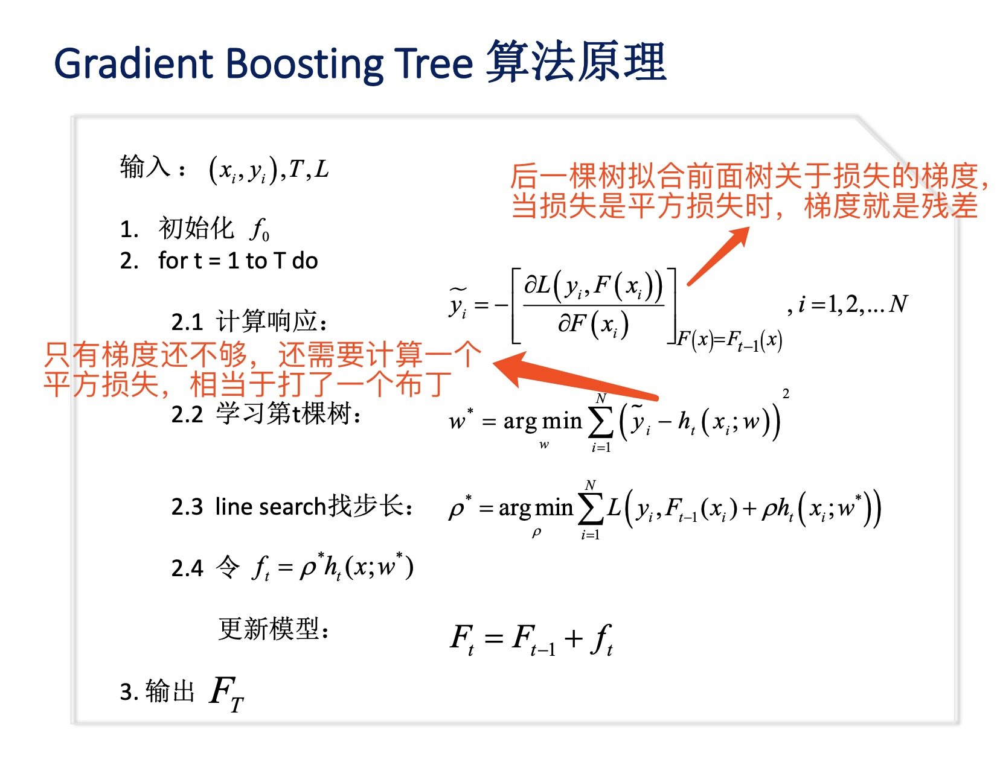
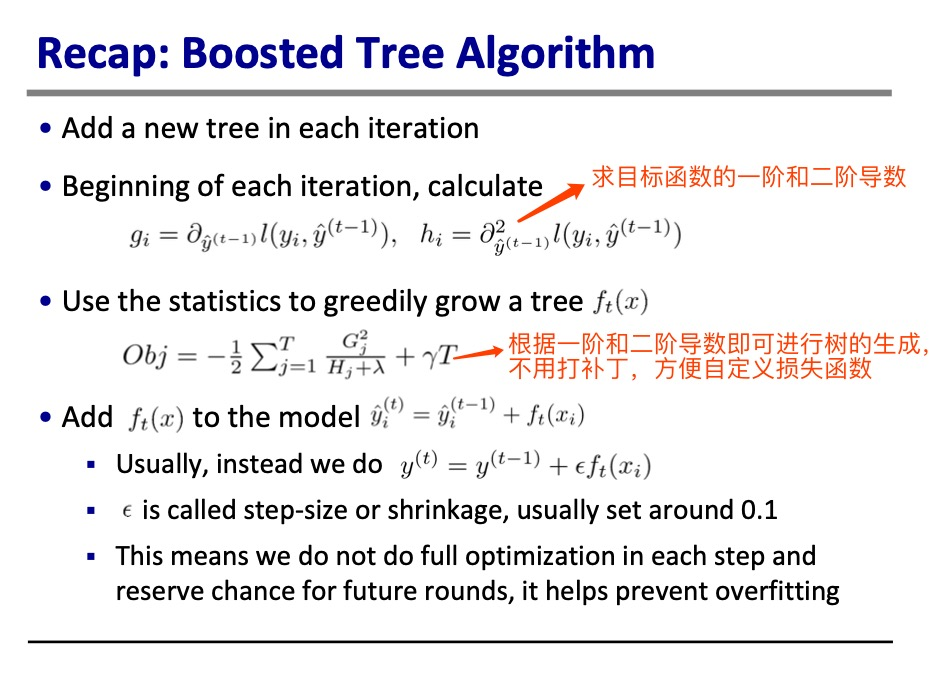
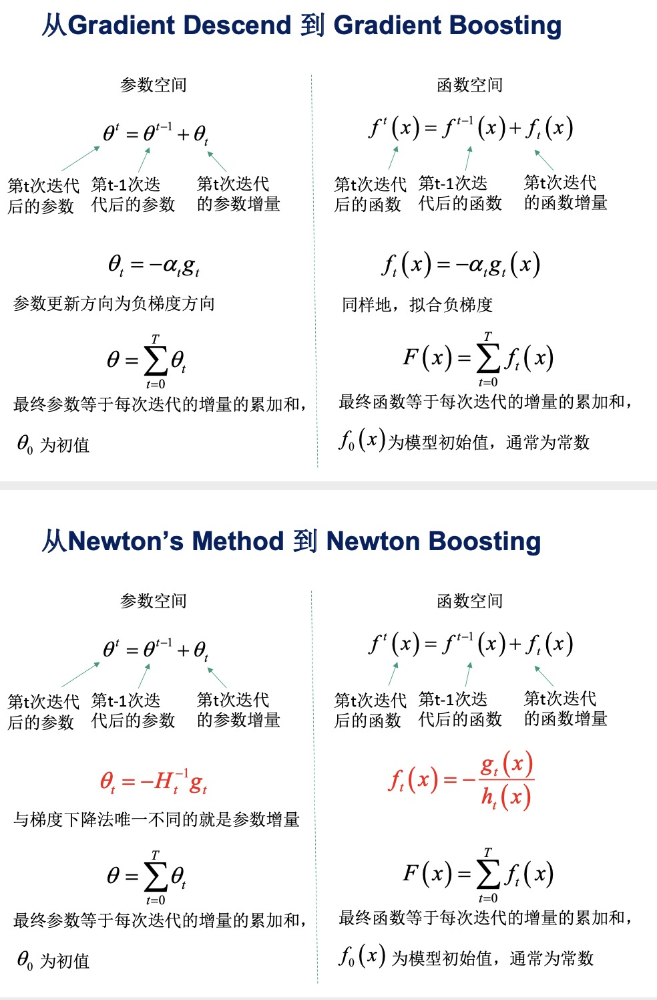

# 05.10-05.16 回顾

# 决策树

### 决策树基础 

- 决策树是基于特征，对实例进行分类的树形模型。决策树可以转换成一个if-then的规则集合，也可以看作是在特征空间划分上的类的条件概率分布。

- 从数据中学到一棵最优决策树是一个**NP完全问题**，现实中采用启发式方法学习**次优决策树**。 

- 决策树的损失函数的正则化的极大似然函数。公式表示如下：
  $$
  \begin{align}
  C_\alpha(T)&= C(T)+\alpha|T|  \\
  &=\sum_{t=1}^{|T|}N_tH_t(T)+\alpha|T|
  \end{align}
  $$
  其中，树 $T$ 的叶子结点有 $|T|$ 个，$t$ 是 $T$ 的叶子结点，$t$ 上有 $N_t$ 个样本点，其中 $k$ 类的样本点有 $N_{tk}$ 个，$H_t(T)$ 是叶子结点上的经验熵。
  $$
  H_t(T)=-\sum_k\frac{N_{tk}}{N_t}\log \frac{N_{tk}}{N_t}
  $$

  $$
  C(T)=\sum_tN_tH_t(T)=-\sum_t\sum_k N_{tk}\log \frac{N_{tk}}{N_t}
  $$

- 决策树的学习算法包括3部分：特征选择，树的生成和树的剪枝。

- **特征选择**的常用准则包括：

  1. 信息增益 （ $\text{ID3}$ ）
     $$
     g(D,A) = H(D)-H(D|A)\\
     H(D)=-\sum_k \frac{|C_k|}{|D|}\log \frac{|C_k|}{|D|}\\
     H(D|A)=\sum_{i=1}^n \frac{|D_i|}{D}H(D_i) 
     $$
     $H(D)$ 是数据集 $D$ 的熵，$H(D_i)$ 是数据集 $D_i$ 的熵，$H(D|A)$ 是条件熵。$D_i$ 是 $D$ 中特征 $A$ 取第 $i$ 个值的样本子集。 $C_k$ 是 $D$ 中属于第 $k$ 个类别的样本子集，$n$ 是特征 $A$ 的取值个数。

  2. 信息增益比（ $\text{C4.5}$ ）
     $$
     g_R(D,A)=\frac{g(D,A)}{H(D)}
     $$
     使用信息增益，存在倾向于选择特征较多的特征的问题，使用信息增益比进行校正。

  3. 基尼指数（ $\text{CART}$ ）
     $$
     \text{Gini}(D)=1-\sum_{k=1}^K\left(\frac{|C_k|}{|D|} \right)^2
     $$
     特征 $A$ 下的集合 $D$ 的基尼指数：
     $$
     \text{Gini}(D,A)=\frac{|D_1|}{|D|}\text{Gini}(D_1) +\frac{|D_2|}{|D|}\text{Gini}(D_2) 
     $$

- **树的生成**：选择信息增益最大、信息增益比最大、基尼指数最小作为特征选择的准则。

- **树的剪枝**：根据决策树的损失函数，从底部开始，如果去掉叶子结点，可以使得损失函数变小，则进行剪枝操作。

- $\text{CART}$ ：classification and regression tree，是一种二叉决策树。

  - 回归树：使用平方误差最小化准则
  - 分类树：使用基尼指数最小化准则

### GBDT和xgboost

- GBDT可以泛指所有的梯度提升树，包括xgboost。本文档中的GBDT特指"Greedy Function Approximation: A Gradient Boosting Machine"里提出的算法，它只采用了一阶导数信息。

- **关于监督学习的回顾：** 

  - 监督学习的目标函数形式：
    $$
    Obj(\Theta)=L(\Theta)+\Omega(\Theta)
    $$
    其中，$L(\Theta)$ 是损失函数， $\Omega(\Theta)$ 是正则项。

    损失函数可以是：square loss, logistic loss 等

    正则项可以是：L1 norm, L2 norm。

  - **Ridge regression**: 线性模型，square loss，L2 norm
    $$
    \sum_{i=1}^n(y_i-w^Tx_i)^2+\lambda||w||_2^2
    $$
    
  - **Lasso regression**: 线性模型，square loss，L1 norm
  
  $$
  \sum_{i=1}^n(y_i-w^Tx_i)^2+\lambda||w||_1
  $$
  
  - **Elastic net**：线性模型，square loss，L1 & L2 norm 
  $$
    \frac1{2n}\sum_{i=1}^n (y_i-w^Tx_i)^2 + \lambda(\alpha||w||_1 + \frac{(1-\alpha)}{2}||w||_2^2 )
  $$
  
  - **Logistic regression**: 线性模型，logistic loss，L2 norm
    $$
  \sum_{i=1}^n[y_i\ln(1+e^{-w^Tx_i})+(1-y_i)\ln(1+e^{w^Tx_i})]+\lambda||w||_2^2
    $$
    
  - 模型、参数、目标函数的分离，可以对工程实现带来便利。
  
  - L1 vs L2
  
    - L1 带来稀疏性。L1在原点处不可导，计算没有L2方便。
    
  - L2 则使得每个参数都是一个很小的值。
  
  - L0、L1、L2、L-Infinity Norm
  
    - $l_p \ \text{norm}$ 的定义：$||x||_p= \sqrt[p] {\sum_i |x_i|^p}$  where $p\in \R$ 
    - $l_0 \ \text{norm}$ ：$||x||_0= \#(i|x_i\ne0) $ 
    - $l_1 \ \text{norm}$ ：$||x||_1=\sum_i|x_i| $
    - $l_2 \ \text{norm}$ ：$||x||_2=\sqrt{\sum_i x_i^2 }$ 
    - $l_\infin \ \text{norm}$ ：$||x||_\infin= \max(|x_i|) $ 
    - https://rorasa.wordpress.com/2012/05/13/l0-norm-l1-norm-l2-norm-l-infinity-norm/
  
- **树模型ensemble的目标函数** 
  $$
  Obj=\sum_{i=1}^n l(y_i, \hat y_i)+ \sum _{k=1}^K\Omega(f_k)
  $$
  其中，
  $$
  \hat y_i=\sum_{k=1}^Kf_k(x_i),\ \ \ f_k\in \mathcal F
  $$
  由于模型是决策树，没法求导，没法使用SGD，因此，采用**Additive Training (Boosting)** ，每次只学习一棵树。则 $t$ 时刻的目标函数为：
  $$
  Obj^{(t)} = \sum_{i=1}^n l\left(y_i,\hat y_i^{(t-1)}+f_t(x_i) \right)+\Omega(f_t)+constant
  $$
  将损失函数用泰勒公式进行二阶展开：
  $$
  Obj^{(t)}\approx \sum_{i=1}^n\left[l(y_i,\hat y_i^{(t-1)})+g_if_t(x_i)+\frac12h_if_t^2(x_i)  \right]+\Omega(f_t)+constant
  $$
  其中，
  $$
  g_i={\part_{ \hat y_i^{(t-1)}}  l(y_i,\hat y_i^{(t-1)})}\\
  h_i={\part^2_{ \hat y_i^{(t-1)}}  l(y_i,\hat y_i^{(t-1)})}
  $$
  当采用平方损失函数时：
  $$
  \begin{align}
  Obj^{(t)} &= \sum_{i=1}^n \left(y_i-(\hat y_i^{(t-1)}+f_t(x_i) )\right)^2 +\Omega(f_t)+constant \\
  &=\sum_{i=1}^n \left(2(\hat y_i^{(t-1)}-y_i)f_t(x_i)+f_t(x_i)^2 \right) +\Omega(f_t)+constant
  \end{align}
  $$
  此时有：
  $$
  g_i=2(\hat y_i^{(t-1)}-y_i)\\
  h_i=2
  $$

- **决策树的重新定义**：

  - 树的结构将一个样本map到其叶子节点，同时叶子节点上有不同的权重。
    $$
    f_t(x)=w_{q(x)}, \ \ w\in \R^T, \ \ q:\R^d\rightarrow\{1,2,...,T\}
    $$
    其中， $w$ 是叶子节点的权重， $T$ 维向量。$q$ 是树的结构，将 $d$ 维的输入 $x$ ，映射到叶子节点。

  - 树的复杂度定义：
    $$
    \Omega(f_t)=\gamma T + \frac12\lambda\sum_{j=1}^Tw_j^2
    $$

  - 则目标函数（去掉常数项）可以重写为：
    $$
    \begin{align}
    Obj^{(t)}&\approx \sum_{i=1}^n\left[g_if_t(x_i)+\frac12h_if_t^2(x_i)  \right]+\Omega(f_t) \\
    &=\sum_{i=1}^n\left[g_iw_{q(x_i)}+\frac12h_iw_{q(x_i)}^2  \right]+\gamma T + \frac12\lambda\sum_{j=1}^Tw_j^2 \\
    &=\sum_{j=1}^T\left[(\sum_{i\in I_j} g_i)w_j + \frac12(\sum_{i\in I_j}h_i+\lambda)w_j^2   \right] + \gamma T \\
    &=\sum_{j=1}^T\left[ G_jw_j + \frac12(H_j+\lambda)w_j^2   \right] + \gamma T 
    \end{align}
    $$
    其中，$I_j=\{i|q(x_i)=j\}$ 是indicator function。

  - 将目标函数求导，导数=0，求解得到最优参数，并将最优参数回代，得到最优目标函数值：
    $$
    w_j^*=-\frac{G_j}{H_j+\lambda}\\
    Obj^{(t)}=-\frac12\sum_{j=1}^T\frac{G_j^2}{H_j+\lambda} + \gamma T
    $$
    其中，$\frac{G_j^2}{H_j+\lambda}$ 可以用于评价树结构的好坏。

  - 理论上，可以列出所有可能的树结构，根据以上公式计算树的好坏，找到最优的树。然而，复杂度太高，只能用启发式方法进行求解。

- **贪心算法学习树的结构**

  1. 从一棵深度为0的树开始学习

  2. 对于每个叶子节点，尝试分裂为两个叶子节点。分裂后目标函数的改变为：
     $$
     Gain=\frac12\left[ \frac{G_L^2}{H_L+\lambda} + \frac{G_R^2}{H_R+\lambda}-\frac{G_L^2+G_R^2}{H_L +H_R+\lambda}\right]-\gamma
     $$

- 如何找到最好的分裂点

  - 对于每一个节点，列举所有的feature：
    - 对每个feature，根据feature value进行排序
    - 使用线性扫描去找到这个feature的最佳分裂点
  - 返回所有feature中，最优的分裂点
  - 时间复杂度： $O(kdn\log n)$ ，树的深度是 $k$ ，一种有 $d$ 种feature，每个特征有 $n$ 个取值。

- **提升树模型总结** 

  - 通过迭代求解，每次迭代增加一棵新树

  - 在每次迭代开始时，计算：
    $$
    g_i={\part_{ \hat y_i^{(t-1)}}  l(y_i,\hat y_i^{(t-1)})}\\
    h_i={\part^2_{ \hat y_i^{(t-1)}}  l(y_i,\hat y_i^{(t-1)})}
    $$

  - 使用贪心算法求解一棵新树 $f_t(x)$ ：
    $$
    Obj^{(t)}=-\frac12\sum_{j=1}^T\frac{G_j^2}{H_j+\lambda} + \gamma T
    $$

  - 将 $f_t(x)$ 添加到模型中
    $$
    y^{(t)}=y^{(t-1)}+\epsilon f_t(x)
    $$
    其中，$\epsilon$ 是步长（也叫shrinkage），通常取值在0.1左右。

- [传统GBDT和xgboost的差别](https://www.zhihu.com/question/41354392/answer/98658997) 
  - 传统GBDT在优化时只用到一阶导数信息，xgboost则对代价函数进行了二阶泰勒展开，同时用到了一阶和二阶导数。顺便提一下，xgboost工具支持自定义代价函数，只要函数可一阶和二阶求导。
  - 传统GBDT以CART作为基分类器，xgboost还支持线性分类器，这个时候xgboost相当于带L1和L2正则化项的逻辑斯蒂回归（分类问题）或者线性回归（回归问题）。
  - xgboost在代价函数里加入了正则项，用于控制模型的复杂度。正则项里包含了树的叶子节点个数、每个叶子节点上输出的score的L2模的平方和。从Bias-variance tradeoff角度来讲，正则项降低了模型的variance，使学习出来的模型更加简单，防止过拟合，这也是xgboost优于传统GBDT的一个特性。
  - Shrinkage（缩减），相当于学习速率（xgboost中的eta）。xgboost在进行完一次迭代后，会将叶子节点的权重乘上该系数，主要是为了削弱每棵树的影响，让后面有更大的学习空间。实际应用中，一般把eta设置得小一点，然后迭代次数设置得大一点。（补充：传统GBDT的实现也有学习速率）
  - 列抽样（column subsampling）。xgboost借鉴了随机森林的做法，支持列抽样，不仅能降低过拟合，还能减少计算，这也是xgboost异于传统gbdt的一个特性。
  - 对缺失值的处理。对于特征的值有缺失的样本，xgboost可以自动学习出它的分裂方向。
  
- 为什么xgboost要使用二阶的导数信息

  1. **模块化**，可以**方便地自定义损失函数**，只要该损失函数可以求一阶和二阶导数。下面对GBDT和xgboost的算法过程作对比。

     - GBDT

       

       - xgboost

  2. 类比梯度下降和牛顿法，可以更快收敛

     

- xgboost如何做特征工程

[[校招-基础算法]GBDT/XGBoost常见问题](https://zhuanlan.zhihu.com/p/81368182)  

# 集成学习

- 集成学习是通过将多个弱学习器使用一定的方法组合成一个强学习器的方法。根据弱学习器组合方式的不同，可以分为bagging和boosting。

- Bagging 

  - bagging通过分别独立训练多个弱学习器，再对这些弱学习器通过集合策略，最终得到强学习器。

  - 常见的算法为随机森林（RF）

  - 随机采样（Boostrap），有放回的采样。

    对于一个有m个样本的训练数据集，对其进行m次放回随机采样，一个样本m次均没有被采中的概率为$(1-\frac1m)^m$ ，当 $m\rightarrow \infin$ 时，$(1-\frac1m)^m\rightarrow \frac1e \approx0.368$ 。也就是说，训练集中大概有36.8%的数据没有被采样集采中。这部分没被采中的数据称为袋外数据（Out Of Bag，简称OOB），这些数据没有参与训练模型的拟合，因此可以用来检测模型的泛化能力。

- Boosting 

  - Boosting算法的工作机制是首先从训练集用初始权重训练出一个弱学习器1，根据弱学习的学习误差率表现来更新训练样本的权重，使得之前弱学习器1学习误差率高的训练样本点的权重变高，使得这些误差率高的点在后面的弱学习器2中得到更多的重视。然后基于调整权重后的训练集来训练弱学习器2.，如此重复进行，直到弱学习器数达到事先指定的数目T，最终将这T个弱学习器通过集合策略进行整合，得到最终的强学习器。
  - 主要算法包括：AdaBoost，GBDT

- Bagging vs Boosting

  - Bagging: leverages unstable base learners that are weak because of overfitting
  - Boosting: Leverages stable base learners that are weak because of underfitting

- 集成学习的组合策略

  - 平均法：普通平均，加权平均
  - 投票法：相对多数投票法，绝对多数投票法
  - 学习法：代表方法是stacking

- 随机森林算法

  - RF采用CART作为弱学习器

  - 特征采样：从n个feature中，随机选择 $n_{sub}$ 个特征，再从中选择最优feature进行决策树的左右划分。当$n=n_{sub}$ 时，RF的弱学习器就是普通的CART。$n_{sub}$ 越小，模型会越健壮（variance减小，bais增大）。 

  - RF学习算法

    - 输入为样本集$D={(x_1,y_1),(x_2,y_2),...,(x_m,y_m)}$，弱分类器迭代次数 $T$ 。

    - 输出为最终的强分类器 $f(x)$ 

      1. 对于$t=1,2,...,T$ 

         A) 对训练集进行第 $t$ 次随机采样，共采集 $m$ 次，得到包含 $m$ 个样本的采样集 $D_t$ 

         B) 用采样集 $D_t$ 训练第 $t$ 个决策树模型 $G_t(x)$ ，在训练决策树模型的节点的时候， 在节点上所有的样本特征中选择 $n_{sub}$ 个样本特征， 在这些样本特征中选择最优的特征来做决策树的左右子树划分

      2. 如果是分类算法预测，则 $T$ 个弱学习器投出最多票数的类别或者类别之一为最终类别。如果是回归算法，$T$ 个弱学习器得到的回归结果进行算术平均得到的值为最终的模型输出。

  - [Bagging与随机森林算法原理小结](https://www.cnblogs.com/pinard/p/6156009.html) 

# Plan of next week

- 

