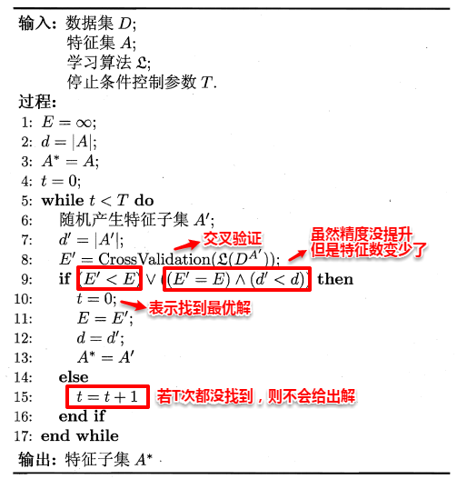

# 05.17-05.23 回顾

# 1. 特征工程

- 数据和特征决定了机器学习算法的上限。更多的数据胜于更好的算法，更好的数据胜于更多的数据。
- 特征工程就是将原始数据空间，变换到新的特征空间。
- 特征工程和模型二者此消彼长，复杂的模型一定程度上减少了特征工程需要做的工作。
- 特征工程的第一步时理解业务数据和业务逻辑。特征提取可以看作是用特征描述业务逻辑的过程。
- 对于陌生的数据，可以采用探索性数据分析（EDA）了解数据。EDA的目的是尽可能得洞察数据，发现数据内部的结构，提取重要特征，检测异常值，检验基本假设，建立初步的模型。EDA技术通常可以分为两类：
  - 可视化技术：各种图。
  - 定量技术：样本均值、方差、分位数、峰度、偏度等

## 1.1 特征表达

### 1.1.1 数值特征

- 数值特征包括**离散型**和**连续型**特征。给出8种常见的数值特征的处理方法：
  1. **截断**：保留重要信息的前提下，去掉过多的精度。截断后可以看作类别特征。
  2. **二值化**：标识是否存在。
  3. **分桶**：均匀分桶、幂（对数）分桶、分位数分桶、使用模型寻找最优分桶
  4. **缩放**：标准化缩放（Z缩放）、最大最小值缩放及最大绝大值缩放、基于范数的缩放、平方根缩放或者对数缩放。
  5. **缺失值处理**：补一个值（均值或中位数）、直接忽略（对于可以处理缺失值的模型）
  6. **特征交叉**：对两个特征进行加、减、乘、除等操作。（FM和FFM模型可以自动进行特征交叉组合）
  7. **非线性编码**：如采用多项式核、高斯核等。或者将随机森林的叶节点进行编码喂给线性模型
  8. **行统计值**：统计行向量中的空值个数、正值或负值个数、均值、方差、、等。

- 为了防止异常点造成的影响，增强健壮性，有时候会使用中位数代替均值，使用分位数代替方差。

### 1.1.2 类别特征

- 常见的类别特征处理方法：
  1. **自然数编码**：使用较少
  2. **独热编码**：one-hot 
  3. **分层编码**：对于邮编、身份证号码等类别特征，可以取不同位数进行分层。一般需要专业领域知识。
  4. **散列编码**：当独热编码非常稀疏时，可以先进行散列编码。重复多次选取不同的散列函数，利用融合来提升模型效果。自然数编码和分层编码时散列编码的特例。
  5. **计数编码**：类别特征用其对应的计数来代替（异常值敏感）
  6. **计数排名编码**：类别特征用其对应的计数排名代替（异常值不敏感）
  7. **目标编码**：对于高基数类别特征（如城市名、街道等），独热编码太稀疏，使用基于目标变量对类别特征进行编码。（没太懂怎么操作）
  8. **类别特征交叉组合**：两个特征的笛卡尔积、多个特征的组合、基于统计的组合。
  9. **类别特征和数值特征交叉组合**：


- **标签编码：LabelEncoder or OrdinalEncoder**  

  - sklearn中的用法：[`LabelEncoder`](https://scikit-learn.org/stable/modules/generated/sklearn.preprocessing.LabelEncoder.html#sklearn.preprocessing.LabelEncoder) is a utility class to help normalize labels such that they contain only values between 0 and n_classes-1.   [`OrdinalEncoder`](https://scikit-learn.org/stable/modules/generated/sklearn.preprocessing.OrdinalEncoder.html#sklearn.preprocessing.OrdinalEncoder)  convert categorical features to integer codes. 

  - 🌰

    ```python
    from sklearn import preprocessing
    le = preprocessing.LabelEncoder()
    le.fit(["paris", "paris", "tokyo", "amsterdam"])
    
    list(le.classes_)                                 # ['amsterdam', 'paris', 'tokyo']
    le.transform(["tokyo", "tokyo", "paris"])         # array([2, 2, 1])
    list(le.inverse_transform([2, 2, 1]))             # ['tokyo', 'tokyo', 'paris']
    ```

    ```python
    enc = preprocessing.OrdinalEncoder()
    X = [['male', 'from US', 'uses Safari'], ['female', 'from Europe', 'uses Firefox'],['female', 'from Aisa', 'uses Firefox']]
    enc.fit(X)
    
    enc.transform([['female', 'from US', 'uses Safari']]) 
    array([[0., 2., 1.]])
    ```

  -  `OrdinalEncoder` is for converting features, while `LabelEncoder` is for converting target variable.  (`OrdinalEncoder` for 2D data; shape `(n_samples, n_features)`, `LabelEncoder` is for 1D data: for shape `(n_samples,)`)        

  - 有序的非数值离散特征才会用到标签编码

- **独热编码：LabelBinarizer or OneHotEncoder**   

  - 可以用sklearn的onehotencoder，pandas的get_dummies或者自己用字典映射

  - 🌰 

    ```python
    from sklearn import preprocessing
    lb = preprocessing.LabelBinarizer()
    lb.fit([1, 2, 6, 4, 2])
    
    lb.classes_                  # array([1, 2, 4, 6])
    lb.transform([1, 6])         # array([[1, 0, 0, 0],
           						 # 		  [0, 0, 0, 1]])
    ```

    ```python
    from sklearn import preprocessing
    enc = preprocessing.OneHotEncoder()
    X = [['male', 'from US', 'uses Safari'], ['female', 'from Europe', 'uses Firefox']]
    enc.fit(X)
    
    enc.transform([['female', 'from US', 'uses Safari'],
                   ['male', 'from Europe', 'uses Safari']]).toarray()
    # array([[1., 0., 0., 1., 0., 1.],
    #        [0., 1., 1., 0., 0., 1.]])
    ```

  - 和上面类似，`LabelBinarizer` 是对 label 进行转换，而 `OneHotEncoder`  是对 feature 进行转换。
  - mutli-hot 类型可以用  [`MultiLabelBinarizer`](https://scikit-learn.org/stable/modules/generated/sklearn.preprocessing.MultiLabelBinarizer.html#sklearn.preprocessing.MultiLabelBinarizer) 。

- **计数编码** 

  - 每一个类别特征的类别对标签进行sum求和，得到每个类别中样本标签为1的总数。

  - 代码一行搞定

    ```python
    df.groupby("category")["feature"].sum()
    ```

  - 据说这个编码在竞赛中很好用？

- **直方图编码**  

  - 针对 **类别型特征** 和 **类别型标签** 的一种编码方法。统计特征的不同值，在 label 下的均值。举个🌰，设有特征 $f = [A，A，B，B，B，C，C]$ ，对应的 label 为 $[0,1,0,1,1,0,0]$ ，则，$A,B,C$ 的直方图编码，分别为：$[0.5, 0.5],[0.33, 0.67],[1, 0]$  

    ```python
    df = pd.DataFrame({"a":["A","A","B","B","B","C","C"],"b":[0,1,0,1,1,0,0]})
    df["l0"] = df["b"].apply(lambda x: 1 if x==0 else 1)
    df["l1"] = df["b"].apply(lambda x: 1 if x==1 else 0)
    df.groupby("a")[["l0","l1"]].mean()
    
    #  	  l0        l1
    # a
    # A  0.500000  0.500000
    # B  0.333333  0.666667
    # C  1.000000  0.000000
    
    ```

  - 直方图编码的问题：
    1. 当不同特征出现的频率差别很大时，计算出来的结果根本不能算是明显的统计特征，而很可能是一种噪音。例如，设有特征 $f = [A，A，A，A，A，A，B]$ ，对应的 label 为 $[0,0,0,1,1,1,0]$ ，则，$A,B$ 的直方图编码，分别为：$[0.5, 0.5],[1, 0]$  ，这显然是不合理的。
    2. 当训练集和测试集数据分布差异较大时，有较明显的过拟合现象。

- **目标编码：TargetEncoder**  

  - 分类问题：对于C分类问题，目标编码（target encode）后只需要增加C−1个属性列。为了解决直方图编码的第一个问题，加入了先验概率。具体计算公式如下：
    $$
    f\left(y_{j}, x_{i}\right)=\lambda\left(n_{i}\right) P\left(y=y_{j} \mid x=x_{i}\right)+\left(1-\lambda\left(n_{i}\right)\right) P\left(y=y_{j}\right)
    $$
    其中，$j\in [0,C)$ ，$n_i$ 是训练集中 $x_i$ 的样本个数，$\lambda(n_i)\in [0,1]$ ，用于平衡先验和后验之间的比重，一种计算方式如下：  
    $$
    \lambda (n)=\frac{1}{1+e^{-(n-k) / f}}
    $$
    其中，k 和 f 是 min_sample_leaf 和 smoothing 参数，在 category_encoders 的 TargetEncoder 中，默认值 min_samples_leaf = 1，smoothing = 1.0 

    ```python
    from category_encoders import TargetEncoder
    df = pd.DataFrame({"feat":["A","A","B","B","B","C","C"],"label":[0,1,0,1,1,0,0]})
    encoder = TargetEncoder()
    encoder.fit_transform(df["feat"],df["label"])
    
    #        feat
    # 0  0.480790
    # 1  0.480790
    # 2  0.638285
    # 3  0.638285
    # 4  0.638285
    # 5  0.115261
    # 6  0.115261
    ```

  - 回归问题：需要把概率换成均值
    $$
    f(y,x_i) = \lambda(n_i) \frac{\sum_{x=x_i}y}{n_i} + (1-\lambda(n_i))\frac{\sum y}{N}
    $$

    ```python
    from category_encoders import TargetEncoder
    df = pd.DataFrame({"feat":["A","A","B","B","B","C","C"],"label":[1,2,3,4,5,6,7]})
    encoder = TargetEncoder()
    encoder.fit_transform(df["feat"],df["label"])
    #        feat
    # 0  2.172354
    # 1  2.172354
    # 2  4.000000
    # 3  4.000000
    # 4  4.000000
    # 5  5.827646
    # 6  5.827646
    ```

  - 实现过程

    ```python
    def fit_target_encoding(self, X, y):
        mapping = {}
    
        for switch in self.ordinal_encoder.category_mapping:
            col = switch.get('col')
            values = switch.get('mapping')
    
            prior = self._mean = y.mean()
    
            stats = y.groupby(X[col]).agg(['count', 'mean'])
    
            smoove = 1 / (1 + np.exp(-(stats['count'] - self.min_samples_leaf) / self.smoothing))
            smoothing = prior * (1 - smoove) + stats['mean'] * smoove
            smoothing[stats['count'] == 1] = prior  
            # 注意上面的 stats, smoove, smoothing 都是 pd.DataFrame
    
            if self.handle_unknown == 'return_nan':
                smoothing.loc[-1] = np.nan
            elif self.handle_unknown == 'value':
                smoothing.loc[-1] = prior
    
            if self.handle_missing == 'return_nan':
                smoothing.loc[values.loc[np.nan]] = np.nan
            elif self.handle_missing == 'value':
                smoothing.loc[-2] = prior
    
            mapping[col] = smoothing
    
        return mapping
    
    ```

    可以看到，分类问题和回归问题，都是针对 label 求均值（概率也是通过均值求得到），因此可以有统一的形式。

  - 上述方法解决了直方图编码的第一个问题，对于第二个问题，还需要使用交叉验证的方法，避免过拟合。一般而言，对于分类问题，使用 `StratifiedKFold` 进行分层抽样交叉，对于回归问题，使用 `KFold` 进行普通抽样交叉。网上的一个实现如下。

    [mean_encoding.py](./src/mean_encoding.py) 

  - 参考资料：

    特征编码方法总结—part1 https://zhuanlan.zhihu.com/p/67475635

    平均数编码：针对高基数定性特征（类别特征）的数据预处理/特征工程 https://zhuanlan.zhihu.com/p/26308272

- **贝叶斯目标编码** 
  
  - 略，以后再补充 


### 1.1.3 时间特征

- 时间特征的处理方式：
  1. **当作类别特征处理** 
  2. **转化为若干类别特征**：计算年、月、日、时、分、秒、星期、是否月初、是否月末、是否工作日、是否营业时间等。
  3. **转化为数值特征**：用连续的时间差值法，即计算出所有样本的时间到某一个未来时间之间的数值差距，这样这个差距是UTC的时间差，从而将时间特征转化为连续值
  4. **时间序列处理**：对于类似股票价格、天气温度等数据，使用滞后特征（lag特征）。使用滑动窗口统计特征。

### 1.1.4 空间特征

- 空间特征处理方式：
  1. **当成数值特征**：经纬度
  2. **当成类别特征**：对经纬度进行散列，对空间区域进行分块。获取对应的行政区特征、城市特征、街道特征等类别特征

### 1.1.5 文本特征

- 文本特征构建流程：
  - 语料构建：构建词表、文档 x 词表矩阵
  - 文本清洗：去除特殊字符、去除停用词、大小写转换、去除空格、标点编码
  - 分词：词性特征、词根还原、文本统计特征（文本长度、数字个数、大小写单词个数、数字占比等）、n-gram特征
  - 词向量：词集特征、词袋特征、TFIDF、word2vec
  - 计算相似度：余弦相似度、Jaccard相似度、编辑距离、隐语义分析


## 1.2 特征选择

- 特征选择的前提是：训练数据中包含冗余或者无用的特征，移除这些特征不会导致信息的丢失。
- **特征选择**和**降维**是处理高维数据的两大主流技术。

### 1.2.1 过滤方法

- 包括单变量过滤和多变量过滤

- 常见的过滤方法：

  1. **覆盖率**

  2. **皮尔森相关系数** : 相关系数并不一定合理，

  3. **Fisher得分**

  4. **方差**：

     - 方差越大的特征，越有用。如果方差较小，比如小于1，这个特征可能对算法作用没有那么大。最极端的，如果某个特征方差为0，即所有的样本该特征的取值都是一样的

     - sklearn中的VarianceThreshold类

  5. **假设检验**：

     - 在sklearn中，可以使用chi2这个类来做卡方检验， [卡方检验原理及应用](https://segmentfault.com/a/1190000003719712) 
     - 在sklearn中，有F检验的函数f_classif和f_regression。

  6. **互信息**

     - sklearn中，可以使用mutual_info_classif(分类)和mutual_info_regression(回归)来计算各个输入特征和输出值之间的互信息。

  7. **最小冗余最大相关性 ** （Minimum Redundancy Maximum Relevance，mRMR）

  8. **相关特征选择** （Correlation Feature Selection，CFS）

  9. **Relief**（Relevant Feature）
     $$
     \delta^j=\sum_i-\text{diff}(x_i^j,x^j_{i,nh})^2+\text{diff}(x_i^j,x^j_{i,nm})^2
     $$
     其中，$x^j_{i,nh}$ 是“猜中近邻”（near hit），$x^j_{i,nm}$ 是“猜错近邻”（near miss）。该统计量越大，该特征的分类能力越强。此算法是针对二分类设计的，可以推广到多分类。

### 1.2.2 封装方法

- 直接使用机器学习算法评估特征子集的效果，直接看哪些特征的组合使得算法性能最好。
- 目标：从初始特征集合中，选取一个包含了所有重要信息的重要子集。穷举所有可能性复杂度太高（$O(2^n)$），采用选取**候选子集**的办法。候选子集可以使用**前向**和**后向**算法进行产生（贪心算法）。
  - **前向搜索**：从一个特征开始，先找出最优的单个特征，每次添加一个其他特征，使得当前个数的子集最优，直至k+1的子集不如k的子集。
  - **后向搜索**：从完整特征集合开始，每次去掉一个最无关的特征。
  - **双向搜索** 
- 为了选出最优的子集，需要进行**子集评价**。比如使用信息熵等。（前向搜索+信息熵，与决策树算法非常近似。）

- 常见的封装方法

  1. Las Vegas Wrapper（LVW）

     - 一种随机搜索方法

     - 缺点：当特征数很大时，可能很难达到停止条件

     - 算法过程如下：

       

       

  2. **递归消除特征法**(recursive feature elimination，RFE)
     - 一种后向搜索方法，以经典的SVM-RFE算法为例，当求出SVM的判别超平面之后，找到权重的平方最小的index $i= \arg\max_i w_i^2$ ，然后将其删除。循环迭代。
     - 在sklearn中，可以使用RFE函数来选择特征。

- 和过滤方法相比，封装方法效果更好，但计算开销更大。

### 1.2.3 嵌入方法

- 利用L1正则做特征选择，最典型的例子：LASSO

- LASSO的求解：Coordinate descent

  - 每次只对一个参数进行迭代求解

  - 具体推导及实现：
    $$
    \begin{align}
    L &= \sum_{i=1}^n (\sum_{j=1}^d w_jx_{ij} +b-y_i) + \lambda\sum_{j=1}^d |w_j| \\
    \frac{\part L}{\part w_l}&=2\sum_{i=1}^n(\sum_{j=1}^dw_jx_{ij}+b+y_i)\cdot x_{il}+\lambda\frac{\part |w_l|}{\part w_l}  \\
    &=2\sum_{i=1}^n(\sum_{j\ne l}w_jx_{i,j}+b+y_i )\cdot x_{il}+2w_l\sum _{i=1}^nx_{il}^2+\lambda\frac{\part |w_l|}{\part w_l}\\
    &= C_l+w_la_l+\lambda\frac{\part |w_l|}{\part w_l}
    \end{align}
    $$
    其中，
    $$
    \begin{align}
    C_l &=2\sum_{i=1}^n(\sum_{j\ne l}w_jx_{i,j}+b+y_i )\cdot x_{il} \\
    a_l&=2\sum _{i=1}^nx_{il}^2
    \end{align}
    $$
    则有
    $$
    \frac{\part L}{\part w_l}=\cases {C_l+w_la_l+\lambda&  $w_l>0$\\
    \left[C_l-\lambda, C_l+\lambda\right]& $w_l=0$\\
    C_l+w_la_l+\lambda & $w_l<0$}
    $$
    对于参数 $w_l$  
    $$
    \hat w_l=\cases{\frac{-C_l-\lambda}{a_l} & if $\ \ C_l<-\lambda$ \\
    0 &if $ -\lambda\le C_l\le \lambda $\\
    \frac{\lambda-C_l}{a_l}& if $\ \ C_l>\lambda$
    }
    $$

  - 参考链接

    - https://xavierbourretsicotte.github.io/lasso_derivation.html 
    - https://xavierbourretsicotte.github.io/lasso_implementation.html 

- 其他求解方法：

  -  最小角回归法(Least Angle Regression， LARS)

## 1.3 特征选择的工具

- sklearn的feature_selection
- spark MLlib
- xgboost中，xgbfi提供了多种指标对特征及特征组合的排序

## 1.4 参考资料

- 周志华《机器学习》第11章 特征选择与稀疏学习
- 《美团机器学习实践》第2章 特征工程
- 刘建平Pinard的博客 [特征工程之特征选择](https://www.cnblogs.com/pinard/p/9032759.html)， [特征工程之特征表达](https://www.cnblogs.com/pinard/p/9061549.html)，[特征工程之特征预处理](https://www.cnblogs.com/pinard/p/9093890.html) ，[Lasso回归算法： 坐标轴下降法与最小角回归法小结](https://www.cnblogs.com/pinard/p/6018889.html) 
- [特征选择，经典三刀](https://mp.weixin.qq.com/s/1dF9Dot7eyiVKFcvL06QoA) 

# 2. 超参选择和正则

## 2.1 超参选择

- 交叉验证和grid search

  ```python
  import pandas as pd
  from sklearn.linear_model import LogisticRegression
  from sklearn.model_selection import train_test_split
  from sklearn.feature_extraction.text import TfidfVectorizer
  from sklearn.model_selection import GridSearchCV
  
  data = pd.read_csv("xx.csv")
  
  sents = data[1].values.tolist()
  labels = data[0].values.tolist()
  
  X_train, X_test, y_train, y_test = train_test_split(sents, labels, test_size=0.2, random_state=42)
  
  vectorizer = TfidfVectorizer()
  X_train = vectorizer.fit_transform(X_train)
  X_test = vectorizer.transform(X_test)
  
  parameters = {"C":[0.0001, 0.001, 0.01, 0.1, 0.5, 1, 2, 5]}
  lr = LogisticRegression()
  lr.fit(X_train, y_train).score(X_test, y_test)
  
  clf = GridSearchCV(lr, parameters, cv=5)
  clf.fit(X_train, y_train)
  clf.score(X_test, y_test)
  print(clf.best_params_)
  ```

- 其他的参数搜索方法：

  - 随机搜索
  - 遗传算法
  - 贝叶斯优化

## 2.2 正则的灵活使用

- L2正则是的参数绝对值很小，L1正则产生稀疏的参数。还有一些别的参数限制，也可以通过正则进行实现。

  - 对于特征分为多组的情况，每一组中要产生稀疏的参数，可以对每一个组分别使用L1正则

  - 如果相邻的特征之间的变化比较缓慢，可以加一个相邻元素之间的正则。可以应用于随时间变化的推荐系统（Time-Aware Recommendation）中，用户的偏好可能会随时间变化，但是变化不会非常剧烈，因此可以加一个类似下式的正则：
    $$
    \sum_{t=2}^T\sum_{i=1}^n||u_i^{(t)}-u_i^{(t-1)}||_2^2
    $$
    

## 2.3 MLE和MAP

- MLE：Maximum Likelihood Estimation ，最大似然估计
  $$
  \begin{align}
  \hat \theta&=\arg\max P(X|\theta)\\
  &=\arg\max \sum_i \log P(x_i|\theta)
  \end{align}
  $$
  其中，$X$ 是数据集。

- MAP：Maximum A Posteriori ，最大后验估计
  $$
  \begin{align}
  \hat \theta&=\arg\max P(\theta|X)\\
  &=\arg\max P(X|\theta)P(\theta) \\
  &=\arg\max \sum_i \log P(x_i|\theta)+\log P(\theta)
  \end{align}
  $$
  其中， $P(\theta)$ 是先验概率。

- 当 $\theta$ 满足高斯分布时， $P(\theta)$ 等价于L2正则
  $$
  \theta \sim   N(0,\sigma^2)\\ 
   P(\theta)=\frac1{\sqrt{2\pi}\sigma}\exp(-\frac{\theta^2}{2\sigma^2})
  $$
  
- 当 $\theta$ 满足拉普拉斯分布时， $P(\theta)$ 等价于L1正则 
  $$
  \theta \sim  Laplace(0,b)\\ 
   P(\theta)=\frac1{2b}\exp(-\frac{|\theta|}{b})
  $$

- 当数据足够多时，MLE和MAP的解趋于相同。

# 3. 凸优化

- 优化问题的分类
  1. smooth v.s. non-smooth 
     - 平滑函数可以使用SGD，非平滑函数（如Lasso）要使用特别的方法
  2. convex v.s. non-convex
     - logistic是凸函数，神经网络是非凸函数。对于非凸函数，初始化显得更重要，that why we need pretraining。
  3. discrete v.s. continous 
  4. contrained v.s. non-contrained 
- 根据优化问题的不同分类可以选择不同的优化算法
  - Least-squares problem
  - Linear programming
  - Quadratic programming
  - Interger Programming
  - Geometric programming
  - ...

## 3.1 凸优化基础概念

- 凸集：假设对于任意 $x,y\in C$ ，并且任意参数 $\alpha \in [0,1]$ ，有 $\alpha x+(1-\alpha)y \in C$ ，则集合 $C$ 为凸集。

- 常见的凸集：

  - 所有的 $R^n$ 
  - 所有的正数集合 $R_+^n$ 
  - 范数 $||x||<1$ 
  - 线性方程组 $Ax=b$ 的解空间
  - 不等式的所有解 $Ax<b$ 
  - 两个凸集的交集也是凸集

- 凸函数：函数的**定义域是凸集**，并且对于定义域内的任意 $x,y$ ，函数满足
  $$
  f(\theta x+(1-\theta)y)\le \theta f(x)+(1-\theta)f(y) 
  $$
  其中$\theta\in [0,1]$ 

- 常见的凸函数：

  - 线性函数为凸/凹函数
  - $\exp x, -\log x, x\log x$ 是凸函数
  - 范数是凸函数
  - $\frac {x^Tx}{t}$ 为凸函数（$x>0$） 

- 凸函数的判断方法：

  1. 定义法

  2. 一阶判断法

     假设 $f:R^n\rightarrow R$ 是可导的，则 $f$ 是凸函数，当且仅当
     $$
     f(y)\ge f(x)+ \nabla(x)^T(y-x)
     $$

  3. 二阶判断法

     假设 $f:R^n\rightarrow R$ 是二阶可导的，则 $f$ 是凸函数，当且仅当
     $$
     \nabla^2f(x)\ge0
     $$

  4. 根据凸函数的性质

     - 如果 ${f}$ 和 ${g}$ 是凸函数，那么${m(x)=\max\{f(x),g(x)\}}$ 和 $h(x)=f(x)+g(x)$ 也是凸函数。
     - 如果 $f$ 和 $g$ 是凸函数，且 $g$ 递增，那么 $h(x)=g(f(x))$ 是凸函数。
     - 凸性在仿射映射下不变：也就是说，如果 $f(x)$ 是凸函数（${ x\in \mathbb {R} ^{n}}$），那么 $g(y)=f(Ay+b)$ 也是凸函数，其中 $A\in \mathbb {R} ^{n\times m},\;b\in \mathbb {R} ^{m}$.
     - 如果 $f(x,y)$ 在 $(x,y)$ 内是凸函数，且 $C$ 是一个凸的非空集，那么 $g(x)=\inf _{y\in C}f(x,y)$  在 $x$ 内是凸函数，只要对于某个 $x$ ，有 $g(x)>-\infty$ 。

- 凸优化的标准形式
  $$
  \begin{align}
  &\text{minimize}_x &f(x) &\\
  &\text{subject to} &g_i(x)\le0\\
  & & h_j(x)=0
  \end{align}
  $$

## 3.2 优化举例

- 股票组合优化（portfolio optimization） 

  假设有m支股票，每只股票的服从分布 $S_i\sim N(r_i,\sigma_i^2)$ ，选择一个股票组合，使得收益最高，风险最小。则，所有股票的组合符合分布 
  $$
  \sum_{i=1}^mw_iS_i\sim N(\sum_{i=1}^m w_ir_i,\sum_j\sum_{j\ne i}w_iw_j\sigma_{ij}   )
  $$
  其中，$\sigma_{ij}$ 是协方差矩阵的元素。则问题可以转化为优化问题：
  $$
  minimize -\sum_{i=1}^m w_ir_i +\sum_j\sum_{ i}w_iw_j\sigma_{ij} \\
  s.t. \ \ \ 
   w_i\ge 0 \\
   \ \ \  \  \ \ \ \ \ \ \sum_iw_i=1
  $$

- maximum flow problem （线性规划，linear programming）

- set cover problem

## 3.3 梯度下降法的收敛性

- L-Lipschitz条件以及定理

  - 一个光滑函数 $f$ 满足L-Lipschitz条件，则对于任意 $x,y \in R^d$ ，有：

  $$
  ||\nabla f(x)-\nabla f(y) ||\le L||x-y||
  $$

  - 一个函数 $f$ 满足L-Lipschitz条件，并且是凸函数，则对于任意 $x,y \in R^d$ ，有：
    $$
    f(y)\le f(x)+\nabla f(x)(y-x) +\frac L2||y-x||^2
    $$

- 假设函数满足L-Lipschitz条件，并且是凸函数，设定 $x^*=\arg\min f(x)$，则对于步长 $\eta_t\le\frac1L$， 满足
  $$
  f(x_k)\le f(x^*)+\frac{||x_0-x^*||^2_2}{2\eta_tk}
  $$
  当我们迭代 $k=\frac{L||x_0-x^*||^2_2}{\epsilon}$ 次之后，可以保证得到 $\epsilon$ - approximation optimal value 

# 4. SVM

## 4.1 线性分类器的导出

- 对于数据 $D=\{x_i, y_i\}$ ，$y_i\in \{1,-1\}$  有线性分类器：$w^Tx+b=0$ 有
  $$
  y_i=\cases{1, & $w^Tx_i+b\ge0$ \\ 
  -1, & $w^Tx_i+b<0$} 
  $$
  上式等价于
  $$
  (w^Tx_i+b)\cdot y_i\ge 0
  $$
对于线性可分的数据，设正类的支持向量为 $x_+$ ，负类对应的支持向量为 $x_-$ ，则有
  $$
  w^Tx_++b=1\\
  w^Tx_-+b=-1\\
  x_+=x_-+\lambda w
  $$
  将第3式代入第1式，并利用第2式，有：
  $$
  \lambda=\frac2{w^Tw}
  $$
  正负样本之间的margin可以表示为：
  $$
  margin = |x_+-x_-|=\frac2{||w||}
  $$
  
- SVM的hard-constraint 
  $$
  \min ||w||^2 \\
  s.t.\  (w^Tx_i+b)\cdot y_i\ge 1
  $$
  其中，最小化 $||w||^2$ 等价于最大化margin。

- SVM的soft-constraint
  $$
  \min ||w||^2 +\lambda \sum_{i=1}^n \varepsilon_i\\
  s.t.\ (w^Tx_i+b)\cdot y_i\ge 1-\varepsilon_i,\ \ \text{ where   } \varepsilon_i\ge0
  $$
  其中，$\varepsilon_i$ 是松弛变量（slack variable）

- Hinge loss
  $$
  \min ||w||^2 +\lambda\sum_{i=1}^n\max(0,1-(w^Tx_i+b)\cdot y_i)
  $$

- SGD for Hinge loss

  - $w_0, b_0$ 初始化

  - For $i =1,2,...,n$ :

    - if $1-(w^Tx_i+b)\cdot y_i\le0$  
      $$
      w^* = w -\eta_t\cdot 2w
      $$

    - else
      $$
      w^* = w -\eta_t\cdot( 2w+\lambda\frac{\part (1-(w^Tx_i+b)\cdot y_i)}{\part w}) \\
      b^*=b-\eta_t(\lambda\frac{\part (1-(w^Tx_i+b)\cdot y_i)}{\part b})
      $$

## 4.2 拉格朗日对偶性

- **如何理解拉格朗日乘子法** 

  对于有约束的优化问题：
  $$
  \min_x f(x)\\
  \text{s.t. }g(x)=0
  $$
  转化为无约束的优化问题：
  $$
  \min_x f(x)+\lambda g(x)
  $$
  分别对 $x$ 和 $\lambda$ 求导，并另导数为零，求解，最优值。为什么上述两个问题是等价的。从几何意义上说，极值点处是 $f(x)$ 和 $g(x)$ 相切的地方，也就是说，极值点处，两个的**导数方向是平行**的，即
  $$
  \nabla_xf(x)=\lambda \nabla g(x)
  $$
  上式等价于
  $$
  \nabla_x(f(x)+\lambda g(x))=0
  $$
  同时，极值点还需要满足在 $g(x)$ 上，有 $g(x)=0$ ，恰好是 $f(x)+\lambda g(x)$ 对 $x$ 和 $\lambda$ 的导数等于0的情况。因此，两者是等价的。

  [知乎-如何理解拉格朗日乘子法？](https://www.zhihu.com/question/38586401/answer/457058079) 

- KKT条件

  对于有约束的优化问题：
  $$
  \begin{align}
  \min_x\ & f(x)\\
  \text{s.t. }\ & c_i(x)\le0 ,   &\ i=1,2,\cdots,k\\
  &h_j(x)=0, &\ j=1,2,\cdots,l
  \end{align}
  $$
  引入拉格朗日函数：
  $$
  L(x,\alpha,\beta)=f(x)+\sum_{i=1}^k\alpha_ic_i(x)+\sum_{j=1}^l\beta_jh_j(x)
  $$
  其中，$\alpha_i\ge0$ 。则KKT条件为：
  $$
  \begin{align}
  \nabla_xL(x^*,\alpha^*,\beta^*) =0\\
  a_i^*c_i(x^*)=0\\
  c_i(x^*)\le0\\
  \alpha_i^*\ge0\\
  h_j(x^*)=0
  \end{align}
  $$
  对于等式约束 $h_j(x)$ ，拉格朗日乘子法中已经进行过讨论。

  对于**不等式约束**，先定义可行域 $K=\{x\in\R^n| c_i(x)\le0\}$ ，并假设最优解为 $x^*$ ，有两种情况：

  1. $c_i(x)<0$ ，最优解 $x^*$ 为于  $K$ 内部，称为内部解，此时约束条件是无效的，即 $\alpha_i=0$  。
  2. $c_i(x)=0$ ，最优解 $x^*$ 为于  $K$ 边界，称为边界解，此时约束条件是有效的。

  因此，无论内部解还是边界解 $\alpha_ic_i(x)=0$ 恒成立，称为**互补松弛性**。

  [知乎-Karush-Kuhn-Tucker (KKT)条件](https://zhuanlan.zhihu.com/p/38163970) 

- 拉格朗日对偶性

  公式太多，就不抄了，具体参考《统计学习方法》或者知乎。

  [知乎-拉格朗日对偶性](https://zhuanlan.zhihu.com/p/38182879) 
  
- SVM的KKT条件
  $$
  \min_{w,b} ||w||^2+\sum_{i=1}^n \lambda_i(1-(w^Tx_i+b)\cdot y_i)  \\
  s.t.  \ \ \lambda_i(1-(w^Tx_i+b)\cdot y_i)=0 \\
  1-(w^Tx_i+b)\cdot y_i \le0  \\
  \lambda_i\ge0
  $$

## 4.3 线性不可分SVM

- 线性SVM无法解决线性不可分的问题，面对线性不可分的数据，有两种办法：

  - 改用非线性模型，如神经网络
  - 将数据映射到高维空间，在高维空间学习一个线性分类器（映射之后，算法复杂度会升高--> 核函数）

- 为什么要将原问题转化为对偶问题：

  - 原问题比较难解决
  - 对偶问题有一些比较好的特性，如可以使用kernel trick

- SVM的prime-dual problem
  $$
  L=\frac12 ||w||^2+\sum_{i=1}^n \lambda_i(1-(w^Tx_i+b)\cdot y_i)  \\
  s.t.  \ \ \lambda_i(1-(w^Tx_i+b)\cdot y_i)=0 \\
  1-(w^Tx_i+b)\cdot y_i \le0  \\
  \lambda_i\ge0
  $$
  令 $\frac{\part L}{\part w}=0,\frac{\part L}{\part b}=0$ ，得到：
  $$
  w=\sum_{i=1}^n \lambda_iy_ix_i\\
  \sum_{i=1}^n\lambda_iy_i=0
  $$
  将上两式代入 $L$ 得到：
  $$
  L=-\frac12\sum_{i=1}^n\sum_{j=1}^n\lambda_i\lambda_jy_iy_jx_i^Tx_j+\sum_{i=1}^n\lambda_i
  $$
  上式称为dual-problem。

- 对偶问题的标准形式为：
  $$
  \min_\lambda\frac12\sum_{i=1}^n\sum_{j=1}^n\lambda_i\lambda_jy_iy_jx_i^Tx_j-\sum_{i=1}^n\lambda_i \\
  s.t. \sum_{i=1}^n \lambda_iy_i=0  \\
   \lambda_i\ge0 
  $$

- 原问题和对偶问题，要求接的参数是不同的。

- 核技巧 

  设 $\mathcal X$ 是输入空间，又 $\mathcal H$ 是特征空间，存在一个从 $\mathcal X$ 到 $\mathcal H$ 的映射
  $$
  \phi(x):\mathcal X\rightarrow\mathcal H
  $$
  则对所有的 $x,z\in \mathcal X$ ，函数 $K(x,z)$ 满足条件
  $$
  K(x,z)=\phi(x)\cdot\phi(z)
  $$
  则称 $K(x,z)$ 是核函数， $\phi(x)$ 是映射函数，其中 $\phi(x)\cdot\phi(z)$ 是 $\phi(x)$ 和 $\phi(z)$ 的内积。

- 常见的核函数

  - 线性核
    $$
    K(x,y) =x^Ty
    $$
    
  - 多项式核
  
  $$
  K(x,y)=(x^Ty+1)^d
  $$
  
  - 高斯核
  $$
    K(x,y)=\exp{-\frac{||x-y||^2}{2\sigma^2}}
  $$

# 疑问 

- 一个知乎提问
  1. GBDT中的梯度是什么对什么的梯度？
  2. 给一个有m个样本，n维特征的数据集，如果用LR算法，那么梯度是几维? 
  3. 同样的m $\times$ n数据集，如果用GBDT，那么梯度是几维？m维？n维？m $\times$ n维？或者是与树的深度有关？或者与树的叶子节点的个数有关？

# Plan of next week

- 


