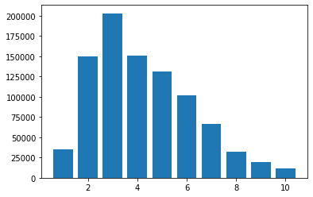
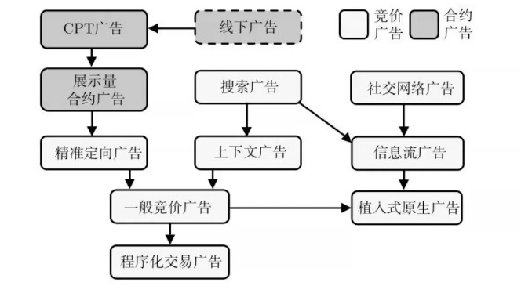
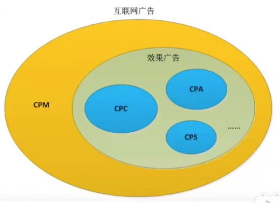
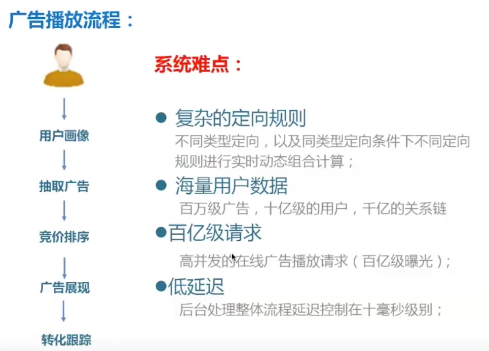
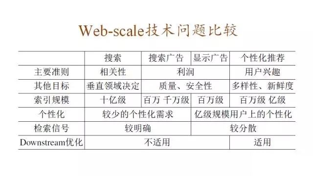
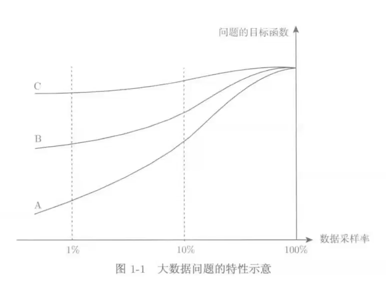

# 05.24-05.30 回顾

# 1. EDA Of Ads Data

## 1.1 train的基本统计

### 1.1.1 ad.csv

- 字段：

  ```python
  ['creative_id', 'ad_id', 'product_id', 'product_category','advertiser_id', 'industry']
  ```

- 数据量

  | 字段             | 空     | 重复数  | 非重复  | 总数    | 备注                                                 |
  | ---------------- | ------ | ------- | ------- | ------- | ---------------------------------------------------- |
  | creative_id      | 0      | 0       | 2481135 | 2481135 |                                                      |
  | ad_id            | 0      | 216945  | 2264190 | 2481135 |                                                      |
  | product_id       | 929524 | 1518339 | 33272   | 2481135 |                                                      |
  | product_category | 0      | 2481117 | 18      | 2481135 | 1-18                                                 |
  | advertiser_id    | 0      | 2429045 | 52090   | 2481135 |                                                      |
  | industry         | 101048 | 2379762 | 325     | 2481135 | 1-335,除去 7, 43, 77, 80, 91, 95, 153, 189, 198, 199 |

  ```python
  creative_id
  空： 0
  重复数： 0
  非重复数： 2481135
  total： 2481135
  
  ad_id
  空： 0
  重复数： 216945
  非重复数： 2264190
  total： 2481135
  
  product_id
  空： 929524
  重复数： 1518339
  非重复数： 33272
  total： 2481135
  
  product_category
  空： 0
  重复数： 2481117
  非重复数： 18
  total： 2481135
  
  advertiser_id
  空： 0
  重复数： 2429045
  非重复数： 52090
  total： 2481135
  
  industry
  空： 101048
  重复数： 2379762
  非重复数： 325
  total： 2481135
  ```

- 重复数据

  - 除creative_id之外，所有数据项都一样。共215185条。表明是同一ad的不同素材。
  - 去除上述数据之后，剩余数据2265950条，还有ad_id重复的数据1760条。查看数据，主要是industry项不同，表明在其他数据项中有矛盾数据？还是说同一条ad_id可以属于不同的industry？（暂时先保留）

- value_counts

  - ad_id：大部分ad_id只有一条数据，少数有2-3条。最多是3条数据。

    ```python
    1    2262448
    2       1724
    3         18
    ```

  - product_id：共有33272个产品，统计每个产品的ad数目：

    ```python
    (0, 10]           26284
    (10, 100]          5428
    (100, 1000]        1360
    (1000, 10000]       184
    (10000, 50000]       16
    ```

    大部分的product的ad数都少于10。再来个细分的：

    ```python
    (0, 1]            12855
    (10, 100]          5428
    (1, 2]             5012
    (5, 10]            3095
    (2, 3]             2518
    (3, 4]             1623
    (100, 1000]        1360
    (4, 5]             1181
    (1000, 10000]       184
    (10000, 50000]       16
    ```

    33272个product中，12855支产品只有一条ad，而ad数最多的product有35804条ads。

  - product_category：不同类型产品的广告数量

    ```python
    2     841625
    18    581223
    3     257650
    5     227970
    8     218994
    17     35634
    13     33222
    4      22917
    12     17720
    6       9290
    7       7611
    16      7216
    9       2859
    11      1327
    15       330
    1        251
    14        95
    10        16
    ```

  - advertiser_id：52090广告主投放广告数量的统计，绝大部分少于10条。

    ```python
    (0, 10]           33993
    (10, 100]         13507
    (100, 1000]        4325
    (1000, 10000]       261
    (10000, 50000]        4
    ```

    更细分的统计

    ```python
    (0, 1]            13550
    (10, 100]         13507
    (1, 2]             6638
    (5, 10]            5568
    (100, 1000]        4325
    (2, 3]             3792
    (3, 4]             2532
    (4, 5]             1913
    (1000, 10000]       261
    (10000, 50000]        4
    ```

  - industry：不同industry中广告数的分布

    ```python
    (100, 1000]         76
    (1000, 10000]       72
    (0, 10]             64
    (10, 100]           63
    (10000, 100000]     46
    (100000, 300000]     4
    ```

### 1.1.2 click_log.csv

- 基础信息

  ```markdown
  RangeIndex: 30082771 entries, 0 to 30082770
  Data columns (total 4 columns):
   #   Column       Dtype
  ---  ------       -----
   0   time         int64
   1   user_id      int64
   2   creative_id  int64
   3   click_times  int64
  dtypes: int64(4)
  memory usage: 918.1 MB
  ```

- 每个用户点击的素材数统计

  ```python
  (10, 100]         816844
  (0, 10]            50058
  (100, 1000]        33088
  (1000, 10000]          9
  (10000, 20000]         1
  ```

- 每天的点击次数

  绝大部分低于10次，最大值50，outlier152次

### 1.1.3 user.csv

```markdown
 #   Column   Non-Null Count   Dtype
---  ------   --------------   -----
 0   user_id  900000 non-null  int64
 1   age      900000 non-null  int64
 2   gender   900000 non-null  int64
dtypes: int64(3)
memory usage: 20.6 MB
```

- 年龄分布

  

- 性别分布

  ```
  1    602610
  2    297390
  ```

# 2. 补充基础知识

## 2.1 广告基础知识

### 2.1.1 基础术语

- 广告的主动参与方：**出资人** （demand）和**媒体** （supply）；被动参与方：**受众** 。

- 广告的目的：

  - **品牌广告**：接触大量用户，宣传品牌形象，提升**中长期**购买率和利润。
  - **效果广告**：**短期**内带来大量的购买或其他转化行为。

- 广告的流程和有效性原理

  - 选择：曝光、关注 
  - 解释：理解、接受 
  - 态度：保持、决策

- 计算广告的技术特点

  - 技术和计算导向
    - 数字媒体的特点使在线广告可以进行精细的受众定向
    - 技术又使得广告决策和交易朝着计算驱动的方向发展

  - 效果的可衡量性
    - 以展示和点击日志的形式直接记录广告效果，并目可以利用这些日志优化广告效果
  - 创意和投放方式的标准化
    - 典型的有视频广告的VAST标准和实时竞价的OpenRTB标准
  - 媒体概念的多样化
    - 举个例子，对在线购物行业而言，门户网站、垂直网站、搜索引擎、电商网站、返利网，
      在转化链条上一个比一个更靠近购买行为

- 计算广告的核心问题

  - 计算广告的核心问题，是为一系列用户与环境的组合找到最合适的广告投放策略以优化整体广告活动的利润。

  - 表达式中的 $a,\ u,\ c$ 三个变量，分别代表广告、用户与环境，即广告活动的三个参与主体，显然，广告展示的收入或成本与这三个因素都有关系。
    $$
    \max \sum_{i=1}^{T}\left(r_{i}-q_{i}\right) \\
    \max _{a_{1}, \ldots, T} \sum_{i=1}^{T}\left\{r\left(a_{i}, u_{i}, c_{i}\right)-q\left(a_{i}, u_{i}, c_{i}\right)\right\} \\
    \operatorname{ROI}=\sum_{i} r_{i} / \sum_{i} q_{i}
    $$
    其中，$r$ 是回报， $q$ 是投入。


- 广告的进化

  

- 商业产品设计原则

  - 设计原则 
  - 用户产品的设计原则总是朝着更简单、更直观、更快捷的方向努力。而相应的产品设计重点也集中在关键功能的突出、操作过程的流畅等方面。 
    - 商业产品一般都有一个明确的商业目标，而商业产品的使用者选用一款产品的动力也是为了优化这个商业目标。

  - 关键点
  - 相对于产品功能，要特别关注产品中的策略部分 
    - 要特别关注数据，让运营和产品优化形成闭环

- **常见的广告付费方式：** 

  - **CPA（Cost Per Action）：**每行动成本，广告投放的实际效果，即按回应的有效问卷或者订单来计费，而不限于广告的投放量。

  - **CPS（Cost Per Sale）：**广告主为避免广告费用的风险，按照广告点击之后产生的实际销售笔数付给广告站点销售提成费用。

  - **CPC（Cost Per Click）：**以每点击广告一次进行收费，加强作弊难度，是网络比较成熟的国家常见的付费方式之一。

  - **CPM（Cost Per Mille）：**千人成本是一种媒体或者媒体排期表送达1000人或者“家庭”的成本计算单位。千人成本并非是广告主衡量媒体的唯一标准，只是为了对不同媒体进行衡量不得已而制定的一种相对指标。

  - **CPT(Cost Per Time)**：按时常计费广告

  - **eCPM（effective Cost Per Mille）：**指的就是每一千次展示可以获得的广告收入，展示的单位可以是网页，广告单元，甚至是单个广告，经常被用来衡量一个网站的盈利能力。

  - 关系图

    

- **广告拍卖机制**

  - 英式拍卖（公开增价拍卖）
  - 荷兰式拍卖（公开减价拍卖）
  - GFP（第一价格密封拍卖）
  - **GSP（第二价格密封拍卖）** 
    - 优点：广告主没必要不断调整降低出价，诚实出价，不关心别人出价，竞价系统稳定

- **广告的竞价排序** （混合竞价）

  - CPM出价：eCPM = CPM

  - CPC出价：eCPM = CPC * pCTR * 1000

  - CPA出价：eCPM = CPA * pCVR * pCTR * 1000

    其中，pCTR是预估点击率，pCVR是预估转化率。举个例子如下：

    |             | 目标     | 出价方式 | 出价 | 点击率/转化率          | eCPM |
    | ----------- | -------- | -------- | ---- | ---------------------- | ---- |
    | 汽车广告主A | 曝光     | CPM      | 40   |                        | 40   |
    | 餐饮广告主B | 点击     | CPC      | 1    | pCTR : 6%              | 60   |
    | 手游广告主C | 下载激活 | CPA      | 10   | pCTR : 10% , pCVR : 5% | 50   |

    则，广告主B胜出，扣费采用广告主C的价格（第二价格），即0.05。

- 广告的流程

  

### 2.1.2 计算广告技术点

- **点击率预估、转化率预估** 
  - 特征
    - 场景：当时场景，如何时何地、何种设备、何种浏览器
    - 广告：广告主特征，广告自身的特征如创意、类型等
    - 媒体：网页、APP等的特征，广告位特征等
    - 用户：用户画像、用户浏览历史等
  - 模型
    - LR、GBDT、MLR、MDL、DNN、DIN、DIEN...
- **自然语言处理** 
  - Query改写
  - Query分析、召回
  - Query Item Embedding
  - 语义相关性
  - 自动标题、自动摘要
- **图像处理** 
  - 图像分类、图像创意、图像生成、图像embedding
- **机制设计** 
  - 智能出价、智能调价
  - oCPM、oCPC
  - 合约广告的pacing
  - 增加学习
- **人群定向** 
  - 人群基础属性定向
  - 人群商业兴趣定向
  - 消费能力定向
  - 相似人群Lookalike
  - Graph embedding（如SDNE）

### 2.1.3 广告和推荐系统的差别

- **广告跟个性化推荐最大的差别在，广告比个性化推荐复杂得多。** 



- 广告和大数据的关系

  - 确定目标函数的数据处理问题

    - C类：采样显著降低数据处理的复杂程度，同时解决问题的效果(即目标函数)没有太大的下降
      
      - 例如：传统数据处理问题，统计报表等
    - A类：不可能通过处理一小部分数据来达到全量数据所能达到的效果，数据采样率的下降，收益会快 速下降
  
    - 大数据问题：推荐、广告
  
    - B类：数据达到一定规模之后，效果提升不明显

      - topic model
    
      

[计算广告学笔记之基础概念](https://www.cnblogs.com/maybe2030/p/4966036.html) 

[【知乎】广告术语CPM、CPT、CPC、CPA术语大全](https://zhuanlan.zhihu.com/p/28745663) 

[【七月在线】计算广告及搜索广告入门](https://www.bilibili.com/video/av80973916/) 


# 3. 使用词向量的方法训练ad embedding

- 将分类问题转化为一个NLP问题

  - 用户在90天内点击了不同的广告，我们可以**将每个广告看作一个单词word**，然后把这些单词连接起来组成一句话：**[creative_id_1,creative_id_2,…,creative_id_n]**。 

  - 由于每个广告有不同属性，如广告主id，并且每个用户点击广告也有不同属性，如点击次数，这样对于每个用户我们就可以得到8种文本。那么剩下的问题就是如何根据这8种文本预测用户的年龄和性别。在NLP中，预测文本的类别有许多模型，比如lstm, gru, transformer等。对于这8种文本，我们将它们看成正常的文本，然后输入到常见的NLP模型中，**在输出端做多分类即可**。


# Plan of next week

- 


