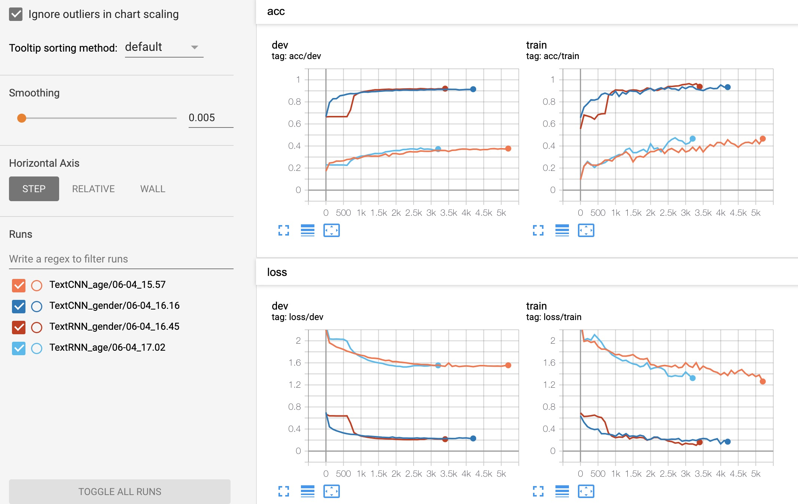
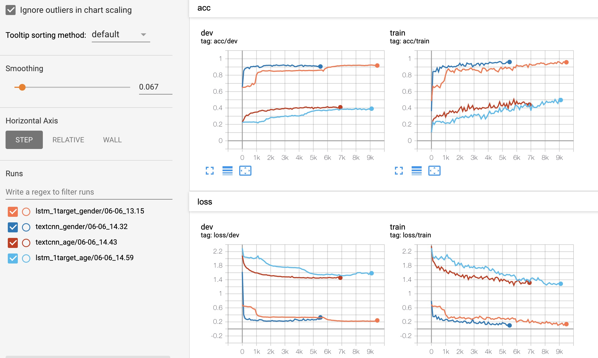

# 05.31-06.06 回顾

# 腾讯广告大赛2020

## 1. baseline

- 只使用了creative_id这一列，用于分类。

| 模型    | 参数 | gender (val) | age (val) | 成绩 | 备注              |
| ------- | ---- | ------------ | --------- | ---- | ----------------- |
| textcnn |      | 91.34%       | 37.14%    | 1.29 | 只用了creative_id |
| textrnn |      | 91.82%       | 36.82%    | 1.29 | 只用了creative_id |

 


- 使用`["creative_id","ad_id","advertiser_id","product_id"]` 四列数据 

| 模型    | 参数 | gender (val) | age (val) | 成绩  | 备注 |
| ------- | ---- | ------------ | --------- | ----- | ---- |
| textcnn |      | 92.48%       | 40.92%    | 1.335 |      |
| textrnn |      | 92.04%       | 38.36%    | 1.306 |      |



```shell
# structure of textcnn
<bound method Module.parameters of Model(
  (embedding): ModuleDict(
    (creative_id): Embedding(939604, 128, padding_idx=939603)
    (ad_id): Embedding(924811, 128, padding_idx=924810)
    (advertiser_id): Embedding(52025, 128, padding_idx=52024)
    (product_id): Embedding(33205, 128, padding_idx=33204)
  )
  (convs): ModuleDict(
    (creative_id): ModuleList(
      (0): Conv2d(1, 256, kernel_size=(2, 128), stride=(1, 1))
      (1): Conv2d(1, 256, kernel_size=(3, 128), stride=(1, 1))
      (2): Conv2d(1, 256, kernel_size=(4, 128), stride=(1, 1))
    )
    (ad_id): ModuleList(
      (0): Conv2d(1, 256, kernel_size=(2, 128), stride=(1, 1))
      (1): Conv2d(1, 256, kernel_size=(3, 128), stride=(1, 1))
      (2): Conv2d(1, 256, kernel_size=(4, 128), stride=(1, 1))
    )
    (advertiser_id): ModuleList(
      (0): Conv2d(1, 256, kernel_size=(2, 128), stride=(1, 1))
      (1): Conv2d(1, 256, kernel_size=(3, 128), stride=(1, 1))
      (2): Conv2d(1, 256, kernel_size=(4, 128), stride=(1, 1))
    )
    (product_id): ModuleList(
      (0): Conv2d(1, 256, kernel_size=(2, 128), stride=(1, 1))
      (1): Conv2d(1, 256, kernel_size=(3, 128), stride=(1, 1))
      (2): Conv2d(1, 256, kernel_size=(4, 128), stride=(1, 1))
    )
  )
  (dropout): ModuleDict(
    (creative_id): Dropout(p=0.5, inplace=False)
    (ad_id): Dropout(p=0.5, inplace=False)
    (advertiser_id): Dropout(p=0.5, inplace=False)
    (product_id): Dropout(p=0.5, inplace=False)
  )
  (fc): Linear(in_features=3072, out_features=10, bias=True)
)>
```

```shell
# structure of lstm 
<bound method Module.parameters of Model(
  (embedding): ModuleDict(
    (creative_id): Embedding(939604, 128, padding_idx=939603)
    (ad_id): Embedding(924811, 128, padding_idx=924810)
    (advertiser_id): Embedding(52025, 128, padding_idx=52024)
    (product_id): Embedding(33205, 128, padding_idx=33204)
  )
  (lstm): ModuleDict(
    (creative_id): LSTM(128, 128, num_layers=2, batch_first=True, dropout=0.5, bidirectional=True)
    (ad_id): LSTM(128, 128, num_layers=2, batch_first=True, dropout=0.5, bidirectional=True)
    (advertiser_id): LSTM(128, 128, num_layers=2, batch_first=True, dropout=0.5, bidirectional=True)
    (product_id): LSTM(128, 128, num_layers=2, batch_first=True, dropout=0.5, bidirectional=True)
  )
  (fc): Linear(in_features=1024, out_features=2, bias=True)
)>
```


# Plan of next week

- 


