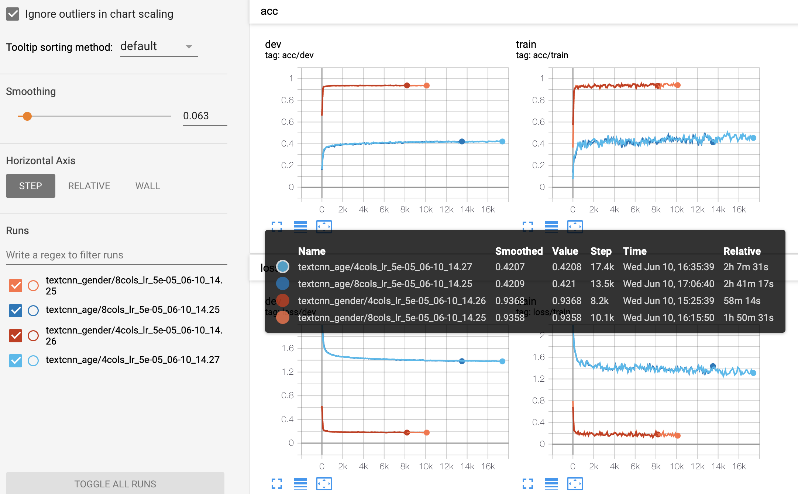
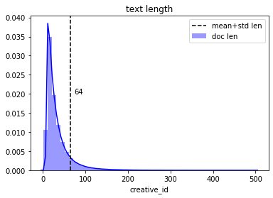

# 06.07-06.13 回顾

# 训练embedding

### word2vec的epoch和loss

lr = 0.025

| data       | feature     | vocab   | total words | epoch | loss         | mean loss |
| ---------- | ----------- | ------- | ----------- | ----- | ------------ | --------- |
| train      | creative_id | 2481135 | 30082771    | 3     | 34913756.0   | 1.16      |
| train      | creative_id | 2481135 | 30082771    | 15    | 69651776.0   | 2.31      |
| train+test | creative_id | 3412772 | 63668283    | 3     | 52672688.0.  | 0.827     |
| train+test | creative_id | 3412772 | 63668283    | 5     | 67822744.0.  | 1.065     |
| train+test | creative_id | 3412772 | 63668283    | 10    | 78523144.0.  | 1.233     |
| train+test | creative_id | 3412772 | 63668283    | 15    | 89925152.0.  | 1.412     |
| train+test | creative_id | 3412772 | 63668283    | 30    | 123048280.0. | 1.932     |
| train+test | creative_id | 3412772 | 63668283    | 50    | 134217728.0. | 2.108     |


lr 0.0001,       epoch 3,        loss 0.8254270654668039
lr 0.0001,       epoch 5,        loss 1.065181544160693
lr 0.0001,       epoch 10,       loss 1.2335154067214282
lr 0.001,        epoch 3,        loss 0.8256979695840078
lr 0.001,        epoch 5,        loss 1.0656044863028582
lr 0.001,        epoch 10,       loss 1.2332751615117372
lr 0.005,        epoch 3,        loss 0.8257717896994332
lr 0.005,        epoch 5,        loss 1.0655269594752539
lr 0.005,        epoch 10,       loss 1.2343370403125211
lr 0.01,         epoch 3,        loss 0.8258415889745291
lr 0.01,         epoch 5,        loss 1.0655313572693643
lr 0.01,         epoch 10,       loss 1.23310377319269
lr 0.025,        epoch 3,        loss 0.8233729186634419
lr 0.025,        epoch 5,        loss 1.0656113971221746
lr 0.025,        epoch 10,       loss 1.2334419007341537

- **疑问**：为何epochs增加，loss会增大？

### 使用固定embedding的方法

- 参数

  ```python
  lr = 0.025  # lr for word2vec
  epoches = 5
  feat = ["creative_id"]
  model = "textcnn"
  ```

  | 模型    | 参数 | gender (val) | age (val) | 成绩 | 备注 |
  | ------- | ---- | ------------ | --------- | ---- | ---- |
  | textcnn |      | 92.98%       | 36.86%    |      |      |

- 使用embedding训练模型

  | 模型    | 特征 | lr       | seq_len | gender (val) | age (val) | 备注                  |
  | ------- | ---- | -------- | ------- | ------------ | --------- | --------------------- |
  | textcnn | 4列  | 5e-5     | 90      | 93.70%       | 42.14%    | epoch 5 embedding     |
  | textcnn | 8列  | 5e-5     | 90      | 93.56%       | 42.12%    | epoch 5 embedding     |
  | textcnn | 4列  | 5e-5 (Y) | 64      |              | 43.18%    | epoch 5 embedding (Y) |
  | textcnn | 4列  | 5e-5     | 64      |              | 41.10%    | epoch 1 embedding     |
  | textcnn | 4列  | 1e-4     | 64      |              | 41.28%    | epoch 1 embedding     |
  | textcnn | 4列  | 5e-3(N)  | 64      |              | 38.42%    | epoch 1 embedding     |
  | lstm    | 4列  | 1e-4 (Y) | 64      |              | 39.54%    | epoch 1 embedding     |
  | lstm    | 4列  | 1e-5 (N) | 64      |              | 37.9%     | epoch 1 embedding     |
  |         |      |          |         |              |           |                       |
  | textcnn | 3列  | 5e-5 (Y) | 64      |              | 41.92%    | epoch 5 embedding     |
  | textcnn | 4列  | 5e-5 (Y) | 64      |              | 42.90%    | epoch 50 embedding    |
  | textcnn | 4列  | 1e-5     | 64      |              | 41.72%    | epoch 50 embedding    |

  

  

   


- 文本的长度统计

  

### 修复文本序列顺序的bug

| 模型    | 特征 | lr       | seq_len | gender (val) | age (val) | 备注                      |
| ------- | ---- | -------- | ------- | ------------ | --------- | ------------------------- |
| textcnn | 4列  | 5e-5 (Y) | 64      |              | 42.70%    | epoch 5 embedding         |
| textcnn | 4列  | 5e-5 (Y) | 64      |              | 43.9%     | embed_win3_dim128_epoch5  |
| textcnn | 4列  | 5e-5 (Y) | 64      | 93.84%       | 43.66%    | embed_win3_dim32__epoch10 |
| textcnn | 4列  | 5e-5 (Y) | 64      | 93.82%       | 43.82%    | embed_win3_dim128_epoch10 |
| textcnn | 4列  | 5e-5 (Y) | 64      | 93.68%       | 44.38%    | embed_win3_dim32_epoch30  |

### 自己训练word2vec

- click log中，共有30082771条数据，大于1次的log有1656228次，占5.5%。（错误）
- 有多次点击同一creative_id的 **用户** ，在train中(900000, 558385)，test中(1000000, 620952)。


### 疑问

- 最终seq序列的顺序以什么为准？

# Plan of next week

- 


