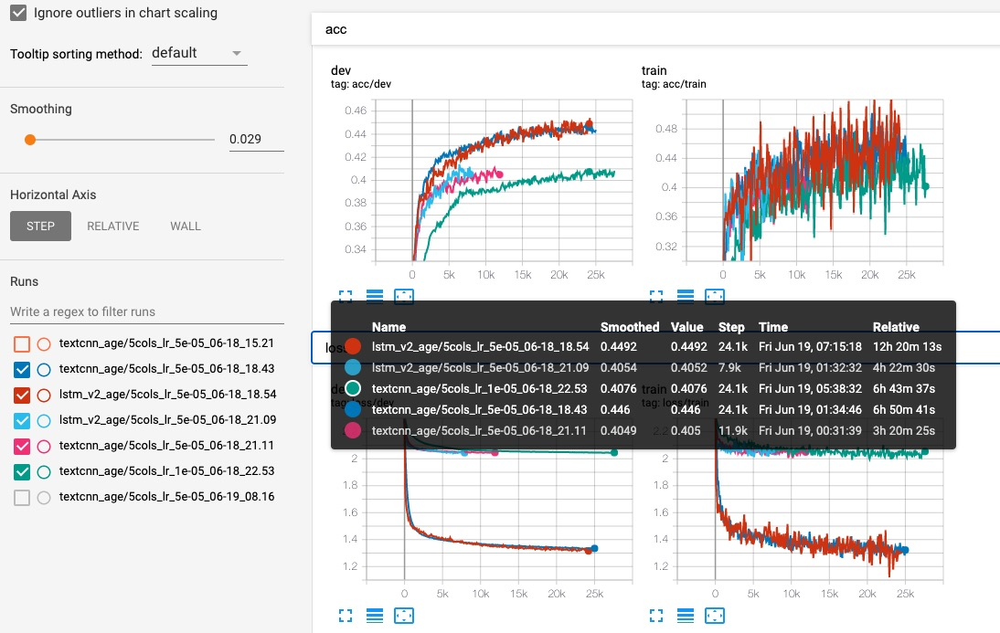

# 06.14-06.20 回顾

### word2vec 预训练的情况

| feature       | batch_size | epoch | ss    | loss                                                         |
| ------------- | ---------- | ----- | ----- | ------------------------------------------------------------ |
| creaticve_id  | 4096       | 10    | False | [2.06, 1.86, 1.81, 1.79, 1.76, 1.72, 1.72, 1.75, 1.71, 1.73(√) ] [2.1, 1.9, 1.81, 1.77, 1.74, 1.75, 1.72, 1.72, 1.72, 1.72 (√)] |
| advertiser_id | 4096       | 10    | False | [2.21, 2.19, 2.19, 2.21, 2.22, 2.17, 2.16(√) , 2.2, 2.19, 2.2] |
| ad_id         | 4096       | 10    | False | [2.1, 1.87 ,1.8, 1.77, 1.77, 1.74, 1.73, 1.74, 1.69(√) ,1.7] |
| product_id    | 4096       | 10    | False | [2.34, 2.32, 2.35, 2.31, 2.32, 2.32, 2.35, 2.31(√), 2.32, 2.31] |
| industry      | 4096       | 10    | False | [2.92, 2.9, 2.92, 2.91, 2.93, 2.87 (√), 2.89, 2.9, 2.88, 2.88] |

### 使用自训练embedding

| model   | embedding                           | features | lr   | gender | age    | notes |
| ------- | ----------------------------------- | -------- | ---- | ------ | ------ | ----- |
| textcnn | embed_win3_dim32_epoc3 ( loss 1.8 ) | 1col     | 5e-5 | 93.06% | 39.48% |       |
| textcnn | embed_win3_dim32_epoc10 (loss 1.73) | 1col     | 5e-5 | 93.14% | 42.48% |       |
| textcnn | embed_win3_dim32_epoc10_batch4096   | 4 cols   | 5e-5 | 93.76% | 45.24% |       |
| lstm_v2 | embed_win3_dim32_epoc10_batch4096   | 4 cols   | 5e-5 | 92.8%  |        |       |

### 群里的建议

- lstm hidden 256
- lstm drop 0.5
- (age 0.47) 看了下是adam的默认值。lr 0.001，beta1 0.9， beta20.999
- 百度的aistudio使用paddle有GPU？v100
- lstm 12层？
- lstm单折应该是能上144的，接着调参试试
- dropout我试了，很敏感
- 单折五折？
- 对padding的部分加了非常大的负值，然后在maxpooling
- 融合：随机100个seed，然后融合
- 数据量大的情况下采用skip-gram效果会好些，本次题目还有个重要参数window，细调可能有意外发现哦。

- w2v 128维 skip gram  window10, maxlen128,  lstm 5输入  144 真的 

### 使用群里的参数

- w2v 128维 skip gram  window10, maxlen128,  lstm 5输入  144 真的 

- 使用的是cbow

  | model   | embedding                  | features | lr   | gender | age    | notes                                 |
  | ------- | -------------------------- | -------- | ---- | ------ | ------ | ------------------------------------- |
  | textcnn | embed_win10_dim128_epoch10 | 5cols    | 5e-5 |        | 44.66% | 15 epoches                            |
  | textcnn | embed_win10_dim128_epoch10 | 5cols    | 5e-5 |        | 40.52% | 7 epoches (加了softmax)               |
  | textcnn | embed_win10_dim128_epoch10 | 5cols    | 1e-5 |        | 40.84% | 16 epoches (加了softmax)              |
  |         |                            |          |      |        |        |                                       |
  | lstm_v2 | embed_win10_dim128_epoch10 | 5cols    | 5e-5 |        | 44.72% | 7 epoches                             |
  | lstm_v2 | embed_win10_dim128_epoch10 | 5cols    | 5e-5 |        | 43.83% | 3 epoches （加了softmax, early stop） |

   

- 使用skip gram

  | model   | embedding                  | features | lr   | gender | age    | notes                       |
  | ------- | -------------------------- | -------- | ---- | ------ | ------ | --------------------------- |
  | textcnn | embed_win10_dim128_epoch10 | 5cols    | 5e-5 |        | 47.2%  | 17 epoches                  |
  | textcnn | embed_win10_dim128_epoch10 | 5cols    | 5e-5 |        | 43.96% | 8 epoches (加了softmax)     |
  |         |                            |          |      |        |        |                             |
  | lstm_v2 | embed_win10_dim128_epoch10 | 5cols    | 5e-5 |        |        |                             |
  | lstm_v2 | embed_win10_dim128_epoch10 | 5cols    | 5e-5 |        |        | （加了softmax, early stop） |

### word2vec 预训练的情况（window=10）

| feature       | batch_size | epoch | ss    | loss                                                         |
| ------------- | ---------- | ----- | ----- | ------------------------------------------------------------ |
| creaticve_id  | 4096       | 10    | False | [1.62, 1.49 ,1.45 ,1.44, 1.44, 1.45, 1.41, 1.42, 1.4]        |
| advertiser_id | 4096       | 10    | False | [1.8, 1.75 ,1.77 ,1.77 ,1.75 (√) ,1.77 ,1.76 ,1.77 ,1.78, 1.76] |
| ad_id         | 4096       | 10    | False |                                                              |
| product_id    | 4096       | 10    | False |                                                              |
| industry      | 4096       | 10    | False | [2.39, 2.37, 2.39 ,2.35 ,2.32 (√) ,2.42 ,2.35 ,2.35 ,2.37 ,2.37] |

### 疑问

- 为什么没有softmax反而感觉效果好一些（收敛快，准确率高）
- 从来没看到过拟合，train和val基本都保持一致。即使是很小的数据集也是如此
- loss刚开始很快，后来下降的很慢。感觉是lr太大？但是降低了lr性能下降，也有类似的问题

### 总结

- 做了的工作
  - 使用最基础的textcnn达到1.29
  - 加入预训练的textcnn达到1.33
  - 借鉴了airbnb的思路，自己训练的embedding，再提升
  - 最后，根据别人的参数，加大了word2vec的window，提升至1.4，还是没能进入复赛。
  - 最终的成绩`gender: 94.18%, age: 45.95% ` 。 
- 不足：
  - 调参不会调
  - 特征工程也不太会
  - 模型集成也不会，还是太菜了。
- 明年再战吧。

# Plan of next week

- 

