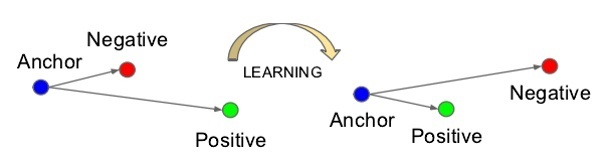
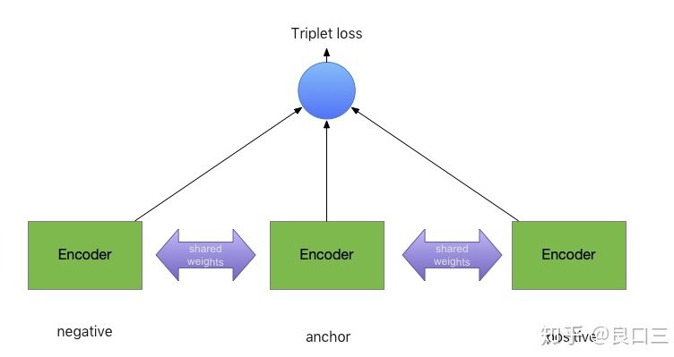

# 06.28-07.04 回顾

## Loss in face recognition  

- 人脸识别的步骤：
  1. 找人脸
  2. 对齐人脸
  3. 识别

### 1. Softmax Loss

- softmax 函数
  $$
  \begin{align}
  \sigma(\mathbf{z})_{j}&=\frac{e^{z_{j}}}{\sum_{k=1}^{K} e^{z_{k}}} \\
  &=\frac{e^{z_{j}-z_{m a v}}}{\sum_{k=1}^{K} e^{z_{k}-z_{\max }}} \text { for } j=1, \ldots, K
  \end{align}
  $$
  将其剪去最大值，是为了避免溢出。

- softmax loss
  $$
  \begin{align}
  Softmax \ Loss&=\sum_{k=1}^{K}-y_{k} \log \left(\sigma_{k}\right) \\
  &=-y_{g t} \log \left(\sigma_{g t}\right)=-\log \left(\sigma_{g t}\right) \\
  &=CrossEntropy \ ( Softmax)
  \end{align}
  $$

### 2. SphereFace

- 从softmax开始：
  $$
  \begin{align}
  L&=-\log \left(\sigma_{g t}\right)=-\log \left(\frac{e^{z_{g t}}}{\sum_{k=1}^{K} e^{z_{k}}}\right) \\
  &=-\log \left(\frac{e^{W_{g t}^{T} x+b_{g t}}}{\sum_{k=1}^{K} e^{w_{k}^{T} x+b_{k}}}\right) \\
  &=-\log \left(\frac{e^{\| W_{g t} \| \|x\| \cos (\theta_{W_{gt}, x})+b_{g t}} }{\sum_{k=1}^{K} e^{\left\|W_{k}\right\|\| x \| \cos \left(\theta_{W_{k}, x}\right)+b_{k}}  }\right)
  \end{align}
  $$
  其中 $\theta_{i, j} \in(0, \pi)$ 代表两个向量 $i, j$ 之间的夹角，如果对 $W_{k}$ 归一化, 将偏置 $b$ 置为0, 即 $\left\|W_{k}\right\|=1$ and $b_{k}=0,$ 则有：
  $$
  L_{m}=-\log \left(\frac{e^{\|x\| \cos \left(\theta_{W t}, x\right)}}{\sum_{k=1}^{K} e^{\|x\| \cos \left(\theta_{W k}, x\right)}}\right)
  $$
  下标 m 表示 modified 。对于 $\theta$ 我们乘上一个大于等于1的整数 $m:$
  $$
  L_{a n g}=-\log \left(\frac{e^{\|x\| \cos \left(m \theta_{W t}\right)}}{\sum_{k=1}^{K} e^{\| x \mid \cos \left(m \theta_{W_{k}, x}\right)}}\right) m \in\{1,2, \ldots\}
  $$
  
  这样不仅放大了类之间的距离，也因放大了同类 $W_{g t}^{T}$ 与 $x$ 之间的间隔而使类内更聚拔。不过上述公式仍有问题：原来的 $\theta_{i, j} \in(0, \pi),$ 如今 $m \theta_{i, j} \in(0, m \pi)$ 超出了向量之间的夹角函数 $\operatorname{cos}$ 定义域范围$(0, \pi)$ 怎么办?那就变个函数，把n个cos怼起来变成一个递减的连续的函数：
  $$
  \psi\left(\theta_{i, j}\right)=(-1)^{n} \cos \left(m \theta_{i, j}\right)-2 n, \theta_{i, j} \in\left[\frac{n \pi}{m}, \frac{(n+1) \pi}{m}\right], n \in[0, m-1]
  $$
  这样一来：
  $$
  L_{a n g}=-\log \left(\frac{e^{\|x\| \psi\left(\theta_{W_{g t}, x}\right)}}{e^{\|x\| \psi\left(\theta_{W_{g t}, x}\right)}+\sum_{k \neq g t} e^{\|x\| \cos \left(\theta_{W_{k}, x}\right)}}\right)
  $$
  
  如此我们就得到了SphereFace的损失函数 A-Softmax

### 3. CosFace

- 和SphereFace类似，CosFace也是从 SoftMax 的余弦表达形式入手，令 $\left\|W_{k}\right\|=1$ and $b_{k}=0$ 。与此同时，作者发现 $\|x\|$ 对于分类并没有舍帮助，所以干脆将其固定 $\|x\|=s,$ 所以有：
  $$
  L_{n s}=\frac{1}{N} \sum_{i}-\log \frac{e^{s \cos \left(\theta_{y_{i}, i}\right)}}{\sum_{j} e^{s \cos \left(\theta_{j, i}\right)}}
  $$
  $n s$ 应该代表归一化的 $\operatorname{SoftMax~}$，接下来与上文 $A-S o f t M a x$ 类似的是也引入了常数 $m,$ 不同的是这里的 $m$ 是加上去的：
  $$
  L_{l m c}=\frac{1}{N} \sum_{i}-\log \frac{e^{s\left(\cos \left(\theta_{y_{i}, i}\right)-m\right)}}{e^{s\left(\cos \left(\theta_{y_{i}, i}\right)-m\right)}+\sum_{j \neq y_{i}} e^{s \cos \left(\theta_{j}, i\right)}}
  $$
  subject to:
  $$
  W=\frac{W^{*}}{\left\|W^{*}\right\|}\\
  x=\frac{x^{*}}{\left\|x^{*}\right\|} \\
  \cos \left(\theta_{j}, i\right)=W_{j}^{T} x_{i}
  $$
  
  以上我们就得到了cosFace中提出的 Large Margin Cosine Loss

### 4. ArcFace

- 和CosFace非常类似，只是将 $m$ 作为角度加上去了，这样就强行拉大了同类之间的角度，使得神经网络更努力地将同类收得更紧。
  $$
  L=-\frac{1}{N} \sum_{i=1}^{N} \log \frac{e^{s\left(\cos \left(\theta_{y_{i}}+m\right)\right)}}{e^{s\left(\cos \left(\theta_{y_{i}}+m\right)\right)}+\sum_{j=1, j \neq y_{i}}^{n} e^{s \cos \theta_{j}}}\\
  =-\frac{1}{N} \sum_{i}\log \frac{e^{s\left(\cos \left(\theta_{y_{i}, i}+m\right)\right)}}{e^{s\left(\cos \left(\theta_{y_{i}, i}+m\right)\right)}+\sum_{j \neq y_{i}} e^{s \cos \left(\theta_{j}, i\right)}}
  $$
  subject to:
  $$
  W=\frac{W^{*}}{\left\|W^{*}\right\|}\\
  x=\frac{x^{*}}{\left\|x^{*}\right\|}\\
  \cos \left(\theta_{j}, i\right)=W_{j}^{T} x_{i}
  $$
  
- 伪代码实现步骤

  1. 对 $x$ 进行归一化
  2. 对 $W$ 进行归一化
  3. 计算 $Wx$ 得到预测向量 $y$
  4. 从 $y$ 中挑出与ground truth对应的值
  5. 计算其反余弦得到角度
  6. 角度加上$m$
  7. 得到挑出从 $y$ 中挑出与ground truth对应的值所在位置的独热码
  8. 将 $\cos (\theta+m)$ 通过独热码放回原来的位置
  9. 对所有值乘上固定值 $s$ 
### 5. metric learning的class-level总结

- 上述几种loss都可以总结为metric learning中的class-level方法，都是在softmax的基础上进行的改进。可以总结为下表：
  $$
  \begin{array}{c|c}
    \hline \text { Loss Functions } & \text { Decision Boundaries } \\
    \hline \text { Softmax } & \left(W_{1}-W_{2}\right) x+b_{1}-b_{2}=0 \\
    \text { W-Norm Softmax } & \|x\|\left(\cos \theta_{1}-\cos \theta_{2}\right)=0 \\
    \text { SphereFace  } & \|x\|\left(\cos m \theta_{1}-\cos \theta_{2}\right)=0 \\
    \text { F-Norm SphereFace } & s\left(\cos m \theta_{1}-\cos \theta_{2}\right)=0 \\
    \text { CosineFace } & s\left(\cos \theta_{1}-m-\cos \theta_{2}\right)=0 \\
    \text { ArcFace } & s\left(\cos \left(\theta_{1}+m\right)-\cos {\theta}_{2}\right) =0 \\
    \hline
    \end{array}
  $$

### 6. metric learning的 pair-level 方法

- 除了上述的方法，还有一种方法就是使用siamese network，分别对不同的图片生成feature vector，然后使用triplet loss进行优化。思路和word2vec比较类似。

- 三元组（Triplet）计算而来的损失（Loss）由Anchor(A)，Negative(N)，Positive(P)组成，基点为A,正匹配为P，负匹配为N。

  

- 损失函数：
  $$
  L(A,P,N)=\max(\|f(A)-f(P) \|^2- \|f(A)-f(N) \|^2 + \alpha,\ 0)
  $$

- P和N都是从样本中构造出来的pair，为了模型能够学到更多的东西，一般要选择更难学习的pair。例如满足以下条件：
  $$
  \|f(A)-f(P) \|^2\approx \|f(A)-f(N) \|^2
  $$
  或者，使用hard triplet，具体而言是选择hard positive和hard negative。
  $$
  \text{Hard positive:  }\  \arg\max _{x_i^p}\| f(x_i^a)-f(x_i^p) \|^2_2 \\
  \text{Hard negative:  }\  \arg\min _{x_i^n}\| f(x_i^a)-f(x_i^n) \|^2_2
  $$
  类比，airbnb那篇文章中，negative sampling的时候，选择一些更难分辨的负样本，从而学到更好的embedding。

- triplet loss 的三塔结构

  

- pseudo-siamese network，伪孪生神经网络，两边可以是不同的神经网络（如一个是lstm，一个是cnn），也可以是相同类型的神经网络。
- 孪生神经网络用于处理两个输入**"比较类似"**的情况。伪孪生神经网络适用于处理两个输入**"有一定差别"**的情况。比如，我们要计算两个句子或者词汇的语义相似度，使用siamese network比较适合；如果验证标题与正文的描述是否一致（标题和正文长度差别很大），或者文字是否描述了一幅图片（一个是图片，一个是文字），就应该使用pseudo-siamese network。 

### 7. circle loss 

- 给定特征空间中的单个样本 $x$，假设与 $x$ 相关的类内相似度分数有 $K$ 个，与 $x$ 相关的类间相似度分数有 $L$ 个，分 别记为 $\left\{s_{p}^{i}\right\}\{i=1,2, \ldots, K\}$ 和 $\{s_{n}^{j}\}\{j=1,2, \ldots, L\}$ 。
  $$
  \begin{aligned}
  \mathcal{L}_{u n i} &=\log \left[1+\sum_{i=1}^{K} \sum_{j=1}^{L} \exp \left(\gamma\left(s_{n}^{j}-s_{p}^{i}+m\right)\right)\right] \\
  &=\log \left[1+\sum_{j=1}^{L} \exp \left(\gamma\left(s_{n}^{j}+m\right)\right) \sum_{i=1}^{K} \exp \left(\gamma\left(-s_{p}^{i}\right)\right)\right]
  \end{aligned}
  $$

- 上式可以转换为class-level的classification loss
  $$
  \begin{aligned}
  \mathcal{L}_{a m} &=\log \left[1+\sum_{j=1}^{N-1} \exp \left(\gamma\left(s_{n}^{j}+m\right)\right) \exp \left(-\gamma s_{p}\right)\right] \\
  &=-\log \frac{\exp \left(\gamma\left(s_{p}-m\right)\right)}{\exp \left(\gamma\left(s_{p}-m\right)\right)+\sum_{j=1}^{N-1} \exp \left(\gamma s_{n}^{j}\right)}
  \end{aligned}
  $$
  其中，$N$ 是类别的数量，$s_{n}^{j}=w_{j}^{\top} x /\left(\left\|w_{j}\right\|\|x\|\right)$ ，$w_j$ 是第 $j$ 个非类别的权重，$s_{p}=w_{y}^{\top} x /\left(\left\|w_{y}\right\|\|x\|\right)$ ，$w_y$ 是类别对应的权重。

- 也可以转化为pair-level的triplet loss
  $$
  \begin{aligned}
  \mathcal{L}_{t r i} &=\lim _{\gamma \rightarrow+\infty} \frac{1}{\gamma} \mathcal{L}_{u n i} \\
  &=\lim _{\gamma \rightarrow+\infty} \frac{1}{\gamma} \log \left[1+\sum_{i=1}^{K} \sum_{j=1}^{L} \exp \left(\gamma\left(s_{n}^{j}-s_{p}^{i}+m\right)\right)\right] \\
  &=\max \left[s_{n}^{j}-s_{p}^{i}+m\right]_{+}
  \end{aligned}
  $$
  其中，$s_{n}^{j}=\left(x_{n}^{j}\right)^{\top} x /\left(\left\|x_{n}^{j}\right\|\|x\|\right)$  ， $s_p^i=\left(x_{p}^{i}\right)^{\top} x /\left(\left\|x_{p}^{i}\right\|\|x\|\right)$  

-  Circle Loss
  $$
  \begin{aligned}
  \mathcal{L}_{\text {circle }} &=\log \left[1+\sum_{i=1}^{K} \sum_{j=1}^{L} \exp \left(\gamma\left(\alpha_{n}^{j} s_{n}^{j}-\alpha_{p}^{i} s_{p}^{i}\right)\right)\right] \\
  &=\log \left[1+\sum_{j=1}^{L} \exp \left(\gamma \alpha_{n}^{j} s_{n}^{j}\right) \sum_{i=1}^{K} \exp \left(-\gamma \alpha_{p}^{i} s_{p}^{i}\right)\right.
  \end{aligned}
  $$
  再定义 $s_p$ 的最优值为 $O_p$，$s_n$ 的最优值为 $O_n$；$O_n < O_p$。当一个相似性得分与最优值偏离较远，Circle Loss 将分配较大的权重，从而对它进行强烈的优化更新。为此，以自定步调（self-paced）的方式给出了如下定义：
  $$
  \left\{\begin{array}{c}
  \alpha_{p}^{i}=\left[O_{p}-s_{p}^{i}\right]_{+} \\
  \alpha_{n}^{j}=\left[s_{n}^{j}-O_{n}\right]_{+}
  \end{array}\right.
  $$

-  Circle Loss类内余量和类间余量 

  - 不同于优化 $(s_n - s_p)$ 的损失函数，在 Circle Loss 中，$s_n$ 和 $s_p$ 是不对称的，本文为其各自定义了余量 $∆_n$ 和 $∆_p$，这样可得到最终带余量的 Circle Loss：
    $$
    \mathcal{L}_{\text {circle}}=\log \left[1+\sum_{j=1}^{L} \exp \left(\gamma \alpha_{n}^{j}\left(s_{n}^{j}-\Delta_{n}\right)\right) \sum_{i=1}^{K} \exp \left(-\gamma \alpha_{p}^{i}\left(s_{p}^{i}-\Delta_{p}\right)\right)\right]
    $$

  - 通过推导决策边界，本文进一步分析 $∆_n$ 和 $∆_p$。为简单起见，这里以二元分类的情况进行说明，其中决策边界是在$a_{n}\left(s_{n}-\Delta_{n}\right)-a_{p}\left(s_{p}-\Delta_{p}\right)=0$ 处得到，再根据以上的两式，可以得到决策边界：
    $$
    \begin{array}{l}
    \left(s_{n}-\frac{O_{n}+\Delta_{n}}{2}\right)^{2}+\left(s_{p}-\frac{O_{p}+\Delta_{p}}{2}\right)^{2}=C \\
    \text{where }\  C=\left(\left(O_{n}-\Delta_{n}\right)^{2}+\left(O_{p}-\Delta_{p}\right)^{2}\right) / 4
    \end{array}
    $$

  - Circle Loss 有 5 个超参数，即 $O_p$、$O_n$、$γ$、$∆_n$ 和 $∆_p$。通过将 $O_p = 1+m, O_n =-m, ∆_p = 1-m, ∆_n = m$。可将上式约简为：
    $$
    \left(s_{n}-0\right)^{2}+\left(s_{p}-1\right)^{2}=2 m^{2}
    $$
    上式作为决策边界，可对 Circle Loss 进行另外一番解读。其目标是优化 $s_p → 1$ 和 $s_n → 0$。参数 $m$ 控制着决策边界的半径，并可被视为一个松弛因子。换句话说，Circle Loss 期望 $s_{p}^{i}>1-m $ 且 $s_{n}^{j}<m$ 。因此，超参数仅有 2 个，即扩展因子 $γ$ 和松弛因子 $m$。

### Reference

- 人脸识别损失函数简介与Pytorch实现：ArcFace、SphereFace、CosFace - Uno Whoiam的文章 - 知乎 https://zhuanlan.zhihu.com/p/60747096
- 人脸识别合集 | 10 ArcFace解析 - Mengcius的文章 - 知乎 https://zhuanlan.zhihu.com/p/76541084
- 通俗易懂-arcface - 神奇小双双的文章 - 知乎 https://zhuanlan.zhihu.com/p/101059838
- ArcFace: Additive Angular Margin Loss for Deep Face Recognition https://arxiv.org/pdf/1801.07698.pdf
- ArcFace的实现：https://github.com/deepinsight/insightface 
- Triplet Loss - 黄鑫的文章 - 知乎 https://zhuanlan.zhihu.com/p/40400141
- Siamese network 孪生神经网络--一个简单神奇的结构 - mountain blue的文章 - 知乎 https://zhuanlan.zhihu.com/p/35040994 
- 旷视研究院提出Circle Loss，革新深度特征学习范式 - 旷视科技的文章 - 知乎 https://zhuanlan.zhihu.com/p/117716663

# Plan of next week

- 

