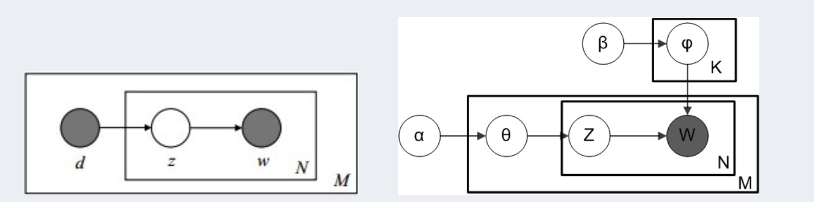
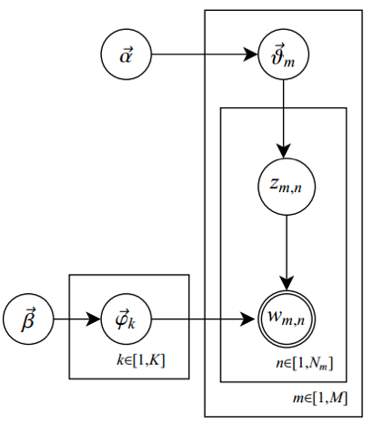
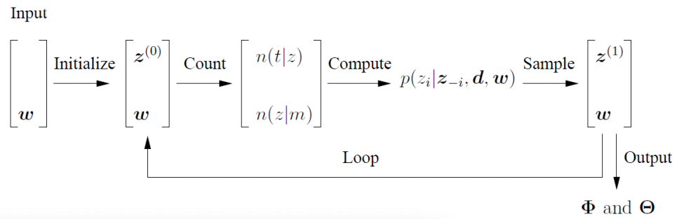

# 06.28-07.04 回顾

## 一. 概率分布复习

### 1 伯努利分布(*Bernoulli distribution*)

- 又称为**两点分布**或者**0-1分布**。 表示的是只有**两种**可能结果的**单次**随机试验。

- 服从伯努利分布的随机变量 $X$ ，记为 $X∼Ber(p)$ ，概率质量函数（probability mass function）为：
  $$
  f(k; p)=P(X=k)=\left\{\begin{array}{ll}p & \text { if } k=1 \\ q=1-p & \text { if } k=0\end{array}\right.
  $$
也可以写为：
  $$
  f(k; p)=P(X=k)=p^{k}(1-p)^{1-k}, k=0,1
  $$
  

### 2 二项分布(*Binomial distribution*)

- 将伯努利实验独立地重复**n次**，正例发生次数的概率分布。

- 服从二项分布的随机变量 $X$ ，记为 $X∼B(n,p)$ ，概率质量函数（probability mass function）为：
  $$
  f(k;n,p)=P(X=k)=C_{n}^{k} p^{k}(1-p)^{n-k}
  $$
  其中，$C_{n}^{k}=\frac{n !}{k !(n-k) !}$ 为二项系数。

- 从定义可知，伯努利分布是二项分布在 $n=1$ 时的特例。 典型例子是抛硬币。

- numpy代码

  ```python
  import numpy
  a = numpy.random.binomial(n=10, p=0.7, size = 1)
  ```

  

### 3 多项分布(*Multinomial Distribution*)

- 多项分布是二项分布的扩展，在单次实验中，可能有m种情况，这m种情况互斥且和为1。则发生其中一个结果的概率就是多项分布。

- 服从多项分布的随机变量 $X$ ，概率质量函数（probability mass function）为：
  $$
  \begin{aligned}
  f\left(x_{1}, \ldots, x_{k} ; n, p_{1}, \ldots, p_{k}\right) &=\operatorname{P}\left(X_{1}=x_{1} \text { and } \ldots \text { and } X_{k}=x_{k}\right) \\
  &=\left\{\begin{array}{cc}
  \frac{n !}{x_{1} ! \cdots x_{k} !} p_{1}^{x_{1}} \times \cdots \times p_{k}^{x_{k}}, & \text { when } \sum_{i=1}^{k} x_{i}=n \\
  \\
  0 & \text { otherwise }
  \end{array}\right.
  \end{aligned}
  $$

- 二项分布是多项分布在 $m=2$ 时的特例，典型例子是掷骰子。

- numpy代码

  ```python
  import numpy
  a = numpy.random.multinomial(n=10, pvals=[0.2,0.4,0.4], size = 1)
  ```


### 4 Gamma函数

- Gamma函数的定义
  $$
  x\Gamma(x)=\int_{0}^{\infty} t^{x-1} e^{-t} d t
  $$
  分部积分后，可以发现Gamma函数如有这样的性质：
  $$
  \Gamma(x+1)=x \Gamma(x)
  $$
  Gamma函数可以看成是阶乘在实数集上的延拓，具有如下性质：
  $$
  \Gamma(n)=(n-1) !
  $$

### 5 Beta分布(*Beta distribution*)

- **先验概率**：事情尚未发生，对于概率的预估。通过历史资料计算的先验概率称为**客观先验概率**，凭主观经验的先验概率，称为**主观先验概率**。

- **后验概率**：通过调查或者数据，增加新的附加信息，利用贝叶斯公式对先验概率进行修正，而后得到的概率。

- **似然函数**：给定参数，对数据出现的概率的描述。

- 先验概率和后验概率的**区别**：先验概率不是根据全部资料测定的，只是利用现有的材料计算的。后验概率使用了更多的信息，既有先验概率，也有补充资料。

- 先验概率和后验概率的**关系**：$posterior=likelihood \times prior$ 
  $$
  \begin{align}
  MLE:&\ \arg\max _{\theta} P(X|\theta) \\
  MAP:&\ \arg\max_{\theta} P(\theta|X)=\arg\max_{\theta}P(X|\theta)P(\theta)
  \end{align}
  $$

- Beta分布可以看作一个概率的概率分布（可以当成先验），概率密度函数（Probability density function）为：
  $$
  {\displaystyle {\begin{aligned}f(x;\alpha ,\beta )&=\mathrm {constant} \cdot x^{\alpha -1}(1-x)^{\beta -1}\\[3pt]&={\frac {x^{\alpha -1}(1-x)^{\beta -1}}{\displaystyle \int _{0}^{1}u^{\alpha -1}(1-u)^{\beta -1}\,du}}\\[6pt]&={\frac {\Gamma (\alpha +\beta )}{\Gamma (\alpha )\Gamma (\beta )}}\,x^{\alpha -1}(1-x)^{\beta -1}\\[6pt]&={\frac {1}{\mathrm {B} (\alpha ,\beta )}}x^{\alpha -1}(1-x)^{\beta -1}\end{aligned}}}
  $$
  where $Γ(z)$ is the [gamma function](https://en.wikipedia.org/wiki/Gamma_function). For any positive integer $n$, $\Gamma (n)=(n-1)!$ . The [beta function](https://en.wikipedia.org/wiki/Beta_function), ${\displaystyle \mathrm {B} }$, is a [normalization constant](https://en.wikipedia.org/wiki/Normalization_constant) to ensure that the total probability is 1.  

- **共轭分布**：后验概率分布函数和先验概率分布函数具有**相同形式**。共轭先验就是先验分布是beta分布，而后验分布同样是beta分布。

  - 二项分布的似然函数：
    $$
    P(X|\theta)\propto \theta^k(1-\theta)^{n-k}
    $$

  - Beta相当于先验：
    $$
    \operatorname{Beta}(a, b)=\frac{\theta^{a-1}(1-\theta)^{b-1}}{B(a, b)} \propto \theta^{a-1}(1-\theta)^{b-1}
    $$

  - 后验概率为：
    $$
    P(\theta|X)\propto \theta^k(1-\theta)^{n-k} * \theta^{a-1}(1-\theta)^{b-1} \\
    \propto\theta^{a+k-1}(1-\theta)^{b+n-k-1}
    $$
    令$a^\prime=a+k,b^\prime=b+n-k$ ，则后验概率服从 $Beta(a^\prime,b^\prime)$ 。

- 参考资料

  - 如何通俗理解 beta 分布？ - 小杰的回答 - 知乎 https://www.zhihu.com/question/30269898/answer/123261564
  
  - 伯努利分布、二项分布、多项分布、Beta分布、Dirichlet分布  https://blog.csdn.net/Michael_R_Chang/article/details/39188321

### 6 狄利克雷分布(*Dirichlet distribution*)

- 多项分布的共轭分布。概率密度函数（Probability density function）为：
  $$
  f\left(x_{1}, \ldots, x_{K} ; \alpha_{1}, \ldots, \alpha_{K}\right)=\frac{1}{\mathrm{B}(\alpha)} \prod_{i=1}^{K} x_{i}^{\alpha_{i}-1}
  $$
  其中：
  $$
  \mathrm{B}(\alpha)=\frac{\prod_{i=1}^{K} \Gamma\left(\alpha_{i}\right)}{\Gamma\left(\sum_{i=1}^{K} \alpha_{i}\right)}, \quad \alpha=\left(\alpha_{1}, \ldots, \alpha_{K}\right)
  $$

- 对 Dirichlet 分布做采样，就可以得到多项分布。对 Beta 分布做采样，就可以得到二项分布。
- 多项分布中，底数是分布参数，指数是随机变量；Dirichlet分布中，底数是随机变量，指数是分布参数。
- 参考资料
  
  - LDA中，多项式分布， 和狄利克雷分布的 形式一致，所以称为共轭，但是这两个分布的区别是什么呢？ - poodar.chu的回答 - 知乎 https://www.zhihu.com/question/39004744/answer/397828994

### 7 Beta / Dirichlet 分布的一个性质

- 如果 $p \sim\operatorname{Beta}(t \mid \alpha, \beta),$ 则
  $$
  \begin{align}
  E(p)&=\int_{0}^{1} t * \operatorname{Beta} (t \mid \alpha, \beta) d t  \\
  &=\int_{0}^{1} t * \frac{\Gamma(\alpha+\beta)}{\Gamma(\alpha) \Gamma(\beta)} t^{(\alpha-1)}(1-t)^{\beta-1} d t  \\
  &=\frac{\Gamma(\alpha+\beta)}{\Gamma(\alpha) \Gamma(\beta)} \int_{0}^{1} t^{\alpha}(1-t)^{\beta-1} d t 
  \end{align}
  $$
  上式右边的积分对应到概率分布 $\operatorname{Beta}(t \mid \alpha+1, \beta),$ 对于这个分布，有
  $$
  \int_{0}^{1} \frac{\Gamma(\alpha+\beta+1)}{\Gamma(\alpha+1) \Gamma(\beta)} t^{\alpha}(1-t)^{\beta-1} d t=1
  $$
  把上式带入 $E(p)$ 的计算式，得到
  $$
  \begin{align}
  E(p)&=\frac{\Gamma(\alpha+\beta)}{\Gamma(\alpha) \Gamma(\beta)} \cdot \frac{\Gamma(\alpha+1) \Gamma(\beta)}{\Gamma(\alpha+\beta+1)} \\
  &=\frac{\Gamma(\alpha+\beta)}{\Gamma(\alpha+\beta+1)} \cdot \frac{\Gamma(\alpha+1)}{\Gamma(\alpha)} \\
  &=\frac{\alpha}{\alpha+\beta}
  \end{align}
  $$
  这说明，对于Beta分布的随机变量，其均值可以用 $\frac{\alpha}{\alpha+\beta}$ 来估计。

- Dirichlet分布也有类似的结论，如果 $\vec{p} \sim \operatorname{Dir}(\vec{t} \mid \vec{\alpha}),$ 同样可以证明：
  $$
  E(p)=\left(\frac{\alpha^{1}}{\sum_{i=1}^{K} \alpha_{i}}, \frac{\alpha^{2}}{\sum_{i=1}^{K} \alpha_{i}}, \cdots, \frac{\alpha^{K}}{\sum_{i=1}^{K} \alpha_{i}}\right)
  $$

- 这两个结论非常重要，后面的LDA数学推导过程会使用这个结论。

- 超参数 $\alpha_k$ 的直观意义就是事件先验的伪计数(prior pseudo-count)。


## 二、PGM概率图模型

- Model
  - LDA（2003）（topic model）（Blei）
  - MMSB（2008）（social network）（Blei）
  - Bayesian Neural Networks （Neil）
- Inference（Approximate）
  - MCMC（Markov chain Monte Carlo ）
  - Variational Inference（变分法）（Micheal Jordan, Blei）
- Non parametric Bayesian
  - LDA, k-means（对于stream数据，随着数据量不断增大，自主扩充k，而不是人工指定k）
  - 对于一个模型（如LDA）加上一个Stochastic Process，从而变成一个Non parametric 模型。常见的Stochastic Process有：
    - Dirichlet Process 
    - Chinese Restaurant Process
    - Indian Buffet Processs
    - Stick-breaking Process
    - Gaussian Process


## 三、模型估计的方式

- 常见的模型估计方法可以分为**两个学派**（频率学派，贝叶斯学派）和**三种方法**（MLE、MAP、Bayesian）。

### 频率学派 vs 贝叶斯学派

- 频率学派：所有的数据是由参数空间中的**某一个**参数 $\theta^*$ 生成的。因此要求出此最优的参数，从而进行预测。

- 贝叶斯学派：参数空间的**每一个**参数 $\theta$ 都可能是生成数据的值，只不过是每个参数的概率不同，即参数也服从某个先验分布。

- 不同方法的对比：
  $$
  \begin{array}{c|c}
  \hline
  & \text {Approaches}&\text{Parameter Estimation} & \text{Inference}\\
  \hline \text{MLE}& \text{Frequentist} &\theta^*= \arg\max P(D|\theta)& x^\prime\rightarrow p(y^\prime|x^\prime,\theta^*) \\ 
  \hline \text{MAP}& \text{Frequentist} &\theta^*= \arg\max P(\theta|D)& x^\prime\rightarrow p(y^\prime|x^\prime,\theta^*) \\
  \hline \text{Bayesian}&\text{Bayesian} && x^\prime\rightarrow \int_\theta p(y^\prime|x^\prime,\theta) p(\theta|D)d\theta
  \\
  \hline
  \end{array}
  $$

- 贝叶斯方法中，会对每个参数 $\theta$ 计算其概率，但是这是很难计算的，因此需要使用抽样的方法。
- 从概率的角度看，贝叶斯学派的想法其实更为自然，这也是为什么贝叶斯学派的产生远早于频率学派（2014年是贝叶斯250周年）。但是贝叶斯方法本身有很多问题，比如当先验选的不好或者模型不好的时候你后验分布的具体形式可能都写不出来，跟别说做统计推断了。在当年电子计算机还没发展出来的时候，对这些情况做分析几乎是不可能的，这也就大大限制了贝叶斯方法的发展。而频率学派主要使用最优化的方法，在很多时候处理起来要方便很多。所以在频率学派产生后就快速地占领了整个统计领域。直到上世纪90年代依靠电子计算机的迅速发展，以及抽样算法的进步（Metropolis-hastings, Gibbs sampling）使得对于任何模型任何先验分布都可以有效地求出后验分布，贝叶斯学派才重新回到人们的视线当中。
- 就现在而言，贝叶斯学派日益受到重视当然是有诸多原因的，所以这并不意味这频率学派就不好或者不对。两个学派除了在参数空间的认知上有区别以外，方法论上都是互相借鉴也可以相互转化的。

### Bayesian Inference

- 为了计算 $\int_\theta p(y^\prime|x^\prime,\theta) p(\theta|D)d\theta$ ，要计算出 $p(\theta|D)$ 

  - Exact Inference
    $$
    p(\theta|D) = \frac{p(D|\theta)p(\theta)}{p(D)} = \frac{p(D|\theta)\,p(\theta)}{\int_{\theta}p(D,\theta) \, d\theta}= \frac{p(D|\theta)\,p(\theta)}{\int_{\theta_1}\int_{\theta_2}...\int_{\theta_\infin} p(D,\theta) \, d\theta} 
    $$ { }
    此处分母的 $p(D)$ 是不能省略的，因为省略之后，就不再是概率了。而分母的计算是很难的，一般难以计算，因此会采用采用的方法进行估计。

  - Approximate Inference
    $$
    \int_\theta p(y^\prime|x^\prime,\theta) p(\theta|D)d\theta \approx  \frac1S\sum_{s=1}^S  p(y^\prime|x^\prime,\theta^s) \\
    \theta^s \sim p(\theta|D)
    $$

  - 在采样时，如果每次都是随机采样（Monte Carlo），那么效率可能会比较低。而比较好的参数的周围存在其他好的参数的概率也比较大，这种性质叫做Locality。利用这样的性质，可以提高采到好的参数的概率，这样的**Monte Carlo + sequence**的方法，称为**Markov chain Monte Carlo（MCMC）**。 
  - 比较常见的抽样方法：
    - Metropolis-hastings
    - Gibbs sampling (*)
    - Rejection sampling
    - Langevin dynamics (*)


- Bayesian 考虑了无穷多的参数的可能性，可以看作模型集成，即使小数据集也不容易过拟合，在小数据集上效果优于神经网络。

### 参考资料 

- 贝叶斯学派与频率学派有何不同？ - Xiangyu Wang的回答 - 知乎 https://www.zhihu.com/question/20587681/answer/41436978

## 四、LDA

### 主题模型

- 主题模型属于贝叶斯模型
- 主题模型是生成模型，以无监督的方式进行学习
- 主题模型属于Mixed Membership模型
- 对于主题模型的推到需要近似算法如MCMC

### pLSA vs LDA

- 模型思路对比：左图是pLSA，右图是LDA（右图不太规范，z 跟 w 都得是小写， 其中，阴影圆圈表示可观测的变量，非阴影圆圈表示隐变量，箭头表示两变量间的条件依赖性conditional dependency，方框表示重复抽样，方框右下角的数字代表重复抽样的次数）： 

  

- 在pLSA中，我们使用EM算法去估计“主题-词项”矩阵 $Φ$（由转换得到）和“文档-主题”矩阵 $Θ$（由转换得到）这两个参数，而且这两参数都是个固定的值，只是未知，使用的思想其实就是极大似然估计MLE。

  而在LDA中，估计 $\Phi$、$\Theta$ 这两未知参数可以用变分(Variational inference)-EM算法，也可以用gibbs采样，前者的思想是最大后验估计MAP（MAP与MLE类似，都把未知参数当作固定的值），后者的思想是贝叶斯估计。贝叶斯估计是对MAP的扩展，但它与MAP有着本质的不同，即贝叶斯估计把待估计的参数看作是服从某种先验分布的随机变量。


### LDA的生成过程

- 生成过程：
  1. $\vec\varphi_k \sim Dir(\vec\beta)\, \text{ for } k=1,2...K$ 
  2. $\text{for }\, m=1,2...M$ 
  3. ​        $\vec\vartheta_m\sim Dir(\vec\alpha)\, \text{ for } m=1,2...M$ 
  4. ​        $\text{for }\, n=1,2...N_m$ 
  5. ​                $z_{m,n}\sim Multinomial(\vec\vartheta_m)$ 
  6. ​                $w_{m,n}\sim Multinomial(\vec\varphi_{z_{m,n}})$  

- 在LDA模型中，一篇文档生成的方式如下：

  - 从狄利克雷分布 $\alpha$ 中取样生成文档 $i$ 的主题分布 $\theta_{i} $ 
  - 从主题的多项式分布 $\theta_{i}$ 中取样生成文档i第 j 个词的主题 $z_{i, j}$ 
  - 从狄利克雷分布 $\beta$ 中取样生成主题 $z_{i, j }$对 应 的 词 语 分 布$ \phi_{z i, j}$ 
  - 从词语的多项式分布 $\phi_{z_{i}, j}$ 中采样最终生成词语 $w_{i, j}$ 

- 图示如下

  

- 为什么使用Dirichlet分布，而不是其他的分布生成参数？
  - Dirichlet分布生成的参数具有 $\theta_{i,j}>0 \, \   \sum\theta_{i,j}=1$ 的性质 
  - Dirichlet分布生成的参数，具有sparsity的性质
  - Dirichlet和multinomial分布具有共轭先验的性质

### Gibbs Sampling

- 条件独立和Markov Blanket

- $\theta$ 的采样
  $$
  \begin{align}
  \theta_i\sim &P(\theta_i\mid \alpha,Z,w,\phi,\beta) \\
  =&P(\theta_i\mid \alpha,Z) \\
  =&\underbrace{P(\theta_i\mid \alpha,Z_{i\cdot})}_{\text{posterior}} \\ 
  \propto &\underbrace {P(\theta_i\mid \alpha)}_{\text{Dirichlet (prior)}}\,\,\ \underbrace{P(Z_{i\cdot}\mid\theta_i)}_{\text{Multinomial (likelihood)}} \\
  =&\frac{1}{B(\alpha)}\prod_{k=1}^K \theta_{ik}^{\alpha_k-1} \cdot \prod_{j=1}^{N_i}\prod_{k=1}^K \theta_{ik}^{I(Z_{ij}=k)} \\
  =&\frac{1}{B(\alpha)}\prod_{k=1}^K \theta_{ik}^{\sum_{j=1}^{N_i}I(Z_{ij}=k)+ \alpha_k-1} \\
  =& Dir(\alpha+\sum_{j=1}^{N_i}I(Z_{ij}=k))
  \end{align}
  $$

- $Z$ 的采样
  $$
  \begin{align}
  P(Z_{ij}=k\mid w_{ij},\phi_k,\theta_i) & \propto P(Z_{ij}=k\mid \theta_i) \cdot P(w_{ij} \mid Z_{ij}=k,\phi_k) \\
  &=\theta_{ik}\cdot \phi_{k,w_{ij}} \\
  &=\exp(\log\theta_{ik}+ \log\phi_{k,w_{ij}})
  \end{align}
  $$

- 代码实现

  ```python
  import numpy as np
  # words
  W = np.array([0, 1, 2, 3, 4])
  
  # D := document words 此处是bags of words, 不是word sequence
  X = np.array([
      [0, 0, 1, 2, 2],
      [0, 0, 1, 1, 1],
      [0, 1, 2, 2, 2],
      [4, 4, 4, 4, 4],
      [3, 3, 4, 4, 4],
      [3, 4, 4, 4, 4]
  ])
  
  N_D = X.shape[0]  # num of docs
  N_V = W.shape[0]  # num of words
  N_K = 2  # num of topics
  
  # Dirichlet priors
  alpha = 1
  gamma = 1
  
  # Z := word topic assignment
  Z = np.zeros(shape=[N_D, N_V])
  
  for i in range(N_D):
      for l in range(N_V):
          Z[i, l] = np.random.randint(N_K)  # randomly assign word's topic
  
  # Pi := document topic distribution
  theta = np.zeros([N_D, N_K])
  
  for i in range(N_D):
      theta[i] = np.random.dirichlet(alpha*np.ones(N_K))
  
  # phi := word topic distribution
  phi = np.zeros([N_K, N_V])
  
  for k in range(N_K):
      phi[k] = np.random.dirichlet(gamma*np.ones(N_V))
  
  for it in range(1000):
      # Sample from full conditional of Z
      # ---------------------------------
      for i in range(N_D):
          for v in range(N_V):
              # Calculate params for Z
              p_iv = np.exp(np.log(theta[i]) + np.log(phi[:, X[i, v]]))
              p_iv /= np.sum(p_iv)
  
              # Resample word topic assignment Z
              Z[i, v] = np.random.multinomial(1, p_iv).argmax()
  
      # Sample from full conditional of Pi
      # ----------------------------------
      for i in range(N_D):
          m = np.zeros(N_K)
  
          # Gather sufficient statistics
          for k in range(N_K):
              m[k] = np.sum(Z[i] == k)
  
          # Resample doc topic dist.
          theta[i, :] = np.random.dirichlet(alpha + m)
  
      # Sample from full conditional of B
      # ---------------------------------
      for k in range(N_K):
          n = np.zeros(N_V)
  
          # Gather sufficient statistics
          for v in range(N_V):
              for i in range(N_D):
                  for l in range(N_V):
                      n[v] += (X[i, l] == v) and (Z[i, l] == k)
  
          # Resample word topic dist.
          phi[k, :] = np.random.dirichlet(gamma + n)
  
  ```

- sklearn实现

  ```python
  from sklearn.decomposition import LatentDirichletAllocation
  from sklearn.feature_extraction.text import CountVectorizer, TfidfVectorizer
  import pandas as pd
  
  yelp = pd.read_csv('./datasets/yelp.csv', encoding='utf-8')
  print (yelp['text'].head())
  
  # 把每个文本表示成count vector. 
  vectorizer = CountVectorizer(stop_words="english")
  X = vectorizer.fit_transform(yelp['text'])
  
  lda   = LatentDirichletAllocation(n_components=10, learning_method="batch", random_state=42)
  model = lda.fit(X)
  
  import matplotlib.pyplot as plt
  %matplotlib inline
  
  ####
  # Per topic: (token, pseudocount)
  # pseudocount represents the number of times word j was assigned to topic i
  # 
  # We can to convert these to a normalized form -- well you don't have to
  # but it's easier to understand the output in this form.  Also, this is 
  # consistent with how Gensim performs.  After some consideration, we will plot these out.
  ####
  
  def display_topics(model, feature_names, no_words = 10, plot = False, plot_dim=(5,2)):  
      topics_tokens = []
      
      for topic_idx, topic in enumerate(model.components_):
          topic = zip(feature_names, topic)
          topic = sorted(topic, key=lambda pair: pair[1])
          
          topic_words = [(token, counts)
                         for token, counts in topic[:-no_words - 1:-1]]
          topics_tokens.append(topic_words)
          
          if not plot:
              print ("Topic %d:" % (topic_idx))
              print (topic_words)
          
      if plot:
          plot_matrix = np.arange(10).reshape(5,2)
          fig, ax = plt.subplots(figsize=(10, 10), nrows=5, ncols=2)
          topics = [
              {key: value for key, value in topic} 
                    for topic in topics_tokens]
          
          row = 0
          for topic_id, topic in enumerate(topics):
              
              column = (0 if topic_id % 2 == 0 else 1)  
              chart = pd.DataFrame([topic]).iloc[0].sort_values(axis=0)
              chart.plot(kind="barh", title="Topic %d" % topic_id, ax=ax[row, column])
              row += 1 if column == 1 else 0
          
          plt.tight_layout()
  
  display_topics(model, vectorizer.get_feature_names(), no_words=10, plot=True)
  
  comp = model.transform(X)
  document_topics = pd.DataFrame(comp, columns=["topic %d" % i for i in range(comp.shape[1])])
  top_topics = document_topics['topic 0'] > .8
  document_topics[top_topics].head()
  ```


### Collapsed Gibbs sampling

- 上述的gibbs sampling，是一种通用算法，可以用于各种贝叶斯模型的估计。在LDA中，可以有更近一步简化的方法，即collapsed gibbs sampling。

- 给定一个文档集合，$w$ 是可以观察到的已知变量， $\alpha$ 和 $\beta$ 是根据经验给定的先验参数，其他的变量 $z,\vartheta, \Phi$ 都是未知的隐含变量, 需要根据观察到的变量来学习估计的。根据LDA的图模型，可以写出所有变量的联合分布：
  $$
  p\left(\vec{w}_{m}, \vec{z}_{m}, \vec{\vartheta}_{m}, \Phi \mid \vec{\alpha}, \vec{\beta}\right)=\prod_{n=1}^{N_{m}} p\left(w_{m, n} \mid \vec{\varphi}_{z_{m, n}}\right) p\left(z_{m, n} \mid \vec{\vartheta}_{m}\right) \cdot p\left(\vec{\vartheta}_{m} \mid \vec{\alpha}\right) \cdot p(\Phi \mid \vec{\beta})
  $$
  因为 $\alpha$ 产生主题分布 $\theta$，主题分布 $\theta$ 确定具体主题，且 $\beta$ 产生词分布 $\varphi$ ，词分布 $\varphi$ 确定具体词，因此，上式等价于下式表示的联合概率分布 $p(\vec{w}, \vec{z}):$
  $$
  p(\vec{w}, \vec{z} \mid \vec{\alpha}, \vec{\beta})=p(\vec{w} \mid \vec{z}, \vec{\beta}) p(\vec{z} \mid \vec{\alpha})
  $$
  其中，第一项因子 $p(\vec{w} \mid \vec{z}, \vec{\beta})$ 表示的是根据确定的主题 $\vec{z}$ 和词分布的先验分布参数 $\vec\beta$ 采样词的过程，第二项因子 $p(\vec{z} \mid \vec{\alpha})$ 是根据主题分布的先验分布参数 $\vec\alpha$ 采样主题的过程，这两项因子是需要计算的两个未知参数。

- 第一项的求解
  $$
  \begin{aligned}
  p(\vec{w} \mid \vec{z}, \vec{\beta}) &=\int p(\vec{w} \mid \vec{z}, \Phi) p(\Phi \mid \vec{\beta}) \mathrm{d} \Phi \\
  &=\int \prod_{z-1}^{K} \frac{1}{\Delta(\vec{\beta})} \prod_{t-1}^{V} \varphi_{z, t}^{n_{2}^{(t)}+\beta_{t}-1} \mathrm{d} \vec{\varphi}_{z} \\
  &=\prod_{z=1}^{K} \frac{\Delta\left(\vec{n}_{z}+\vec{\beta}\right)}{\Delta(\vec{\beta})}, \quad \vec{n}_{z}=\left\{n_{z}^{(t)}\right\}_{t=1}^{V}
  \end{aligned}
  $$

- 第二项求解
  $$
  \begin{aligned}
  p(\vec{z} \mid \vec{\alpha}) &=\int p(\vec{z} \mid \Theta) p(\Theta \mid \vec{\alpha}) \mathrm{d} \Theta \\
  &=\int \prod_{m-1}^{M} \frac{1}{\Delta(\vec{\alpha})} \prod_{k=1}^{K} \vartheta_{m, k}^{n(k)}+\alpha_{k}-1+\overrightarrow{\mathrm{d}} \vec{\vartheta}_{m} \\
  &=\prod_{m-1}^{M} \frac{\Delta\left(\vec{n}_{m}+\vec{\alpha}\right)}{\Delta(\vec{\alpha})}, \quad \vec{n}_{m}=\left\{n_{m}^{(k)}\right\}_{k=1}^{K}
  \end{aligned}
  $$

- 结合起来可得：
  $$
  p(\vec{z}, \vec{w} \mid \vec{\alpha}, \vec{\beta})=\prod_{z=1}^{K} \frac{\Delta\left(\vec{n}_{z}+\vec{\beta}\right)}{\Delta(\vec{\beta})} \cdot \prod_{m-1}^{M} \frac{\Delta\left(\vec{n}_{m}+\vec{\alpha}\right)}{\Delta(\vec{\alpha})}
  $$

- 接下来，有了联合分布 $p(\vec{w}, \vec{z})$ 便可以通过联合分布来计算在给定可观测变量 $\mathbf{w}$ 下的隐变量 $\mathbf{z}$ 的条件分布 (后验分布)  $p(z\mid w)$ 进行贝叶斯分析。

- 求出每个文档上Topic的后验分布和每个Topic下的词的后验分布分别如下
  $$
  \begin{array}{l}
  p\left(\vec{\vartheta}_{m} \mid \vec{z}_{m}, \vec{\alpha}\right)=\frac{1}{Z_{\theta_{m}}} \prod_{n=1}^{N_{m}} p\left(z_{m, n} \mid \vec{\vartheta}_{m}\right) \cdot p\left(\vec{\vartheta}_{m} \mid \vec{\alpha}\right)=\operatorname{Dir}\left(\vec{\vartheta}_{m} \mid \vec{n}_{m}+\vec{\alpha}\right) \\
  p\left(\vec{\varphi}_{k} \mid \vec{z}, \vec{w}, \vec{\beta}\right)=\frac{1}{Z_{\varphi_{k}}} \prod_{\left\{i: z_{i}-k\right\}} p\left(w_{i} \mid \vec{\varphi}_{k}\right) \cdot p\left(\vec{\varphi}_{k} \mid \vec{\beta}\right)=\operatorname{Dir}\left(\vec{\varphi}_{k} \mid \vec{n}_{k}+\vec{\beta}\right)
  \end{array}
  $$
  其中， $\vec{n}_{m}$ 是构成文档 m 的主题数向量, $\vec{n}_{k}$ 是构成主题 k 的词项数向量。

- 最终求解的Dirichlet 分布期望为
  $$
  \begin{aligned}
  \vartheta_{m, k} &=\frac{n_{m}^{(k)}+\alpha_{k}}{\sum_{k=1}^{K} n_{m}^{(k)}+\alpha_{k}}  \\
  \varphi_{k, t} &=\frac{n_{k}^{(t)}+\beta_{t}}{\sum_{t=1}^{V} n_{k}^{(t)}+\beta_{t}}
  \end{aligned}
  $$

- 于是，我们最终得到了LDA 模型的Gibbs Sampling 公式
  $$
  p\left(z_{i}=k \mid \overrightarrow{\mathbf{z}}_{\neg i}, \overrightarrow{\mathbf{w}}\right) \propto \frac{n_{m, \neg i}^{(k)}+\alpha_{k}}{\sum_{k=1}^{K}\left(n_{m, \neg i}^{(t)}+\alpha_{k}\right)} \cdot \frac{n_{k, \neg i}^{(t)}+\beta_{t}}{\sum_{t=1}^{V}\left(n_{k, \neg i}^{(t)}+\beta_{t}\right)}
  $$
  这个公式是很漂亮的，右边其实就是 $p(t o p i c \mid d o c) \cdot p(w o r d \mid \text { topic }),$ 这个概 率其实是 $doc \rightarrow topic \rightarrow word$ 的路径概率，由于topic 有 K 个，所以Gibbs
  Sampling 公式的物理意义其实就是在这 K 条路径中进行采样。 

- 图示：

  

### LDA Training and Inference

- 有了LDA 模型，当然我们的目标有两个：
  - 估计模型中的参数 $\vec{\varphi}_{1}, \cdots, \vec{\varphi}_{K}$ 和 $\vec{\theta}_{1}, \cdots, \vec{\theta}_{M}$ 
  - 对于新来的一篇文档doc $_{n e w},$ 我们能够计算这篇文档的topic 分布 $\vec{\theta}_{n e w^{\circ}}$
- 有了Gibbs Sampling 公式，我们就可以基于语料训练LDA 模型，并应用 训练得到的模型对新的文档进行topic 语义分析。训练的过程就是通过Gibbs Sampling 获取语料中的 $(z, w)$ 的样本，而模型中的所有的参数都可以基于最终 采样得到的样本进行估计。训练的流程很简单:
- LDA Training
  1. 随机初始化：对语料中每篇文档中的每个词 $w$，随机的赋一个topic 编号 $z$ 
  2. 重新扫描语料库，对每个词 $w$，按照Gibbs Sampling 公式重新采样它 的topic，在语料中进行更新 
  3. 重复以上语料库的重新采样过程直到Gibbs Sampling 收敛
  4. 统计语料库的topic-word 共现频率矩阵，该矩阵就是LDA的模型
- 对于Gibbs Sampling 算法实现的细节，请参考Gregor Heinrich 的Parameter estimation for text analysis 中对算法的描述，以及[PLDA](https://code.google.com/archive/p/plda/) 的代码实现，此处不 再赘述。
- 由这个topic-word 频率矩阵我们可以计算每一个 $p(word|topic)$ 概率，从而算出模型参数 $\vec{\varphi}_{1}, \cdots, \vec{\varphi}_{K}$ 。当然，语料中的文档对应的参数 $\vec{\theta}_{1}, \cdots, \vec{\theta}_{M}$ 在以上训练过程中也是可以计算出来的，只要在Gibbs Sampling 收敛之后，统计每篇文档中的topic 的频率分布，我们就可以计算每一个 $p(topic|doc)$ 概率，于是就可以计算出每一个 $\vec\theta_m$ 。由于参数 $\vec\theta_m$ 是和训练语料中的每篇文档相关的，对于我们理解新的文档并无用处，所以工程上不会保留。通常，在 LDA 模型训练的过程中，我们是取 Gibbs Sampling 收敛之后的 n 个迭代的结果进行平均来做参数估计，这样模型质量更高。
- 有了LDA 的模型，对于新来的文档 $doc_{n e w}$ ，如何做该文档的topic语义分布的计算呢？基本上inference 过程和training 的过程完全类似。对于新的文档，我们只要认为Gibbs Sampling 公式中的 $\hat\varphi_{k t}$ 部分是稳定不变的，是由训练语料得到的模型提供的，所以采样过程中只要估计该文档的topic 分布 $\vec\theta_{n e w}$ 就好了。  
- LDA Inference
  1.  随机初始化：对当前文档中的每个词 $w$ ，随机的赋一个topic 编号 $z$ 
  2. 重新扫描当前文档，按照Gibbs Sampling 公式，对每个词 $w$ ，重新采样它的topic 
  3. 重复以上过程直到Gibbs Sampling 收敛
  4. 统计文档中的topic分布，该分布就是 $\vec\theta_{n e w}$ 


### Reference

- 一文详解LDA主题模型 - 陈运文的文章 - 知乎 https://zhuanlan.zhihu.com/p/31470216
- 通俗理解LDA主题模型 https://blog.csdn.net/v_july_v/article/details/41209515?utm_source=tool.lu
- LDA数学八卦 https://bloglxm.oss-cn-beijing.aliyuncs.com/lda-LDA数学八卦.pdf
- https://clyyuanzi.gitbooks.io/julymlnotes/content/lda.html
- [用scikit-learn学习LDA主题模型](https://www.cnblogs.com/pinard/p/6908150.html) 

# Plan of next week

- 


