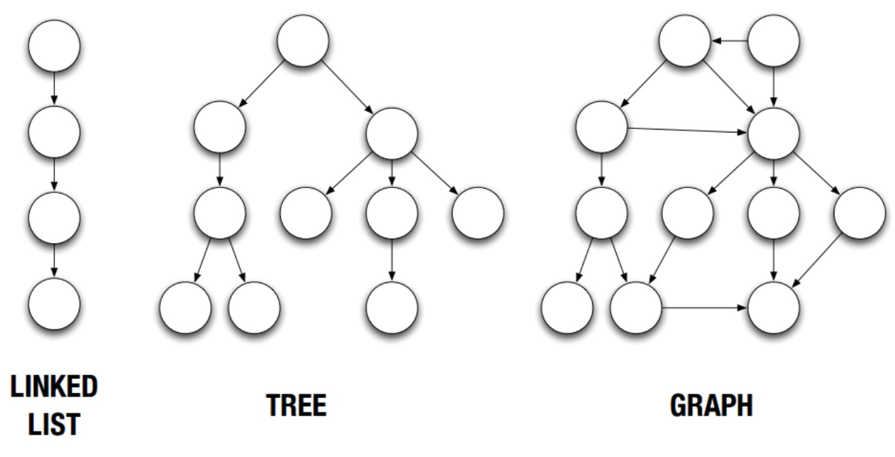

# 07.05-07.11 回顾

### 图

- 链表 、树和图的对比

  

- 图中的术语

  - 顶点vertex，边edge，无向图，有向图，路径path，入度，出度，度。

- 图ADT的数据成员：顶点、边。

- 图ADT的操作

  - 有多少顶点、有多少边、增加一个新顶点、增加一条新的边、获取所有邻居、两个顶点之间是否连通、反转所有边、获取2跳邻居等。

- 图的表示方法：

  - 邻接矩阵表示法
  - 邻接列表表示法

- DFS

  - 如何跟踪下一步搜索位置：stack

  - 如何跟踪访问过的内容：set

  - 如何跟踪从开始到目标的路径：dict

  - 递归

    ```python
    def dfs(node, graph, visited):
        print("visit node: ", node.getValue())
        visited[node] = True
        for n in node.getNeighbor:
            if n not in visited:
                dfs(n, graph, visited) 
    def DFS(graph):
        visited = {}
        for n in graph:
            if n not in visited:
            	dfs(n, graph, visited)
    ```

  - 迭代

    ```python
    def dfs_iter(graph):
        visited = {}
        nodes = []
        for n in graph:
            if n not in visited:
                nodes.append(n)
                while nodes:
                    cur = nodes.pop()
                    print("visit node: ", cur.getValue())
                    visited[cur] = True
                    for ner in cur.getNeighbor:
                        if ner not in visited:
                            nodes.append(ner) 
    ```

    

- BFS

  - 如何跟踪下一步搜索位置：queue

  - 如何跟踪访问过的内容：set

  - 如何跟踪从开始到目标的路径：dict

    ```python
    from collections import deque
    def bfs(graph, start, dest):
        visited = {}
        queue = deque()
        parents = {}
        queue.append(start)
        while queue:
            cur = queue.popleft()
            visited[cur] = True
            if cur.getID() == dest.getID():
                return parents
            for n in cur.getNeighbor():
                if n not in visited:
                    queue.append(n)
                    parents[n.getID()] = cur.getID()
    ```

- Dijkstra's算法

  - 如何跟踪下一步搜索位置：heap
  - 贪婪算法
  - 当权重中有负数时不适合

- 本周之前刷题数目：111

- 本周之后刷题数目：119


- #### [490. 迷宫](https://leetcode-cn.com/problems/the-maze/)

  ```python
  class Solution:
      def hasPath(self, maze: List[List[int]], start: List[int], destination: List[int]) -> bool:
          stack = [] 
          stack.append(start) 
          while stack :
              cur = stack.pop()
              if cur[0] == destination[0] and cur[1] == destination[1]:
                  return True
              maze[cur[0]][cur[1]] = 2
  
              idx = cur[0] 
              while idx -1  >=0 and maze[idx-1][cur[1]] != 1:
                  idx -= 1
              if maze[idx][cur[1]] == 0:
                  stack.append([idx,cur[1]]) 
  
              idx = cur[0]
              while idx +1 < len(maze) and maze[idx+1][cur[1]] != 1:
                  idx += 1
              if maze[idx][cur[1]] == 0:
                  stack.append([idx,cur[1]]) 
  
              idx = cur[1]
              while idx+1 < len(maze[0]) and maze[cur[0]][idx+1] != 1:
                  idx += 1
              if maze[cur[0]][idx] == 0:
                  stack.append([cur[0],idx]) 
  
              idx = cur[1]
              while idx-1 >=0 and maze[cur[0]][idx-1] != 1:
                  idx -= 1
              if maze[cur[0]][idx] == 0:
                  stack.append([cur[0],idx]) 
  
          return False 
  ```

- #### [505. 迷宫 II](https://leetcode-cn.com/problems/the-maze-ii/)

  ```python
  class Solution:
      def shortestDistance(self, maze: List[List[int]], start: List[int], destination: List[int]) -> int:
          import heapq
          heap = [] 
          heapq.heappush(heap, (0, start))
          while heap:
              distance, cur = heapq.heappop(heap)
              if cur == destination:
                  return distance 
              maze[cur[0]][cur[1]] = 2 
              
              idx = cur[0] 
              while idx -1 >=0 and maze[idx-1][cur[1]] != 1:
                  idx -= 1 
              if maze[idx][cur[1]] == 0:
                  heapq.heappush(heap, (cur[0]-idx + distance, [idx, cur[1]]))
              
              idx = cur[0] 
              while idx +1 <len(maze) and maze[idx+1][cur[1]] != 1:
                  idx += 1
              if maze[idx][cur[1]] == 0:
                  heapq.heappush(heap, (idx-cur[0]+distance, [idx, cur[1]]))
  
              idx = cur[1] 
              while idx -1 >= 0 and maze[cur[0]][idx-1] != 1:
                  idx -= 1
              if maze[cur[0]][idx] == 0:
                  heapq.heappush(heap, (cur[1]-idx+distance , [cur[0] ,idx ]))
              
              idx = cur[1]
              while idx + 1 < len(maze[0]) and maze[cur[0]][idx+1] != 1:
                  idx += 1 
              if maze[cur[0]][idx] == 0:
                  heapq.heappush(heap, (idx-cur[1]+distance, [cur[0] ,idx ]))
  
          return -1
  ```

  ```python
  class Solution:
      def shortestDistance(self, maze: List[List[int]], start: List[int], destination: List[int]) -> int:
          import heapq
          heap = [] 
          def getNeighbors(maze, node): 
              directions = [[0,1],[0,-1],[1,0],[-1,0]]
              for dirs in directions:
                  dis, curNode = 0 , list(node)  # 注意此处要复制node，否则是引用！！！
                  while 0 <= curNode[0] + dirs[0] < len(maze) and \
                        0 <= curNode[1] + dirs[1] < len(maze[0]) and \
                        maze[curNode[0] + dirs[0]][curNode[1] + dirs[1]] != 1:
                      curNode[0] += dirs[0]
                      curNode[1] += dirs[1] 
                      dis += 1
                  yield dis, curNode
          
          heap.append((0, start)) 
          while heap: 
              curdis , cur = heapq.heappop(heap)  
              if cur == destination:
                  return curdis 
              maze[cur[0]][cur[1]] = 2 
              for dis, node in getNeighbors(maze, cur):
                  if maze[node[0]][node[1]] == 0:
                      heapq.heappush(heap, (dis + curdis ,node)) 
  
          return -1 
  
  ```

- #### [499. 迷宫 III](https://leetcode-cn.com/problems/the-maze-iii/) 

  ```python
  class Solution:
      def findShortestWay(self, maze: List[List[int]], ball: List[int], hole: List[int]) -> str:
          import heapq 
          def getNeighbor(maze, node): 
              directions = {"u": [-1,0] ,"d":[1,0] ,"l":[0,-1] ,"r": [0,1]} 
              for p, idx in directions.items():
                  curNode, dis = list(node) , 0 
                  while 0 <= curNode[0] + idx[0] < len(maze) and \
                        0 <= curNode[1] + idx[1] < len(maze[0])  and \
                        maze[curNode[0] + idx[0]][curNode[1] + idx[1]] != 1:
                      curNode[0] += idx[0]
                      curNode[1] += idx[1]
                      dis += 1 
                      if curNode == hole:
                          break 
                  yield dis, p, curNode 
          
          visited = set() 
          heap = [(0, "", ball)] 
          while heap :
              curDis, curPath, curNode = heapq.heappop(heap) 
              if curNode == hole:
                  return curPath 
              visited.add(tuple(curNode)) 
              for dis, path, node in getNeighbor(maze, curNode):
                  if tuple(node) not in visited:
                      heapq.heappush(heap ,(dis+curDis, curPath+path, node ) )
          return "impossible"
  
  ```

- #### [733. 图像渲染](https://leetcode-cn.com/problems/flood-fill/) 

  ```python
  class Solution:
      def floodFill(self, image: List[List[int]], sr: int, sc: int, newColor: int) -> List[List[int]]:
          def getNeighbors(image, node , color): 
              directions = [[1,0],[-1,0],[0,1],[0,-1]] 
              for direct in directions:
                  curNode = node[:]
                  if 0 <= curNode[0] + direct[0] < len(image) and \
                     0 <= curNode[1] + direct[1] < len(image[0]) and \
                     image[curNode[0] + direct[0]][curNode[1] + direct[1]] == color :
                      curNode[0] += direct[0]
                      curNode[1] += direct[1] 
                      yield curNode
  
          sourceColor = image[sr][sc] 
          if newColor == sourceColor:
              return image 
          stack = [[sr,sc]] 
          while stack:
              cur = stack.pop() 
              image[cur[0]][cur[1]] = newColor 
              for node in getNeighbors(image, cur, sourceColor):
                  stack.append(node) 
          return image 
  ```

- #### [547. 朋友圈](https://leetcode-cn.com/problems/friend-circles/) 

  ```python
  class Solution:
      def findCircleNum(self, M: List[List[int]]) -> int:
          count = 0 
          stack = [] 
          visited = set() 
          l = len(M)
          for i in range(l): 
              if i not in visited:
                  stack.append(i) 
                  count += 1 
              while stack: 
                  cur = stack.pop() 
                  visited.add(cur) 
                  for j in range(l):
                      if M[cur][j] == 1 and j not in visited:
                          stack.append(j) 
          return count 
  
  ```

- #### [200. 岛屿数量](https://leetcode-cn.com/problems/number-of-islands/) 

  ```python
  class Solution:
      def numIslands(self, grid: List[List[str]]) -> int:
          if len(grid) == 0:
              return 0 
          stack = []
          count = 0
          visited = [[0 for i in range(len(grid[0]))] for j in range(len(grid))]   
          for i in range(len(grid)):
              for j in range(len(grid[0])) :
                  if  grid[i][j] == "1" and visited[i][j] == 0: 
                      stack.append([i,j]) 
                      count += 1 
                  while stack:
                      row, col = stack.pop() 
                      if visited[row][col] == 1:
                          continue
                      visited[row][col] = 1
                      for direct in [[0,1],[0,-1],[1,0],[-1,0]]:
                          r , c = row, col 
                          if 0 <= r + direct[0] < len(grid) and \
                             0 <= c + direct[1] < len(grid[0]) and \
                             grid[r + direct[0]][c + direct[1]] == "1" : 
                              r += direct[0]
                              c += direct[1] 
                              stack.append([r,c]) 
          return count
  ```

- #### [695. 岛屿的最大面积](https://leetcode-cn.com/problems/max-area-of-island/) 

  ```python
  class Solution:
      def maxAreaOfIsland(self, grid: List[List[int]]) -> int:
          if len(grid) == 0:
              return 0 
          stack = []
          maxArea = 0 
          visited = [[0 for i in range(len(grid[0]))] for j in range(len(grid))]   
          for i in range(len(grid)):
              for j in range(len(grid[0])): 
                  area = 0 
                  if  grid[i][j] == 1 and visited[i][j] == 0: 
                      stack.append([i,j]) 
                  while stack:
                      row, col = stack.pop() 
                      if visited[row][col] == 1:
                          continue  # 此处注意，如果没有判断，可能会有重复计算的情况！！！！！
                      visited[row][col] = 1 
                      area += 1 
                      for direct in [[0,1],[0,-1],[1,0],[-1,0]]:
                          r , c = row, col 
                          if 0 <= r + direct[0] < len(grid) and \
                             0 <= c + direct[1] < len(grid[0]) and \
                             grid[r + direct[0]][c + direct[1]] == 1 : 
                              r += direct[0]
                              c += direct[1] 
                              stack.append([r,c]) 
                  if area > maxArea:
                      maxArea = area 
          return maxArea 
          
  ```

- #### [690. 员工的重要性](https://leetcode-cn.com/problems/employee-importance/) 

  ```python
  """
  # Definition for Employee.
  class Employee:
      def __init__(self, id: int, importance: int, subordinates: List[int]):
          self.id = id
          self.importance = importance
          self.subordinates = subordinates
  """
  
  class Solution:
      def getImportance(self, employees: List['Employee'], id: int) -> int: 
          data = {e.id : e for e in employees} 
          stack = [id] 
          res = 0 
          while stack:
              curID = stack.pop() 
              curE = data[curID] 
              res += curE.importance 
              for e in curE.subordinates:
                  stack.append(e) 
          return res 
  ```

  


# Plan of next week

- 


