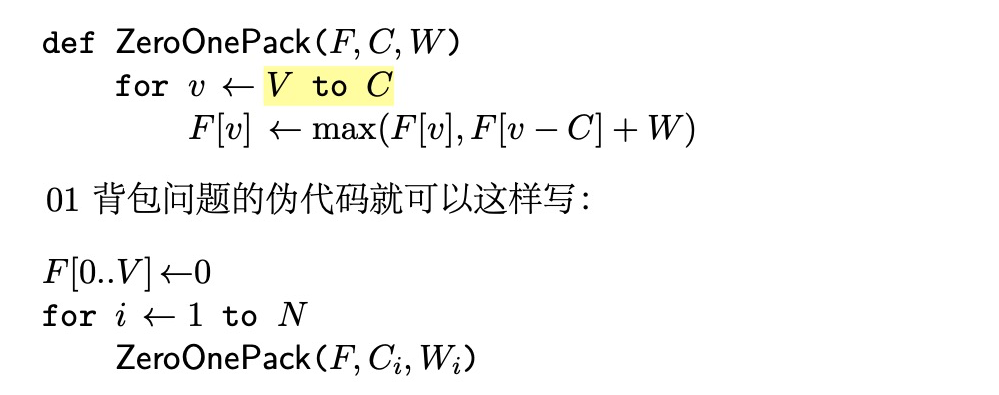
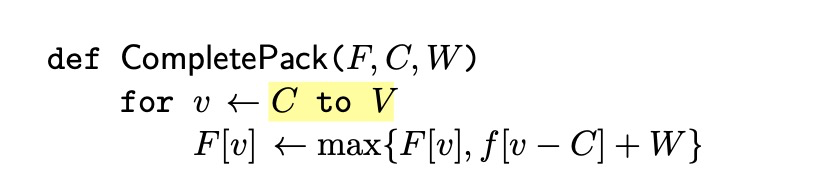
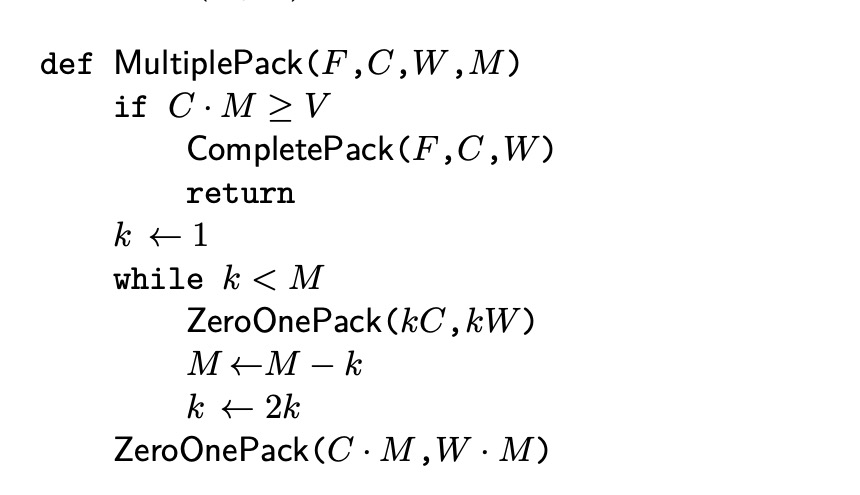
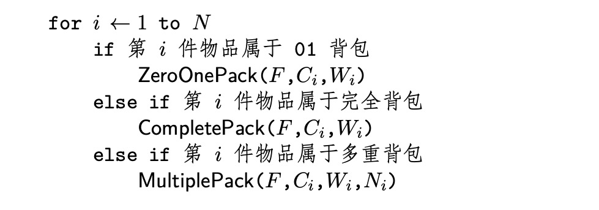
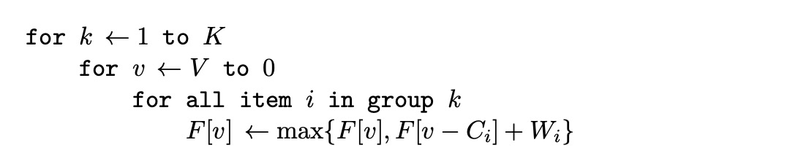
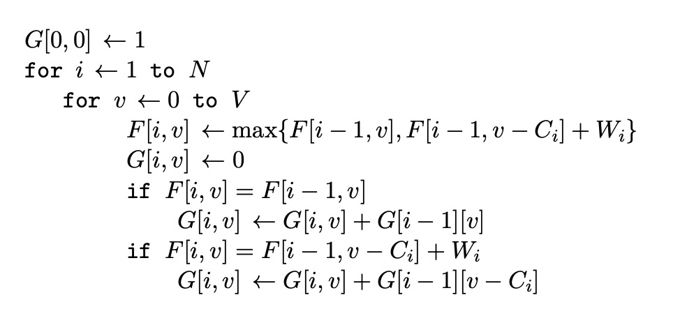
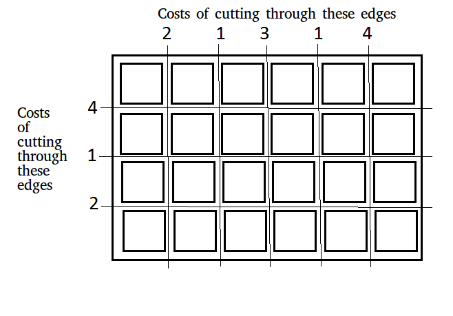

# 07.26-08.01 回顾

- 本周之前刷题数目：161
- 本周之后刷题数目：168 （根据leetcode统计，未包含非leetcode的题目）

### 1. Dynamic Programming Part II

- 动态规划的问题一般是**求最值**。求最值的核心问题是**穷举**，列出所有的可能性，然后找出其中的**最值**。 
  - 穷举过程中，会有**重叠子问题**。通过memorization来避免不必要的重复计算。
  - 动态规划问题一定会**具备「最优子结构」**，才能通过子问题的最值得到原问题的最值。
  - 穷举所有可行解其实并不是一件容易的事，只有列出**正确的「状态转移方程」**才能正确地穷举。
  - 重叠子问题、最优子结构、状态转移方程就是动态规划三要素。

- 一个思维框架，辅助你思考状态转移方程：

  **明确 base case -> 明确「状态」-> 明确「选择」 -> 定义 dp 数组/函数的含义**。

- 动态规划的标准框架：

  - 第一步**要明确两点，「状态」和「选择」**。

    先说状态，如何才能描述一个问题局面？只要给定几个可选物品和一个背包的容量限制，就形成了一个背包问题，对不对？**所以状态有两个，就是「背包的容量」和「可选择的物品」**。

    再说选择，也很容易想到啊，对于每件物品，你能选择什么？**选择就是「装进背包」或者「不装进背包」嘛**。明白了状态和选择，动态规划问题基本上就解决了，只要往这个框架套就完事儿了：

    ```
    for 状态1 in 状态1的所有取值：
        for 状态2 in 状态2的所有取值：
            for ...
                dp[状态1][状态2][...] = 择优(选择1，选择2...)
    ```

    PS：此框架出自历史文章 [团灭 LeetCode 股票买卖问题](https://leetcode-cn.com/problems/best-time-to-buy-and-sell-stock-iv/solution/yi-ge-tong-yong-fang-fa-tuan-mie-6-dao-gu-piao-w-5/)。 

  - 第二步**要明确`dp`数组的定义**。

    `dp`数组是什么？其实就是描述问题局面的一个数组。换句话说，我们刚才明确问题有什么「状态」，现在需要用`dp`数组把状态表示出来。

    首先看看刚才找到的「状态」，有两个，也就是说我们需要一个二维`dp`数组，一维表示可选择的物品，一维表示背包的容量。

    **`dp[i][w]`的定义如下：对于前`i`个物品，当前背包的容量为`w`，这种情况下可以装的最大价值是`dp[i][w]`。**

    PS：为什么要这么定义？便于状态转移，或者说这就是套路，记下来就行了。建议看一下我们的动态规划系列文章，几种动规套路都被扒得清清楚楚了。

    **根据这个定义，我们想求的最终答案就是**`dp[N][W]`。base case 就是`dp[0][..] = dp[..][0] = 0`，因为没有物品或者背包没有空间的时候，能装的最大价值就是 0。

- 01背包问题

  ```python
  class Solution:
      def knapSack(self, value, weight, capacity):
          dp = [[0] * (capacity + 1) for _ in range(len(weight)+1)]
          
          for i in range(1, len(weight)+1):
              for j in range(1, capacity+1):
                  if weight[i-1] <= j:
                      dp[i][j] = max(dp[i-1][j], value[i-1] + dp[i-1][j-weight[i-1]] ) 
                  else:
                      dp[i][j] = dp[i-1][j] 
          return dp[-1][-1] 
  ```

- #### [1143. 最长公共子序列](https://leetcode-cn.com/problems/longest-common-subsequence/) 

  ```python
  class Solution:
      def longestCommonSubsequence(self, text1: str, text2: str) -> int: 
          dp = [[0]* (len(text2)+1) for _ in range(len(text1)+1)] 
          for i in range(1,len(text1)+1):
              for j in range(1,len(text2)+1):
                  if text1[i-1] == text2[j-1]:
                      dp[i][j] = dp[i-1][j-1] + 1 
                  else:
                      dp[i][j] = max(dp[i-1][j], dp[i][j-1]) 
          return dp[-1][-1] 
  ```

- #### [300. 最长上升子序列](https://leetcode-cn.com/problems/longest-increasing-subsequence/) 

  ```python
  # 使用LCS实现LIS，O(n^2) 
  class Solution:
      def lengthOfLIS(self, nums: List[int]) -> int: 
          nums1 = nums[:] 
          nums2 = []
          nums1.sort() 
          for i in range(len(nums1)):
              if i == 0 or nums1[i] != nums1[i-1]:
                  nums2.append(nums1[i]) 
          n = len(nums) 
          m = len(nums2)
          dp = [[0]*(m+1) for _ in range(n+1)] 
  
          for i in range(1,n+1):
              for j in range(1, m+1):
                  if nums[i-1] == nums2[j-1] :
                      dp[i][j] = dp[i-1][j-1] + 1
                  else:
                      dp[i][j] = max(dp[i-1][j],dp[i][j-1]) 
          return dp[-1][-1] 
  ```

  ```python
  # O(nlog n)
  class Solution:
      def lengthOfLIS(self, nums: List[int]) -> int: 
          if len(nums) == 0:
              return 0
          dp = [ nums[0] ] 
          for i in range(1,len(nums)):
              if nums[i] > dp[-1]:
                  dp.append(nums[i]) 
              else:
                  l, r = 0, len(dp)-1
                  while l<r:                  # 这段代码相当于bisect_left，想想为啥不是bisect
                      mid = l + (r-l) // 2
                      if nums[i] > dp[mid]:
                          l = mid + 1
                      else:
                          r = mid 
                  dp[l] = nums[i] 
          return len(dp) 
  ```

- #### [322. 零钱兑换](https://leetcode-cn.com/problems/coin-change/) 

  想想和背包问题的区别（其实是一种特殊的背包问题，必须装满，初始化和普通背包问题不同）

  ```python
  class Solution:
      def coinChange(self, coins: List[int], amount: int) -> int: 
          res = [sys.maxsize] * (amount + 1) 
          res[0] = 0 
          for coin in coins: 
              for i in range(coin,amount+1):
                  res[i] = min(res[i], res[i-coin]+1) 
          return res[-1] if res[-1] != sys.maxsize else -1 
  ```
  
- #### [518. 零钱兑换 II](https://leetcode-cn.com/problems/coin-change-2/) 

  ```python
  class Solution:
      def change(self, amount: int, coins: List[int]) -> int:
          dp = [0] * (amount+1) 
          dp[0] = 1 
          for c in coins:
              for i in range(c, amount+1):
                  dp[i] = dp[i] + dp[i-c] 
          return dp[-1] 
  ```

  ```python
  # 错误解法，想想为什么
  class Solution:
      def change(self, amount: int, coins: List[int]) -> int:
          dp = [0] * (amount+1) 
          dp[0] = 1 
          for i in range(amount+1):
              for c in coins:
                  if i < c:
                      continue
                  dp[i] = dp[i] + dp[i-c] 
          return dp[-1] 
  ```

  https://leetcode-cn.com/problems/coin-change-2/solution/python3-dong-tai-gui-hua-by-wang-zhe-3/

- 背包问题总结

  -  $F(i,v)$ 的含义：将前 $i$ 件物品放入容量为 $v$ 的背包中 

  - **01背包**
    $$
    F(i,v) = \max\left(F(i-1,v),\, F(i-1,v-C_i)+W_i \right)
    $$
    空间复杂度优化之后：
    

    

  - **完全背包**  
    $$
    F(i,v) = \max\left(F(i-1,v),\, F(i,v-C_i)+W_i \right)
    $$
    空间复杂度优化之后：

    

    
  
  - **多重背包**
  $$
    F[i, v]=\max \left\{F\left[i-1, v-k * C_{i}\right]+k * W_{i} \mid 0 \leq k \leq M_{i}\right\}
  $$
    复杂度是 $O\left(V \Sigma M_{i}\right)$ ，可将其这些物品进行组合，令系数为 $$1,2,2^{2} \ldots 2^{k-1}, M_{i}-2^{k}+1$$ ，从而将复杂度下降为 $O(V\sum\log M_i)$ 。函数定义如下（太妙了！！）： 
  
  
  
  还有一种 $O(NV)$ 的算法
  
    

  -  **混合背包** 

     
  
  - **二维费用的背包问题** 
    $$
    F[i, v, u]=\max \left\{{F}[{i}-1, {v}, {u}], {F}\left[{i}-1, {v}-{C}_{{i}}, {u}-{D}_{{i}}\right]+{W}_{{i}}\right\}
    $$
    如前所示，可以优化存储空间，使用一个二维数组，当每件物品只能取一次时，逆序循环 $u,v$ ；当物品有无穷多时，顺序循环 $u,v$ ，当物品是多重时，拆分物品。
  
  - **分组背包问题**  
    $$
    F[k, v]=\max \left\{F[k-1, v], F\left[k-1, v-C_{i}\right]+W_{i} \mid \text { item } i \in \operatorname{group} k\right\}
    $$
    伪代码如下：
  
    
  
  - **背包问题的初始化** 
  
    - 恰好装满背包：$F[0]=0,\ F[1,...,V]=-\infin $ 
    - 不是必须装满：$ F[0,...,V]=0$ 
  
  - **背包问题的问法变化** 
  
     - 输出方案 
  
        ```python
        i = N
        v = V 
        while i > 0:
            if F[i][v] == F[i-1][v]:
                print("未选择第i项物品") 
            elif F[i][v] == F[i-1][v-C[i]] + W[i]:
                print("选择了第i项物品") 
                v -= weight[i]
            i -= 1
        ```
  
     -  求方案总数 
        $$
        F[i, v]=\operatorname{sum}\left\{F[i-1, v], F\left[i, v-C_{i}\right]\right\}
        $$
        初始条件是 $F[0,0]=1$ ，适用于完全背包问题。
  
     -  最优方案总数 
  
        
  
  - **参考资料：** 
  
    - [背包九讲](../books/背包9讲V2.pdf) 


### 2. Greedy Algorithm

- 贪心算法：在对问题求解时，总是做出在当前看来是最好的选择。

- 适用前提：局部最优策略能导致产生全局最优解。

- 贪心算法 vs 动态规划：
  - 动态规划是bottom-up求解，贪心算法是top-down，每一次贪心选择将问题简化为规模更小的子问题。
  - 动态规划中有重复计算的子问题，需要memorization。贪心算法每一步直接取局部最优解。

- 活动问题：

  - N个活动，每个活动的开始时间为si，结束时间是fi。如果 si ≥ fj or sj ≥ fi 则可以定义这两场活动不冲突。试着找到一种能够找到最多的非冲突活动的集合(S)。也就是说无法找到集合S’ 使得|S’| > |S|。
  - 输入：`[(0,6),(3,4),(1,2),(5,7),(8,9),(5,9)]` 
  - 输出：`[(1, 2), (3, 4), (5, 7), (8, 9)]` 

  ```python
  # 要活动数量最多，则要找时间短的（结束早），先结束后再找其他的。
  def printMaxActivities(acts):
      acts.sort(key=lambda x:x[1])
      res = []
      for i in range(len(acts)): 
          if i == 0 or acts[i][0] >= res[-1][1]:
              res.append(acts[i]) 
      return res 
  ```

- 最小数字问题

  - 如何找到给定数字总和s和位数m的最小数字?
  - 输入: `s = 9, m = 2`。输出: `18 ` 
  - 输入: `s = 20, m = 3`。输出: `299` 

  ```python
  def findSmallest(m, s):
      if s > m * 9 or s <0:
          return -1 
      if s == 0:
          if  m == 1:
              return 0 
          else:
              return -1
      res = [0] * m 
      s -= 1                              # 先为首位留出1 
      for i in range(m-1,0,-1):
          res[i] = min(9,s) 
          s = max(0, s-res[i]) 
      res[0] = 1 + s 
      return "".join([str(i) for i in res])
  ```

- 以最低的成本连接绳索

  - 有n条不同长度的绳索，我们需要将这些绳索连接成一根绳子。连接两条绳索的成本等于它们长度的总和。我们需要以最低的成本连接绳索。

  - 例如，如果我们获得4条长度为4，3，2和6的绳索，我们可以通过以下方式 连接绳索。

    1)首先连接长度为2和3的绳索。现在我们有三根长度为4，6和5的绳索。 

    2)现在连接长度为4和5的绳索。现在我们有两根长度为6和9的绳索。 

    3)最后连接两条绳索，所有绳索已连接。

  - 连接所有绳索的总成本为5+9+15=29。

  ```python
  import heapq
  def ropeCost(ropes):
      if len(ropes) == 0:
          return 0
      heapq.heapify(ropes)
      total = 0
      while len(ropes)>1:
          a = heapq.heappop(ropes)
          b = heapq.heappop(ropes)
          total += a+b
          heapq.heappush(ropes,a+b) 
      return total
  ```

- 最小站台数

  根据所有到达火车站的列车的到达和离开时间，找到火车站所需的最少数量的平台，以免列车等待。我们给出了代表停止列车到达和离开时间的两个数组，例子:

  ```c++
  arr [] = {9:00, 9:40, 9:50, 11:00, 15:00, 18:00}
  dep [] = {9:10, 12:00, 11:20, 11:30, 19:00, 20:00}
  ```

  输出：3

  ```python
  def findPlatform(arr, dep, n):
      arr.sort()
      dep.sort() 
      
      res = 0
      i, j = 0, 0
      platform = 0
      while i<n and j<n:
          if arr[i] < dep[j]:
              platform += 1
              res = max(res,platform)
              i += 1
          else:
              platform -= 1
              j += 1
      return res 
  ```

- 将板子切割成正方形的最小成本

  给定一个长度为m和宽度为n的电路板，我们需要将这个电路板分成m*n个正方形，使得断开成本最小。每个板的切割成本将提供给电路板。总之，我们需要选择这样的一系列切割，以使成本最小化。

  

  ```python
  def minimumCostOfBreaking(X, Y, m, n):
      X.sort(reverse=True)
      Y.sort(reverse=True) 
      
      res = 0
      i, j = 0, 0  
      n_ver, n_hon = 1, 1
      while i<m and j<n :
          if X[i] < Y[j]:
              res += Y[j] * n_hon 
              n_ver += 1
              j += 1
          else:
              res += X[i] * n_ver 
              n_hon += 1 
              i += 1 
      
      while i < m:
          res += X[i] * n_ver 
          i += 1
      while j < n:
          res += Y[j] * n_hon
          j += 1
      return res 
  
  m, n = 5, 3
  X = [2, 1, 3, 1, 4]
  Y = [4, 1, 2]
   
  print(minimumCostOfBreaking(X, Y, m, n))
  ```

- 字典中最小的数组 

  给定一个数组arr[ ]，找到在最多K次连续交换之后可以获得的字典顺序最小的数组。

  输入：`arr = [7,6,9,2,1], k = 3` 

  输出：`arr = [2,7,6,9,1]` 

  ```python
  def minimizeWithKSwaps(arr, n, k):
      for i in range(n):
          pos = i 
          for j in range(i+1,n):
              if j-i>k:
                  break 
              if arr[j] < arr[pos]:
                  pos = j 
          while pos > i:
              arr[pos],arr[pos-1] = arr[pos-1], arr[pos]
              pos -= 1
              k -= 1
      return arr 
  ```

- 逃脱游戏

  你作恶多端，终于被警方追捕。你逃到了一条神秘的街道，街道里有一排格子，每个格子里有一个数字（一个非负整数的数组），表示着你在当前格子里最多可以跳跃的步数，刚开始你在街道的这一头（数组的第一个位置），问你能不能逃脱成功，跳到街道的另外一头（数组里的最后一个位置）。

  ```
  输入：[2,3,1,1,4] 
  输出：True
  ```

  ```python
  # O(n^2) 
  def canJump(nums):
      if len(nums) == 0:
          return False 
      jump = [False] * len(nums) 
      jump[-1] = True 
      for i in range(len(nums)-2,-1,-1): 
          furthestJump = min(i + nums[i], len(nums) - 1)
          for j in range(i+1, furthestJump+1):
              if jump[j]:
                  jump[i] = True 
                  break 
      return jump[0] 
  ```

  ```python
  # O(n)
  def canJump(nums):
      pos = len(nums) -1 
      for i in range(len(nums)-2,-1,-1):
          if nums[i] + i >= pos:
              pos = i 
      return pos == 0
  ```


### 3. Bit manipulation 

- 位操作

  - 与
  - 或
  - 非
  - 异或：相异是是或操作，相同时为0 
  - 左移位
  - 右移位

- python的 `bin()` 函数可以将数字显示为二进制

- 基本技巧

  - bit ^ 1 翻转

  - bit ^ 0 不变

  - set bit 

    ```python
    num | (1<<n)    # 最右边是第0位，下同
    ```

  - clear bit

    ```python
    num & ~(1<<n)
    ```

  - toggle bit 

    ```python
    num ^ (1<<n) 
    ```

  - test bit 

    ```python
    def testBit(num, n):
        res = num & (1<<n)
        return res != 0
    ```

- 将整数转换为Bits(二进制)

  ```python
  # 自己写的
  def int2bin(n):
      res = ''
      while n//2:
          res += str(n%2)
          n //= 2
      res += str(n)
      return res[::-1]
  ```

  ```python
  # 万门版本，按位操作
  def toBinary(n):
      sb = []
      if n < 256:
          upper = 128
      else:
          upper = 32768
      i = upper
      while i > 0:
          if n & i != 0:
              sb.append(str(1))
          else:
              sb.append(str(0))
          i = i >> 1
      return ''.join(sb)
  ```

  

- 将Bits(二进制)转换为整数

  ```python
  def convertBits2Int(binary):
      length = len(binary)
      result = 0
      if length > 16:
          raise ValueError("Only Supports 16 Bits")
      for i in range(length):            # 从高位开始
          c = int(binary[i])
          if (c != 0 and c != 1):
              raise ValueError("binary can only be 0 or 1")
          result = (result << 1) + c
      return result
  ```

- 用Bits展示小数。

  ```python
  def convertDecimal(f):
      int_part, dec_part = divmod(f,1) 
      int_part = int(int_part)
      print(int_part,dec_part)
      
      int_s = "" 
      while int_part//2:
          int_s += str(int_part % 2)
          int_part //= 2 
      int_s += str(int_part) 
      int_s = int_s[::-1] 
      
      dec_s = "" 
      while dec_part:
          if len(dec_s)>16:
              print(dec_s)
              raise ValueError("Error") 
  
          dec_part = dec_part * 2 
          if dec_part >= 1:
              dec_s += "1"
              dec_part -= 1
          else:
              dec_s += "0"
      return int_s  +"."+ dec_s
  ```

  

- 将HEX转换为整数 

  ```python
  def hex2int(s):
      digits = "0123456789ABCDEF"
      val = 0
      for i in range(len(s)):
          c = s[i].upper()
          d = digits.index(c)
          val = 16 * val + d
      return val
  ```

  

- 将整数转换为HEX 

  ```python
  def int2hex(d):
      digits = "0123456789ABCDEF" 
      res = ""
      while d//16:
          res += digits[d%16]
          d //= 16 
      res += digits[d] 
      return res[::-1]
  ```

  

- #### [191. 位1的个数](https://leetcode-cn.com/problems/number-of-1-bits/) 

  ```python
  class Solution:
      def hammingWeight(self, n: int) -> int:
          count = 0
          while n:
              n &= (n-1)
              count += 1
          return count
  ```

- (n & (n – 1) == 0)可以检测的是：是否是2的幂

- #### [231. 2的幂](https://leetcode-cn.com/problems/power-of-two/) 

  ```python
  class Solution:
      def isPowerOfTwo(self, n: int) -> bool:
          if n == 0:                      # 注意这个special case 
              return False
          return (n & (n-1)) == 0
  ```

- 下一个2的幂数

  给定一个整数n, 找到下一个数(这个数比n大，且是2的幂数)

  ```python
  def next2Power(n):
      c = 0 
      while n:
          c += 1
          n >>= 1
      return 1 << c 
  ```

  ```python
  def next2Power(n):
      while (n & (n-1) != 0):
          n = n & (n-1)
      return n << 1
  ```

- 检测两个整数的是否有相反符号

  给定两个整数，检查他们是否有相同的符号

  ```python
  def isOppositeSigns(a, b):
      return (a^b) < 0
  # 会比乘法快得多 
  ```

- 乘以7

  给定一个整数 x，不使用乘法，计算`7 * x`。 

  ```python
  (x << 3) - x
  ```

- 计算一个整数的符号 

  ```python
  def isPositiveInteger(n):
      return (n >> 31) == 0
  ```

- 不使用分支计算一个整数的绝对值

  ```python
  def absoluteA(a):
      mask = a >> 31
      result = (a + mask) ^ mask
      return result
  ```

  - 负数用反码表示，右移的时候左边补1，
  - 原码取反得到反码，反码+1得到补码。

- 就地(in-place)整数交换

  ```python
  def swap2(a, b):
      a = b - a
      b = b - a
      a = a + b
      print(a, b)
  ```

  ```python
  def swap3(a, b):
      a = a ^ b
      b = a ^ b
      a = a ^ b
      print(a, b)
  ```

- 将整数A转换为整数B

  计算将整数A转换为整数B所需要的位数

  ```python
  def convertA2B(a, b):
      count = 0
      c = a ^ b
      while (c != 0):
          c = c & (c - 1)
          count += 1
      return count
  ```

- 不使用算术运算符进行添加

  写一个两数相加的函数。不可以使用+或者任何算术运算符。

  ```python
  def add(a, b):
      if b == 0:
          return a
      sum = a ^ b            # 注意是异或，不是或
      carry = (a & b) << 1
      return add(sum, carry)
  ```

- Amazing Mask （微软面试题）

  给定两个32-bit的数，N和M，以及两个比特位置 i 和 j 。写一个方法，这个方法可以将N的i到j之间的值设置为M(即，M变成N的i到j之间的一个子串) 

  ```python
  def amazingMask(n, m, i, j):
      allOne = ~0
      left = allOne - ((1<<(j+1))-1)
      right = (1<<i)-1
      mask = left | right
  
      return (n & mask) | (m << i)
  ```

  - 全1技巧：0取反
  - 后n位是1技巧：1左移n位再减一 

- 在一个无穷的数据流中，挑选一个概率相等的数字。

  ```python
  def getNumFromSteam(nums):
      res = nums[0]
      idx = 1
      while True:
          idx += 1
          if random.rand() < 1/idx:
              res = nums[idx-1] 
             
  ```

  - 拓展，要从无穷数据流中取m个数的方法：
    1. 前m个数都留下
    2. 从第m+1个数开始，以m/(n+1) 的概率将该数留下，随机替换m个数中的一个。
  - 证明：
    - 假设当前m个数是从n个数中得到的，概率为n/m 
    - 则第n+1个数有两种情况，一种是被留下，一种是被放走
    - 放走时，概率为 $m/n * (1-m/(n+1)) = m(n+1-m)/n(n+1)$   
    - 留下时，留下的数的概率为 m/(n+1) ，其他数留下的概率为  $m/n * m/(n+1) * (m-1)/m = m(m-1)/n(n+1)$  
    - 根据全概率公式，将两种概率相加得到：m/(n+1) 
  - https://blog.csdn.net/yangcs2009/article/details/38385295


### 4. String

- 偶数子串的数量

  给定一串0到9的数字。任务是计算在将整数转换为偶数时的子串的数量。

  ```
  - Input : str = "1234". 
  - Output : 6
  - “2”, “4”, “12”, “34”, “234”, “1234是6个子字符串，它们是偶数。
  ```

  ```python
  def evenNum(s):
      res = 0 
      for i in range(len(s)):
          if int(s[i]) % 2 == 0:
              res += i + 1
      return res 
  ```

- 对具有相同首尾字符的子字符进行计数

  给出一个字符串S，我们需要找到所有连续的子字符串开始和结束的字符都相同的计数。

  ```
  Input : S = "abcab"
  Output : 7
  "abcab" 有15个子字符串
  在上面的子串中，有7个子串满足要求:a，abca，b，bcab，c，a和b。
  ```

  ```python
  from collections import Counter
  def countSub(s):
      c = Counter(s) 
      res = 0
      for k, v in c.items():
          res += v * (v+1) // 2
      return res 
  ```

- 查找字符串中的所有相同字母异序词

  给定字符串s和非空字符串p,在s中找到所有p的相同字母异序词的起始索引。 ž 字符串只包含小写英文字母，字符串s和p的长度不会超过20,100。输出的顺序并不重要。

  ```
  Input: s: "cbaebabacd" p: "abc"
  Output: [0, 6]
  解释:
  以0作为起始索引的子序列是 “cba”，它是"abc"的相同字母异序词. 
  以6作为起始索引的子序列是 “bac”，它是"abc"的相同字母异序词.
  ```

  ```python
  from collections import Counter
  def findAnagrams(s, p): 
      res = []
      s_counter = Counter(s[:len(p)-1])
      p_counter = Counter(p) 
      
      for i in range(len(p)-1,len(s)):
          s_counter[s[i]] += 1
          if s_counter == p_counter:
              res.append(i-len(p)+1)
          s_counter[s[i-len(p)+1]] -= 1          # 索引细节出错
          if s_counter[s[i-len(p)+1]] == 0:
              del s_counter[s[i-len(p)+1]]
      return res 
  ```

  - 首先想到的是 $O(n^2)$ 算法，然后采用滑动窗进行优化。注意索引细节。

-  移位

  给定两个字符串s1和s2，写一段程序说明s2是否是s1 的移位。

  ```python
  def areRotations(string1, string2):
      if len(string1) != len(string2):  # 容易漏掉的判断
          return False
      temp = string1 + string1
      return temp.find(string2) >0
  ```

- 移位 II

  写一个函数 rotate(arr[], d, n) 将大小为n的数组arr[] 原地移位d个单位。

  ```python
  def rotate(arr, d):
      reverse(arr,0,d-1)
      reverse(arr,d,len(arr)-1)
      reverse(arr,0,len(arr)-1)
      return arr
      
  def reverse(s, l, r):
      while l < r:
          s[l], s[r] = s[r], s[l] 
          l += 1
          r -= 1 
  ```

  - 三段翻转技巧

- 移位回文

  检查给定的字符串是否是一个回文字符串的移位。

  ```python
  def isRotationOfPalindrome(s):
      n = len(s)
      s = s + s
      for i in range(n):
          if isPalindrome(s[i : i + n]):
              return True
      return False
  ```

- 回文流判定 

  ```java
  Input: str[] = "abcba"
  Output: a Yes   // "a" is palindrome
          b No    // "ab" is not palindrome
          c No    // "abc" is not palindrome
          b No    // "abcb" is not palindrome
          a Yes   // "abcba" is palindrome
  
  Input: str[] = "aabaacaabaa"
  Output:  a Yes   // "a" is palindrome
           a Yes   // "aa" is palindrome
           b No    // "aab" is not palindrome 
           a No    // "aaba" is not palindrome  
           a Yes   // "aabaa" is palindrome  
           c No    // "aabaac" is not palindrome  
           a No    // "aabaaca" is not palindrome  
           a No    // "aabaacaa" is not palindrome  
           b No    // "aabaacaab" is not palindrome  
           a No    // "aabaacaaba" is not palindrome  
           a Yes   // "aabaacaabaa" is palindrome  
  ```

  ```python
  # d is the number of characters in input alphabet
  d = 256
   
  # q is a prime number used for evaluating Rabin Karp's
  # Rolling hash
  q = 103
   
  def checkPalindromes(string):
   
      # Length of input string
      N = len(string)
   
      # A single character is always a palindrome
      print(string[0] + " Yes")
   
      # Return if string has only one character
      if N == 1:
          return
   
      # Initialize first half reverse and second half for
      # as firstr and second characters
      firstr = ord(string[0]) % q
      second = ord(string[1]) % q
   
      h = 1
      i = 0
      j = 0
   
      # Now check for palindromes from second character
      # onward
      for i in range(1,N):
   
          # If the hash values of 'firstr' and 'second'
          # match, then only check individual characters
          if firstr == second:
   
              # Check if str[0..i] is palindrome using
              # simple character by character match
              for j in range(0,i//2):
                  if string[j] != string[i-j]:
                      break
              j += 1
              if j == i//2:
                  print(string[i] + " Yes")
              else:
                  print(string[i] + " No")
          else:
              print(string[i] + " No")
   
          # Calculate hash values for next iteration.
          # Don't calculate hash for next characters if
          # this is the last character of string
          if i != N-1:
   
              # If i is even (next i is odd)
              if i % 2 == 0:
   
                  # Add next character after first half at
                  # beginning of 'firstr'
                  h = (h*d) % q
                  firstr = (firstr + h*ord(string[i//2]))%q
   
                  # Add next character after second half at
                  # the end of second half.
                  second = (second*d + ord(string[i+1]))%q
              else:
                  # If next i is odd (next i is even) then we
                  # need not to change firstr, we need to remove
                  # first character of second and append a
                  # character to it.
                  second = (d*(second + q - ord(string[(i+1)//2])*h)%q
                              + ord(string[i+1]))%q 
  ```

  

- 数出“1(0+)1”模式的发生次数

  给定一个字母数字字符串，找出给定字符串中出现模式1(0+)1的次数。 这里， (0+)表示存在连续0的非空序列。

  ```python
  def patternCount(s):
      flag = False 
      count = 0
      last = 0
      for i in range(len(s)):
          if (not flag) and (s[i] == "1"):
              flag = True 
              last = i 
          elif flag and s[i] == "1":        # 这个判断要先于下个判断，想想为啥
              if i - last > 1:
                  count += 1
              last = i
          elif flag and s[i] != "0":
              flag = False 
              
      return count 
  ```

  


- #### [44. 通配符匹配](https://leetcode-cn.com/problems/wildcard-matching/) 

  ```python
  class Solution:
      def isMatch(self, s: str, p: str) -> bool: 
        dp = [[False] * (len(s)+1) for _ in range(len(p)+1)]
          dp[0][0] = True 
          for i in range(1,len(p)+1):    # 处理开头是*的特殊情况
              if p[i-1] == "*":
                  dp[i][0] = True 
              else:
                  break 
          for i in range(1,len(p)+1):
              for j in range(1,len(s)+1):
                  if p[i-1] == s[j-1] or p[i-1] == '?':
                      dp[i][j] = dp[i-1][j-1]
                  elif p[i-1] == "*":
                      dp[i][j] = dp[i-1][j] or dp[i][j-1]
                  else:
                      dp[i][j] = False 
          return dp[-1][-1]
  
  ```
  
  


# Plan of next week

- 


