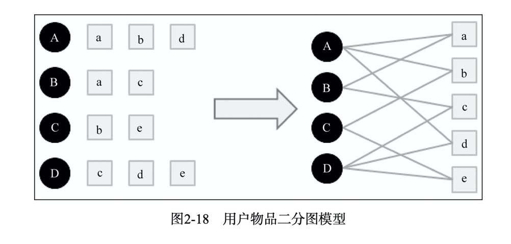
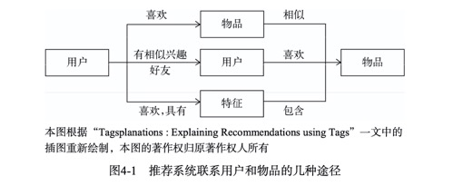
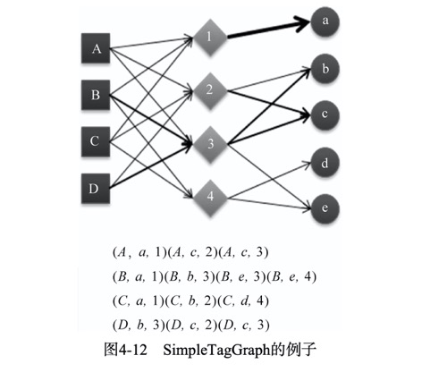
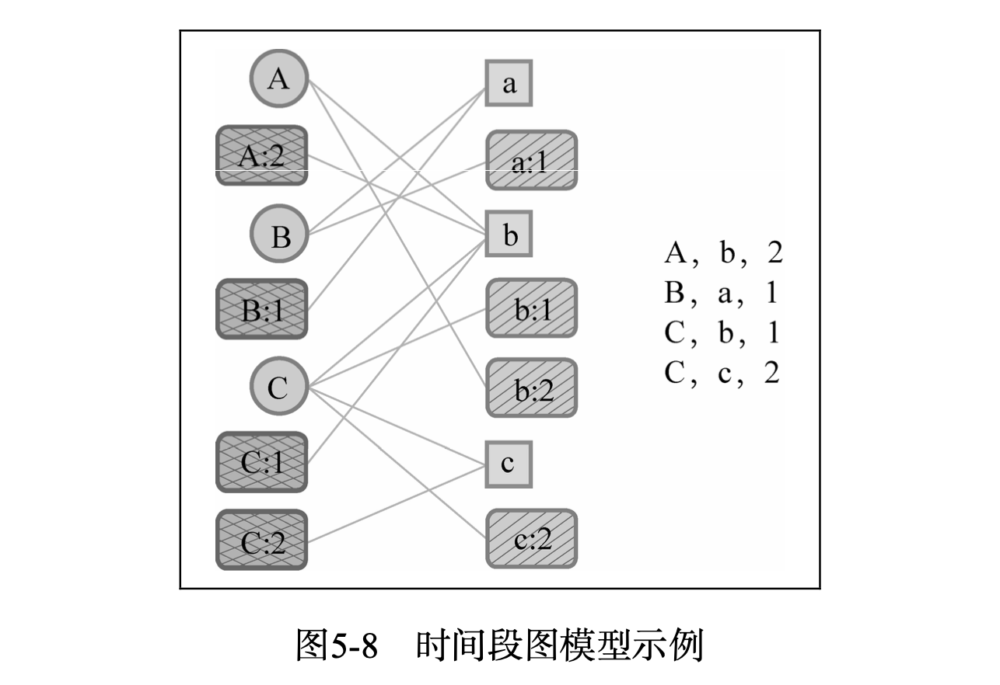
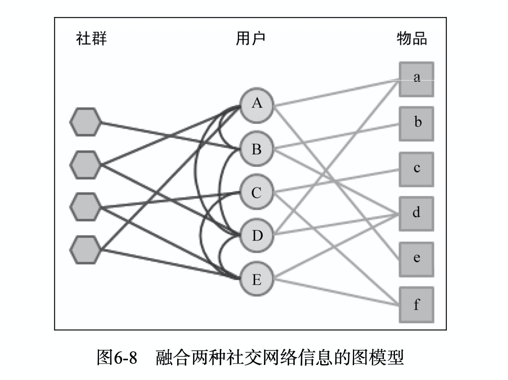
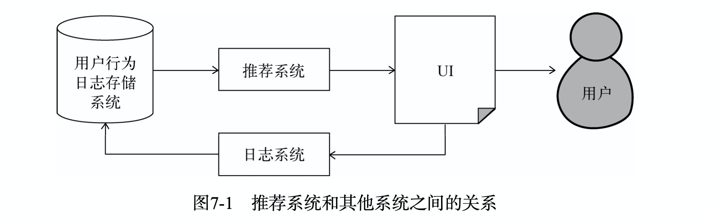
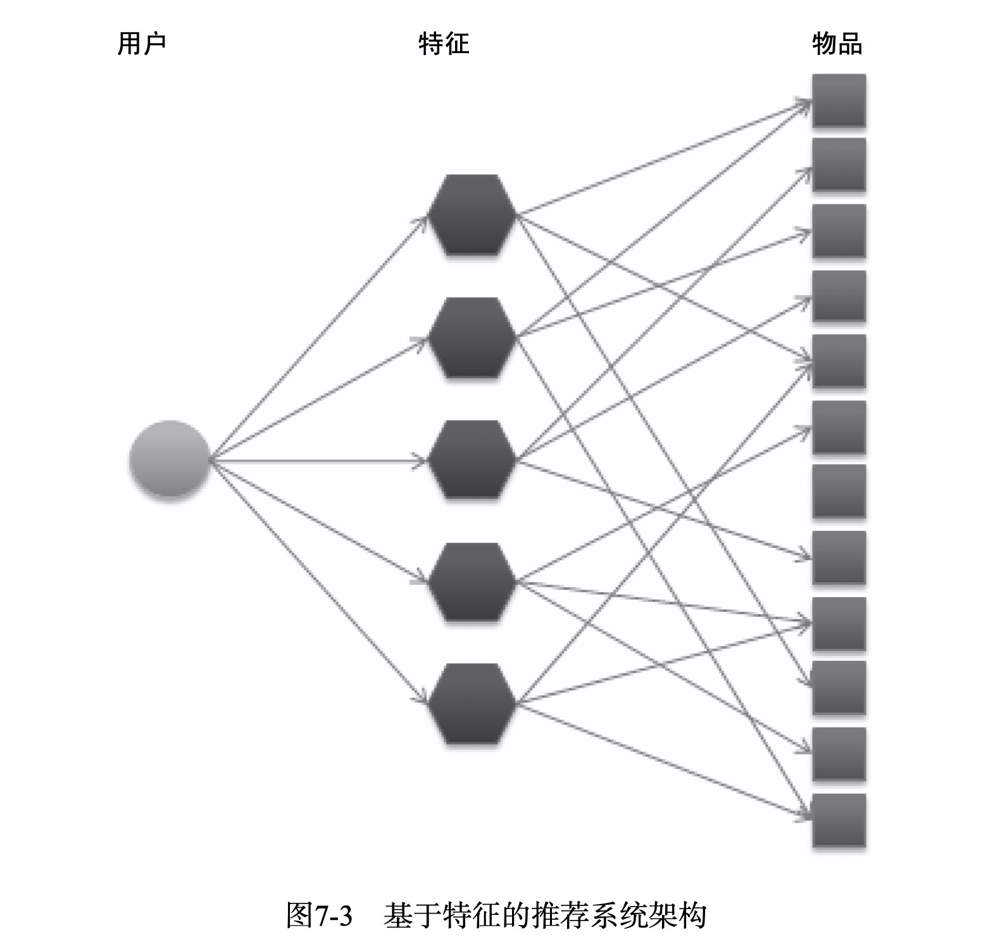
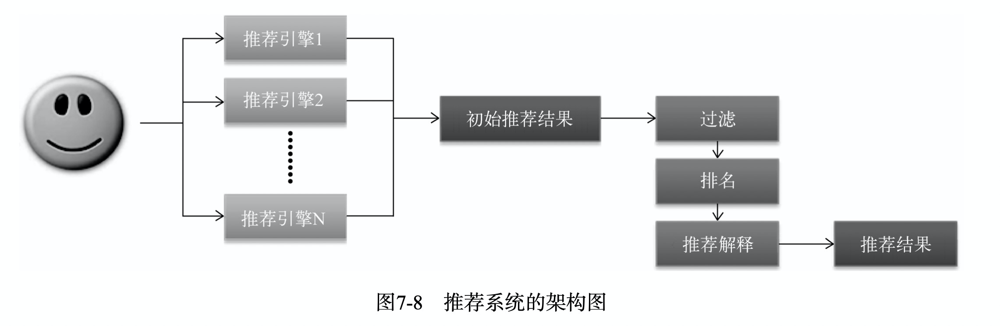
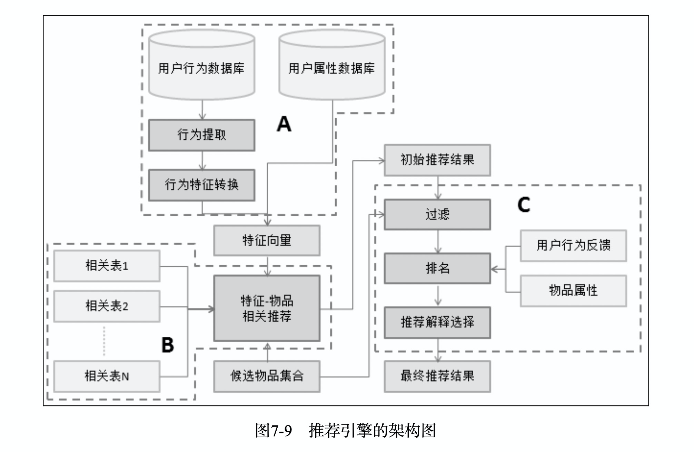

# 08.02-08.08 回顾

## 《推荐系统实战》笔记

## 第1章 好的推荐系统

### 1.1 什么是推荐系统

- 和分类目录、搜索引擎一起，解决信息过载问题。
- 和搜索引擎互补，在用户没有明确需求的时候，帮助用户发现感兴趣的新内容。
- 推荐系统可以更好地发掘物品的长尾(long tail)。

### 1.2 应用场景

- 电子商务、电影和视频、音乐、社交网络、阅读、基于位置的服务、个性化邮件和广告。

### 1.3 推荐系统评测

- 推荐系统实验方法：离线实验、用户调查、在线实验（ABtest）

- 一个新的算法上线，需要完成上述3个实验

  - 离线实验证明它在很多离线指标上优于现有的算法
  - 通过用户调查确定它的满意度不低于现有的算法
  - 通过在线AB测试确定它在我们关心的指标上优于现有的算法

- 评测指标：

  1. 用户满意度：通过问卷或在线实验获得。可以通过点击率、用户停留时间和转化率来衡量用户的满意度。

  2. 预测准确度：（最重要的离线指标）

     - 评分预测：预测用户对一个物品的评分，通过均方根误差（RMSE）和平均绝对误差（MAE）计算。
       $$
       \text{RMSE} = \sqrt{\frac{\sum_{u,i\in T}(r_{ui}-\hat r_{ui})^2}{|T|}} 
       $$

       $$
       \text{MAE}=\frac{\sum_{u,i\in T}|r_{ui}-\hat r_{ui}|}{|T|}
       $$

       RMSE加大了对于预测不准确物品的惩罚，评测更加苛刻。如果评分系统是整数，那么对于结果取整会见底MAE。

     - TopN推荐：给用户一个个性化推荐列表。通过precision和recall度量。
       $$
       \begin{align}
       \operatorname{Recall}&=\frac{\sum_{u \in U}|R(u) \cap T(u)|}{\sum_{u \in U}|T(u)|} \\
       \text { Precision }&=\frac{\sum_{u \in U}|R(u) \cap T(u)|}{\sum_{u \in U}|R(u)|}
       \end{align}
       $$
       选取不同的推荐列表长度*N*，计算出一组准确率/召回率，然后画出准确率/召回率曲线(precision/recall curve)。

     - TopN更适合应用需求，因为用户看完某一个物品之后，可能会打高分，但是实际上，用户可能不会看。（预测是否会看，比预测看完之后的评分更重要） 

  3. 覆盖率：推荐出来的物品占总物品集合的比例（发掘长尾的能力）
     $$
     \text { Coverage }=\frac{\left|\bigcup_{u \in \mathrm{U}} R(u)\right|}{|I|}
     $$
     其他的指标，信息熵和基尼系数
     $$
     H=-\sum_{i=1}^{n} p(i) \log p(i)\\
     G=\frac{1}{n-1} \sum_{j=1}^{n}(2 j-n-1) p\left(i_{j}\right)
     $$
     通过基尼系数，可以判断推荐系统是否具有马太效应（实际上是有的）。

  4. 多样性：满足用户广泛的兴趣，描述推荐列表中物品两两之间的不相似度。
     $$
     \text{Diversity} =1-\frac{\sum_{i, j \in R(u), i \neq j} s(i, j)}{\frac{1}{2}|R(u)|(|R(u)|-1)}
     $$
     其中，相似性函数 $s(i,j)$ 可以使用不同，如内容相似性函数、协同过滤相似性函数。

  5. 新颖性：推荐用户没听说过的商品。

     - 最简单的方法：利用推荐结果的平均流行度，越不热门的物品越容易让用户觉得新颖。
     - 通过牺牲精度来提高多样性和新颖性很容易，难的是在不牺牲精度的情况下提高多样性和新颖度。

  6. 惊喜度：推荐结果和用户的历史兴趣不相似，但是，用户很满意。

  7. 信任度：用户信任推荐系统，就会增加和推荐系统的互动。

     - 提高信任度的方法：1. 增加透明度，2. 考虑用户的社交网络

  8. 实时性：

     - 用户有行为之后，推荐列表变化的速率来评测。
     - 新加入系统的物品，是否可以推荐给用户（冷启动问题）。

  9. 健壮性

     - 常见攻击手段：同时购买两件商品、恶意刷评论。
     - 测评方法：首先给定数据和算法，测试性能；然后模拟攻击加入噪声，再进行性能的测试。
     - 设计系统时，尽量采用代价高的用户行为。
     - 在使用数据之前，进行攻击检测，进行数据的清理工作。

  

## 第2章 利用用户数据

### 2.1 用户数据简介

- 用户行为推荐系统中，分为两种：显性反馈行为和隐性反馈行为
- 本章使用的数据是：无上下文信息的隐性反馈数据。

### 2.2 用户行为分析

- 互联网上很多数据分布都满足Power Law的分布，也称为长尾分布。
- 物品的流行度：对物品产生过行为的用户总数。
- 用户的活跃度：用户产生过行为的物品总数。
- 新用户倾向于热门的物品，老用户会逐渐开始浏览冷门物品。
- 仅仅基于用户行为数据设计的推荐算法称为协同过滤算法，协同过滤算法又可以分为：基于邻域的方法、隐语义模型、基于图的随机游走算法。

### 2.3 实验设计和算法测评

- 数据集：由GroupLens提供的MovieLens数据集。
- 实验设计：离线的M折交叉验证，研究基于隐性反馈数据的TopN推荐问题。
- 评价指标：precision、recall、coverage、新颖度（平均流行度）

### 2.4 基于邻域的算法

#### 2.4.1 User CF 

- User CF的两个步骤：

  1. 找到和目标用户兴趣相似的用户集合； 
  2. 找到这个集合中用户喜欢的，但是目标用户没听过的物品推荐给用户

- 两个用户相似度的度量（余弦相似度）：
  $$
  w_{uv} = \frac{|N(u) \bigcap N(v)|}{\sqrt{|N(u)||N(v)|}}
  $$
  其中，$N(u)$  表示用户 $u$ 有过正反馈的物品集合。

- 用户 $u$ 对于物品 $i$ 的感兴趣程度为：
  $$
  p(u,i)=\sum_{v\in S(u,K) \bigcap N(i)} w_{uv}r_{vi} 
  $$
  其中， $S(u,K)$ 是和用户 $u$ 兴趣最相近的 $K$ 个用户，$N(i)$ 是对物品 $i$ 有过行为的用户集合， $r_{vi}$ 是用户 $v$ 对物品 $i$ 的兴趣，此处有 $r_{vi}=1$。

- 从实验结果来看：

  - $K$ 越大，参考的人越多，结果越接近热门商品，流行度越高，覆盖率就越低。 

- 用户相似度的改进（User-IIF）
  $$
  w_{uv} = \frac{ \sum_{i\in |N(u) \bigcap N(v)|}  \frac1{\log(1+|N(i)|)} }{\sqrt{|N(u)||N(v)|}}
  $$
  和User CF相比，惩罚了热门的物品。

- User-IIF 在各项离线指标的性能上都略优于 User CF。

#### 2.4.2 Item CF 

- 物品相似度
  $$
  w_{ij}=\frac{|N(i) \bigcap N(j)|}{\sqrt{|N(i)||N(j)|}}
  $$
  其中， $N(i)$ 表示对物品 $i$ 有过行为的用户集合。潜在的逻辑是：如果两个物品共同出现在很多用户的兴趣中，则它们具有很大的相似度。

- 用户 $u$ 对于物品 $j$ 的感兴趣程度为：
  $$
  p(u,j)=\sum_{i\in N(u)\bigcap S(j,K) } w_{ji}r_{ui}
  $$
  其中，$N(u)$ 是用户喜欢的物品的集合，$S(j,K)$ 是和物品 $j$ 最相似的 $K$ 个物品的集合，$w_{ji}$ 是物品 $j$ 和 $i$ 的相似度，$r_{ui}$ 是用户 $u$ 对物品 $i$ 的兴趣。(对于隐反馈数据集，如果用户 $u$ 对物品 $i$ 有过行为，即可令 $r_{ui}=1$ )。

- 物品相似度的改进（IUF - Inverse User Frequence） 
  $$
  w_{i j}=\frac{\sum_{u \in N(i) \cap N(j)} \frac{1}{\log (1+|N(u)|)}}{\sqrt{|N(i)||N(j)|}}
  $$
  惩罚了活跃度过高的用户。

- Item CF - IUF相比于Item CF，precision和recall比较接近，但是提高了覆盖率，降低了流行度。

- 相似度归一化可以提高推荐的准确度，也可以提高覆盖率和多样性。（各项离线指标都有提升）
  $$
  w_{i j}^{\prime}=\frac{w_{i j}}{\max _{j} w_{i j}}
  $$

- 哈利波特问题

  - 亚马逊上，任何购买一本书的人，几乎都会购买《哈利波特》。原因：《哈利波特》太热门了！！

  - 在公式
    $$
    w_{ij}=\frac{|N(i) \bigcap N(j)|}{\sqrt{|N(i)||N(j)|}}
    $$
    中，如果 $j$ 非常热门，那么分子就会越来越接近 $|N(i)|$ ，导致热门的 $j$ 会和很多物品都相似。

  - 改进办法：
    $$
    w_{i j}=\frac{|N(i) \cap N(j)|}{|N(i)|^{1-\alpha}|N(j)|^{\alpha}}
    $$
    其中，$\alpha \in [0.5, 1]$ ，可以惩罚热门的物品 $j$ 。当 $\alpha=0.5$ 时，就是普通的ItemCF。$\alpha$ 越大覆盖率越高，平均热门度也越低。通过这种方法，可以在适当牺牲准确率和召回率的情况下，显著提升覆盖率和新颖性。

#### 2.4.3 UserCF vs Item CF

- UserCF 推荐更加社会化，反映了用户所在小群体中物品的热门程度。

- ItemCF推荐更加个性化，反映了用户兴趣的传承。

- 综合对比：

  |          | UserCF                                                       | ItemCF                                                   |
  | -------- | ------------------------------------------------------------ | -------------------------------------------------------- |
  | 性能     | 适合用户少的场景                                             | 适用于物品数明显小于用户的场合                           |
  | 领域     | 时效性强，个性化兴趣不太明显的领域（如新闻）                 | 长尾物品丰富，个性化需求强烈的领域                       |
  | 实时性   | 用户的新行为，不一定导致推荐结果立即变化                     | 用户的新行为一定会导致结果实时变化                       |
  | 可解释性 | 可解释性差                                                   | 可解释性强                                               |
  | 冷启动   | 新物品上线后，只要有用户对它有行为，就可以推给类似的其他用户 | 没办法在不离线更新物品相似度的情况下，将新物品推荐给用户 |

- 两种算法经过优化之后，在离线性能上是近似的。

### 2.5 隐语义模型

- 推荐的另一种思路：对于物品和用户都按照兴趣进行分类，然后对于每个用户，在其喜欢的分类中进行推荐。

- LFM（latent factor model）通过如下公式计算用户 $u$ 对物品 $i$ 的兴趣：
  $$
  p(u,i) =r_{ui}=p^T_uq_i=\sum_{k=1}^K p_{u,k}q_{k,i} 
  $$
  这个公式中 $p_{u, k}$ 和 $q_{k, i}$ 是模型的参数，其中 $p_{u, k}$ 度量了用户 $u$ 的兴趣和第 $k$ 个隐类的关系，而 $q_{k, i}$ 度量了第 $k$ 个隐类和物品 $i$ 之间的关系。

- LFM在显性反馈数据上解决评分预测问题有很好的精度。针对隐性反馈数据，需要通过负采样构造负样本。

- 负采样的原则：

  - 对于每个用户，保证正负样本的平衡（数目相似）
  - 负采样时，要选取那些热门，但是用户没有行为的物品，这些物品更加代表用不不感兴趣。

- 采样之后，得到一个用户-物品集 $K=\{(u, i)\},$ 其中如果 $(u, i)$ 是正样本，则有 $r_{u i}=1,$ 否则有 $r_{u i}=0$ 。然后需要优化如下的损失函数来找到最合适的参数 $p$ 和 $q$ :
  $$
  C=\sum_{(u, i) \in K}\left(r_{u i}-\hat{r}_{u i}\right)^{2}=\sum_{(u, i) \in K}\left(r_{u i}-\sum_{k=1}^{K} p_{u, k} q_{k, i}\right)^{2}+\lambda\left\|p_{u}\right\|^{2}+\lambda\left\|q_{i}\right\|^{2}
  $$
  然后使用梯度下降法进行求解。

- 正负样本的比例ratio对于算法发掘长尾的能力有很大影响。

- 当数据稀疏时，LFM的性能会明显下降。

- LFM不能根据用户的行为变化实时调整推荐结果，冷启动问题也很明显。

- 和基于邻域的方法的对比

  |                    | 基于邻域的方法                                               | LFM                                                      |
  | ------------------ | ------------------------------------------------------------ | -------------------------------------------------------- |
  | 理论基础           | 基于统计的方法                                               | 基于学习的方法                                           |
  | 离线计算空间复杂度 | 需要很大内存，物品相关表（O(N^2)），用户相关表（O(N^2)）。在Netflix 比赛中需30GB内存。 | 空间复杂度低，O(F*(M+N)) ，在Netflix 比赛中只需4GB内存。 |
  | 时间复杂度         | 相差不大                                                     | 相差不大                                                 |
  | 实时推荐           | ItemCF可以实现实时推荐                                       | 无法实时推荐                                             |
  | 推荐解释           | ItemCF有较好的可解释性                                       | 难以解释                                                 |

  

### 2.6 基于图的模型

- 用户物品二分图

  

- 影响两个顶点的相关性的因素：
  - 两个顶点之间的路径数
  - 两个顶点之间路径的长度
  - 两个顶点之间的路径经过的顶点
- 相关性高的顶点具有的特点：
  - 两个顶点之间有很多的路径相连
  - 链接两个顶点之间的路径长度都比较短
  - 路径不会经过出度比较大的顶点（惩罚热度高的节点）
- 基于以上因素，给出了PersonalRank算法，但算法的时间复杂度比较高。

## 第3章 冷启动问题

### 3.1 冷启动简介

- 冷启动问题（cold start）的分类
  - 用户冷启动
  - 物品冷启动
  - 系统冷启动
- 解决方案：
  - 提供非个性化的推荐（如热门榜单）
  - 利用用户注册时的年龄、性别等信息做粗粒度的个性化
  - 导入社交网络信息，推荐用户社交网络上好友喜欢的物品
  - 要求用户在登录时，对一些物品进行反馈，收集用户对这些物品的兴趣信息，然后进行推荐
  - 对于新加入的物品，可以利用内容信息，将它们推荐给喜欢过和它们类似物品的用户
  - 对于系统冷启动，引入专家知识，通过一定的高效方式建立起物品的相关度表

### 3.2 利用用户注册信息

- 用户注册信息包括：

  - 人口统计学信息，比如：年龄、性别、职业、民族、学历和居住地等
  - 用户兴趣描述
  - 从其他网站导入的用户站外行为数据

- 基于注册信息的个性化推荐的基本流程：

  1. 获取用户的注册信息
  2. 根据用户的注册信息对用户进行分类
  3. 给用户推荐他所属分类中用户喜欢的物品

- 为了计算每种特征的用户喜欢的物品，做如下的定义：
  $$
  p(f,i)=\frac{|N(i)\bigcap U(f) |}{|N(i)|+\alpha}
  $$
  其中，$N(i)$ 是喜欢物品 $i$ 的用户集合，$U(f)$ 是具有特征 $f$ 的用户集合，$\alpha$ 是解决数据稀疏的平滑项。

  分母是 $N(i)$ 而不是 $U(f)$ 的原因是：使用 $N(i)$ 可以惩罚热门的物品，而使用 $U(f)$ 的话，只是将具有特征 $f$ 的用户中的热门物品进行了排序。从含义上来说，挑选可以使上式取值较大的物品，也就是挑选具有特征 $f$ 比例较高的物品。

- 对于用户的人口统计学特征，使用特征越多，就越能准确预测用户的兴趣。

### 3.3 选择合适的物品启动用户兴趣

- 在用户登录系统的时候，给用户提供一些物品，让用户反馈基于这些物品的兴趣，从而再提供推荐

- 选择用来启动用户兴趣的物品需要以下特点：

  - 比较热门
  - 具有代表性和区分性
  - 启动物品集合要有多样性

- 使用决策树来确定启动物品集合：先从所有用户中选出最具有区分度的物品 $i$， 然后将用户区分为3类（喜欢、不喜欢、不知道该物品），然后再在每类用户中继续找到最具有区分度的物品，又可以将每类用户分为3类（总用户分为9类），如此进行下去。

- 令 $\sigma_{u} \in U^{\prime}$ 为用户集合 $U^{\prime}$ 中所有评分的方差， Nadav Golbandi通过如下方式度量一个物品的区分度$D(i)$:
  $$
  D(i)=\sigma_{u \in N^{+}(i)}+\sigma_{u \in N^{-}(i)}+\sigma_{u \in \bar{N}(i)}
  $$
  其中， $N^{+}(i)$ 是喜欢物品的用户集合， $N^{-}(i)$ 是不喜欢物品的用户集合， $\bar{N}(i)$ 是没有对物品 $i$ 评分的用户集合。 $\sigma_{u \in N^{+}(i)}$ 是喜欢物品 $i$ 的用户对其他物品评分的方差， $\sigma_{u \in N^{-}(i)}$ 是不喜欢物品 $i$ 的用户对其他物品评分的方差， $\sigma_{u \in \bar{N}(i)}$ 是没有对物品 $i$ 评分的用户对其他物品评分的方差。

### 3.4 利用物品的内容信息

- 物品冷启动：将新加入的物品推荐给用户，对于新闻等网站尤为重要。

- UserCF对于物品冷启动并不非常敏感。只要有一小部分人能够发现并喜欢新物品，就可以扩散给更多的用户。只需解决第一推动力的问题，一般采用其他的途径，也包括随机展示和基于物品内容相似度的推荐。

- 对于ItemCF，物品冷启动比较严重。只能采用物品内容的相似度进行推荐，并频繁更新物品的相关表。

- 向量空间模型：

  - 将物品表示为一个关键词向量，然后通过余弦相似度来计算相似性。对物品d，它的内容表示成一个关键词向量如下：
    $$
    d_{i}=\left\{\left(e_{1}, w_{1}\right),\left(e_{2}, w_{2}\right), \cdots\right\}
    $$
    其中， $e_{i}$ 就是关键词， $w_{i}$ 是关键词对应的权重。如果物品是文本，我们可以用信息检索领域著名的TF-IDF公式计算词的权重 :
    $$
    w_{i}=\frac{\operatorname{TF}\left(e_{i}\right)}{\log \operatorname{DF}\left(e_{i}\right)}
    $$
    这种算法的时间复杂度很高，假设有 $N$ 个物品， 每个物品有 $m$ 个关键词，则复杂度为 $O(N^2m)$ 。使用关键词-物品倒排表可以加速这一计算过程。

  - 和ItemCF对比：

    - 大多数情况下，基于内容的算法性能比协同过滤差
    - 但如果用户行为强烈收到某一个内容属性的影响，那么基于内容的算法是可以超越ItemCF的。

- 主题模型（LDA）

  - 通过主题模型找出物品在话题上的分布，再利用话题分布计算物品相似度。

  - 计算分布的相似度可以用KL散度（交叉熵）。
    $$
    \mathrm{D}_{\mathrm{KL}}(p \| q)=\sum_{i} p(i) \ln \frac{p(i)}{q(i)}
    $$
    其中p和q是两个分布，KL散度越大说明分布的相似度越低。

  

### 3.5 发挥专家作用

- 对于系统的冷启动，使用专家信息，对物品进行标注。如Pandora进行的音乐基因项目，使用了400多个特征，对每首歌进行标注，最终得到的每首歌都可以表示为一个400维向量。

## 第4章 利用用户标签数据

- 推荐系统中，连接用户和物品的3种方式：物品、用户和特征。

  

- 标签就是一种重要的特征表示方式。
  - 标签是一种无层次化结构的、用来描述信息的关键词
  - 包括：专家生成的标签、用户生成的标签（UGC）
  - 标签的流行度：一个标签被一个用户使用在一个物品上，流行度就增加1
  - 标签的流行度也呈现典型的长尾分布（双对数曲线接近一条直线）

### 4.1 UGC 标签系统的代表应用

- 代表应用领域：论文书签、音乐、视频、电影评论等网站。

### 4.2 标签系统的推荐问题

- 标签系统中的推荐问题：
  1. 如何利用用户打标签的行为推荐物品？（基于标签的推荐）
  2. 如何在用户打标签时为其推荐合适的标签？（标签推荐）

### 4.3 基于标签的推荐系统

- 数据组织方式：一个用户标签行为的数据集由一个三元组集合表示，记录 $(u,i,b)$ 表示用户 $u$ 给物品 $i$ 搭上了标签 $b$ 。

- 评价指标：precision、recall、coverage、Diversity、新颖度（平均流行度）

  - 多样性的计算方式
    $$
    {\text {Diversity }}=1-\frac{\sum_{i \in R(u)} \sum_{j \in R(u), j \neq i} \operatorname{Sim}\left(\text { item_tags}[i], \text { item_tags}[j]\right)}{\frac{1}{2}|R(u)|(|R(u)|-1)}
    $$
    其中，item_tags[i] 表示物品 $i$ 的标签向量。

  - 新颖度的计算方式
    $$
    \text { AveragePopularity }=\frac{\sum_{u} \sum_{i \in R(u)} \log \left(1+\text { item_pop}(i)\right)}{\sum_{u} \sum_{i \in R(u)} 1}
    $$
    其中，item_pop(i) 表示物品 $i$ 的流行度（给物品打过标签的用户数）。

- 最简单的算法（SimpleTagBased）

  - 用户 $u$ 对物品 $i$ 的兴趣定义如下：
    $$
    p(u,i)=\sum_b n_{u,b} n_{b,i}
    $$
    其中，$n_{u,b}$ 是用户 $u$ 打过标签 $b$ 的次数，$n_{b,i}$ 是物品 $i$ 被打标签 $b$ 的次数。

  - 缺点：

    - 对于热门标签、热门物品权重过大

- 借鉴TFIDF的改进

  - 惩罚热门标签
    $$
    p(u, i)=\sum_{b} \frac{n_{u, b}}{\log \left(1+n_{b}^{(u)}\right)} n_{b, i}
    $$
    其中，$n_{b}^{(u)}$ 记录了标签 $b$ 被多少个不同的用户使用过。这个算法记为TagBasedTFIDF。

  - 惩罚热门商品
    $$
    p(u, i)=\sum_{b} \frac{n_{u, b}}{\log \left(1+n_{h}^{(u)}\right)} \frac{n_{b, i}}{\log \left(1+n_{i}^{(u)}\right)}
    $$

    其中， $n_{i}^{(u)}$ 记录了物品 $i$ 被多少个不同的用户打过标签。这个算法记为TagBasedTFIDF++。

- 针对数据稀疏性的改进

  - 用户和物品是通过 $B(u)\bigcap B(i)$ 来建立的，对于新用户或者新物品，标签很稀疏，交集也会很小

  - 为了提高推荐准确率，要对标签集合做扩展。扩展的方法包括：

    - 同义词表

    - 计算不同标签之间的相似度（同时出现在很多物品的标签集合中的两个标签具有较大的相似度），扩展相似度较大的标签
      $$
      \operatorname{sim}\left(b, b^{\prime}\right)=\frac{\sum_{i \in N(b) \bigcap N\left(b^{\prime}\right)} n_{b, i} n_{b^{\prime}, i}}{\sqrt{\sum_{i \in N(b)} n_{b, i}^{2} \sum_{i \in N\left(b^{\prime}\right)} n_{b^{\prime}, i}^{2}}}
      $$
      其中，$N(b)$ 为有标签 $b$ 的物品的集合，$n_{b,i}$ 为给物品计上标签 $b$ 的用户数.

- 基于图的推荐算法（SimpleTagGraph）

  - 用户 $u$ 对物品 $i$ 的兴趣定义如下：
    $$
    p(i|u)=\sum_b p(i|b)p(b|u)
    $$
    一个简单的图如下：

    

  - 构建好图之后，采用PersonalRank算法进行求解。

- 标签清理

  - 常见的标签清理方法：
    - 去除词频很高的停用词
    - 去除因词根不同造成的同义词
    - 去除因分隔符造成的同义词

  

- 基于标签的推荐解释

  - 通过标签推荐，可以增加系统的可解释性
  - 用户对标签的兴趣，可以帮助用户理解为什么给他推荐某个物品
  - 标签物品相关性，可以帮助用户判断被推荐物品是否符合他当前的兴趣

### 4.4 给用户推荐标签

- 推荐物品最热门的标签（ItemPopularTags）
- 推荐用户最常用的标签（UserPopularTags）
- 通过一个系数，将上述两者进行线性加权（HybirdPopularTags）
- 基于图 + PersonalRank 的算法

## 第5章 利用上下文信息

- 上下文信息（时间、地点、心情等），也将重要地影响用户的点击行为。

### 5.1 时间上下文信息

- 时间效应简介

  - 用户兴趣是变化的
  - 物品也是有生命周期的
  - 季节效应

- 给定时间信息之后，推荐系统就从一个静态系统变成了一个时变系统。用一个三元组 $(u,i,t)$ 表示用户 $u$ 在时刻 $t$ 对物品 $i$ 产生了行为。

- 系统的时间特性分析

  - 每天独立用户数的增长情况
  - 用户访问情况（平均活跃天数）
  - 系统物品的变化情况
    - 物品平均在线天数（和物品本身的流行度有关）
    - 相隔T天，系统物品流行度向量的平均相似度（表明系统的时效性）

- 推荐系统的时间多样性

  - 定义：推荐系统**每天推荐结果的变化程度** 
  - 时间多样性高的推荐系统中，用户会经常看到不同的推荐结果
  - 提高推荐系统的时间多样性的两个方面：1. 用户有了新行为要及时更新推荐结果； 2. 用户没有新的行为时，也能够变化一下结果。
  - 提高推荐系统时间多样性的方法：
    - 对推荐结果加入一定的随机性。例如从推荐列表的前20个结果中随机挑选10个。
    - 记录用户每天看到的推荐结果，并对前几天看过的物品进行适当降权。
    - 设计多种不同的推荐算法，每天随机选一种方法进行推荐。

- 时间上下文的ItemCF算法

  - 基本思想：

    1. 相隔时间短喜欢的物品具有更高的相似度 
    2. 在线推荐时，推荐和用户近期喜欢的物品相似的物品

  - 基于第1点改进ItemCF的物品相似度算法：

    从下面的基本公式
    $$
    \text {sim}(i,j)=\frac{\sum_{u \in N(i) \cap N(j)} {1}/{\log (1+|N(u)|)}}{\sqrt{|N(i)||N(j)|}}
    $$
    改进为：
    $$
    \text {sim}(i,j)=\frac{\sum_{u \in N(i) \cap N(j)} f(|t_{ui}-t_{uj}|)}{\sqrt{|N(i)||N(j)|}}
    $$
    其中，$f(|t_{ui}-t_{uj}|)$ 是一个和时间相关的衰减项，比如，可以使用以下函数：
    $$
    f(|t_{ui}-t_{uj}|)=\frac1{1+\alpha|t_{ui}-t_{uj}|}
    $$

  - 基于第2点改进用户对物品的喜欢程度

    从下面的基本公式
    $$
    p(u,i)=\sum_{j\in N(u)\bigcap S(i,K)} \text{sim}(i,j)
    $$
    改进为：
    $$
    p(u,i)=\sum_{j\in N(u)\bigcap S(i,K)} \text{sim}(i,j)\frac 1{1+\beta|t_0-t_{uj}|}
    $$

- 时间上下文的UserCF算法

  - 基本思想：

    1. 同时喜欢相同物品的两个用户，比不同时间喜欢相同物品的两个用户具有更高相似度
    2. 推荐和他兴趣相似用户*最近*喜欢的物品

  - 基于第1点改进用户相似度

    从下面的基本公式
    $$
    w_{uv} = \frac{|N(u) \bigcap N(v)|}{\sqrt{|N(u)||N(v)|}}
    $$
    改进为：
    $$
    w_{uv} = \frac{\sum_{i\in|N(u) \bigcap N(v)|}\frac1{1+\alpha|t_{ui}-t_{vi}|}}{\sqrt{|N(u)||N(v)|}}
    $$

  - 基于第2点改进用户对物品的喜欢程度

    从下面的基本公式
    $$
    p(u,i)=\sum_{v\in S(u,K)} w_{uv}r_{vi}
    $$
    改进为：
    $$
    p(u,i)=\sum_{v\in S(u,K)} w_{uv}r_{vi}\frac 1{1+\alpha(t_0-t_{vi})}
    $$

- 时间段图模型 

  - 时间段模型，也是一个二分图模型。定义为： $G(U,S_U,I,S_I,E,w,\sigma)$ 。其中，$U$ 是用户节点集合，$S_U$ 是用户时间段节点集合，$I$ 是物品节点集合， $S_I$ 是物品时间段节点集合，$E$ 是边集合，$w(e)$ 定义了边的权重， $\sigma(e)$ 定义了节点的权重。示意图如下：

    

  - 可以用PersonalRank算法进行求解，但是时间复杂度太高。下面给出了一种**路径融合算法**的方法。

    - 首先图上相关度较高的顶点一般具有以下的特征：

      1. 两个顶点之间有很多路径相连
      2. 两个顶点之间的路径比较短
      3. 两个顶点之间的路径不经过出度较大的顶点

    - 基于以上的原则，路径融合算法首先提取出两个顶点之间长度小于一个阈值的所有路径，然后将这些路径的所有权重相加之和作为两个顶点的相关度。其中，经过路径 $P=\{v_1,v_2,\cdots,v_n\}$ ，连接两个顶点的权重定义如下：
      $$
      \Gamma(P)=\sigma\left(v_{n}\right) \prod_{i=1}^{n-1} \frac{\sigma\left(v_{i}\right) \cdot w\left(v_{i}, v_{i+1}\right)}{\left|\operatorname{out}\left(v_{i}\right)\right|^{\rho}}
      $$
      其中， $\text{out}(v)$ 是顶点 $v$ 指向的顶点，$|\text{out}(v)|$ 是顶点的出度。$\sigma\left(v_{i}\right) \in(0,1]$ 定义了顶点的权重 , $w\left(v_{i}, v_{i+1}\right) \in(0,1]$ 定义了边 $e\left(v_{i}, v_{i+1}\right)$ 的权重。

      在定义了一条路径的权重后, 就可以定义顶点之间的相关度。对于顶点 $v$ 和 $v'$ , 令 $P\left(v, v^{\prime}, K\right)$ 为这两个顶点间距离小于 $K$ 的所有路径，那么这两个顶点之间的相关度可以定义为：
      $$
      d\left(v, v^{\prime}\right)=\sum_{P \in P\left(v, v^{\prime}, K\right)} \Gamma(P)
      $$
      对于时间段图模型，所有边的权重都定义为1，而顶点的权重 $\sigma(v)$ 定义如下 :
      $$
      \sigma(v)=\left\{\begin{array}{c}
      1-\alpha(v \in U) \\
      \alpha\left(v \in S_{U}\right) \\
      1-\beta(v \in I) \\
      \beta\left(v \in S_{I}\right)
      \end{array}\right.
      $$
      其中，$\alpha, \beta\in[0,1]$ 是两个参数，控制了不同顶点的权重。

  

### 5.2 地点上下文信息

- 位置感知推荐系统LARS（Location Aware Recommender System）

- 三种不同形式的数据形式：

  1. （用户，用户位置，物品，评分）
  2. （用户，物品，物品位置，评分）
  3. （用户，用户位置，物品，物品位置，评分）

- 针对第一种数据集，基本思想是将数据集根据用户位置划分为很多子集，每个子集中包含了和该用户在同一位置的其他用户，LARS利用这些叶子节点上的用户行为数据进行推荐。缺点是，叶子节点数据可能会很稀疏，无法训练一个好的算法。改进为金字塔模型，树的每一层都进行计算，然后将不同层的结果线性相加。称为LARS-U算法。

- 针对第二种数据集，先忽略物品的位置信息，利用ItemCF计算用户对物品的兴趣 $P(u,i)$ ，再对位置信息进行惩罚
  $$
  \text{RecScore} = P(u,i)-\text{TravelPenalty}(u,i)
  $$
  该算法成为LARS-T算法。

## 第6章 利用社交网络数据

### 6.1 获取社交网络数据的途径

- 电子邮件、用户注册信息、用户位置数据、论坛和讨论组、即时聊天工具、社交网站
- 社会图谱和兴趣图谱
  - 社会图谱：基于社交关系建立的网络，双向关系。Facebook
  - 兴趣图谱：基于兴趣而建立的好友关系，单向关系。Twitter 

### 6.2 社交网络数据简介

- 社交网络数据中，用户的入度和出度也都符合长尾分布。

### 6.3 基于社交网络的推荐

- 社会化推荐的优点：增加信任度，利用社交关系解决冷启动问题

- 社会化推荐的缺点：不一定能增加算法的精确率和召回率，特别是基于社会图谱的数据，因为好友关系不是基于共同兴趣产生的 

- 基于邻域的社会化推荐（类似UserCF）
  $$
  p_{ui}=\sum_{v\in \text{out}(u)}w_{uv}r_{vi}
  $$
  其中，$\text{out}(u)$ 是用户 $u$ 的好友，如果用户喜欢 $v$ 喜欢物品 $i$ ，则 $r_{vi}=1$ ，否则 $r_{vi}=0$ 。$w_{uv}$ 由两部分组成，两个用户的熟悉度和相似度。
  $$
  \text{familiarity}(u,v)=\frac{|\text{out}(u)\bigcap \text{out}(v)|}{|\text{out}(u)\bigcup\text{out}(v)|} \\
  \text{similiarity}(u,v)=\frac{|N(u)\bigcap N(v)|}{|N(u)\bigcup N(v)|}
  $$
  

- 基于邻域的社会化推荐，看似简单，但实际很难操作，因为拿到用户所有好友的历史行为数据，是很重的操作。模仿Twitter的架构，重新设计数据库，为每个用户维护一个消息队列。

- 基于图的社会化推荐算法 

  - 将社会图谱信息表示成图，然后使用PersonalRank算法 

    

- 信息流推荐：Facebook 的 EdgeRank算法。

### 6.4 给用户推荐好友 

- 为用户推荐好友，可以增加网络的稠密程度和社交网络用户的活跃度。

- 好友推荐算法，在社交网络上被称为 **链接预测** 

- 基于内容的推荐：

  - 推荐具有相似内容属性的用户为好友（类似基于内容计算物品的相似度，采用向量空间模型、LDA等）
  - 内容属性包括：人口统计学属性、用户兴趣、用户位置

- 基于共同兴趣的好友推荐：

  - 类似于UserCF中计算用户的相似度，喜欢相同物品（链接）的用户具有相似的兴趣

- 基于社交网络图的推荐

  - 通过社交网络关系进行推荐，主要由三种方式计算用户的相似度
    $$
    w_{\text{out}}(u,v)=\frac{|\text{out}(u)\bigcap \text{out}(v)|}{\sqrt{|\text{out}(u)||\text{out}(v)|}} \\
    w_{\text{in}}(u,v)=\frac{|\text{in}(u)\bigcap \text{in}(v)|}{\sqrt{|\text{in}(u)||\text{in}(v)|}} \\
    w_{\text{out,in}}(u,v)=\frac{|\text{out}(u)\bigcap \text{in}(v)|}{\sqrt{|\text{out}(u)||\text{in}(v)|}}
    $$

- 社交网络中的两个最著名的问题：

  1. 如何度量人的重要性，也就是社交网络顶点的中心度（centrality）
  2. 如何度量人和人之间的关系，也就是链接预测。

## 第7章 推荐系统实例

### 7.1 外围架构

- 推荐系统是如何和网站的其他系统接口的

  

### 7.2 推荐系统架构

- 推荐系统都可以抽象为一种基于特征的架构。用户喜欢的物品也是一种用户特征，用户兴趣相似的其他用户也是一种用户特征。

  

- 推荐系统需要由多个推荐引擎组成，每个引擎负责一类特征和一种任务。

  

### 7.3 推荐引擎架构

- 推荐引擎架构图

  

- 推荐的结果要进行排名，从新颖性、多样性、时间多样性等方面排序，可以增加用户的满意度。

## 第8章 评分预测问题

- 之前的讨论都是基于TopN的推荐，本章讨论基于评分的推荐。

### 8.1 离线实验方法

- 使用均方根误差度量预测的精度 

### 8.2 评分预测方法

- 基于平均值的预测（略）

- 基于用户的邻域方法 

  - 用户对物品的评分
    $$
    \hat r_{ui}=\bar r_u+\frac{\sum_{v\in S(u,K)\bigcap N(i)}w_{uv}(r_{vi}-\bar r_v)}{\sum_{v\in S(u,K)\bigcap N(i)}|w_{uv}|}
    $$

  - 用户之间的相似度可以通过皮尔逊系数计算
    $$
    w_{uv}=\frac{\sum_{i\in I}(r_{ui}-\bar r_u)\cdot(r_{vi}-\bar r_v)}{\sqrt{\sum_{i\in I}(r_{ui}-\bar r_u)^2\sum_{i\in I}(r_{vi}-\bar r_v)^2}}
    $$

- 基于物品的邻域方法

  - 用户对物品的评分
    $$
    \hat r_{ui}=\bar r_i + \frac{\sum_{j\in S(i,K)\bigcap N(u)}w_{ij}(r_{uj}-\bar r_j) }{\sum_{j\in S(i,K)\bigcap N(u)} |w_{ij}|}
    $$

  - 用户之间的相似度计算

    - 余弦相似度

    $$
    w_{i j}=\frac{\sum_{u \in U} r_{u i} \cdot r_{u j}}{\sqrt{\sum_{u \in U} r_{u i}^{2} \sum_{u \in U} r_{u j}^{2}}}
    $$

    - 皮尔逊系数
      $$
      w_{i j}=\frac{\sum_{u \in U}\left(r_{u i}-\bar{r}_{i}\right) \cdot\left(r_{u j}-\bar{r}_{j}\right)}{\sqrt{\sum_{u \in U}\left(r_{u i}-\bar{r}_{i}\right)^{2} \sum_{u \in U}\left(r_{u j}-\bar{r}_{j}\right)^{2}}}
      $$

    - 修正的余弦相似度
      $$
      w_{i j}=\frac{\sum_{u \in U}\left(r_{u i}-\bar{r}_{u}\right) \cdot\left(r_{u j}-\bar{r}_{u}\right)}{\sqrt{\sum_{u \in U}\left(r_{u i}-\bar{r}_{u}\right)^{2} \sum_{u \in U}\left(r_{u j}-\bar{r}_{u}\right)^{2}}}
      $$

  

- 隐语义模型与矩阵分解模型

  - 传统SVD 

  - Simon Funk的SVD（LFM）

    - 用户对物品的评分预测值为
      $$
      \hat r_{ui} = \sum_f p_{uf} q_{fi}
      $$
      损失函数
      $$
      C(p, q)=\sum_{(u, i) \in \text { Train }}\left(r_{u i}-\sum_{f=1}^{F} p_{u f} q_{fi}\right)^{2}+\lambda\left(\left\|p_{u}\right\|^{2}+\left\|q_{i}\right\|^{2}\right)
      $$

    - 使用梯度下降法求解

    - 初始化P、Q矩阵时，随机数要和 $1/\text{sqrt}(F)$ 成正比。

  - 加入偏置项的LFM（BiasSVD）
    $$
    \hat{r}_{u i}=\mu+b_{u}+b_{i}+p_{u}^{T} \cdot q_{i}
    $$
    

  - 考虑邻域影响的LFM（SVD++） 

    - 用户对物品的评分预测值为
      $$
      \hat{r}_{u i}=\frac{1}{\sqrt{|N(u)|}} \sum_{j \in N(u)} x_{i}^{T} y_{j}=\frac{1}{\sqrt{|N(u)|}} x_{i}^{T} \sum_{j \in N(u)} y_{j}
      $$

    - 将上面的模型和LFM相加，得到：
      $$
      \hat{r}_{u i}=\mu+b_{u}+b_{i}+p_{u}^{T} \cdot q_{i}+\frac{1}{\sqrt{|N(u)|}} x_{i}^{T} \sum_{j \in N(u)} y_{j}
      $$
      为了减少参数，令 $x=q$ ，得到最终的SVD++模型
      $$
      \hat{r}_{u i}=\mu+b_{u}+b_{i}+q_{i}^{T} \cdot\left(p_{u}+\frac{1}{\sqrt{|N(u)|}} x_{i}^{T} \sum_{j \in N(u)} y_{j}\right)
      $$

- 加入时间信息 

  - 基于邻域的模型融合时间信息
    $$
    \hat{r}_{u i t}=\frac{\sum_{j \in N(u) \cap S(i, K)} f\left(w_{i j}, \Delta t\right) r_{u j}}{\sum_{j \in N(u) \cap S(i, K)} f\left(w_{i j}, \Delta t\right)}
    $$
    $f\left(w_{i j}, \Delta t\right)$ 相当于对 $w_{ij}$ 对时间进行衰减
    $$
    f\left(w_{i j}, \Delta t\right)=\sigma\left(\delta \cdot w_{i j} \cdot \exp \left(\frac{-|\Delta t|}{\beta}\right)+\gamma\right) \\
    \sigma(x)=\frac{1}{1+\exp (-x)}
    $$

  - 对矩阵分解融合时间信息 

    - 从BaisSVD改进（TSVD），仿照分解二维矩阵的方式对三维矩阵进行分解
      $$
      \hat{r}_{u i t}=\mu+b_{u}+b_{i}+b_{t}+p_{u}^{T} \cdot q_{i}+x_{u}^{T} \cdot y_{t}+s_{i}^{T} z_{t}+\sum_{f} g_{u, f} h_{i, f} l_{t, f}
      $$

    - 从SVD++进行改进 
      $$
      \hat{r}_{u i t}=\mu+b_{u}(t)+b_{i}(t)+q_{i}^{T} \cdot\left(p_{u}(t)+\frac{1}{\sqrt{|N(u)|}} \sum_{j \in N(u)} y_{j}\right) \\
      b_{u}(t)=b_{u}+\alpha_{u} \cdot \operatorname{dev}_{u}(t)+b_{u t}+b_{u, \text { period }(t)} \\
      \operatorname{dev}_{u}(t)=\operatorname{sign}\left(t-t_{u}\right) \cdot\left|t-t_{u}\right|^{\beta} \\
      b_{i}(t)=b_{i}+b_{i t}+b_{i, \text { perid }(t)} \\
      p_{u f}(t)=p_{u f}+p_{u f}
      $$

  

- 模型融合

  - boosting

  - bagging

    

## 腾讯广告大赛top选手的一些tip

- target encoding
- tfidf如何使用

- 数据稀疏问题怎么解决

- ad_id shuffle

- 滑动窗、时序是否相关
- 广告本身是针对不同性别和年龄进行投放的

- 序列编码

## Recommender System

- offline 的基本技能
  1. python + 数据分析（pandas, seaborn, SQL） 
  2. 大数据（HDFS, spark, Dataframe, SQL） 
  3. ML/DL 

# Plan of next week

- 

