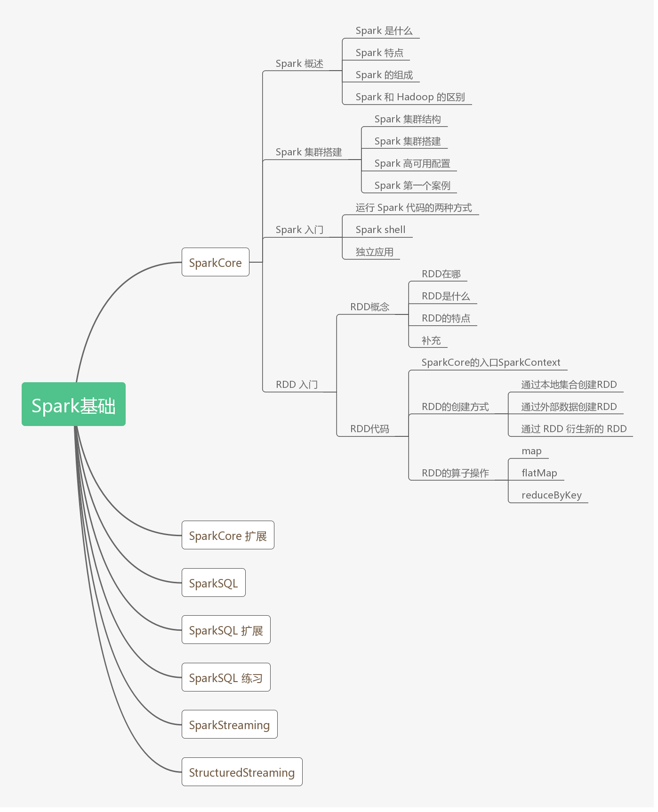
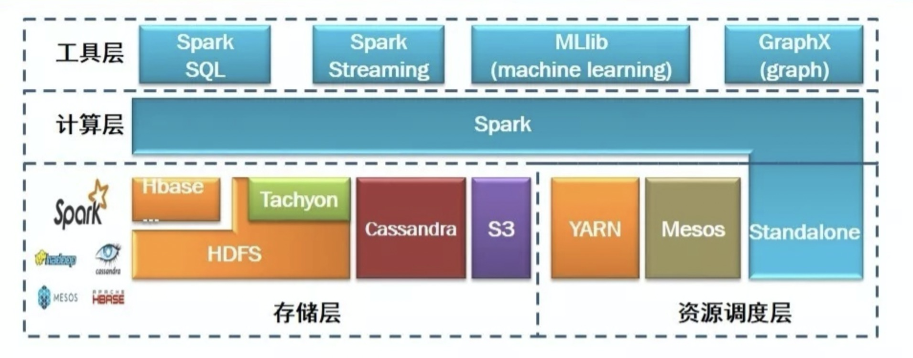

# 08.16-08.22 回顾


## SparkCore



### 1. Spark概述

- Spark是什么
  - Spark是一个快速的，多用途的集群计算系统
  - Hadoop的缺点：1、计算过程慢，不适应交互式计算，不适应迭代式计算  2、不是所有的计算都是由 map 和 reduce 两个极短组成
  - Spark解决的问题：1、内存存储中间结果  2、提供更好的API，函数式接口

- Spark特点

  - 速度快：内存计算比Hadoop快100倍，硬盘计算是Hadoop的10倍
  - 易用：支持Java、Scala、Python、R、SQL等多种语言
  - 通用：提供完整的技术栈，包括SQL、MLlib、GraphX，SparkStreaming等，用户可以在同一应用中使用这些工具
  - 兼容性：可以和绝大多数集群管理工具（Hadoop Yarn, Spark Standalone等）整合 ，也可以和绝大多数存储系统（HBase, HDFS, Hive等）进行整合

- Spark组成

  - SparkCore和RDD（弹性分布式数据集，一个可以并行操作，有容错的数据集合）

  - SparkSQL（处理结构化的数据）

  - SparkStreaming

  - MLlib

  - GraphX

    

- Spark和Hadoop的异同

  |        | Hadoop                         | Spark                      |
  | ------ | ------------------------------ | -------------------------- |
  | 类型   | 基础平台，包含计算、调度、存储 | 分布式计算工具             |
  | 场景   | 大规模数据集上的批处理         | 迭代计算、交互计算、流计算 |
  | 延迟   | 大                             | 小                         |
  | 易用性 | API较为底层                    | API较为顶层                |
  | 价格   | 对机器要求低，价格便宜         | 对内存有要求，较贵         |

### 2. Spark集群搭建

- Spark集群结构

  ​	

  - 名词解释：
    - Driver：该进程调用Spark的main方法，并且启动SparkContext
    - Cluster Manager：该进程和外部集群打交道，申请或释放资源
    - Worker：守护进程，启动和管理Executor
    - Executor：一个JVM虚拟机，负责运行Spark Task
  - Spark可以在两种模式下运行：1、单机（使用线程模拟并行）2、集群（使用集群管理器来和不同的集群交互）
  - 可以使用的集群管理工具：Spark Standalone、Hadoop Yarn、Apache Mesos、Kubernetes 
  - Standalone集群中，可以分为两个角色：Master 和 Slav e。Master对应Cluster Manager，Slave对应Worker。而Driver的启动分为两种模式：Client 和 Cluster。在Client模式时，Driver运行在 Client 端，在 Client 启动时就会启动。在 Cluster 下，Dirver运行在某个Worker中，随着应用的提交而启动。在 Standalone 中，集群启动时，就会创建固定数量的Worker。
  - 在Yarn集群中，也可以分为两种模式：Client 和 Cluster，但Client逐渐被废弃了，主要是Cluster模式。在Yarn中运行Spark，首先会和MR交互，开启ApplicationMaster，其中运行了Driver，Driver创建基础环境之后，会有RM提供对应的容器，运行Executor，Executor会反向向Driver注册自己，并申请Tasks执行。

- Spark集群搭建

  - Spark 的集群搭建大致有如下几个步骤
    1. 下载和解压 Spark
    2. 配置 Spark 的所有从节点位置
    3. 配置 Spark History server 以便于随时查看 Spark 应用的运行历史
    4. 分发和运行 Spark 集群

  - （具体见课件文档）
  - How To Install Spark On Ubuntu https://phoenixnap.com/kb/install-spark-on-ubuntu

- 高可用性配置

  - 使用 Zookeeper 帮助 Spark Standalone 高可用（具体见课件文档）

- 运行案例测试集群

  - 并没有运行成功，不知道为什么，先忽略

### 3. Spark入门案例

- 写 Spark 程序的两种常见方式

  1. spark-shell
  2. spark-submit

-  Spark shell 的方式编写 WordCount 

  1. 启动Spark shell

     ```shell
     $ spark-shell --master local[2]
     # local[N] 表示使用 N 条 Worker 线程在本地运行
     ```

  2. 执行以下代码

     ```scala
     val rdd1 = sc.textFile("file:///export/data/wordcount.txt")
     val rdd2 = rdd1.flatMap(item => item.split(" "))
     val rdd3 = rdd2.map(item => (item, 1))
     val rdd4 = rdd3.reduceByKey((cur,agg)=> cur + agg)
     rdd4.collect()
     ```

-  Spark shell 读取 HDFS 上的文件 

  1. 上传文件到HDFS

     ```shell
     $ cd /export/data
     $ hdfs dfs -mkdir /dataset
     $ hdfs dfs -put wordcount.txt /dataset/
     ```

  2. 在 Spark shell 中访问 HDFS

     ```scala
     val sourceRdd = sc.textFile("hdfs://node01:8020/dataset/wordcount.txt")
     val flattenCountRdd = sourceRdd.flatMap(_.split(" ")).map((_, 1))
     val aggCountRdd = flattenCountRdd.reduceByKey(_ + _)
     val result = aggCountRdd.collect
     ```

- 编写独立应用提交 Spark 任务

  - 本地IDEA中运行成功，提交运行失败。可能是因为没有安装hadoop集群？
  - 具体过程见教程和视频。（略）

  

- 总结: 三种不同的运行方式

  - **Spark shell**
    - 作用：一般用作于探索阶段, 通过 Spark shell 快速的探索数据规律
    - 功能：
      - Spark shell 可以选择在集群模式下运行, 还是在线程模式下运行
      - Spark shell 是一个交互式的运行环境, 已经内置好了 SparkContext 和 SparkSession 对象, 可以直接使用
      - Spark shell 一般运行在集群中安装有 Spark client 的服务器中, 所以可以自有的访问 HDFS

  - **本地运行**
    - 作用：在编写独立应用的时候, 每次都要提交到集群中还是不方便, 另外很多时候需要调试程序, 所以在 IDEA 中直接运行会比较方便, 无需打包上传了
    - 功能：
      - 因为本地运行一般是在开发者的机器中运行, 而不是集群中, 所以很难直接使用 HDFS 等集群服务, 需要做一些本地配置, 用的比较少
      - 需要手动创建 SparkContext
  - **集群运行** 
    - 作用：正式环境下比较多见, 独立应用编写好以后, 打包上传到集群中, 使用`spark-submit`来运行, 可以完整的使用集群资源
    - 功能
      - 同时在集群中通过`spark-submit`来运行程序也可以选择是用线程模式还是集群模式
      - 集群中运行是全功能的, HDFS 的访问, Hive 的访问都比较方便
      - 需要手动创建 SparkContext

### 4. RDD入门

- 定义：RDD，全称为 Resilient Distributed Datasets，是一个容错的，并行的数据结构，可以让用户显式地将数据存储到磁盘和内存中，并能控制数据的分区。
- 特点：
  1. RDD 是一个数据集
     1. RDD 允许用户显式的指定数据存放在内存或者磁盘
     2. RDD 是分布式的，用户可以控制 RDD 的分区
  2. RDD 是一个编程模型
     1. RDD 提供了丰富的操作
     2. RDD 提供了 map, flatMap, filter 等操作符, 用以实现 Monad 模式
     3. RDD 提供了 reduceByKey, groupByKey 等操作符, 用以操作 Key-Value 型数据
     4. RDD 提供了 max, min, mean 等操作符, 用以操作数字型的数据
  3. RDD 是混合型的编程模型，可以支持迭代计算，关系查询，MapReduce，流计算
  4. RDD 是只读的
  5. RDD 之间有依赖关系，根据执行操作的操作符的不同，依赖关系可以分为宽依赖和窄依赖

- 创建RDD的三种方式：

  1. 本地集合直接创建

     ```scala
     val conf = new SparkConf().setMaster("local[2]")
     val sc = new SparkContext(conf)
     
     val list = List(1, 2, 3, 4, 5, 6)
     val rddParallelize = sc.parallelize(list, 2)  // 第一个参数是本地集合, 第二个参数是分区数
     // val rddMake = sc.makeRDD(list, 2) 和上面一句是等价的
     ```

  2. 读取外部文件创建

     ```scala
     val conf = new SparkConf().setMaster("local[2]")
     val sc = new SparkContext(conf)
     
     val source: RDD[String] = sc.textFile("hdfs://node01:8020/dataset/wordcount.txt")
     ```

     - **访问方式**
       - 支持访问文件夹, 例如 `sc.textFile("hdfs:///dataset")`
       - 支持访问压缩文件, 例如 `sc.textFile("hdfs:///dataset/words.gz")`
       - 支持通过通配符访问, 例如 `sc.textFile("hdfs:///dataset/*.txt")` 
     - **分区**
       - 默认情况下读取 HDFS 中文件的时候, 每个 HDFS 的 `block` 对应一个 RDD 的 `partition`, `block` 的默认是128M
       - 通过第二个参数, 可以指定分区数量, 例如 `sc.textFile("hdfs://node01:8020/dataset/wordcount.txt", 20)`
       - 如果通过第二个参数指定了分区, 这个分区数量一定不能小于`block`数

  3. 通过其它的 RDD 衍生新的 RDD

     ```scala
     val conf = new SparkConf().setMaster("local[2]")
     val sc = new SparkContext(conf)
     
     val source: RDD[String] = sc.textFile("hdfs://node01:8020/dataset/wordcount.txt", 20)
     val words = source.flatMap { line => line.split(" ") }
     ```

- RDD 算子

  - map
  - flatMap
  - ReduceByKey

## SparkCore扩展

### 1. 深入了解RDD

- 案例 

  ```scala
  package cn.itcast.wc_sprak.rdd
  
  import org.apache.commons.lang3.StringUtils
  import org.apache.spark.{SparkConf, SparkContext}
  import org.junit.Test
  
  class AccessLog {
    @Test
    def ipAgg():Unit ={
      val conf = new SparkConf().setMaster("local[4]").setAppName("ipAggSpark")
      val sc = new SparkContext(conf)
  
      val rdd1 = sc.textFile("dataset/access_log_sample.txt")
      val rdd2 = rdd1.map(item=> (item.split(" ")(0),1) )
      val rdd3 = rdd2.filter(item => StringUtils.isNotEmpty(item._1))
      val rdd4 = rdd3.reduceByKey((cur,agg)=>cur+agg)
      val rdd5 = rdd4.sortBy(item => item._2, ascending = false)
      rdd5.take(10).foreach(item=>println(item))
    }
  }
  ```

- 提出问题

  1. 当文件特别大，怎么处理？
     - 比如，当一个数据大小为1T，存在以下瓶颈：内存、硬盘、CPU。因此要将数据放在集群中进行处理。
  2. 如何放在集群中执行
     - 大问题可以拆解为可并行的小问题。
     - 需要一个共享内存机制。
     - 需要一个协作机制进行调度。
  3. 任务如何拆解
  4. 怎么移动计算
  5. 如何容错
  6. 如果RDD之间的依赖链太长，如何拆解？

- 深入定义RDD

- 总结：RDD的五大属性

  

### 2. RDD算子


### 3. RDD特性


### 4. Spark原理


### 5. Spark高级特性


## SparkSQL


## SparkSteaming 


### 参考资料

- 从FM推演各深度学习CTR预估模型（附代码）by寒小阳  https://blog.csdn.net/han_xiaoyang/article/details/81031961
- [推荐系统遇上深度学习(二十二)--DeepFM升级版XDeepFM模型强势来袭！](https://ask.hellobi.com/blog/wenwen/15743) 
- DeepCTR：https://github.com/shenweichen/DeepCTR

# Plan of next week

- 


