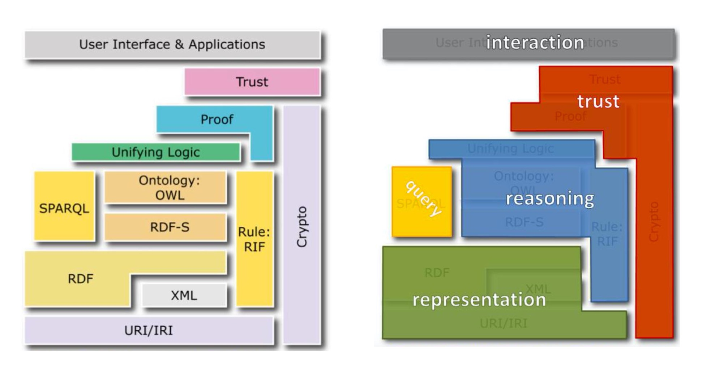
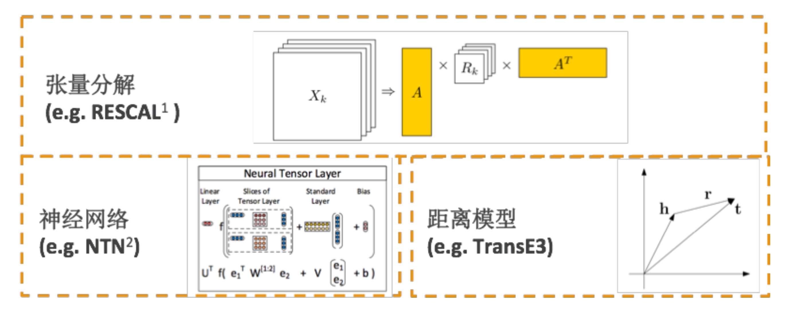
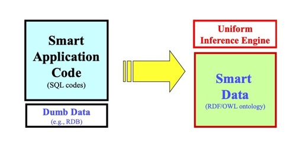
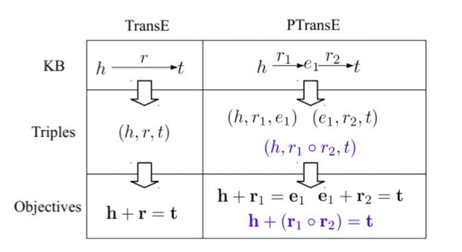
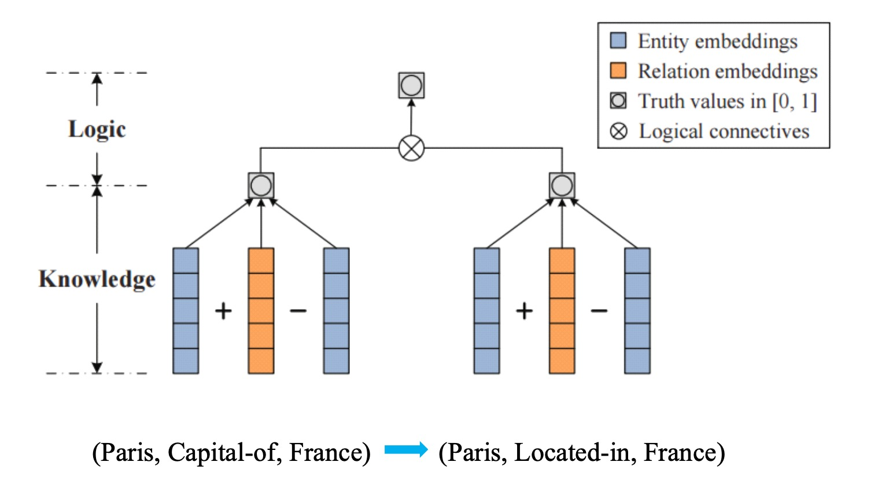
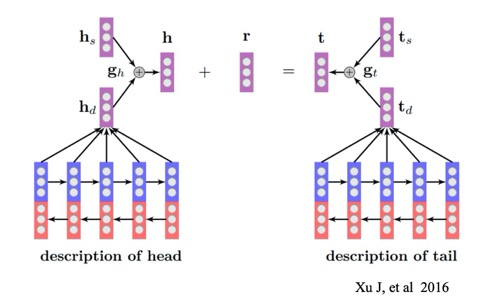
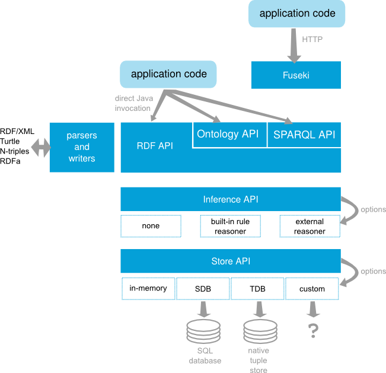
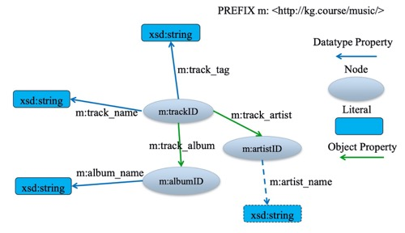
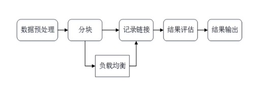
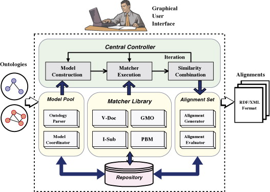

# 08.23-08.29 回顾

# 第一讲 知识图谱概览

## 1. 知识图谱与语义技术概述

- 发展脉络：从文本（超文本）的链接 --> 实体的链接
- 语义网络（1960） --> 本体论（1980） --> Web（1989） --> 语义网（1998） --> 链接数据（2006） --> 知识图谱（2012） 
- 应用领域：
  - KG辅助搜索
  - KG辅助问答
  - KG辅助决策
  - KG辅助AI，常识推理
- KG的本质
  - **Web**视角：像建立文本之间的超链接一样，建立数据之间的语义链接，并支持语义搜索 
  - **NLP**视角：怎样从文本中抽取语义和结构化数据
  - **KR**视角：怎样利用计算机符号来表示和处理知识
  - **AI**视角：怎样利用知识库来辅助理解人的语言
  - **DB**视角：用图的方式去存储知识

## 2. 典型知识库项目简介

- Cyc
  - Cyc知识库主要由术语Terms和断言Assertions组成。Terms包含概念 、关系和实体的定义。Assertions用来建立Terms之间的关系，这既包 括事实Fact描述，也包含规则Rule的描述。
  - 最新的Cyc知识库包含有50万条Terms和700万条Assertions。 Cyc的主 要特点是基于形式化的知识表示方法来刻画知识。形式化的优势是 可以支持复杂的推理。但过于形式化也导致知识库的扩展性和应用 的灵活性不够。Cyc提供开放版本OpenCyc。
  - https://www.cyc.com/ 
- WordNet
  - 最著名的词典知识库，主要用于词义消歧。
  - WordNet主要定义了名词、动词、形容词和副词之间的语义关系。例如：名词之间的上下位关系(如：“猫科动物”是“猫”的上位词)， 动词之间的蕴含关系(如：“打鼾”蕴含着“睡眠”)等
  - WordNet3.0已经包含超过15万个词和20万个语义关系
  - https://wordnet.princeton.edu/ 

- ConceptNet
  - 常识知识库，主要依靠互联网众包、专家创建和游戏三种方法来构建。新版本导入大量开放的结构化数据，如DBPedia、Wikinary，Wordnet等
  - ConceptNet知识库以三元组形式的关系型知识构成。ConceptNet5版本已经包含有2800万关系描述。与Cyc相比，ConceptNet采用了非形式化 、更加接近自然语言的描述，而不是像Cyc那样采用形式化的谓词逻辑
  - 谷歌知识图谱相比，ConceptNet比较侧重于词与词之间的 关系。从这个角度看，ConceptNet更加接近于WordNet，但是又比 WordNet包含的关系类型多。此外，ConceptNet完全免费开放，并支持多种语言
  - http://www.conceptnet.io/ 
- Freebase
  - 完全免费并允许商业化的开放许可协议，通过开源免费吸引用户贡献数据，增值的应用及技术服务收费
- Wikidata
  - 目标是构建全世界最大的免费知识库，采用**CC0**完全自由许可协议
  - https://www.wikidata.org/wiki/Wikidata:Main_Page
- DBPedia
  - 早期的语义网项目。DBPedia意指数据库版本的 Wikipedia，是从Wikipedia抽取出来的链接数据集。DBPedia 采用了一个较为严格的本体，包含人、地点、音乐、电影、 组织机构、物种、疾病等类定义
  - DBPedia还与Freebase，OpenCYC、Bio2RDF等多个数 据集建立了数据链接。DBPedia采用RDF语义数据模型，总共 包含30亿RDF三元组
  - https://wiki.dbpedia.org/ 
- YAGO
  - 由德国马普研究所研制的链接数据库。YAGO主要 集成了Wikipedia、WordNet和GeoNames三个来源的数据。 YAGO将WordNet的词汇定义与Wikipedia的分类体系进行了 融合集成，使得YAGO具有更加丰富的实体分类体系
  - YAGO还考虑了时间和空间知识，为很多知识条目增加了时间和空间维度的属性描述。目前，YAGO包含1.2亿条三元组 知识。YAGO是IBM Watson的后端知识库之一
  - https://www.mpi-inf.mpg.de/departments/databases-and-information-systems/research/yago-naga/yago 
- BabelNet
  - 类似于WordNet的多语言词典知识库。 BabelNet的目标是解决WordNet在非英语语种中数据缺乏的问题。BabelNet采用的方法是将WordNet 词典与Wikipedia百科集成
  - BabelNet3.7包含了271种语言，1400万同义词组， 36.4万词语关系和3.8亿从Wikipedia中抽取的链接 关系，总计超过19亿RDF三元组。 BabelNet集成了 WordNet在词语关系上的优势和Wikipedia在多语言 语料方面的优势，构建成功了目前最大规模的多语 言词典知识库。
  - https://babelnet.org/ 
- NELL(Never-Ending Language Learner) 
  - 卡内基梅隆大学开发的知识库。NELL主要采用互联网挖掘的方法从Web自动抽取三元组知识
  - 基本理念：给定一个初始的本体(少量类和关系的定义)和少量样本，让机器能够通过自学习的方式不断的从 Web学习和抽取新的知识。目前NELL已经抽取了400多万条高置信度三元组知识
  - http://rtw.ml.cmu.edu/rtw/ 
- 微软Concept Graph
  - 以概念层次体系为中心的知识图谱。与Freebase等知识图谱不同，Concept Graph以概念定义和概念之间的IsA关系为主
  - 给定一个概念如“Microsoft”，Concept Graph返回一组与“微软”有 IsA关系概念组，如:“Company”，“Software Company”， “Largest OS Vender”等。这被称为概念化“Conceptualization”
  - Concept Graph可以用于短文本理解和语义消歧中。微软发布的第一个版本包含超过540万的概念，1255万的实体，和8760万的关 系。Concept Graph主要通过从互联网和网络日志中挖掘来构建
  - https://concept.research.microsoft.com/Home/Introduction

- **OpenKG:** 中文知识图谱资源库
  - http://www.openkg.cn/
- zhishi.me 
  - Chinese Linking Open Data. Currently, it covers three largest Chinese encyclopedias: Baidu Baike, Hudong Baike and Chinese Wikipedia.
  - http://zhishi.me/
- cnSchema.org
  - 一个基于社区维护的开放的知识图谱Schema标准 。cnSchema分类(classes)、数据类型(data type)的词汇集包括上千种概念pes)、属性(propertities)和关系(relations)等常用概念定义 ，以支持知识图谱数据的通用性、复用性和流动性
  - 结合中文的特点，复用、连接并扩展了Schema.org，Wikidata ， Wikipedia等已有的知识图谱Schema标准，为中文领域的开放知 识图谱、聊天机器人、搜索引擎优化等提供可供参考和扩展的数 据描述和接口定义标准
  - https://github.com/cnschema/cnschema

## 3. 知识图谱相关技术简介

- 数据来源：文本、结构化数据库、多媒体、传感器、众包
- 技术体系：知识表示、知识抽取、知识融合、知识众包、知识推理、知识链接、可视化、语义搜索、知识问答

### 3.1 知识表示

- 研究怎样用计算机符号来表示人脑 中的知识，以及怎样通过符号之间的运算来模拟人脑的推理过程。

- 发展趋势：基于数理逻辑的知识表示 --> 基于向量空间学习的分布式知识表示

- 语义网知识表示框架

  

- **RDF**（Resource Description Framework）：Triple-based Assertion model

- **RDF Graph**：Directed Labeled Graph

- **RDFS**：Simple Vocabulary and Schema

- **SPARQL**：Query Language for RDF

- **OWL**： Web Ontology Language

- **JSON-LD**：JSON for Linking Data， 适用于作为程序之间做数据交换，在网页中嵌入语义数据和**Restful Web Service**

- **RDFa, HTML5 MicroData:** 在网页中嵌入语义数据

- 知识图谱的分布式表示 – KG Embedding

  - 在保留语义的同时，将知识图谱中的实体和关系映射到连续的稠密的低维向量空间

    

### 3.2 知识抽取（NLP+KR）

- 知识抽取流程：
  1. 非结构化文本的预处理
  2. 分词、词性标注、语法解释、依存分析
  3. NER、实体链接（Entity Linking）
  4. 关系抽取、事件抽取
  5. 三元组、多元关系、模态知识
- 知识抽取主要方法：
  - 知识工程
    - 正则表达式
    - 模版匹配（Bootstrap）
    - 规则约束：POS约束、NER约束、距离约束
  - 基于本体的抽取
    - PRA 基于图的抽取
    - TransE系列 基于Embedding的抽取 
  - 基于模型的抽取
    -  模型：SVM、LR、CRF、LSTM
    - 训练：有监督、无监督、远程监督

### 3.3 知识存储

- 知识比数据的结构更加复杂，知识的存储需要综合考虑图的 特点、复杂的知识结构存储、索引和查询 (支持推理)的优化等问题
- 典型的知识存储引擎分为**基于关系数据库的存储**和**基于原生图的存储**。
- 在实践中，多为**混合存储结构**，图存储并非必须。

### 3.4 知识问答

- KBQA (Knowledge-Based Question Answering，基于知识库的问题回答)
- 以直接而准确的方式回答用户自然语言提问的自动问答系统将构成下一一代搜索引擎的基本形态。

### 3.5 知识推理

- 简单而言，推理是指基于已知事实推出未知的事实的计算过程。
- 按解决方法分类
  1. 基于描述逻辑的推理（本体推理）
     - 描述逻辑(description logic)是一种用于知识表示的逻辑语言和以其 为对象的推理方法，主要用于描述概念分类及其概念之间的关系。 描述逻辑是当前语义网发展中本体的理论基础。
     - 主要方法:
       - 基于表运算(Tableaux)及改进的方法：FaCT++、Racer、 Pellet、Hermit等
       - 基于一阶查询重写的方法(Ontology based data access，基于本体的数据访问)
       - 基于产生式规则的算法(如rete)：Jena 、Sesame、OWLIM等
       - 基于Datalog转换的方法如KAON、RDFox等。
       - 回答集程序 Answer set programming
  2. 基于统计规则挖掘的推理
     - 主要方法：
       - 基于路径排序学习方法 (PRA，Path Ranking Algorithm) 
       - 基于关联规则挖掘方法 (AMIE)
  3. 基于概率逻辑的推理
  4. 基于表示学习和神经网络的推理
     - 将实体和关系都表示为向量
     - 通过向量之间的计算代替图的遍历和搜索来预测三元组的存在，由于向量的表示已经包含了实体原有的语义信息，计算含有一定的推理能力。 
     - 可应用于链接预测，基于路径的多度查询等。

- 按推理类型分类
  1. 缺省推理 Default reasoning 
  2. 连续变化推理 Continuous Change 
  3. 空间推理 Spatial reasoning 
  4. 因果关系推理Causality reasoning

### 3.5 知识融合

- 其它相关叫法：Record Linkage，Entity Resolution，Data Linking，Knowledge Fusion，Entity Alignment......
- 都是指在不同数据集中找出同一个实体的描述记录，主要目的是对不同数据源中的实体信息进行整合，形成更加全面的实体信息
- 典型工具-Dedupe：
  - Dedupe，基于Python的工具包，实现了包括fuzzy matching, deduplication, entity resolution在内的常见任务。主要处理流程 是先对所有records通过Clustering/Blocking的方法进行分组， 然后在组内部通过计算相似度特征和机器学习分类模型对任 一一对records进行预测是否为同一实体。
  - 适合于两个数据集有相似的结构，如果两个数据集的实体属性个数差异很大，不建议采用。
  - http://vldb.org/pvldb/vol5/p1878_larskolb_vldb2012.pdf
  - http://openkg.cn/tool/dedupe
- 典型工具-LIMES：
  - Limes: A Time-Efficient Approach for Large-Scale Link Discovery on the Web of Data. IJCAI2013
  - 专门针对链接数据Linked Data设计的链接框架，不要求两个数据集的实体具有相似的结构
  - 可灵活配置匹配规则，自定义距离计算模型 ，也支持基于 Active Learning的机器学习方法
  - http://openkg.cn/tool/limes

### 3.6 知识众包

- Wikibase
- schema.org
  - 截止目前，全球约有**1.2**亿的网站，超过**30%**的网页已经嵌入有**Schema.org**的语义数据。谷歌**2015**年**12**月推出的 **Cutomizable Knowledg Graph**，允许各网站基于**Schema.org**，以**RDFa**， **JSON-LD**， **HTML Microdata**等方式 在网页、邮件等数据源中嵌入语义化数据，支持个人和企业定制自己的知识图谱信息。

## 4. 典型应用案例：医药、电商、企业、金融、博物馆、媒体

- Open PHACTS：面向药物研发的开放数据访问平 台开发，其核心技术就是采用语义技术为有关研究人员提供高效的数据访问技术环境的支持

- 中医药知识平台
- 电商知识图谱
- 企业知识图谱应用（SAP）
- ……


# 第二讲 知识表示与知识建模

## 1. 早期知识表示简介（了解）

- 符合计算机要求的知识模式
  - 计算机能存储、处理的知识表示模式
  - 数据结构 (List, Table, Tree, Graph, etc.)
- 早期知识表示方法
  - 一阶谓词逻辑 (First-Order Logic) 
  - 产生式规则 (Production Rule)
  - 框架 (Framework)
  - 语义网络 (Semantic Network)
  - 逻辑程序 (Logic Programming) 
  - 缺省逻辑 (Default Logic)
  - 模态逻辑 (Modal Logic)


## 2. 基于语义网的知识表示框架 

### 2.1 RDF和RDFS

- 知识图谱实用的主要技术标准：RDF + SPARQL
- 使用原则：
  - 使用 RDF 作为数据的格式
  - 使用 URIs 作为事物的名字
  - 使用 HTTP URIs 来查询这些事物
  - 当查找某个 URI 时，使用 content negotiation 提供有用的信息
  - 包含链接到其他的 URIs ，从而可以发现与之相关的事物

- RDF模型（Resource Description Framework）
  - 在 RDF 中，知识总是以三元组形式出现
  - RDF 是一个三元组 (triple) 模型，即每一份知识可以被 分解为如下形式： ( subject (主) , predicate (谓) , object (宾) )
  - RDF 可以表示为graph
  - RDF 的资源（resources）和属性（properties）通过 URIs 来进行标识
  - RDF 的属性的值，也可以是字面值（literals），也可以是 XML 数据
  - RDF 允许空白节点
  - RDF 是数据模型，不是序列化格式
  - RDF 使用开放世界假设
  - RDF 允许分布式地定义知识，分布式定义的知识可以自动合并
- 带标注的 RDF 
  - 扩展 RDF 来表达更多信息，如时间、不确定性、空间、信任等 => 带标注的 RDF（annotated RDF）
  - 语法形式： $(s,p,o):\lambda$ ，其中 $\lambda$ 是一个标志，可以表示上述的信息
  - YAGO2 是一个采用 annotated RDF 的知识库
- RDFS （RDF Schema）
  - RDFS 在 RDF 基础上提供了一个术语、概念等的定义方式，以及哪些属性可以应用到哪些对象上。换句话说，RDFS为RDF模型提供了一个基本的类型系统。
  - RDFS 定义的关系：Class, subClassOf, type, Property, subPropertyOf, Domain（主语）, Range（宾语）

- RDF(S) 的缺陷
  - 语义表达能力显得太弱，还缺少诸多常用的特征。
  - 对于局部值域的属性定义：RDF(S)中通过rdfs:range定义了属性的值域 ，该值域是全局性的，无法说明该属性应用于某些具体的类时具有的特殊值域限制。
  - 类、属性、个体的等价性：RDF(S)中无法声明两个或多个类、属性和个体是等价还是不等价 。
  - 不相交类的定义：在RDF(S)中只能声明子类关系，如男人和女人都是人的子类，但无法声明这两个类是不相交的 。
  - 基数约束：即对某属性值可能或必须的取值范围进行约束，如说明一个人有双亲(包括两个人)，一门课至少有一名教师等。
  - 关于属性特性的描述:即声明属性的某些特性，如传递性、函数性、对称性，以及声明一个属性是另一个属性的逆属性等。

- W3C提出了OWL语言扩展RDF(S)，作为在语义网上表示本体的推荐语言


### 2.2 OWL和OWL2 Fragments（了解）

- W3C于2002年7月31日发布了OWL Web 本体语言 (OWL Web Ontology Language) 工作草案的细节，其目的是为了更好地开发语义网。
- OWL的三个子语言
  - OWL Lite
  - OWL DL
  - OWL Full 
- **OWL**与**RDF**的关系
  - OWL Full可以看成是RDF的扩展
  - OWL Lite和OWL Full可以看成是一个约束化的RDF的扩展;  所有的OWL文档 (Lite，DL，Full)都是一个RDF文档
  - 所有的RDF文档都是一个OWL Full文档
  - 只有一些RDF文档是一个合法的OWL Lite和OWL DL文档。
- OWL 可以进行更多的约束申明，如：
  - 等价性申明
  - 申明属性的传递性
  - 申明两个属性相反
  - 申明属性的函数性
  - 申明属性的对称性
  - 申明属性的局部约束：全称限定
  - 申明属性的局部约束：存在限定
  - 声明属性的局部约束：基数限定
  - 声明相交的类
  - ……
- **OWL2**
  - OWL的最新版本；老的OWL版本也被称为OWL1
  - OWL2定义了一些OWL的子语言，通过限制语法使用，使得这些子语言能够更方便地实现，以及服务于不同的应用
  - OWL2的三大子语言：OWL 2 RL，OWL 2 QL，OWL 2 EL
- **OWL 2 RL**
  - OWL 2 RL在扩展RDFS表达能力的同时，保持了较低的复杂度
  - OWL 2 RL在RDFS的基础上引入属性的特殊特性 (函数性，互反性，对称性)；允许声明等价性；允许属性的局部约束
  - 复杂度是PTime-Complete
- **OWL 2 QL**
  - QL代表query language的意思，专为基于本体的查询设计
  - OWL 2 QL的复杂度是AC0，非常适合大规模处理
  - OWL 2的三大子语言中，QL最为简单
  - OWL 2 QL是基于描述逻辑语言DL-Lite定义的
  - 通过OWL 2 QL的语言限制，基于QL的本体查询可以优化到多项式对数时间复杂度
- **OWL 2 EL**
  - OWL 2 EL专为概念术语描述，推理而设计
  - 在生物医疗领域广泛应用，如临床医疗术语本体SNOMED CT
  - 复杂度是PTime-Complete
  - OWL 2 EL是基于描述逻辑语言 EL++定义的

### 2.3 SPARQL查询语言

- SPARQL简介

  - RDF的查询语言，基于RDF数据模型
  - 可以对不同的数据集撰写复杂的连接 (joins) 
  - 由所有主流图数据库支持 
  - **S**PARQL **P**rotocol and **R**DF **Q**uery **L**anguage

- **SPARQL**查询基本构成

  - 变量，RDF中的资源，以“?”或者“$”指示

  - 三元组模板 (triple pattern), 在WHERE子句中列 示关联的三元组模板，之所以称之为模板，因为 三元组中允许变量

  - SELECT子句中指示要查询的目标变量

  - 一个例子🌰

    ```SPARQL
    PREFIX exp: http://www.example.org/ 
    SELECT ?student
    WHERE {
    ?student exp:studies exp:CS328.
    }
    # 查询所有选修CS328课程的学生;
    # 和数据库的SQL语言进行对应;
    # PREFIX部分进行命名空间的声明，使得下面查询的书写更为简洁。
    ```

  - 第二个🌰

    ```SPARQL
    finance:融创中国 rdf:type finance:地产事业 
    finance:孙宏斌 finance:control finance:融创中国 
    finance:贾跃亭 finance:control finance:乐视网 
    finance:孙宏斌 finance:hold_share finance:乐视网 
    finance:王健林 finance:control finance:万达集团 
    finance:万达集团 finance:main_income finance:地产事业 
    finance:融创中国 finance:acquire finance:乐视网 
    finance:融创中国 finance:acquire finance:万达集团
    
    SELECT ?P ?X WHERE {
    ?P finance:control ?c .
    ?c finance:acquire ?X . }
    
    # 查询谁购买了哪个公司（交易）
    # 结果为：
    # 孙宏斌 买了 乐视网
    # 孙宏斌 买了 万达集团
    ```

- 本体 **(ontology)**可以填充知识与查询之间的语义间隙

### 2.4 Json-LD、RDFa、HTML5 MicroData等新型知识表示

- **JSON-LD**（JavaScript Object Notation for Linked Data）

  - 一种基于JSON表示和传输互联数据 (Linked Data)的方法。

  - JSON-LD处理算法和API (JSON-LD Processing Algorithms and API) 描述了处理JSON-LD数据所需的算法及编程接口，通过这些接口可以 在JavaScript, Python及Ruby等编程环境中直接对JSON-LD文档进行转换和处理

  - 一个例子🌰

    ```json
    // 普通json
    // 机器不理解 “name”和“image”这样的术语的含义
    {
    "name": "Manu Sporny",
    "homepage": "http://manu.sporny.org/",
    "image": "http://manu.sporny.org/images/manu.png"
    }
    
    // json-ld
    // 通过引入规范的术语表示，比如统一化表示“name”，“homepage”和 “image”的URI，使得数据交换和机器理解成为基础。
    {
    "http://schema.org/name": "Manu Sporny",
    "http://schema.org/url": { "@id":"http://manu.sporny.org/" }, "http://schema.org/image": { "@id":"http://manu.sporny.org/images/manu.png" }
    }
    ```

- **RDFa** (Resource Description Framework in attributes)

  - 网页标记语言

  - W3C推荐标准。它扩充了XHTML的几个属性，网页制作者可以利用这些属性在网页中添加可供机器读取的资源

  - 与RDF的对应关系使得RDFa可以将RDF的三元组嵌入在XHTML文 档中，它也使得符合标准的使用端可以从RDFa文件中提取出这些RDF 三元组来

  - 🌰 。 示例中用到了RDFa属性中的about属性和property属性， 这段代码示例说明了一篇文章，然后描述了和这篇文章相关的信息 ，比如说标题，创建者和创建日期，而这些属性就可以使得支持 RDFa的机器识别。

    ```html
    <div xmlns:dc="http://purl.org/dc/elements/1.1/" 
         about="http://www.example.com/books/wikinomics">
        <span property="dc:title">Wikinomics</span> 
        <span property="dc:creator">Mr right</span> 
        <span property="dc:date">2006-09-02</span>
    </div>
    
    ```

- **HTML5 Microdata** 

  - Microdata微数据，是在网页标记标记语言嵌入机器可读的属性数据

  - 微数据使用可以来自自定义词汇表、带作用域的键/值对给DOM做标记

  - 用户可以自定义微数据词汇表，在自己的网页中嵌入自定义的属性

  - 微数据是给那些已经在页面上可见的数据施加额外的语义。当HTML的词汇不够用时，使用微数据可以取得较好的效果

  - 🌰

    ```html
    <section itemscope itemtype="http://data-vocabulary.org/Person">
    <h1 itemprop="name">Andy</h1>
    <p></p> <a itemprop="url" href="http://www.example.com/blog">My Blog</a> </section>
    ```


### 2.5 RDF+SPARQL v.s. ER+SQL

- RDF 可以让数据更智能，当数据发生变更时，查询代码可以保持不变。

  

## 2. 典型知识库项目的知识表示

- 不同知识库实现多元关系的方式

  | 名称       | 多元关系表示                                  |
  | ---------- | --------------------------------------------- |
  | DBPedia    | 无考虑，可通过Blank Node等用多个三 元组来表示 |
  | Freebase   | CVT复合类型节点                               |
  | WikiData   | Qualifier或者Reference                        |
  | ConceptNet | 将多元关系添加为边的属性                      |


- 好的知识表示
  - 接近人的自然语言: 好的KR是同时为机器和人设计的
  - 够用的表达能力: 够用就好，不必苛求逻辑完备
  - 易于扩展: 能够非常方便的增加新的类、实体和关系

- RDF/OWL只是众多知识表示框架之一，不少商业化的知识图谱 并未采用RDF/OWL，物理存储也直接采用关系数据库实现，但基本表达要素都可以在RDF/OWL中找到对应。

## 3. 基于本体工具 (Protégé)的知识建模实践

- 略


# 第三讲 知识抽取与挖掘 I

## 1. 知识抽取任务定义和相关比赛

- 知识抽取技术：实体抽取、关系抽取、事件抽取
- 知识获取关键技术与难点
  - 从结构化数据库中获取知识：D2R（难点：复杂表数据的处理）
  - 从链接数据中获取知识：图映射 （难点：数据对齐）
  - 从半结构化(网站)数据中获取知识：使用包装器  （难点：方便的包装器定义方法，包装器自动生成、更新与维护）
  - 从文本中获取知识：信息抽取  （难点：结果的准确率与覆盖率）

- 相关竞赛与数据集
  - **Message Understanding Conference (MUC)** 
    - 命名实体识别、共指消解
    - https://en.wikipedia.org/wiki/Message_Understanding_Conference
  - **Automatic Content Extraction (ACE)** 
    - 实体检测与识别、数值检测与识别、日期表达检测与识别、关系检测与识别、事件检测与识别
  - **TAC Knowledge Base Population (KBP)** 
    - 实体发现与链接、槽填充、事件抽取、信念和情感、端到端冷启动知识构建
    - https://tac.nist.gov/2017/KBP/
  - **Semantic Evaluation(SemEval)** 
    - 由ACL-SIGLEX组织的国际权威的词义消歧评测，目标是增进人们对词义与多义现象的理解
    - https://en.wikipedia.org/wiki/SemEval

- 实体抽取（NER）
  - 采用序列标注方法
  - HMM
  - CRF
  - LSTM+CRF
- 实体识别与链接
  - Wikipedia Miner
  - DBpedia Spotlight
  - OpenCalais 
  - ……
- 关系抽取
  - 基于模板的方法
    - 基于触发词的Pattern、基于依存句法分析的Pattern 
    - 优点：构建简单、小数据上容易实现
    - 缺点：需要专家构建、难以维护、可移植性差
  - 监督学习方法
    - 机器学习方法、深度学习方法 
    - 包括 pipeline 方法和 joint model 两种类型
    - Pipeline方法-CR-CNN模型（Santos et. al Computer Science 2015），Pipeline方法-Att-CNN模型（Zhiyuan Liu et. al ACL 2016），Pipeline方法-Att-BLSTM模型（Peng Zhou et. al ACL 2016）
    - Joint Model - LSTM-RNNs 模型（Miwa et. al ACL 2016）
    - 优点：准确率高，标注数据越多越准确
    - 缺点：标注数据成本太高、不能扩展新的关系
  - 弱监督学习方法
    - 远程监督
      - 知识库与非结构化文本对齐来自动构建大量训练数据，减少模型对人工标注数据的依赖，增强模型跨领域适应能力
      - PCNN 模型（Kang Liu et.al AI 2017）
      - 优点：可以利用丰富的知识库信息，减少一定的人工标注
      - 缺点：假设过于肯定，引入大量噪声，存在语义漂移现象。很难发现新的关系
    - Bootstrapping
      - 通过在文本中匹配实体对和表达关系短语模式，寻找和发 现新的潜在关系三元组
      - 优点：构建成本低，适合大规模构建。可以发现新的关系 (隐含的)
      - 缺点：对初始给定的种子集敏感，存在语义漂移问题，结果准确率较低，缺乏对每一个结果的置信度的计算
- 事件抽取
  - 事件是指发生的事情，通常具有时间、地点、参与者等属性，事件的发生可能因为一个动作的产生或者系统状态的改变。
  - 事件抽取的相关术语
    - 事件描述 (Event Mention)：描述事件的词组或句子
    - 事件触发 (Event Trigger)：表明事件出现的主要词汇
    - 事件元素 (Event Argument)：事件的重要信息
    - 元素角色 (Argument Role)：元素在句子中的语义角色
  - 事件抽取的pipeline
    - 实体识别、共指消解、关系抽取、事件抽取、跨文档实体链接、槽填充、知识库
    - 误差从前面的环节传播到后面的环节，使得性能急剧衰减；各个环节的预测任务是独立的，之间没有互动；无法处理全局的依赖关系
  - 基于动态多池化卷积神经网络的事件抽取方法
    - 系统主要包括四个部分：1.词向量学习;2. 词汇级别特征提取;3. 句子级别特征提取;4. 分类输出
    - Yubo Chen et. al., ACL 2015
  - 扩充语料的方法
    - 使用FrameNet扩展语料 （Shulin Liu, ACL 2016）
    - 运用结构化的知识库自动生成语料 （Yubo Chen, ACL 2017）
    - 从网络获取事件信息 （Karthik Narasimhan et. al.，EMNLP 2016）

## 2. 面向结构化数据的知识抽取

- 方式：
  - Direct mapping
  - R2RML （Relational to RDF Markup Language） 
- 工具：
  - Free：D2R, Virtuoso, Morph, r2rml4net, db2triples, ultrawrap, Quest
  - Commreical：Virtuoso, ultrawrap, Oracle SW
- Direct mapping
  - Create URIs following some simple rules: Map
    - table to class
    - column to property
    - row to resource
    - cell to literal value
    - in addition cell to URI, if there is a foreign key constraint
- R2RML 
  - R2RML is a language for specifying mappingsfrom relational to RDF data.
  - 可以通过R2RML进行更多的配置，定制化转换。
  - https://www.w3.org/TR/r2rml/
  - 一个工具：ontop
    - a platform to query databases as Virtual RDF Graphs using SPARQL. It's extremely fast and is packed with features.
    - https://github.com/ontop/ontop-examples

## 3. 面向半结构化数据的知识抽取

- 种类：
  - 针对百科数据的提取
  - 针对WEB数据抽取
  - WEB TABLE抽取
- http://zhishi.me/ 
  - 第一份中文大规模开放链接数据 (Chinese Linking Open Data)
  - 1000万实体，2亿三元组，提供关键字查询服务，API调用，SPARQL Endpoint
  - 五种访问zhishi.me的方式：
    - Linked data
    - Lookup service (http://zhishi.me/lookup/)
    - SPARQL endpoint (http://zhishi.me/sparql/)
    - APIs (http://zhishi.me/api)
    - Data Dump (于OpenKG中开放，http://openkg.cn/dataset/zhishi-me-dump)
- 如何获取WEB数据信息
  - 手工方法：使用XPath表达式，CSS选择器表达式等
  - 包装器：
    - 包装器是一个能够将数据从HTML网页中抽取出来，并且将它们还原为结构化的数据的软件程序。
    - 包装器归纳是基于有监督学习的，从标注好的训练样例集合中学习数据抽取规则，用于从其他用相同标记或相同网页模板抽取目标数据。
    - 包装器是XPath集合空间，对生成的集合进行归纳，形成若干个子集。归纳的规则是在子集中的XPath能够覆盖多个标注的数据项，具有一定的泛化能力。
  - 自动抽取：
    - 自动抽取网页中的信息不需要任何的先验知识和人工数据的标注。将一组网页通过聚类将相似的网页分成若干个组，每组相似的网页将获得不同的包装器。
    - RoadRunner是自动抽取的典型代表，http://www.dia.uniroma3.it/db/roadRunner/

- WEB TABLE抽取

  - 为了解释Web table中隐含的语义，一些工作将其中的内容标注为 RDF 三元组。

  - 这种标注的第一步就是实体链接 (**entity linking** )，即将表格中各单元格的字符串映射到给定知识库的实体上。

    - 具体又分为：1.候选生成，2. 实体消岐

    - 候选生成：针对表格单元格中的每个字符串，从给定的知识库中识别候选实体。 (token匹配 (字符串匹配， 同义词匹配......))

    - 两类实体链接影响因子：

      1) 每个字符串的初始重要性(importance of each mention);

      2) 不同节点间的语义相关度(semantic relatedness between different nodes).

    - 实体消岐算法**—**PageRank

      PageRank算法 (Iterative probability propagation) 用来整合不同的实体链接影响因子从而做出最终的实体链接决定。

  - 第二步是生成三元组。

## 4. 实践展示:基于百科数据的知识抽取

- 构建一个领域知识图谱的基本流程：1. Knowledge Collection 2. Knowledge Fusion 3. Knowledge Completion 
- Knowledge Collection
  - Category方法
    - 人工观察百科中与佛教人物相关的分类
    - 抽取佛教人物分类下所有文章对应的实体
  - 命名规则方法 
    - 例: “.+菩萨” “.+禅师”
- Knowledge Fusion
  - 主语融合 （同名不同实体，同实体不同名）
  - 宾语融合（单值属性、多值属性）

- Knowledge Completion 
  - 对infobox属性进行补全
    - 人工编写规则从非结构化文本中抽取属性值 
    - 依照知识融合方法将属性值对转换为三元组
- 佛学知识图谱
  - http://www.kg-buddhism.com/


#  第四讲 知识抽取与挖掘 II

## 1. 面向文本的知识抽取 

- DeepDive关系抽取实战
  - http://www.openkg.cn/dataset/cn-deepdive

- 开放域关系抽取
  - 传统 IE：
    - 针对特定领域、实现定义关系类型、依赖领域专业知识、规模小精度高
    - FREEBASE、DBpedia、YAGO、Deepdive
  - 开放域IE：
    - 通用模型、不需要预定义关系、依赖句法特征、全网规模但精度低
    - TextRunner、WOE、REVERB、OLLIE、ClauseIE

 ## 2. 知识挖掘

- 实体消歧与链接

  - 给定一篇文本中的实体指称(mention)，确定这些指称在给定知识库中的目标实体 (entity) 

  - 方法一：使用生成式模型，计算在上下文中，entity和mention同时出现概率最大的entity。
    $$
    \mathrm{e}=\underset{e}{\arg \max } \frac{P(m, e)}{P(m)}
    $$

    - The entity-mention model: a generative probabilistic model

  - 方法二：构建实体关联图

    - 实体关联图由3个部分组成：

      (1) 每个顶点 $V_i=<m_i, e_i>$ 由 mention-entity 对构成

      (2) 每个顶点得分：代表实体指称 $m_i$ 的目标实体为 $e_i$ 概率可能性大小

      (3) 每条边的权重：代表语义关系计算值，表明顶点 $V_i$ 和 $V_j$ 的关联程度

    - 顶点的得分初始化方法：

      (1) 若顶点V实体不存在歧义，则顶点得分设置为1;

      (2) 若顶点中mention和entity满足 $p(e|m)>=0.95$，则顶点 得分也设置为1。

      (3) 其余顶点的得分设置为 $p(e|m)$ 。

    - 边权初始化方法：深度语义关系模型

  - 方法三：基于图动态 PageRank 算法

    - 实体关联图由四个部分组成：

      (1) 实体指称节点

      (2) 候选实体节点

      (3) 候选实体节点顶点值:代表该候选实体是实体指称的目标实体概率大小

      (4) 候选实体节点边权值:代表两个候选实体间的转化概率大小

    - 各候选实体节点顶点值：初始化为均等，之后每轮更新上一轮的PageRank得分，候选实体节点边权值计算公式如下：

      - 两个候选实体间的相似度大小
        $$
        \operatorname{sim}\left(e_{a}^{i}, e_{b}^{j}\right)=\cos \left(v\left(e_{a}^{i}\right), v\left(e_{b}^{j}\right)\right)
        $$

      - 两个候选实体间的转化概率
        $$
        E T P\left(e_{a}^{i}, e_{b}^{j}\right)=\frac{\operatorname{sim}\left(e_{a}^{i}, e_{b}^{j}\right)}{\sum_{k \epsilon\left(V \backslash V_{i}\right)} \operatorname{sim}\left(e_{a}^{i}, k\right)}
        $$

    - 选择本轮最高得分的未消歧实体 New York Knicks作为实体指称 New York 的最佳实体，删除其他候选实体 New York City及相关的边，更新图中的边权值。

- 知识规则挖掘

  - 基于关联规则挖掘(Association Rule Mining, ARM)的方法 

    1. 构建事务表
    2. 挖掘规则
    3. 将规则转换为OWL公理 
    4. 构建本体

  - 基于统计关系学习(Statistical Relational Learning, SRL) 的方法

    - 输入：实体集合、关系集合、已知三元组集合

    - 目标：根据已知三元组对未知三元组成立的可能性进行预测，可以应用于知识图谱补全

    - 基本思想：将连接两个实体的路径作为特征来预测其间可能存在的关系

    - 路径排序算法 – Path Ranking Algorithm (PRA)
      $$
      \text {score}(s, t)=\sum_{\pi \in Q} P(s \rightarrow t ; \pi) \theta_{\pi}
      $$
      Q: all path types starting from s and ending with $t$ (with length of $n$ ) $\theta_{\pi}:$ weights obtained by training


- 知识图谱表示学习

  - 类似word2vec，建立统一的语义空间，语义可计算

  - 实体预测和推理：根据一个实体和关系，推测三元组另一侧的实体。（如实体是《卧虎藏龙》，关系是观影人群，结果是实际的观影人实体）

  - 关系推理：根据以后的实体和关系，挖掘潜藏的关系。（如，父亲 + 父女 + 配偶 关系，可以得到 母女 关系）

  -  知识图谱表示学习 --TransE

    - 将三元组 $<h, r, t>$ 看成 $h$ 通过 $r$ 翻译到 $t$ 的过程

    - 优化目标：势能函数
      $$
      f(h, r, t)=\|\mathbf{h}+\mathbf{r}-\mathbf{t}\|_{2}
      $$
      目标函数：
      $$
      \min _{(h, r, t) \in \Delta\left(h^{\prime}, r, t^{\prime}\right) \in \Delta^{\prime}}\left[\gamma+f(h, r, t)-f\left(h^{\prime}, r, t^{\prime}\right)\right]_{+} \\
      $$
      其中 $[x]_{+}=\max (0, x)$ 

    - 缺点：无法处理一对多、多对一、多对多的关系

    - Bordes, et al 2013 

  -  克服TransE的缺陷：

    - 实体语义空间投影，将非一对一的关系，映射到一个其他空间，形成一对一的关系
    - TransH、TransR
    - Wang, et al 2014、 Lin, et al 2015

  - 将属性（常常出现非一对一关系）和关系（更多是一对一）分开表示。分而治之。

  -  PRA vs. TransE

    - PRA：可解释性强、能够从数据中挖掘出推理规则、难以处理稀疏关系、路径特征提取效率不高
    - TransE：能够表示数据中蕴含的潜在特征、参数较少，计算效率较高、模型简单，难以处理多对一、一对多、多对多的复杂关系、可解释性不强

  - 路径表示学习：

    - TransE孤立地学习每个事实三元组，关系之间存在复杂关系，涉及关系推理

    - PTransE

      

    - Gardne, et al 2013

  - 加入规则的表示学习

    

  

  -  多模态的表示学习

    - 助力Zero-Shot和长尾链接预测

      

      其中，s 代表来自KG的embedding，d 代表来自文本的embedding

  -  基于知识图谱图**结构**的表示学习：通过周围实体context，推测某个节点的实体

    - Triple Context = Triple + Path Context + Neighbor Context

    - 势能函数：希望三元组在Triple Context概率最大
      $$
      f(h, r, t)=P((h, r, t) \mid C(h, r, t) ; \Theta)
      $$
      假设不同的Context都是相互独立的，且独立用来描述三元组的某一部分，则上式可以写为：
      $$
      \begin{aligned}
      f(h, r, t) &=P(h \mid C(h, r, t) ; \Theta) & & f(h, r, t) \approx P\left(h \mid C_{N}(h) ; \Theta\right) \cdot P\left(t \mid C_{P}(h, t), h ; \Theta\right) \cdot P(r \mid h, t ; \Theta) \\
      & \cdot P(t \mid C(h, r, t), h ; \Theta) & & \\
      & \cdot P(r \mid C(h, r, t), h, t ; \Theta)
      \end{aligned}
      $$

    - 目标函数：
      $$
      P(\mathcal{K} \mid \Theta)=\prod_{(h, r, t) \in \mathcal{K}} f(h, r, t)
      $$
      


# 第五讲 知识存储

- 图谱存储工具 **–** 图数据库：
  - 图数据库源起欧拉和图理论 (graph theory)，也可称为面向/基于图的数据库 ，对应的英文是Graph Database。图数据库的基本含义是以“图”这种数据结构存储和查询数据。它的数据模型主要是以节点和关系 (边)来体现，也可处理键值对。它的优点是快速解决复杂的关系问题。
  - 图具有如下特征:
    1. 包含节点和边
    2. 节点上有属性 (键值对) 
    3. 边有名字和方向，并总是有一个开始节点和一个结束节点 
    4. 边也可以有属性
  - https://en.wikipedia.org/wiki/Graph_database

## 1. 从一个例子开始

- 开源数据库 **– Apache Jena** 

  - 一个免费开源的支持构建语义网络和数据链接应用的 Java 框架

  - 架构图

    

- 数据来源

  - 通过人工构建一些数据集

- 数据描述 

  

- 数据导入 

  - 通过TDB导入 

    - 使用TDB导入的命令如下

      ```shell
      $ /jena-fuseki/tdbloader --loc=/jena-fuseki/data filename
      ```

    - Fuseki启动的命令如下，需要指定tdb生成的文件路径并指定数据库名

      ```shell
      $ /jena-fuseki/fuseki-server --loc=/jena-fuseki/data --update /music
      ```

  - 手动导入，具体步骤见课件。（略）

- 数据查询和更新

  - 使用endpoint接口查询 

    - SPARQLQuery: http://localhost:3030/music/query
    - SPARQL Update: http://localhost:3030/music/update

  - Fuseki文档：https://jena.apache.org/documentation/fuseki2/soh.html

  - Python操作Apache Jena 

    - 使用 Jena SPARQL endpoint 接口进行查询和更新

    - 使用SPARQLWrapper包查询和更新

    - 一个🌰

      ```python
      from SPARQLWrapper import SPARQLWrapper, JSON
      
      sparql = SPARQLWrapper("http://dbpedia.org/sparql")
      sparql.setQuery("""
          PREFIX rdfs: <http://www.w3.org/2000/01/rdf-schema#>
          SELECT ?label
          WHERE { <http://dbpedia.org/resource/Asturias> rdfs:label ?label }
      """)
      sparql.setReturnFormat(JSON)
      results = sparql.query().convert()
      
      for result in results["results"]["bindings"]:
          print(result["label"]["value"])
      ```

    - https://rdflib.dev/sparqlwrapper/

- 一些SPARQL查询的🌰

  - 查询某一位歌手所有歌曲的歌曲名

    ```SPARQL
    PREFIX music:<http://kg.course/music>
    SELECT ?name 
    WHERE {
        ?trackID music:track_artist music:artist_01 .
        ?trackID music:track_name ?name
    }
    ```

  - 查询某一个专辑的歌曲数目

    ```SPARQL
    PREFIX music:<http://kg.course/music>
    SELECT (COUNT(?trackID) as ?num)
    WHERE {
        ?albumID music:album_name "album_name_0002" .
        ?trackID music:track_album ?albumID
    }
    ```

  - 其他🌰请看课件或者SPARQL文档


## 2. 图数据库介绍 

- 图数据库的分类：见课件（略）
- 图数据库的发展：见课件（略）
- 开源数据库介绍：RDF4j 、gStore等
  - **RDF4j**
    - 处理RDF数据的Java框架
    - 使用简单可用的API来实现 RDF存储
    - 支持SPARQL endpoints
    - 支持两种RDF存储机制
    - 支持所有主流的RDF文件格式
    - http://rdf4j.org 
    - 前身是Sesame
  - **gStore**
    - gStore从图数据库角度存储和检索RDF知识图谱数据
    - gStore支持W3C定义的SPARQL 1.1标准，包括含有Union， OPTIONAL，FILTER和聚集函数的查询；gStore支持有效的增删改操作
    - gStore单机可以支持1Billion(十亿)三元组规模的RDF知识图 谱的数据管理任务。
    - http://www.gstore.cn/pcsite/index.html

- 商业数据库介绍：Virtuoso、AllegroGraph、Stardog等 

  - **Virtuoso** 

    - 智能数据，可视化与整合 
    - 可扩展和高性能的数据管理 
    - 支持Web 扩展和安全
    - https://virtuoso.openlinksw.com/

  - **Allgrograph**

    - 一个现代的，高性能的，支持永久存储的图数据库

    - 基于Restful接入支持多语言编程
    - AllegroGraph一开始就被设计成为可以提供强大的加载速度，查询速度和高性能的存储图数据库
    - https://allegrograph.com/products/allegrograph/ 

  - **Stardog**

    - https://www.stardog.com/ 


- 原生图数据库介绍：Neo4j、OrientDB、Titan等
  - **Neo4j** 
    - 特点：图数据库+Lucene索引、支持属性图、支持ACID、高可用性、支持320亿的结点，320亿的 关系结点，640亿的属性、REST API接口
    - 数据结构：在一个图中包含两种基本的数据类型：Nodes (节点) 和 Relationships (关系)。Nodes 和 Relationships 包含 key/value形式的属性。 Nodes通过Relationships所定义的关系相连起来，形成关系型网络结构。
    - 优点：高连通数据、推荐、路径查找、A*算法、数据优先
    - 数据导入
      - Cypher CREATE语句，为每一条数据写一个CREATE 
      - Cypher LOAD CSV 语句，将数据转成CSV格式，通 过LOAD CSV读取数据
      - 官方提供的Java API — Batch Inserter
      - 官方提供的 neo4j-import 工具
      - 第三方开发者编写的 Batch Import 工具
    - 查询语言：Cypher 
    - 图可视化展示：内部集成D3.js
    - http://neo4j.com/
  - **OrientDB** 
    - OrientDB是一个用Java实现的开源NoSQL数据库管理系统。它是一个多模式的数据库，支持图形、文档、键值对、对象模型和关系，也可以为图数据库的管理与记录之间的提供连接
  - **Titan** 
    - 弹性和线性增长的数据和用户的可扩展性
    - 数据分布和复制性能和容错性
    - 支持增删改查，支持一致性
    - 支持各种后端存储
    - 支持全局图数据分析，报告，并通过ETL连接大数据平台
    - 支持全文检索
    - http://titan.thinkaurelius.com/
- 图数据库的常用衡量指标 
  - Load Time
  - Repository Size
  - Query Response Time 
  - Throughputs
  - Inference Support

## 3. 图数据库实现细节

- How to conversion of SPARQL to SQL
- Which **indexes** should be built? (to support efficient evaluation of triple patterns)
- How can we **reduce storage space**? 
- How can we find the **best execution plan**? 
- Map all strings to unique integers (e.g., via hashing)


# 第六讲: 知识融合 

## 1. 什么是知识融合

- 目标：融合各层面的知识

  合并两个知识图谱 (本体)，需要确认的是: 

  1. 等价实例

  2. 等价类/子类

  3. 等价属性/子属性

- 知识图谱的构建经常需要融合多种不同来源的数据，实体对齐是知识图谱融合的主要工作

- 分类：概念层知识融合、跨语言知识融合、知识在线融合

- Google Knowledge Vault：（Dong et al., KDD 2014）

- 相关术语：知识融合 (Knowledge Fusion)、本体对齐 (Ontology Alignment)、本体匹配 (Ontology Matching)、Record Linkage (传统数据库领域) 、Entity Resolution (传统数据库领域) 、实体对齐 (Entity Alignment) 

- 知识融合的主要技术挑战
  - 数据质量的挑战
  - 数据规模的挑战
- 知识融合竞赛——OAEI：http://oaei.ontologymatching.org/
  - **SEALS:** SEALS项目致力于评估语义网络技术。 它创建了便于进 行评估的基础架构，组织评估活动，围绕此评估活动构 建工具提供者和工具用户社区。参与者可以通过 OAEI_SealsClient 提交。
  - **Hobbit**：该平台旨在对群集上的关联数据系统进行基准测试。 
    - 官网: http://project-hobbit.eu/
    - Github: https://github.com/hobbit-project
    - Tutorial: https://github.com/hobbit-project/platform/wiki
  - 

## 2. 知识融合的基本技术流程

- 基本技术流程

  

- 数据预处理
  - 语法正规化 
    - 语法匹配：联系电话的表示方法
    - 综合属性: 家庭地址的表达方式 
  - 数据正规化
    - 移除空格，《》，“”，-，等符号
    - 输入错误类的拓扑错误 
    - 用正式名字替换昵称和缩写等
-  分块 (Blocking)
  - 从给定的知识库中的所有实体对中，选出潜在匹配的记录对作为候选项，并将候选项的大小尽可能的缩小。从而降低计算的复杂度。
  - 基于Hash函数的分块：
    - 对于记录 $x$ ，有 $hash(x)=h_i$，则 $x$ 映射到与关键字 $h_i$ 绑定的块 $C_i$ 上。
    -  常见的hash函数：字符串的前n个字、n-grams、结合多个简单的hash函数等
  - 邻近分块 
    - Canopy聚类
    - 排序邻居算法
    - Red‐Blue Set Cover 

- 负载均衡 (Load Balance)
  - 负载均衡 (Load Balance)来保证所有块中的实体数目相当， 从而保证分块对性能的提升程度。 
  - 最简单的方法是多次Map-Reduce操作。

- 记录链接

  -  假设两个实体的记录 $x$ 和 $y$ ，$x$ 和 $y$ 在第 $i$ 个属性上的值是 $x_i,y_i$ ，那么通过如下 两步进行记录链接:

    1. 属性相似度：综合单个属性相似度得到属性相似度向量
       $$
       \left[\operatorname{sim}\left(x_{1}, y_{1}\right), \operatorname{sim}\left(x_{2}, y_{2}\right), \ldots, \operatorname{sim}\left(x_{N}, y_{N}\right)\right]
       $$

    2. 实体相似度：根据属性相似度向量得到一个实体的相似度

  - **计算属性相似度**  

    - 编辑距离：Levenstein，Wagner and Fisher，Edit Distance with Affine Gaps
    - 集合相似度计算：Jaccard系数，Dice
    - 基于向量的相似度计算：Cosine相似度，TFIDF相似度

  - 编辑距离

    - 编辑距离Levenshtein distance是典型的动态规划问题， 可以通过动态规划算法计算，如下：

    $$
    \left\{\begin{array}{l}
    D(0,0)=0 \\
    D(i, 0)=D(i-1,0)+1 \quad 1<i \leqq N \\
    D(0, j)=D(0, j-1)+1 \quad 1<j \leqq M \\
    \end{array}\right.
    $$

    
    $$
    D(i, j)=\min \left\{\begin{array}{l}
    D(i-1, j)+1 \\
    D(i, j-1)+1 \\
    D(i-1, j-1)+1
    
    \end{array}\right.
    $$

    - Wagner and Fisher distance是Levenshtein 的一个 扩展，将这个模型中编辑操作的代价赋予了不同的权重，如下：

    $$
    \left\{\begin{array}{l}
    D(0,0)=0 \\
    D(i, 0)=D(i-1,0)+\operatorname{del}[x(i)] \quad 1<i \leqq N \\
    D(0, j)=D(0, j-1)+\operatorname{del}[y(j)] \quad 1<j \leqq M \\
    \end{array}\right.
    $$

    
    $$
    D(i, j)=\min \left\{\begin{array}{l}
    D(i-1, j)+\operatorname{del}[x(i)] \\
    D(i, j-1)+\operatorname{ins}[y[j]] \\
    D(i-1, j-1)+\operatorname{sub}[x(i), y(j)]
    \end{array}\right.
    $$
    ​		其中， del 和 ins 以及 sub 分别是删除和插入以及替换的代价

    - Edit Distance with affine gaps，在上面两种算法的基础上，引入了gap的概念，将上述的插入，删除和替换操作用用gap opening和 gap extension代替

  - 集合相似度计算

    - Jaccard 系数适合处理短文本的相似度，定义如下:

    $$
    \operatorname{sim}_{\text {Jaccard}}(s, t)=\frac{|S \cap T|}{|S \cup T|}
    $$

    

    - Dice系数用于度量两个集合的相似性，因为可以把字符串理解为一种集合，因此Dice距离也会用于度量字符串的相似性，Dice系数定义如下:

    $$
    \operatorname{sim}_{D \mathrm{ice}}(s, t)=\frac{2|S \cap T|}{|S|+|T|}
    $$

    ​		以 ‘Lvensshtain’ 和‘Levenshtein’为例，两 者相似度为 2*9/ (11+11)= 0.82

    - 上述两种方法，将文本转换为集合，除了可以用符号分格单词外，还可以考虑用n-gram分割单词，用n-gram分割句子等来构建集合，计算相似度。

  - 基于向量的相似度计算

    - Cosine相似度：略
    - TFIDF：略

  - **计算实体相似度**

    - 聚合：加权平均，手动制定规则，分类器（逻辑回归，决策树，SVM和条件随机场等）
    - 聚类：层次聚类，相关性聚类，Canopy + K-means
    - 表示学习 

  - 聚类：

    - 层次聚类：底层的原始数据可以通过相似度函数计算，类之间的相似度有如下三种算法:

      - SL(Single Linkage)算法：又称为最邻近算法 (nearest-neighbor)，是用两个类数据点中距离最近的两个数据点间的相似度作为这两个类的距离。
      - CL (Complete Linkage)算法：与SL不同的是取两个类中距离最远的两个点的相似度作为两个类的相似度。
      - AL (Average Linkage)算法：用两个类中所有点之间相似度的均值作为类间相似度。

    - 相关性聚类（没有特别看懂）

      - $\mathrm{r}_{x y}$ 表示x,y被分配在同一类中， $\mathrm{p}_{x y}$ 代表x, y是 同一类台概率 (x,y之间的相似度)， $\mathrm{w}_{x y}^{+}\left(=\mathrm{p}_{x y}\right)$ 和 $\mathrm{w}^{-}{ }_{x y}\left(=1-\mathrm{p}_{x y}\right)$ 分别 是切 断 X,y 之间 的 边的代价 和保留边的代价。相关性聚类的目标就是使用 最小的代价找到一个聚类方率。
        $$
        \operatorname{minimize} \sum_{\mathrm{r}_{x y}} \mathrm{w}_{x y}^{-}+\left(1-\mathrm{r}_{x y}\right) \mathrm{w}_{x y}^{+}
        $$
        是个NP-Hard问题，可用贪林算法近似求解。

    - Canopy + K-means 

      - 与K-means不同，Canopy聚类最大的特点是不需要事先指定k值 (即clustering的个数)，因此具有很大的实际应用价值，经常将Canopy和K- means配合使用。

  - 表示学习：

    - 知识嵌入—TransE模型。三元组(h, r, t): 关系向量 r 表示为头向量 h 和尾向量 t 之间的位移
    - 如何将两个知识图谱嵌入到同一个空间
      - 联合知识嵌入：将两个KG的三元组糅合在一起 共同训练，并将预链接实体对视为具有SameAS 关系的三元组，从而对两个KG的空间进行约束。具体实现： Hao Zhu et al. Iterative Entity Alignment via Knowledge Embeddings, IJCAI 2017
      - 双向监督训练：两个KG单独进行训练，使用预 链接数据交替进行监督。
    - 如何链接实体
      - KG向量训练达到稳定状态之后，对于KG1每一个没有找到链接的实体，在KG2中找到与之距离最近的实体向量进行链 接，距离计算方法可采用任何向量之间的距离计算，例如欧式距离或Cosine距离。

- 结果评估 
  - 准确率，召回率，F值 
  - 整个算法的运行时间


## 3. 典型知识融合工具简介

- 本体对齐——**Falcon-AO**  

  - Falcon-AO是一个自动的本体匹配系统，已经成为 RDF(S)和OWL所表达的Web本体相匹配的一种实用和流行的选择。编程语言为Java。

  - http://ws.nju.edu.cn/falcon-ao/

  - 结构图

    

  - 基本模块（没太仔细看懂）

    -  Model Pool

      Parser用Jena将输入的本体导入到模型中，coordinator内置了一套协调规则用来调整模型。

    - Matcher Library

      管理4种匹配方法，包括V-Doc , I-Sub, GMO 和PBM 。其中， V-Doc 和I- Sub是基于语言的匹配器，GMO是基于图结构的匹配器， PBM用分而治之的策略为大规模的本体进行块映射。

    - Alignment Set 

      以XML/RDF格式生成匹配文件，并用传统的准确率/召回率进行评测。

    - Central Controller

      手动调节参数，可以选择用Matcher Library 中的哪种方法进行匹配。

    - Repository 

      用来存储中间数据。

- 实体匹配——**Dedupe**

  - Dedupe是一个用于模糊匹配, 记录去重和实体链接的 python 库。
  - https://github.com/dedupeio/dedupe
  - 方法：（没太仔细看懂）
    1. 指定谓词集合&相似度函数
    2. 训练Blocking：通过 Red-Blue set cover 找到最优谓词集合来分块
    3. 训练逻辑回归 (LR)模型

- 实体匹配——**Limes** （没太仔细看懂）

  - Limes是一个基于度量空间的实体匹配发现框架 ，适合于大规模数据链接，编程语言是Java。
  - https://github.com/dice-group/LIMES 
  - LIMES: a time-efficient approach for large-scale link discovery on the web of data. *IJCAI 2011* 
  - 整体流程：给定源数据集S，目标数据集T，闽值 $\theta$ 
    1. 样本选取：从T中选取样本点E来代表T中数据。
    2. 过滤：计算 $s\in S$ 与 $e\in E$ 之间的距离m(s, e)，利用三角不等式进行过滤。
    3. 相似度计算：同上
    4. 序列化：存储为用户指定格式

- 实体匹配——**Silk**  （没太仔细看懂）

  - Silk是一个的集成异构数据源的开源框架。编程语言为python。
  - https://github.com/silk-framework/silk 
  - 整体框架：
    - 预处理：会将索引的结果排名前N的记录下来进行作为候选对，进行下一步更精准的匹配 (损失精度)。
    - 相似度计算：里面包含了很多相似度计算的方法。 
    - 过滤：过滤掉相似度小于给定阈值的记录对。
  - 特点
    - 提供了专门的Silk-LSL语言来进行具体处理
    - 提供图形化用户界面—Silk Workbench ,用户可以很方便的进行记录链接。

## 4. 典型案例简介 

### Zhishi.me

- 融合了百度百科、互动百科、维基百科
- 详细介绍见课件（略）

### OpenKG的链接百科

- 目前OpenKG中已收录了76个中文数据集，目前已经融 合几个百科类数据集Zhishi.me, CN-DBpedia, PKU-PIE 和Belief Engine。
- 数据集：http://openkg.cn/dataset 
- 链接结果：http://openkg.cn/dataset/links-encyclopedia 

- 详细介绍见课件（略）

## 5. LIMES实战演练

- http://openkg.cn/dataset/limes-tutorial


# Plan of next week

- 


