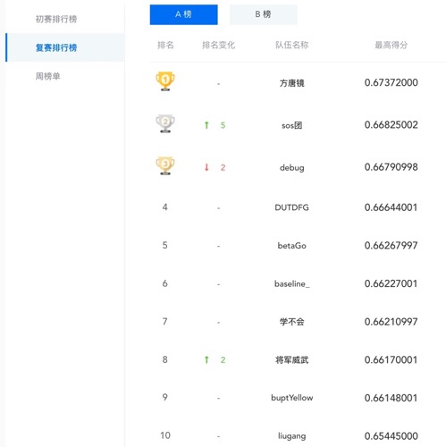

# 09.27-10.03 回顾

## 备忘录

- 关于参数初始化
  - https://blog.csdn.net/u012328159/article/details/80025785
- pytorch的部署可以用caffe2（但其实不好用，而且最好会C++）。更简单的方式是借助onnx转换格式，就可以用TensorFlow serving了...
  - https://github.com/onnx/tutorials 
- 


## 项目技巧

- 使用多进程加速

  ```python
  def line_preprocessing(line, args):
      content = line.split('\t')
      seq = text2seq(content[1], args)
      content[1] = ' '.join(seq)
      return '\t'.join(content)
  
  def _line_preprocessing(param):
      return line_preprocessing(*param)
  
  def preprocessing(input_file, output_file, core_num, args):
      with open(input_file, 'r') as f:
          corpus = f.read().strip()
      # Convert some Chinese characters from full forms into half forms.
      corpus = toolkit.full2half(corpus)
      line = corpus.split('\n')
      pool = multiprocessing.Pool(core_num)
  
      param = [[l, args] for l in line]
      line_processed = pool.map(_line_preprocessing, param)
      with open(output_file, 'w') as f:
          f.write('\n'.join(line_processed))
  ```

- 重采样

  ```python
  def over_sample(ids, data, labels):
      print("over sampling")
      labels_counter = Counter(labels)
      print(labels_counter)
      max_count = labels_counter.most_common(1)[0][1]
      p = dict()
      for i in labels_counter.keys():
          p[i] = (max_count - labels_counter[i]) / labels_counter[i]
      print(p)
  
      new_ids = []
      new_data = []
      new_labels = []
      indices = np.arange(len(labels))
      for i in indices:
          new_ids.append(ids[i])
          new_data.append(data[i])
          new_labels.append(labels[i])
          cur_p = p[labels[i]]
          if cur_p > 1:
              for c in range(int(math.sqrt(cur_p)+0.5)):
                  new_ids.append(ids[i])
                  new_data.append(data[i])
                  new_labels.append(labels[i])
          else:
              rand_p = random.random()
              if rand_p < cur_p-0.1:
                  new_ids.append(ids[i])
                  new_data.append(data[i])
                  new_labels.append(labels[i])
  
      indices = np.arange(len(new_labels))
      np.random.shuffle(indices)
  
      return [new_ids[i] for i in indices], np.array(new_data, dtype=np.int64)[indices], np.array(new_labels, dtype=np.int64)[indices]
  
  ```

- 太长的文本可以分段。

- jieba除了分词，还可以返回词性

  ```python
  import jieba.posseg
  pair = jieba.posseg.cut(text)
  for word, flag in pair:
      if flag == 'nr':
          seq.append('[nr]')
      elif flag == 'ns':
          seq.append('[ns]')
      elif flag == 'm':
          seq.append('[m]')
      else:
          seq.append(word)
  ```

- debug mode

  ```python
  debugflag = False
  
  def debug(stri):
      if debugflag:
          print stri
         
  def LogInfo(stri):
      now = time.strftime("%Y-%m-%d %H:%M:%S", time.localtime())
      print str(now) + ' ' + str(stri)
  ```

  

# AI法官

## 1. 项目背景

- 伴随着人工智能技术的发展以及司法大数据应用的广泛开展，业务人员希望通过机器阅读大量的案件事实，自动给出该案件中责任人所处罚金的范围，以提高办案效率。同时，也有利于公民根据相关案情事实快速了解可能面临的处罚。

## 2. 数据和评测

### 2.1 数据情况

- 本次复现中，将复赛数据作为训练数据，初赛的数据和复赛的数据有部分重复，将初赛的数据去除和复赛重复的部分，作为测试集。

- 得到的数据情况如下：

  ```shell
      24730 test.txt
     120000 train.txt
  ```

### 2.2 算法评价指标 

- 针对罚金类别的预测结果，使用 Micro-Averaged F1指标衡量模型性能。其定义如下
  $$
  \operatorname{micro}-a v g-F 1=\frac{1}{N} \sum_{i=1}^{m} w_{i} f_{i}
  $$
  根据公式，这个 f1 socre其实等价于 `sklearn.metrics.f1_score(true, pred, average="weighted")`  ，后文采用这个api进行测试。

- 针对法律条款预测结果，使用Jaccard相似系数衡量，其定义如下：
  $$
  \begin{aligned}
  P_{i} &=\frac{\left|L^{i} \cap L_{g}^{i}\right|}{\left|L^{i} \cup L_{g}^{i}\right|} \\
  p &=\frac{1}{N} \sum_{i=1}^{n} p_{i}
  \end{aligned}
  $$

- 复赛排名规则则综合两项结果的性能指标，具体计方式如下：0.5 * micro_avg_F1 + 0.5 * p。

- 复赛的排行榜如下所示

  


## 3. 建模模型与优化对比

### 3.1 rank7方案

- 方案主要思路：

  - 该方案主要使用了两层模型，第一层模型包括stacking（伯努利贝叶斯、多项式贝叶斯、LR）、统计特征和 word2vec词向量相加（思路有点像fasttext）；第二层模型使用了xgboost进行分类。

- 特征工程：

  - 分词，去停用词

  - 使用tfidf作为特征提取器 `tfv = TfidfVectorizer(min_df=3, max_df=0.95, sublinear_tf=True)` 

  - 使用stacking的思路，将train数据分为5份，使用TfidfVectorizer转换后的特征预测分类，并将每个类的预测概率作为特征。

  - stacking中使用的模型有伯努利贝叶斯、多项式贝叶斯、LR

  - 使用正则表达式，提取文本中的金额特征

    ```python
    amt = re.findall(u'(\d*\.?\d+)元', row['raw_content'])
    amt_tt = re.findall(u'(\d*\.?\d+)万元', row['raw_content'])
    ```

    将得到的金额list，计算其[sum, min, max, np.ptp, np.mean, np.std] 作为特征。

  - 使用word2vec训练词向量，并将词向量相加的和作为特征

- 分类模型

  - 最终的分类模型，使用的xgboost

    ```python
    bst = xgb.train(params, dtrain, n_trees, evals=watchlist, feval=micro_avg_f1, maximize=True,
                    verbose_eval=evals)
    ```

- 算法结果

  ```python
  # 只做了task1
  f1 = 0.4405507381215934
  ```

  该方案实际比赛中拿到了0.45730999的成绩，还是有一定的差距。可能原因复现中没有使用doc2vec的特征？暂时不太确定。

### 3.2 rank4方案

- 方案思路

  - 将文本分词之后，训练word2vec embedding（过滤低频词）
  - 将文本送入分类神经网络中进行分类（multi-class 和multi-label）
  - 为了解决类别不平衡问题，使用了对cross entropy进行加权的方法

- 复现中，rnn相关模型都太慢了，复现了lstm的模型，但效果比textcnn还差一些。HAN更是非常慢。因此后续只给出了textcnn的结果。

- 算法结果

  ```python
  # 第一次实验
  f1 = 0.4702922694588645
  p = 0.8894590355953075    # 此处计算错误，勿采用。
  final socre = 0.6798756525270859
  ```

  只采用了textcnn的单个模型，没有使用模型集成和更复杂的模型。但已经可以基本达到排行榜中的分数。

  ```python
  # 第二次实验
  f1 = 0.4756143727525285 
  p = 0.8950840473495145    # 此处计算错误，勿采用。
  final socre = 0.6853492100510215
  ```

  和第一次实验的参数都相同，但是结果比第一次还要好

- 使用`preprocessor/recognize` 中的代码，对人名、金额名称等进行替换之后，效果反而变差了

  ```python
  # 对人名等进行统一替换之后的实验
  f1 = 0.4378846530502795 
  p = 0.8639747640596811    # 此处计算错误，勿采用。
  final socre = 0.6509297085549803
  ```

  在 `preprocessor/recognize` 的README文件中，作者写到“此模块目前存在问题，请不要使用”。可能在替换过程中存在一些bug？导致效果不太好。否则，这个方案应该可以带来性能提升才是比较合理的。

### 3.3 rank1方案

- 特征工程

  - 文本类特征

    1. 首先对数据进行预处理，将“余元”等统一换成“元”，方便后续对数字进行统一处理

    2. 提取金额数字，并将其按照数额分桶，将同一区间的数字替换为统一的token。

       ```python
       list1 = [30, 100, 300, 1000, 2000, 3000, 4000, 5000, 7000, 10000, 20000, 50000, 100000, 500000]
       list2 = ['QA', 'QB', 'QC', 'QD', 'QE', 'QF', 'QG', 'QH', 'QI', 'QJ', 'QK', 'QL', 'QM', 'QN', 'QO']
       ```

    3. 去除低频词（出现少于6篇文档）、停用词。然后将得到的序列使用textcnn进行分类

  - 离散类特征

    1. 预处理，分词、去停用词，对一些多见的错误进行清洗。如“万万元”改为“万元”。
    2. 文本长度、句子数量、哪一级法院（省级、市级、区级）
    3. 重量类特征：克（毒品）、mg（酒驾酒精浓度）、千克（盗窃）
    4. 体积类特征：立方米（伐木）
    5. 植物类特征：株（罂粟、伐木）
    6. 涉及钱的特征：合计、金融、犯罪、罚款等。要对中文进行转换为数字。然后分别求其均值、和、最大值、最小值、标准差、中位数、peak2peak等。

- 实验结果

  | 实验方案                | task 1 (f1 score) | task 2 (Jaccard) | final score |
  | ----------------------- | ----------------- | ---------------- | ----------- |
  | textcnn                 | 0.4949            | 0.7206           | 0.6078      |
  | wide_textcnn            | 0.5094            | 0.7519           | 0.6307      |
  | wide_textcnn (双层卷积) | 0.5305            | 0.7803           | 0.6554      |

### 3.4 三种方案对比

- rank4比rank7取得了更好的成绩，主要的因素是textcnn在分类中有比xgboost有更好的表现。rank4甚至没有做除了word2vec之外的其他特征工程。简单粗暴，就有不错的成绩。
- rank1 进行了非常细致的特征工程，并且加深了网络，都取得了很大的提升。


# Plan of next week

- 


