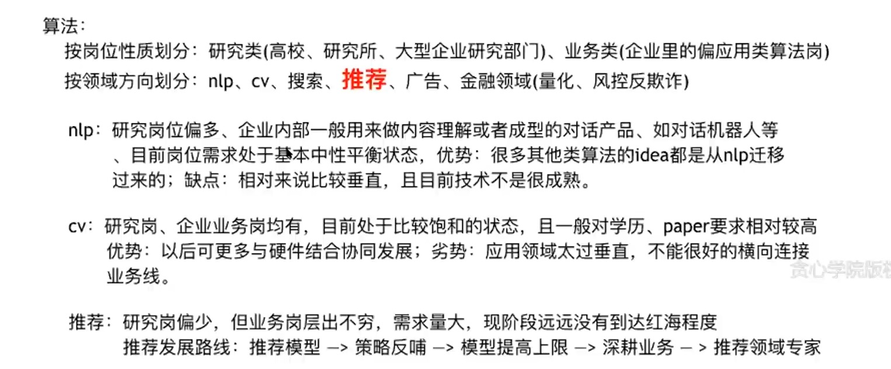

# 复习大纲

### 1、算法与机器学习基础

- 重点
  - [x] LR、决策树、随机森林、XGBoost
  - [x] 梯度下降法、随机梯度下降法、牛顿法
  - [x] L0、L1、L2、L-Infinity Norm
  - [x] Grid search、Bayesian Optimization 
  - [x] 凸函数、凸集、Duality、KKT条件
  - [x] Linear SVM、Dual of SVM
  - [x] Kernel Trick、Mercer's Theorem
- 了解 
  - [ ] Projected Grid Descent

### 2、语言模型和序列标注

- 重点
  - [x] 文本预处理（tfidf，stemming） 
  - [x] 文本领域的特征工程
  - [x] N-gram，词向量模型
  - [x] Latent Variable Models
  - [x] EM 算法和Local Optimality 
  - [ ] EM 与K-means、GMM
  - [ ] Variational Autoencoder 与 Text disentangling
  - [x] 有向图与无向图模型
  - [x] HMM模型以及参数估计
  - [x] Viterbi、Baum Welch
  - [x] CRF 与Linear Chain CRF
  - [x] CRF的Viterbi Decoding 与参数估计
- 了解
  - [x] 倒排表、信息检索技术
  - [ ] 常见的smoothing techniques

### 3、信息抽取、词向量与知识图谱

- 重点
  - [x] 命名实体识别技术
  - [x] 信息抽取技术
  - [x] 词向量、Skip-Gram、Negative Sampling
  - [x] 矩阵分解、CBOW、Glove
  - [x] Contexualized Embedding 和 ELMo
  - [ ] KL Divergence 和 Gaussian Embedding
- 了解
  - [x] 实体统一、实体消岐、指代消解
  - [ ] 知识图谱、实体与关系
  - [ ] 知识图谱嵌入技术
  - [ ] TransE、NTN详解
  - [ ] Node2Vec

### 4、深度学习与NLP

- 重点
  - [ ] Pytorch、Tensorflow详解
  - [ ] 表示学习、分布式表示技术
  - [x] 深度神经网络与BP算法详解
  - [x] RNN与Vanishing/ Exploding Gradient
  - [x] LSTM与GRU
  - [x] Seq2seq 与注意力机制
  - [x] Greedy Decoding与Beam search
  - [x] Bi-LSTM-CRF 模型
  - [ ] Self-attention，Transformer以及Transformer-XL
  - [x] BERT详解
  - [ ] BERT-BiLSTM-CRF
  - [ ] GPT，MASS，XLNet
  - [ ] Low-resource learning
- 了解
  - [ ] 文本领域中的disentangling 
  - [ ] Neural Turing Machine
  - [ ] Memory Network 
  - [ ] 深度学习可视化

### 5、贝叶斯模型与NLP

- 了解

  - [ ] 概率图模型与条件独立
  - [x] 主题模型
  - [ ] MCMC与吉布斯采样
  - [ ] Dynamic Topic Model
  - [ ] Supervised Topic Model 

  

- 算法： 按岗位性质划分：研究类(高校、研究所、大型企业研究部门)、业务类(企业里的偏应用类算法岗) 按领域方向划分：nlp、cv、搜索、推荐、广告、金融领域(量化、风控反欺计)
- nlp：研究岗位偏多、企业内部一般用来做内容理解或者成型的对话产品、如对话机器人等 目前岗位需求处于基本中性平衡状态，优势：很多其他类算法的idea都是从nlp迁移 过来的; 缺点：相对来说比较垂直，且目前技术不是很成熟。
- cv：研究岗、企业业务岗均有，目前处于比较饱和的状态，且一般对学历、paper要求相对较高 优势：以后可更多与硬件结合协同发展; 劣势：应用领域太过垂直，不能很好的横向连接 业务线。
- 推荐：研究岗偏少，但业务岗层出不穷，需求量大，现阶段远远没有到达红海程度 推荐发展路线：推荐模型 -> 策略反哺 -> 模型提高上限 -> 深耕业务 - > 推荐领域专家

