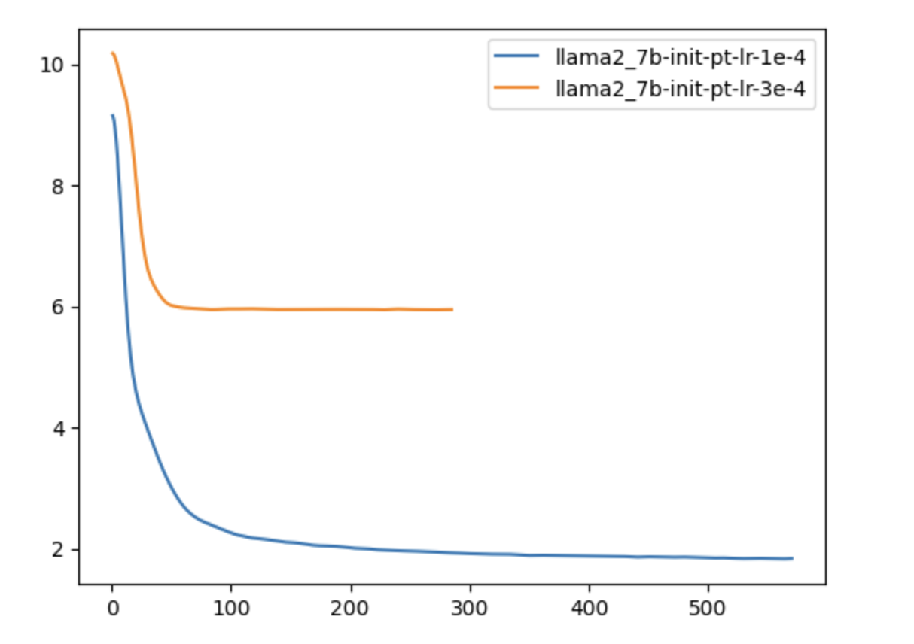
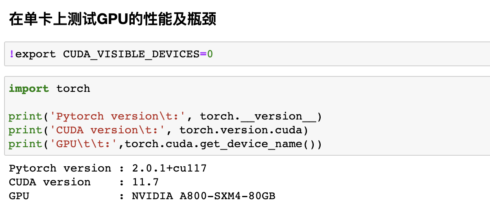
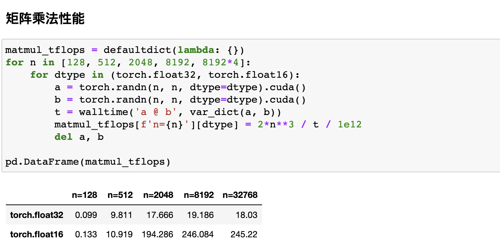
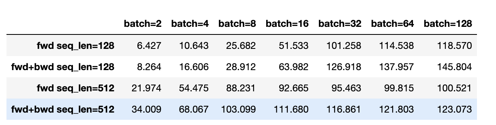
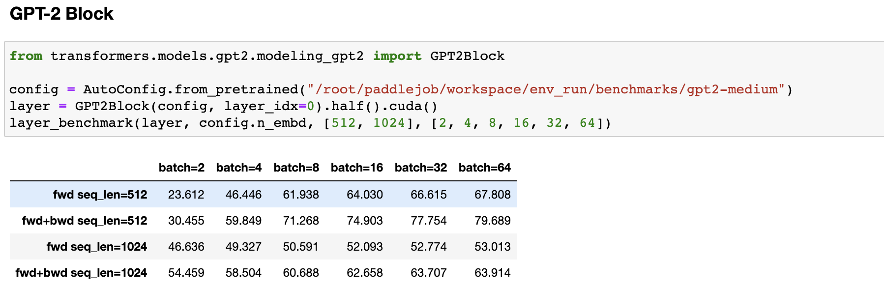

# LLM 细节

- webGPT，webGLM，chatlaw，ACL-检索增强对话

- lamda、chatGLM、llama2
- 文章：分布式训练、参数计算、实验
- 实验
  - post pretrain，sft
  - 数据量多少，训练时长


- 多语言，压缩词表
  - 对比实验，随机初始化
- nbce
- sparse attention
- Transformers 代码及细节
  - https://github.com/wenjtop/transformer/tree/main
  - https://zhuanlan.zhihu.com/p/624740065

- 读代码
- generate

- 左padding还是右padding

- model.eval()
- flashattention

- 主动学习
- instrcutgpt精读：https://blog.csdn.net/qq_56591814/article/details/130588064


## 大模型的细节


## LLM的分布式训练


## LLM的参数高效微调


## 已完成

- pagedattention

- 如何加速，vllm

- 解码：【OpenLLM 013】大模型炼丹术之文本生成中的解码策略：从原理到实践-原理篇 - 羡鱼智能的文章 - 知乎 https://zhuanlan.zhihu.com/p/633498226

- Llama 网络结构

  ```python
  LlamaForCausalLM(
    (model): LlamaModel(
      (embed_tokens): Embedding(32000, 5120, padding_idx=0)
      (layers): ModuleList(
        (0-39): 40 x LlamaDecoderLayer(
          (self_attn): LlamaAttention(
            (q_proj): Linear(in_features=5120, out_features=5120, bias=False)
            (k_proj): Linear(in_features=5120, out_features=5120, bias=False)
            (v_proj): Linear(in_features=5120, out_features=5120, bias=False)
            (o_proj): Linear(in_features=5120, out_features=5120, bias=False)
            (rotary_emb): LlamaRotaryEmbedding()
          )
          (mlp): LlamaMLP(
            (gate_proj): Linear(in_features=5120, out_features=13824, bias=False)
            (down_proj): Linear(in_features=13824, out_features=5120, bias=False)
            (up_proj): Linear(in_features=5120, out_features=13824, bias=False)
            (act_fn): SiLUActivation()
          )
          (input_layernorm): LlamaRMSNorm()
          (post_attention_layernorm): LlamaRMSNorm()
        )
      )
      (norm): LlamaRMSNorm()
    )
    (lm_head): Linear(in_features=5120, out_features=32000, bias=False)
  )
  
  model.layers.0.input_layernorm.weight torch.Size([5120])
  model.layers.0.post_attention_layernorm.weight torch.Size([5120])
  model.norm.weight torch.Size([5120])
  ```

- Swish具有以下特性:
  - 平滑性：Swish函数在整个实数域上是连续且可微的, 没有突变点或不连续的部分, 这有助于提 高梯度的稳定性和训练的效果。(比ReLU更平滑)
  - 渐进饱和性: Swish函数在输入为正或负的大值时, 会趋向于饱和, 即输出值接近于输入值。这 有助于抑制大幅度的激活响应, 减轻梯度爆炸的问题。
  - 自适应性: Swish函数具有自适应的特性, 它的形状和曲线根据输入值的变化而变化。在较大的 负值范围内, Swish函数趋向于线性变换; 在较大的正值范围内, Swish函数趋向于饱和
  (Sigmoid函数的特性), 保持输入的大部分信息。Swish函数结合了ReLU的线性增长特性, 和 Sigmoid函数的平滑特性, 使得处理复杂的非线性关系时更具表达能力。
  - 较低的计算复杂度：相比于其他激活函数（如ReLU）, Swish函数的计算复杂度较低, 可以更高 效地进行前向传播和反向传播。
  - https://blog.csdn.net/qq_56591814/article/details/131162128

- 不同的lr对ppt的影响

  

- 计算量 tflops，达到理论峰值的x%

  - 硬件

    

  - 矩阵乘法

    

  - Bert layer

    

  - Gpt layer

    

- 单机与多机训练

  ```python
  # 单机
  {'loss': 3.1616, 'learning_rate': 0.0, 'epoch': 0.14}
  {'loss': 1.7659, 'learning_rate': 2e-05, 'epoch': 0.28}
  {'loss': 1.7593, 'learning_rate': 2e-05, 'epoch': 0.41}
  {'loss': 0.4539, 'learning_rate': 1.894736842105263e-05, 'epoch': 0.55}
  {'loss': 0.1961, 'learning_rate': 1.7894736842105264e-05, 'epoch': 0.69}
  {'loss': 0.2587, 'learning_rate': 1.6842105263157896e-05, 'epoch': 0.83}
  {'loss': 0.2232, 'learning_rate': 1.578947368421053e-05, 'epoch': 0.97}
  {'loss': 0.2054, 'learning_rate': 1.4736842105263159e-05, 'epoch': 1.1}
  {'loss': 0.1768, 'learning_rate': 1.3684210526315791e-05, 'epoch': 1.24}
  {'loss': 0.1568, 'learning_rate': 1.263157894736842e-05, 'epoch': 1.38}
  {'loss': 0.153, 'learning_rate': 1.1578947368421053e-05, 'epoch': 1.52}
  {'loss': 0.127, 'learning_rate': 1.0526315789473684e-05, 'epoch': 1.66}
  {'loss': 0.1437, 'learning_rate': 9.473684210526315e-06, 'epoch': 1.79}
  {'loss': 0.1303, 'learning_rate': 8.421052631578948e-06, 'epoch': 1.93}
  {'loss': 0.1287, 'learning_rate': 7.368421052631579e-06, 'epoch': 2.07}
  {'loss': 0.1269, 'learning_rate': 6.31578947368421e-06, 'epoch': 2.21}
  {'loss': 0.1276, 'learning_rate': 5.263157894736842e-06, 'epoch': 2.34}
  {'loss': 0.1292, 'learning_rate': 4.210526315789474e-06, 'epoch': 2.48}
  {'loss': 0.1297, 'learning_rate': 3.157894736842105e-06, 'epoch': 2.62}
  {'loss': 0.1339, 'learning_rate': 2.105263157894737e-06, 'epoch': 2.76}
  {'loss': 0.1236, 'learning_rate': 1.0526315789473685e-06, 'epoch': 2.9}
  {'train_runtime': 380.3213, 'train_samples_per_second': 7.178, 'train_steps_per_second': 0.055, 'train_loss': 0.4672037760416667, 'epoch': 2.9}
  ```

  ```python
  # 多机
  10.215.192.87: {'loss': 3.1548, 'learning_rate': 0.0, 'epoch': 0.27}
  10.215.192.22: {'loss': 3.1548, 'learning_rate': 0.0, 'epoch': 0.27}
  10.215.192.87: {'loss': 1.7439, 'learning_rate': 2e-05, 'epoch': 0.53}
  10.215.192.22: {'loss': 1.7439, 'learning_rate': 2e-05, 'epoch': 0.53}
  10.215.192.87: {'loss': 1.764, 'learning_rate': 2e-05, 'epoch': 0.8}
  10.215.192.22: {'loss': 1.764, 'learning_rate': 2e-05, 'epoch': 0.8}
  10.215.192.22: {'loss': 0.6068, 'learning_rate': 1.7142857142857142e-05, 'epoch': 1.07}
  10.215.192.87: {'loss': 0.6068, 'learning_rate': 1.7142857142857142e-05, 'epoch': 1.07}
  10.215.192.87: {'loss': 0.2546, 'learning_rate': 1.4285714285714287e-05, 'epoch': 1.33}
  10.215.192.22: {'loss': 0.2546, 'learning_rate': 1.4285714285714287e-05, 'epoch': 1.33}
  10.215.192.87: {'loss': 0.1945, 'learning_rate': 1.1428571428571429e-05, 'epoch': 1.6}
  10.215.192.22: {'loss': 0.1945, 'learning_rate': 1.1428571428571429e-05, 'epoch': 1.6}
  10.215.192.87: {'loss': 0.1656, 'learning_rate': 8.571428571428571e-06, 'epoch': 1.87}
  10.215.192.22: {'loss': 0.1656, 'learning_rate': 8.571428571428571e-06, 'epoch': 1.87}
  10.215.192.87: {'loss': 0.1517, 'learning_rate': 5.7142857142857145e-06, 'epoch': 2.13}
  10.215.192.22: {'loss': 0.1517, 'learning_rate': 5.7142857142857145e-06, 'epoch': 2.13}
  10.215.192.87: {'loss': 0.1598, 'learning_rate': 2.8571428571428573e-06, 'epoch': 2.4}
  10.215.192.22: {'loss': 0.1598, 'learning_rate': 2.8571428571428573e-06, 'epoch': 2.4}
  10.215.192.22: {'train_runtime': 176.8121, 'train_samples_per_second': 15.44, 'train_steps_per_second': 0.051, 'train_loss': 0.9106402926974826, 'epoch': 2.4}
  10.215.192.87: {'train_runtime': 176.5058, 'train_samples_per_second': 15.467, 'train_steps_per_second': 0.051, 'train_loss': 0.9106402926974826, 'epoch': 2.4}
    
  ```

  

