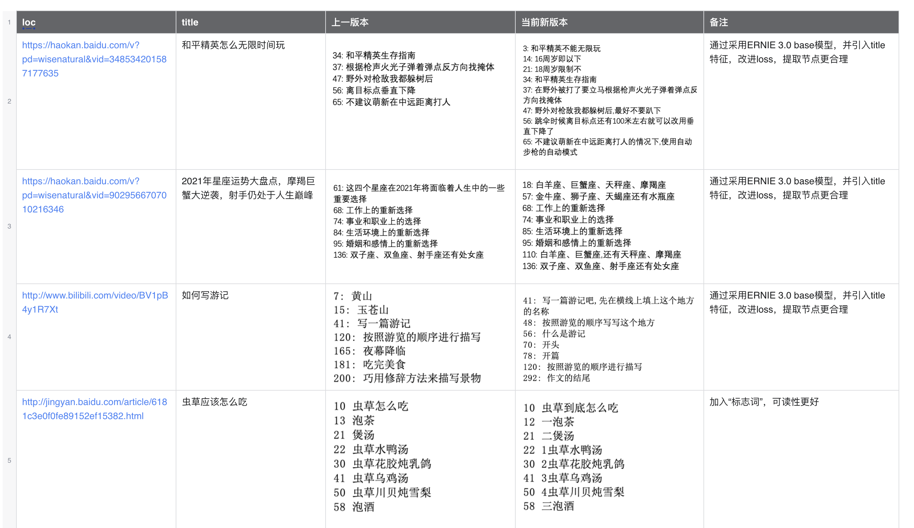
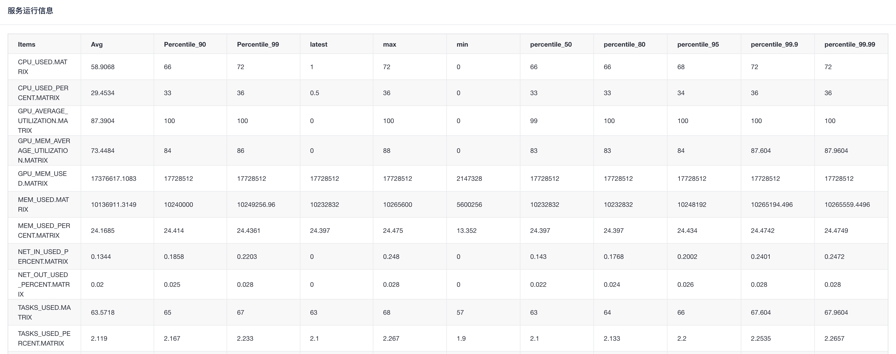
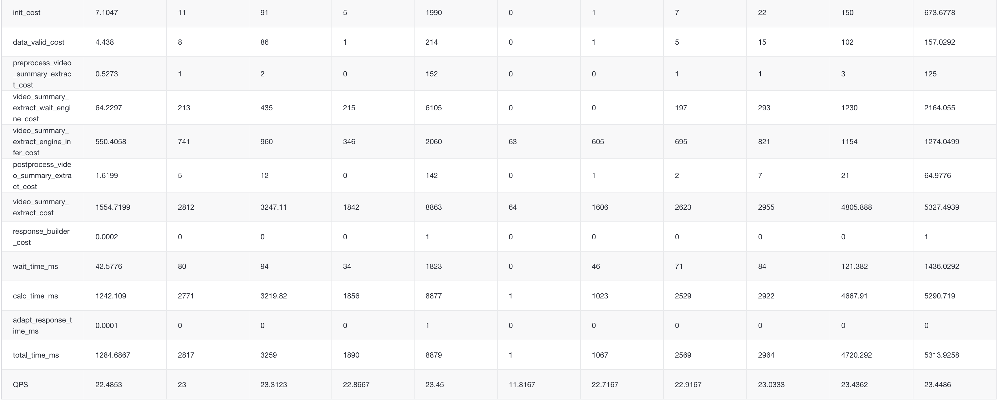
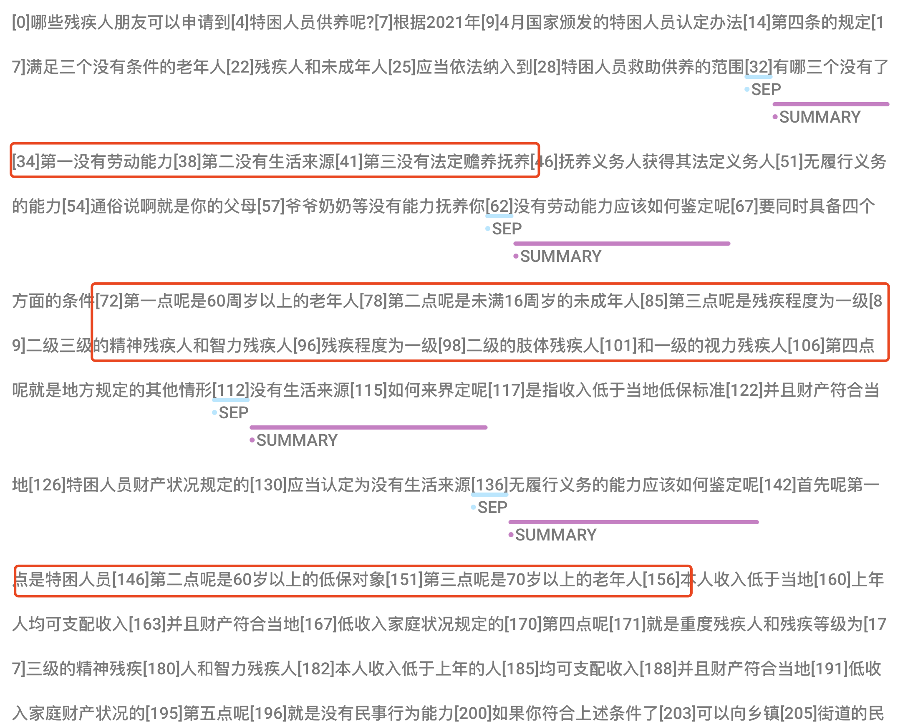
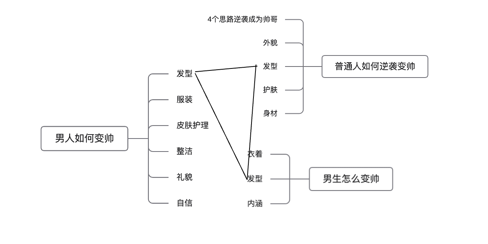
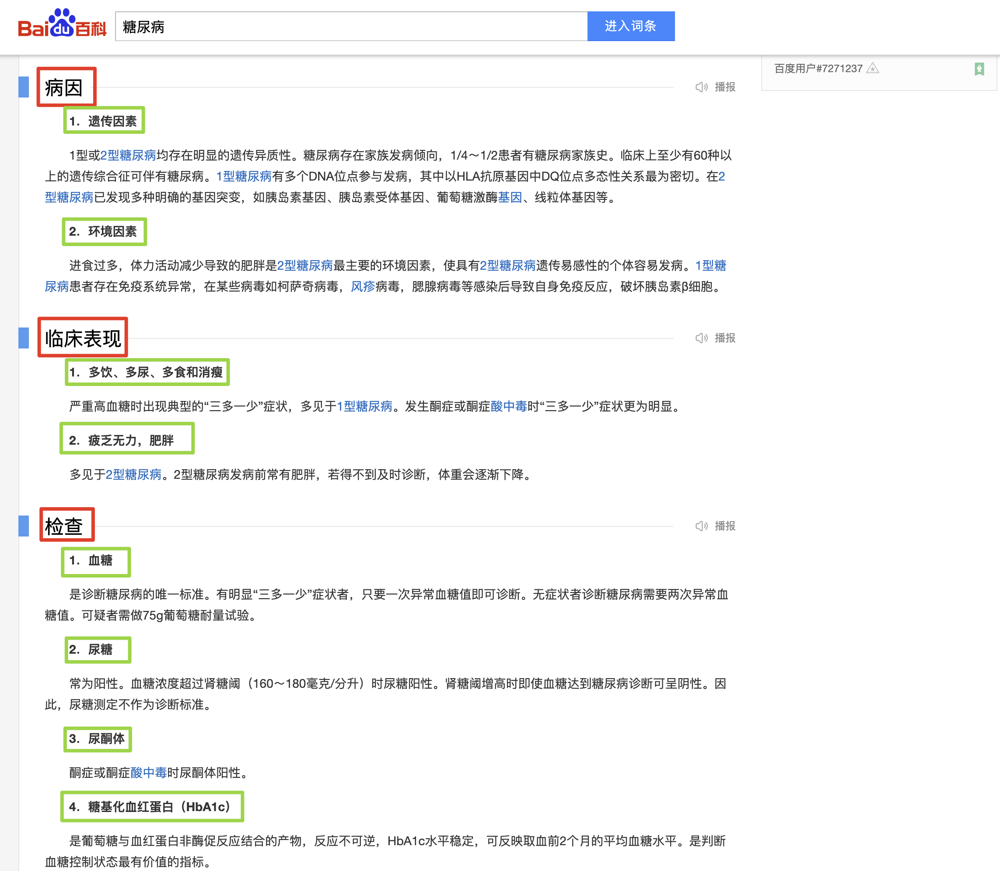
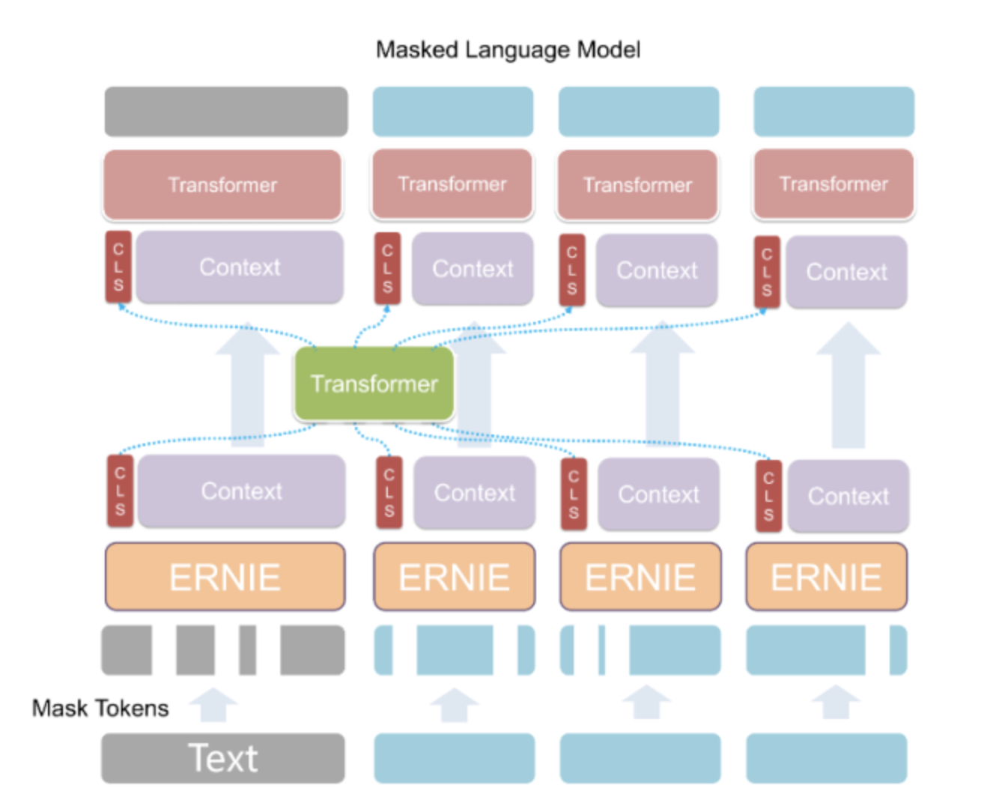
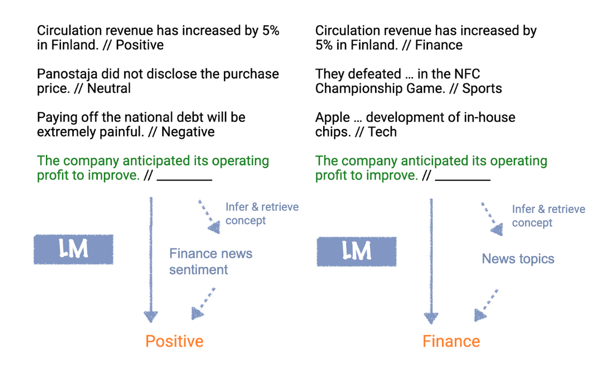
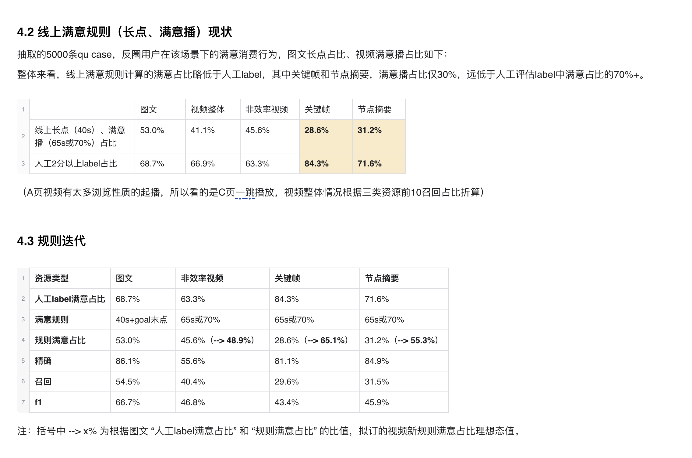

# Video Summary

## 1. 背景与意义

### 1.1 背景

- 视频内容载体**优点**
  - 直观、信息量丰富、更易于用户接受等
- 视频内容载体**缺点**
  - 内容按照时间平铺，无法像文本一样快速浏览（筛选痛点）
  - 视频内容和进度条没有对应关系，想定位某个信息比较困难（定位痛点）

### 1.2 定义

- 一个智能的进度条

- 包含内容

  - 时间点
  - 节点内容提要

- 举例：

  

```json
[{"point_time": "00:01:15", "abstract": "发型打理"}, 
 {"point_time": "00:02:37", "abstract": "脸部清洁"}, 
 {"point_time": "00:03:42", "abstract": "服装穿搭"}, 
 {"point_time": "00:05:40", "abstract": "身材管理"}, 
 {"point_time": "00:08:10", "abstract": "提升自己的内涵"}]
```

### 1.3 作用

|                | **筛选**                                                     | **快速定位**                                                 | **复盘**                                                     |
| -------------- | ------------------------------------------------------------ | ------------------------------------------------------------ | ------------------------------------------------------------ |
| 时间           | 视频消费前                                                   | 视频消费中                                                   | 视频消费后                                                   |
| 目的           | 快速判断内容匹配度                                           | 快速定位目标内容                                             | 整体把握视频内容                                             |
| 场景           | 用户对于搜索结果是否符合预期，进行快速判断                   | 用户已经知道内容符合自己需求，但不清楚内容在视频什么位置『视频时间轴』和『使用体验时间轴』不匹配（操作类、知识类视频） | 用户消费完视频，对于视频内容很满意，整体理解视频内容，作为题纲或者take away |
| 行为           | 多次点击（滑动）进度条 vs 多次点击（滑动）智能摘要           | 反复拖动进度条定位 vs 使用智能摘要直接定位                   | 多次点击（滑动）进度条 vs 多次点击（滑动）智能摘要           |
| 行为结果       | 内容符合预期，产生消费内容不符合预期，划走或者换query        | 定位之后，产生消费无法准确定位，用户失去耐心，不再继续消费   | 加深用户对于视频内容的理解，评论区可能出现课代表（搜索场景下，这种现象较少，但在b站等长视频场景下，这种现象较多） |
| 使用功能       | 节点内容提要                                                 | 时间点                                                       | 节点内容提要                                                 |
| 对于摘要的要求 | 摘要内容能够全面、准确覆盖视频核心内容帮助用户准确判断视频内容是否包含能够满足自己需求的内容 | 时间点要和视频的实际进度条吻合误差2s以内，能提前不要靠后     | 摘要内容能够全面、准确覆盖视频核心内容帮助用户准确判断视频内容是否包含能够满足自己需求的内容 |

### 1.4评估指标

- 主要原则：帮助用户**提升效率**（节省时间）

|          | **筛选**                                                     | **快速定位**                                     | **复盘**                                         |
| -------- | ------------------------------------------------------------ | ------------------------------------------------ | ------------------------------------------------ |
| 开始时间 | 开始自动播放 or 第一次点击智能摘要（进度条）                 | 第一次点击智能摘要（进度条）                     | 消费之后，开始点击智能摘要（进度条）             |
| 结束时间 | 产生消费、换query、划走                                      | 产生消费                                         | 大部分情况下无法监测（少部分情况下，产生课代表） |
| 涉及指标 | 播放时长、满意播比例、跳点率、长点率、长点击占比、换query比例等 | 播放时长、摘要交互点击率、视频某段资源多次播放等 |                                                  |

- 通过评估是否帮助用户减少【筛选】、【快速定位】的时间，通过问卷调研【复盘】的满意度


## 2. 模型

| 版本 | 主要目的         | model                     |
| ---- | ----------------------------------------- | ----------------------------------------------- |
| V1   | 看召回能力                          | BERT+CRF                                        |
| V2   | 提精确，分垂类：通用、步骤、CV      | Longformer+CRF，BERT-cls，BART                  |
| V3   | 扩召回：通用 - 并列句式（无明显语法标志） | Ernie 3.0 base                                  |
| V4   | 提精确，节点合理化                 | ErnieSage pretrain + Ernie 3.0 base，time token |

### 2.1 v1版本

- 方案：BERT+CRF
- 数据：打通了整体流程
- 上线要求，准确率95%+，需要人工审核
- 准确率80.6%
- 影响面：0.04%

### 2.2 v2版本

- v1的缺点：字幕质量差、对长文本的建模能力较差、召回低
- 针对性的改进：
  - 对字幕数据进行提升，最终rouge-1，0.9
  - 使用longformer，seq-len长度1024
  - 领域预训练+百家号数据，提升模型准确率
  - 对通用类进一步细分，序数词、逻辑词、并列句式（评测）、疑问句（主旨句）、法律类、字词类等
  - 在序数词、逻辑词、疑问句（主旨句）类别上准确率达标，并列句式、法律类效果较差，字词类对于错别字0容忍，暂时不做
  - 通过分类模型，去除了并列句式、法律类、字词类效果较差的类别，优先保证准确率
  - BART对摘要文字进行改写，去除口语化的文字，更精炼
- 上线要求，准确率80%+，无需人工审核
- 准确率：84.5%
- 影响面：9%

### 2.3 v3版本

- v2版本的缺点：
  - 并列句式是最大的问题，bad case占比最多
  - 可能会提取出有标志词，但是和主题无关的节点
  - bad case中主要的问题是召回较低
  - 推理速度较慢
- 针对性改进
  - 引入外部知识，采用ernie 3.0 base
  - 引入标题信息，使得提取的摘要和文本更相关
  - 针对召回较低的问题，修改loss中的权重，极大提升了召回率
  - 使用ernie 3.0 的时候，去除了crf层，加快了训练和推理的速度
- 准确率：87.2%
- 影响面：16%（召回率提升至2倍+）
- 虽然没有在步骤类的数据上特殊优化，但是实际效果也不错。一个模型替代了之前的多个模型。

- Show case

  

- qps，提升3倍+，5.7 -> 22，GPU：A10

  

  

### 2.4 v4版本

- v3版本的缺点

  - 针对比较热门的相似句式，表现不错。但是对于比较冷门的case，表现比较差

  - 模型对于时间不敏感

  - 针对有层级的摘要，表现不好（尤其是法律类）

    

- 针对性改进

  - erniesage
    - 将tiltle-summary按照思维导图的结构，建成一棵树
    - 使用node2vec对树进行采样（bfs方式）
    - 采样后同一序列大部分是同一层级的摘要节点
    - 送入ErnieSage，使得同一层级的节点embedding更相近
    - 标注数据中，同一层级的节点要么都提取，要么都不提取（根据time embedding决定是否提取）
  - 引入time token
    - 通过计算前后两句字幕之间的时间差，在模型中引入time信息，将时间差表示为不同的token
    - 模型遇到时间差短的token，即使有标志词也不出摘要

- ErnieSage

  - 介绍文章：https://www.modb.pro/db/189678

  - 图的构建

    

  - 通过不同的文章，引入了更多的数据，对于冷门数据更友好

  - 数据：

    

  - 模型：

    

  - 举例

    - 关羽、张飞、刘__（备）
    - 关云长、张翼德、刘__（玄德）
    - 毛泽东、朱德、刘__ （少奇）
    
  - node2vec：

    - https://github.com/wangjw14/Technology-notes/blob/main/papers/deepwalk%E3%80%81node2vec.md

- time token

  ```
  https://jingyan.baidu.com/article/6181c3e0f0fe89152ef15382.html
  虫草应该怎么吃❼大家应该都知道冬虫夏草是极为滋补的食物❹那虫草到底怎么吃呢❷一、泡茶❷虫草2克，用80℃开水浸泡数分钟后饮用❻可反复冲泡饮用❷二、煲汤❷1、虫草水鸭汤❷用料：虫草10-15克、水鸭1只、生姜5片❻2、虫草花胶炖乳鸽❷用料：虫草5-10克、花胶35克、乳鸽1只、生姜片4片❼3、虫草乌鸡汤❷虫草10-15克、乌鸡1只、瘦肉100克、红枣8枚❼4、虫草川贝炖雪梨❸虫草5-10克、川贝8克、雪梨1个❻三、泡酒❷虫草60克、高度粮食酒10公斤❹用酒坛于阴凉处浸泡1-3个月后饮用
  ```


## 3. 从摘要到LLM

### 3.1 In Context Learning

- in context learning

  

- 一种广义的并列句式

- LLM已经将这种知识通过参数的形式存储在了模型之中

### 3.2 基于图的数据增强

- 类比
  - chatGPT可以给出一篇文章的大纲（类似我们的节点摘要）
  - 也可以根据大纲改写成一整篇文章（从文章到摘要的逆过程）
- LM中的知识融入
  - 参考Ernie的方式，构造知识类的text
  - 基于图的数据增强
    - 可以构建只有节点的文本（大纲）、也可以构建整篇文章
    - 通过图网络，将不同文章的大纲进行交叉，得到新的大纲和文章

- 