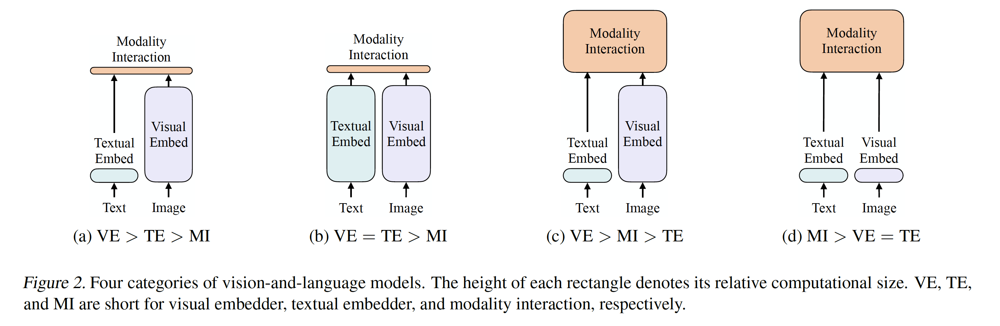
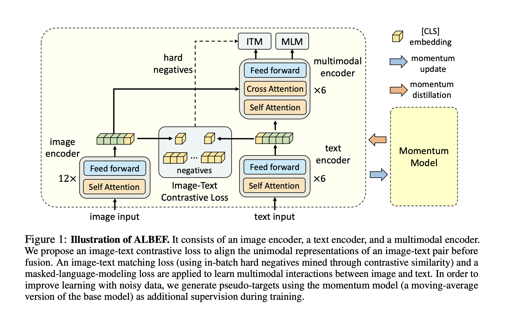
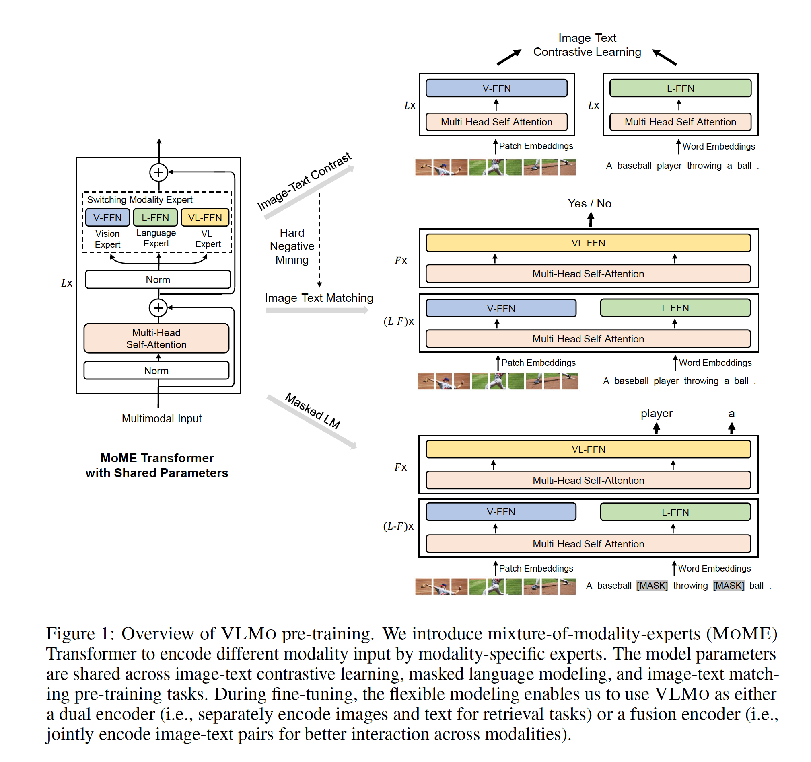
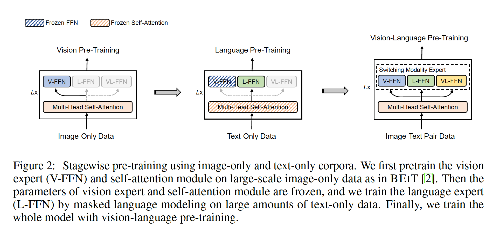
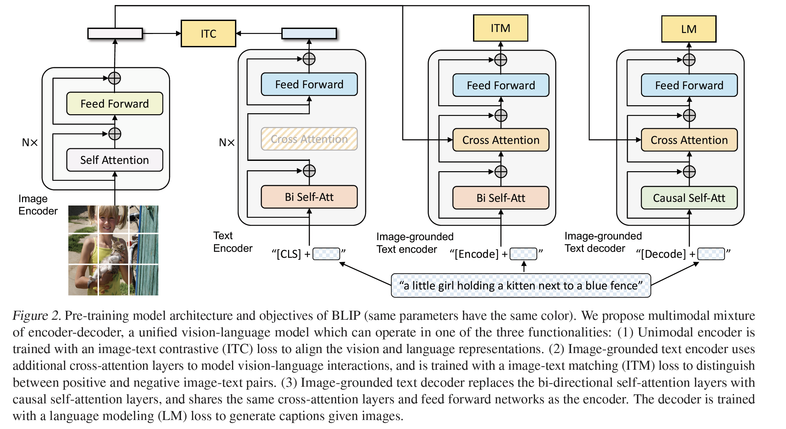
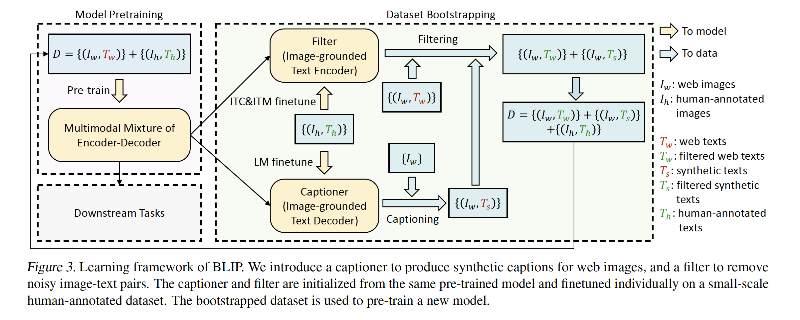
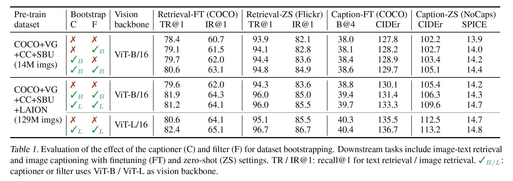
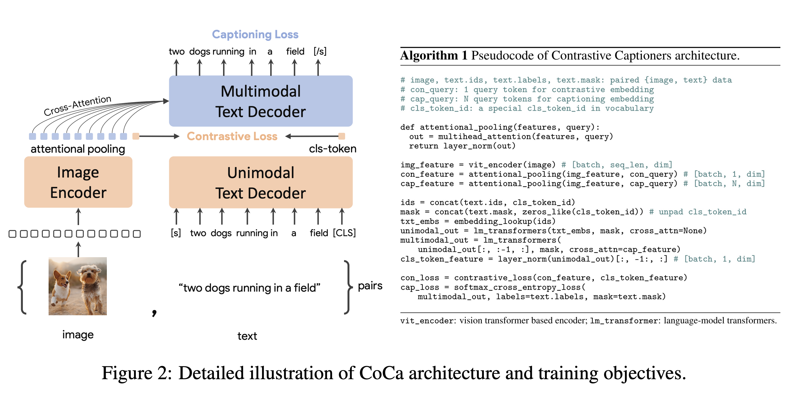
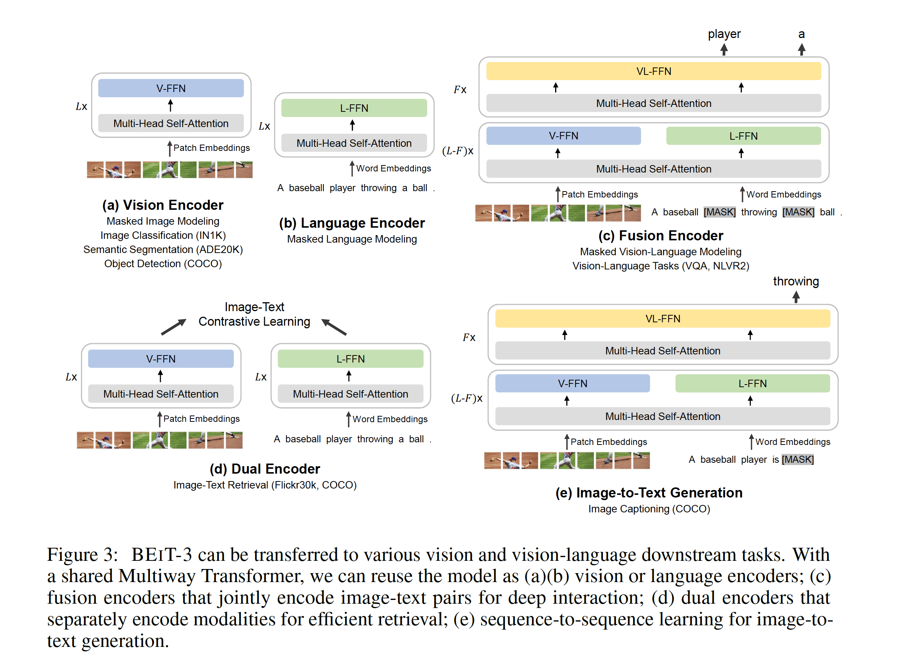

# 多模态

- 前序工作：ViLT、CLIP、各种CLIP的改进
- 多模态任务：视觉问答、图文检索、Language guided detection、Language guided segmentation、文生图、文生视频（Phenaki Video、Imagen video）
- 本次涉及的主要还是传统多模态任务：Image Text Retrieval、VQA、Visual Reasoning、Visual Entailment
- 模型分类：
  - Encoder 多模态模型：ViLT、CLIP、ALBEF、VLMo
  - Encoder-Decoder 多模态模型：BLIP、CoCa、BEIT v3、PaLI
- 多模态模型的不同形态：
  - 
  - a）VSE、VSE++
  - b）CLIP
  - c）VilBERT、UNITER、OSCAR
  - d）ViLT

- ViLT
  - 动机：去除图像backbone的目标检测器，目标检测器太慢了
  - 前提：ViT的出现
  - 训练时长：64张V100-32G，训练3天

- 未来方向：
  - 采用c的结构
  - 目标：ITC、MLM、ITM

## ALBEF

- 作者：Salesforce Research团队，后续工作：BLIP、MUST、ALPro（Video）
- Align before Fuse
- 一台8卡机，训练3-4天，最亲民的工作

### 摘要

- 背景：目标检测器的特征都是提前抽取好的，没有进行align，也就是没有end2end的训练
- 贡献：
  - 本文使用了对比学习的loss（ITC），在fuse之前，将 image 和 text 的 representation 进行了 align
  - 为了对抗数据中的噪声，提出了 momentum distillation，一种基于伪标签的自训练方法（使用momentum model 来提供伪标签）

- 理论分析：互信息最大化 
  - MLM、ITM、momentum distillation，都是为同一个 image-text 对，生成不同的视角，是一种变相的数据增强
- 效果：
  - 图文检索中，ALBEF效果最好，超过CLIP和Align
  - 在VQA和VR中，也超过之前的SOTA

### 模型

- vision transformer

  - 采用 DEiT 进行初始化（Data Efficient Vision Transformer）

- text transformer

  - 为什么要将 text encoder 拆开？text encoder 应该比 vision encoder 小一些。同时可以降低整体的计算量
  - 使用 BERT 进行初始化

- 示意图

  

- 损失函数
  - ITC loss：对比损失函数，和 MoCo 是一样的。moving average = 0.995。
  - ITM loss：判断 image 和 text 是不是一个对。选一些 hard negative case 进行训练。
  - MLM loss：需要增加一次 forward。输入和前两个 loss 不同，是 masked text。

- ITC or ITM 的区别？
  - ITC类似召回，ITM类似精排
- 动量蒸馏
  - 训练数据中有很多的噪声，通过网络爬取的数据往往是weakly correlated的
  - 自训练方法：Google 的 Noisy Student、DINO
  - 使用动量模式生成伪标签，是一个 softmax score，而不是一个 one hot label
  - momentum model：通过EMA来构建
  - ITC 和 MLM 都加上了伪标签
- 训练数据集
  - Conceptual Captions（3M or 12M）、SBU Captions（1M）、COCO（100K）、Visual Genome（100K）
- 实验结果：
  - ITC loss 和 hard negative 带来的增益最大
  - momentum distillation 增益较小，但也是一个有意思的方向

## VLMo

作者：微软团队

团队最近的其他工作：BEiT v1、v2、v3，LayoutLM v1、v2、v3，很 solid 的多模态的组

- 贡献：
  - 结构的贡献：Mixture-of-Modality-Experts
  - 训练方式：分阶段的模型预训练

- 训练成本
  - 4M data，base model，64*V100，2days

- Future work
  - scale up: BEiT v3 (ViT-G)
  - Image captioning: VL-BEiT, BEiT v3
  - 多模态用于单模态：BEiT v3
  - 扩展更多模态：WAVLM (speech), Layout LM (structured knowledge), MetaLM (general-purpose multimodal pre-training)

## BLIP

- 作者：Salesforce Research团队

- 出发点

  - Bootstrapping：数据中噪声很大，通过一些方法获取更干净的数据
  - Unified Framework：将 understanding 和 generation 合并在一个框架中

- 网络结构：Mixure of Encoder and Decoder (MED)

  

- 三个损失函数

  - ITC、ITM、LM

- 使用 dataset bootstrapping 来清洗数据

  

- 消融实验

  

  - Captioner 带来的多样性，对于模型更有益处

- BLIP的应用
  - https://lambdalabs.com/blog/how-to-fine-tune-stable-diffusion-how-we-made-the-text-to-pokemon-model-at-lambda
  - https://laion.ai/blog/laion-coco/

## CoCa

- Contrastive Captioners

- 作者：Google Research

- 模型结构

  

## BEiT-v3

- 作者：微软团队
- 导言很值得一读，导师强烈推荐

- 本文从3个方面推进了 vision-language pretraining 的大一统

  - 不同的 vision-language 任务，需要不同的模型结构。如 dual-encoder 结构适合 retrieval 任务，encoder-decoder 结构适合生成任务， fusion-encoder 结构适合 image-text encoding 任务。本文采用了 multiway-transformers 结构，可以解决多种不同的下游任务。
  - 目前的  vision-language 任务，通常会针对多个任务进行训练。这样对于 scaling 比较不友好。本文只使用了一个 pretraining 任务，也就是 mask-then-predict。并将 image 当成一种语言，Imglish。
  - 将 model size 和 data size 都进行了 scaling。

- 模型结构

  

- 下游任务

  

- 后续的工作
  - language interface：MetaLM、PaLi
  - generalist model：Unified-IO、Uni-Perceiver、Uni-Perceiver-MOE

## FLIP

## BLIP2

## Llava

