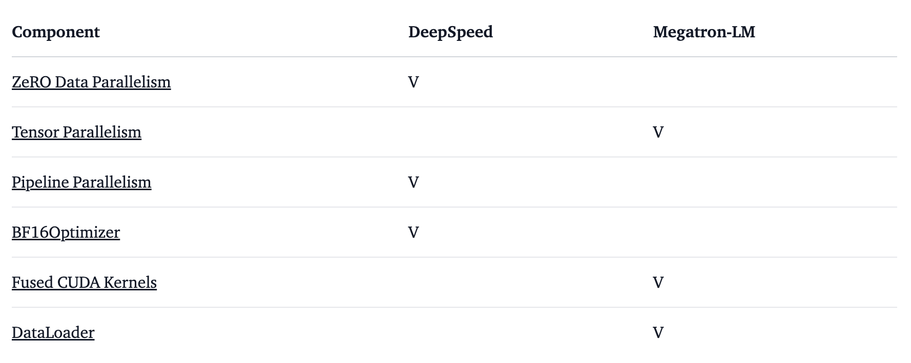

# 大模型训练经验帖

## 1、OPT-175B是如何炼成的

- https://zhuanlan.zhihu.com/p/622061951

- https://www.bilibili.com/video/BV1XT411v7c9/

- Logbook: https://github.com/facebookresearch/metaseq/blob/main/projects/OPT/chronicles/OPT175B_Logbook.pdf

- 训练大模型的痛点

  - OPT-175B要在1000个80G A100上开足马力训练3000亿个词，需要不间断的至少**33天**时间
  - 需要反复试错

- bug

  - 清洗数据时，没有去除转义字符，预测了很多反斜杠

- 数值稳定性

  - 使用bloat16作为基础数值格式
  - 一个提升数值稳定性的技巧：`n * (A dot B) === (sqrt(n) * A) dot (sqrt(n) * B)` 

- 没有benchmark可用

  - LLMs now saturating benchmarks faster than new benchmarks can be designed...

- 黎明前夕

  - 使用了GPT-3和Megatron论文中的设置。两者非常接近

- 问答：

  - Q：重新回到训练开始，最希望改善什么？

    A：Much Much more data。超参什么的都是浮云，关键还是训练数据。另外，发现bfloat16是最适合的格式也是里程碑。

  - Q：强调数据质量，并说如果当初能有更好的数据，模型训练的效果也会更好。既然数据质量这么重要，如何定义数据的好与坏？

    A：书、论文和代码直觉上最好质量的数据。对于特定领域的模型，比如编程模型，一看就知道哪些是好的代码；但对于这些大型通用模型来说，我们不知道怎么定义数据的好坏，要等最终模型训练出来之后才知道喂的数据好不好。

## 2、BLOOM背后的技术

- https://huggingface.co/blog/bloom-megatron-deepspeed

- 模型概览

  |          |                             |                                                              |
  | -------- | --------------------------- | ------------------------------------------------------------ |
  | 硬件     | 384 80GB A100 GPUs          | 48 nodes + 32 spare gpus                                     |
  | 软件     | Megatron-DeepSpeed          |                                                              |
  | 架构     | GPT3 w/ extras              |                                                              |
  | 数据     | 350B tokens of 59 Languages | 46 Languages in 1.5TB cleaned up text.  Vocabulary size of the model is 250,680 tokens |
  | 训练时长 | 3.5 months                  |                                                              |

- For full details please see [The BigScience Corpus A 1.6TB Composite Multilingual Dataset](https://openreview.net/forum?id=UoEw6KigkUn) 

- 软件

  

- 一定不要使用fp16，可以使用bf16。优化器都是使用fp32，梯度累积都是使用fp32。
- 使用Megatron进行kernel fusion，提升训练速度
- 使用了Megatron中高效的dataloader
- 在embedding之后添加一个额外的LayerNorm可以使训练更加稳定
- 位置编码：based on the paper: [Train Short, Test Long: Attention with Linear Biases Enables Input Length Extrapolation](https://arxiv.org/abs/2108.12409) 
- 训练中遇到的问题
  - 只有在48个节点上进行训练时才会出现一些问题，在小规模时不会出现。如框架挂起
  - 频繁的硬件故障
  - PyTorch中的死锁
  - 磁盘空间不足

## 3、万字长文：想训大模型？这里有一份避坑指南

- https://mp.weixin.qq.com/s/yX5B1ZzV7vewQs1-ezHIQg

- **主持人**：Kiwi，AI 领域投资人

  **本期嘉宾介绍**：

  **冠叔**，野路子 AI 产品经理，操盘过大量 AI 业务

  **龙老师**，大模型算法工程师，开源过超过 20 个预训练模型算法

  **欣然**，AI 全栈工程师，做过芯片、框架、算法，以及 AI 应用的全流程开发

- 大模型的特点：有涌现能力，需要分布式训练

- 成本估算

  - **一次性训出 GPT-1 的成本大概是几千块钱，GPT-2 大概是 30万人民币，训练GPT-3大概是 2500 万人民币。**

- I/O瓶颈：如果科学的去做 pipeline ，其实卡 I/O 应该没有那么严重，我们之前做过 GPT-2 的训练，当时通过各种各样的优化，把整个 I/O 的瓶颈基本都消掉了

- **现在可能最好的并行计算方案核心还是基于 Megatron 那套框架**。但是研究员们更喜欢用 Pytorch 去反复调它的模型架构。而把 Pytorch 代码移到 Megatron 上是比较辛苦的一件事情。Megatron 只支持 Bert、T5和GPT

- **高质量的内容才是让模型能够达到今天效果的关键** 

- GPT-3预训练的语料数据是 45T，最后清洗完是不到 1T 的。

- Megatron可能是下一个针对transformer的专用框架

- 国内的公有云化程度远低于美国，可能会导致很多toB的私有云

